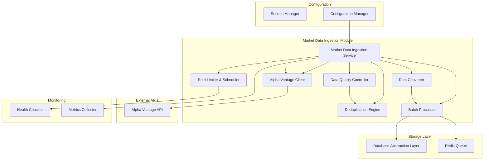
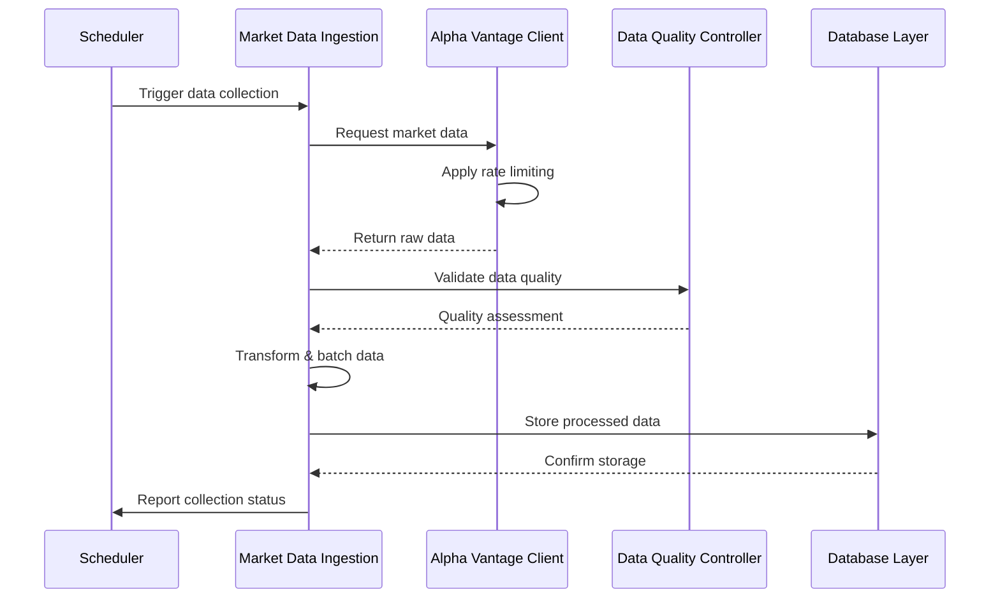

# Market Data Ingestion Module Specification

## Module Overview

The Market Data Ingestion module is responsible for collecting, processing, and storing financial market data from Alpha Vantage APIs. It handles both historical data collection and real-time data streaming, ensuring data quality, deduplication, and efficient storage.

## Module Architecture



## Core Responsibilities

### Primary Functions
1. **Market Data Collection**: Automated collection from Alpha Vantage APIs
2. **Data Quality Assurance**: Validation, cleaning, and quality scoring
3. **Rate Limit Management**: Efficient API quota management and scheduling
4. **Data Transformation**: Convert API responses to internal data formats
5. **Batch Processing**: Efficient bulk data operations
6. **Real-time Processing**: Stream processing for live market data
7. **Error Recovery**: Robust error handling and retry mechanisms
8. **Monitoring & Alerting**: Data collection health monitoring

## Alpha Vantage API Integration

### Supported Endpoints
```rust
pub enum AlphaVantageEndpoint {
    // Time Series Data
    IntradayData { symbol: String, interval: Interval, outputsize: OutputSize },
    DailyData { symbol: String, outputsize: OutputSize },
    DailyAdjusted { symbol: String, outputsize: OutputSize },
    WeeklyData { symbol: String },
    MonthlyData { symbol: String },
    
    // Quote Data
    GlobalQuote { symbol: String },
    SearchEndpoint { keywords: String },
    
    // Technical Indicators (for validation)
    SMA { symbol: String, interval: Interval, time_period: u32, series_type: SeriesType },
    EMA { symbol: String, interval: Interval, time_period: u32, series_type: SeriesType },
    RSI { symbol: String, interval: Interval, time_period: u32, series_type: SeriesType },
    
    // Market Status
    MarketStatus,
}

pub enum Interval {
    OneMin,
    FiveMin,
    FifteenMin,
    ThirtyMin,
    SixtyMin,
}

pub enum OutputSize {
    Compact, // Latest 100 data points
    Full,    // Full-length time series
}
```

### API Client Implementation
```rust
pub struct AlphaVantageClient {
    client: reqwest::Client,
    api_key: String,
    base_url: String,
    rate_limiter: RateLimiter,
    retry_config: RetryConfig,
}

impl AlphaVantageClient {
    pub async fn get_intraday_data(
        &self,
        symbol: &str,
        interval: Interval,
        outputsize: OutputSize,
    ) -> Result<IntradayResponse, IngestionError>;
    
    pub async fn get_daily_data(
        &self,
        symbol: &str,
        outputsize: OutputSize,
    ) -> Result<DailyResponse, IngestionError>;
    
    pub async fn get_global_quote(
        &self,
        symbol: &str,
    ) -> Result<QuoteResponse, IngestionError>;
    
    pub async fn search_symbols(
        &self,
        keywords: &str,
    ) -> Result<SearchResponse, IngestionError>;
}
```

## Data Structures

### Raw API Response Structures
```rust
// Alpha Vantage intraday response
#[derive(Deserialize, Debug)]
pub struct IntradayResponse {
    #[serde(rename = "Meta Data")]
    pub meta_data: MetaData,
    
    #[serde(flatten)]
    pub time_series: HashMap<String, HashMap<String, TimeSeriesEntry>>,
}

#[derive(Deserialize, Debug)]
pub struct MetaData {
    #[serde(rename = "1. Information")]
    pub information: String,
    
    #[serde(rename = "2. Symbol")]
    pub symbol: String,
    
    #[serde(rename = "3. Last Refreshed")]
    pub last_refreshed: String,
    
    #[serde(rename = "4. Interval")]
    pub interval: String,
    
    #[serde(rename = "5. Output Size")]
    pub output_size: String,
    
    #[serde(rename = "6. Time Zone")]
    pub time_zone: String,
}

#[derive(Deserialize, Debug)]
pub struct TimeSeriesEntry {
    #[serde(rename = "1. open")]
    pub open: String,
    
    #[serde(rename = "2. high")]
    pub high: String,
    
    #[serde(rename = "3. low")]
    pub low: String,
    
    #[serde(rename = "4. close")]
    pub close: String,
    
    #[serde(rename = "5. volume")]
    pub volume: String,
}
```

### Internal Data Structures
```rust
// Processed market data for storage
#[derive(Debug, Clone, Serialize, Deserialize)]
pub struct ProcessedMarketData {
    pub symbol: String,
    pub timestamp: DateTime<Utc>,
    pub open: Decimal,
    pub high: Decimal,
    pub low: Decimal,
    pub close: Decimal,
    pub volume: u64,
    pub adjusted_close: Decimal,
    pub source: String,
    pub quality_score: u8,
    pub collection_timestamp: DateTime<Utc>,
}

// Data quality assessment
#[derive(Debug, Clone, Serialize, Deserialize)]
pub struct DataQualityAssessment {
    pub symbol: String,
    pub timestamp: DateTime<Utc>,
    pub completeness_score: f32,
    pub consistency_score: f32,
    pub timeliness_score: f32,
    pub accuracy_score: f32,
    pub overall_quality_score: u8,
    pub issues: Vec<QualityIssue>,
}

#[derive(Debug, Clone, Serialize, Deserialize)]
pub enum QualityIssue {
    MissingData { field: String },
    OutOfRange { field: String, value: f64, expected_range: (f64, f64) },
    InvalidTimestamp { provided: String, expected_format: String },
    DuplicateData { duplicate_timestamp: DateTime<Utc> },
    StaleData { age_minutes: u32, max_age_minutes: u32 },
}
```

## Core Processing Pipeline

### Data Collection Flow


### Data Quality Pipeline
```rust
pub struct DataQualityController {
    validation_rules: Vec<ValidationRule>,
    quality_thresholds: QualityThresholds,
}

impl DataQualityController {
    pub async fn assess_quality(
        &self,
        data: &ProcessedMarketData,
        historical_context: Option<&[ProcessedMarketData]>,
    ) -> DataQualityAssessment {
        let mut assessment = DataQualityAssessment::new(data.symbol.clone(), data.timestamp);
        
        // Completeness check
        assessment.completeness_score = self.check_completeness(data);
        
        // Consistency check with historical data
        if let Some(history) = historical_context {
            assessment.consistency_score = self.check_consistency(data, history);
        }
        
        // Timeliness check
        assessment.timeliness_score = self.check_timeliness(data);
        
        // Accuracy check (cross-validation if possible)
        assessment.accuracy_score = self.check_accuracy(data).await;
        
        // Calculate overall score
        assessment.overall_quality_score = self.calculate_overall_score(&assessment);
        
        assessment
    }
    
    fn check_completeness(&self, data: &ProcessedMarketData) -> f32 {
        let mut score = 1.0;
        
        if data.open.is_zero() { score -= 0.2; }
        if data.high.is_zero() { score -= 0.2; }
        if data.low.is_zero() { score -= 0.2; }
        if data.close.is_zero() { score -= 0.2; }
        if data.volume == 0 { score -= 0.2; }
        
        score.max(0.0)
    }
    
    fn check_consistency(&self, data: &ProcessedMarketData, history: &[ProcessedMarketData]) -> f32 {
        // Check for reasonable price movements
        if let Some(previous) = history.last() {
            let price_change_pct = ((data.close - previous.close) / previous.close).abs();
            
            // Flag unusual price movements (>20% in one period)
            if price_change_pct > Decimal::from_f32_retain(0.20).unwrap() {
                return 0.5; // Reduced score for extreme movements
            }
        }
        
        // Check OHLC relationships
        if data.high < data.low || data.high < data.open || data.high < data.close ||
           data.low > data.open || data.low > data.close {
            return 0.0; // Invalid OHLC relationship
        }
        
        1.0
    }
}
```

## Rate Limiting and Scheduling

### Rate Limit Management
```rust
pub struct RateLimiter {
    calls_per_minute: u32,
    calls_per_day: u32,
    current_minute_count: Arc<AtomicU32>,
    current_day_count: Arc<AtomicU32>,
    last_reset_minute: Arc<AtomicI64>,
    last_reset_day: Arc<AtomicI64>,
}

impl RateLimiter {
    pub async fn acquire_permit(&self) -> Result<(), RateLimitError> {
        self.reset_counters_if_needed().await;
        
        let minute_count = self.current_minute_count.load(Ordering::Acquire);
        let day_count = self.current_day_count.load(Ordering::Acquire);
        
        if minute_count >= self.calls_per_minute {
            return Err(RateLimitError::MinuteLimitExceeded);
        }
        
        if day_count >= self.calls_per_day {
            return Err(RateLimitError::DayLimitExceeded);
        }
        
        self.current_minute_count.fetch_add(1, Ordering::Release);
        self.current_day_count.fetch_add(1, Ordering::Release);
        
        Ok(())
    }
}

// Collection scheduler
pub struct CollectionScheduler {
    symbols: Vec<String>,
    intervals: Vec<Interval>,
    priority_symbols: HashSet<String>,
    schedule: CronSchedule,
}

impl CollectionScheduler {
    pub async fn schedule_collections(&self) -> Vec<CollectionTask> {
        let mut tasks = Vec::new();
        
        // High-priority symbols (real-time)
        for symbol in &self.priority_symbols {
            tasks.push(CollectionTask {
                symbol: symbol.clone(),
                interval: Interval::OneMin,
                priority: Priority::High,
                scheduled_time: Utc::now(),
            });
        }
        
        // Regular symbols (5-minute intervals)
        for symbol in &self.symbols {
            if !self.priority_symbols.contains(symbol) {
                tasks.push(CollectionTask {
                    symbol: symbol.clone(),
                    interval: Interval::FiveMin,
                    priority: Priority::Normal,
                    scheduled_time: Utc::now() + Duration::minutes(1),
                });
            }
        }
        
        tasks
    }
}
```

## API Endpoints

### Internal API Interface
```rust
// REST API endpoints for internal services
#[derive(OpenApi)]
struct MarketDataIngestionApi;

#[utoipa::path(
    post,
    path = "/api/v1/internal/market-data/collect",
    request_body = CollectionRequest,
    responses(
        (status = 200, description = "Collection started", body = CollectionResponse),
        (status = 429, description = "Rate limit exceeded"),
        (status = 500, description = "Internal server error")
    )
)]
pub async fn trigger_collection(
    State(service): State<MarketDataIngestionService>,
    Json(request): Json<CollectionRequest>,
) -> Result<Json<CollectionResponse>, IngestionError>;

#[utoipa::path(
    get,
    path = "/api/v1/internal/market-data/status",
    responses(
        (status = 200, description = "Collection status", body = CollectionStatus)
    )
)]
pub async fn get_collection_status(
    State(service): State<MarketDataIngestionService>,
) -> Result<Json<CollectionStatus>, IngestionError>;

#[utoipa::path(
    get,
    path = "/api/v1/internal/market-data/symbols",
    responses(
        (status = 200, description = "Available symbols", body = Vec<SymbolInfo>)
    )
)]
pub async fn get_available_symbols(
    State(service): State<MarketDataIngestionService>,
) -> Result<Json<Vec<SymbolInfo>>, IngestionError>;
```

### Request/Response Structures
```rust
#[derive(Serialize, Deserialize, ToSchema)]
pub struct CollectionRequest {
    pub symbols: Vec<String>,
    pub interval: Interval,
    pub priority: Priority,
    pub force_refresh: bool,
}

#[derive(Serialize, Deserialize, ToSchema)]
pub struct CollectionResponse {
    pub task_id: String,
    pub estimated_completion: DateTime<Utc>,
    pub symbols_queued: u32,
    pub rate_limit_status: RateLimitStatus,
}

#[derive(Serialize, Deserialize, ToSchema)]
pub struct CollectionStatus {
    pub active_tasks: u32,
    pub completed_today: u32,
    pub failed_today: u32,
    pub rate_limit_remaining: u32,
    pub next_collection_window: DateTime<Utc>,
    pub data_freshness: HashMap<String, DateTime<Utc>>,
}
```

## Configuration

### Service Configuration
```toml
[market_data_ingestion]
service_name = "market-data-ingestion"
port = 8080
worker_threads = 4
max_concurrent_collections = 50

[alpha_vantage]
base_url = "https://www.alphavantage.co/query"
api_key = "${ALPHA_VANTAGE_API_KEY}"
timeout_seconds = 30
max_retries = 3

[rate_limits]
calls_per_minute = 5
calls_per_day = 500
premium_calls_per_minute = 75
premium_calls_per_day = 75000

[collection]
default_symbols = ["AAPL", "GOOGL", "MSFT", "AMZN", "TSLA"]
priority_symbols = ["SPY", "QQQ", "IWM"]
collection_intervals = ["1min", "5min", "15min", "1hour", "1day"]
max_batch_size = 1000
quality_threshold = 70

[retry_policy]
max_attempts = 3
initial_delay_ms = 1000
max_delay_ms = 30000
backoff_multiplier = 2.0
```

## Error Handling

### Error Types
```rust
#[derive(Error, Debug)]
pub enum IngestionError {
    #[error("Alpha Vantage API error: {message}")]
    ApiError { message: String, status_code: u16 },
    
    #[error("Rate limit exceeded: {limit_type}")]
    RateLimitExceeded { limit_type: String },
    
    #[error("Data quality below threshold: {score} < {threshold}")]
    QualityBelowThreshold { score: u8, threshold: u8 },
    
    #[error("Symbol not found: {symbol}")]
    SymbolNotFound { symbol: String },
    
    #[error("Data parsing error: {field} - {error}")]
    ParsingError { field: String, error: String },
    
    #[error("Storage error: {operation}")]
    StorageError { operation: String },
    
    #[error("Configuration error: {parameter}")]
    ConfigurationError { parameter: String },
}
```

## Performance Requirements

### Latency Targets
- **API Response Time**: < 200ms (95th percentile) for collection requests
- **Data Processing**: < 5 seconds for 1000 data points
- **Storage Time**: < 100ms for batch inserts

### Throughput Targets
- **Collections**: 500 symbol collections per hour
- **Data Points**: 100,000 data points per hour sustained
- **Concurrent Requests**: 50 concurrent API calls

### Resource Utilization
- **Memory**: < 512MB under normal load
- **CPU**: < 50% utilization during collection
- **Network**: Efficient connection reuse and compression

## Monitoring and Alerting

### Key Metrics
```rust
pub struct IngestionMetrics {
    pub collections_completed: Counter,
    pub collections_failed: Counter,
    pub api_calls_made: Counter,
    pub api_calls_failed: Counter,
    pub rate_limit_hits: Counter,
    pub data_quality_scores: Histogram,
    pub processing_latency: Histogram,
    pub storage_latency: Histogram,
}
```

### Health Checks
```rust
pub struct HealthCheck {
    pub alpha_vantage_reachable: bool,
    pub database_connected: bool,
    pub rate_limit_healthy: bool,
    pub last_successful_collection: DateTime<Utc>,
    pub current_error_rate: f32,
}
```

## Dependencies

### External Dependencies
- **Alpha Vantage API**: Primary data source
- **Database Abstraction Layer**: Data storage
- **Configuration Manager**: Environment settings
- **Secrets Manager**: API key management

### Internal Dependencies
- **Logging Module**: Structured logging
- **Monitoring Module**: Metrics collection
- **Error Handling Module**: Standardized errors

## Testing Strategy

### Unit Testing
- Mock Alpha Vantage API responses
- Data quality validation testing
- Rate limiter functionality
- Error handling scenarios

### Integration Testing
- Real Alpha Vantage API integration
- Database integration testing
- End-to-end collection workflow
- Performance under load

### Performance Testing
- Rate limit compliance testing
- Concurrent collection handling
- Memory usage optimization
- API response time validation

This Market Data Ingestion module provides reliable, efficient, and scalable collection of financial market data while maintaining high data quality standards and API rate limit compliance.