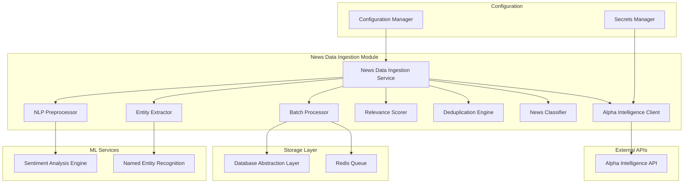
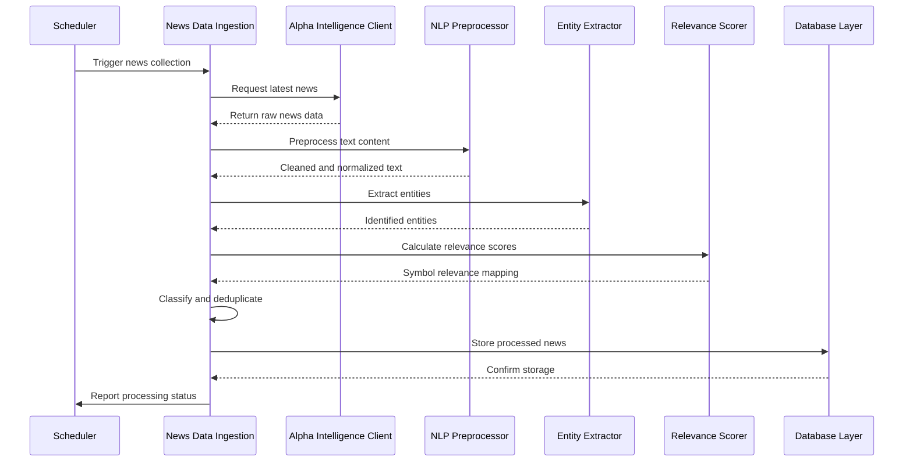

# News Data Ingestion Module Specification

## Module Overview

The News Data Ingestion module collects and processes financial news data from Alpha Intelligence APIs. It handles real-time news feeds, sentiment analysis preparation, entity extraction, and relevance scoring to support trading decisions with timely market intelligence.

## Module Architecture



## Core Responsibilities

### Primary Functions
1. **News Data Collection**: Real-time and historical news collection from Alpha Intelligence
2. **Content Processing**: Text preprocessing and normalization
3. **Entity Extraction**: Company, sector, and financial instrument identification
4. **Relevance Scoring**: Assess news relevance to specific securities and markets
5. **Content Classification**: Categorize news by type, urgency, and market impact
6. **Deduplication**: Eliminate duplicate and similar news articles
7. **Real-time Processing**: Stream processing for breaking news alerts
8. **Quality Assurance**: Content quality validation and filtering

## Alpha Intelligence API Integration

### Supported Endpoints
```rust
pub enum AlphaIntelligenceEndpoint {
    // Real-time news feeds
    LiveNewsFeed { 
        symbols: Vec<String>, 
        topics: Vec<Topic>,
        time_from: Option<DateTime<Utc>>,
        time_to: Option<DateTime<Utc>>,
        sort: SortOrder,
        limit: u32 
    },
    
    // Historical news data
    HistoricalNews { 
        symbol: String,
        time_from: DateTime<Utc>,
        time_to: DateTime<Utc>,
        limit: u32 
    },
    
    // Market-moving news
    MarketMovingNews { 
        time_from: DateTime<Utc>,
        limit: u32 
    },
    
    // Earnings and events
    EarningsCalendar { 
        symbol: Option<String>,
        horizon: TimeHorizon 
    },
    
    // Sentiment analysis
    NewsSentiment { 
        symbols: Vec<String>,
        time_from: DateTime<Utc>,
        time_to: DateTime<Utc> 
    },
}

pub enum Topic {
    Blockchain,
    Earnings,
    IPO,
    Mergers,
    Financial,
    Manufacturing,
    Technology,
    Energy,
    RealEstate,
    Retail,
}

pub enum SortOrder {
    Latest,
    Earliest,
    Relevance,
}

pub enum TimeHorizon {
    ThreeMonths,
    SixMonths,
    TwelveMonths,
}
```

### API Client Implementation
```rust
pub struct AlphaIntelligenceClient {
    client: reqwest::Client,
    api_key: String,
    base_url: String,
    rate_limiter: RateLimiter,
    retry_config: RetryConfig,
    request_timeout: Duration,
}

impl AlphaIntelligenceClient {
    pub async fn get_live_news(
        &self,
        symbols: Vec<String>,
        topics: Vec<Topic>,
        limit: u32,
    ) -> Result<NewsResponse, NewsIngestionError>;
    
    pub async fn get_historical_news(
        &self,
        symbol: &str,
        time_from: DateTime<Utc>,
        time_to: DateTime<Utc>,
        limit: u32,
    ) -> Result<NewsResponse, NewsIngestionError>;
    
    pub async fn get_market_moving_news(
        &self,
        time_from: DateTime<Utc>,
        limit: u32,
    ) -> Result<NewsResponse, NewsIngestionError>;
    
    pub async fn get_earnings_calendar(
        &self,
        symbol: Option<&str>,
        horizon: TimeHorizon,
    ) -> Result<EarningsResponse, NewsIngestionError>;
    
    pub async fn get_news_sentiment(
        &self,
        symbols: Vec<String>,
        time_from: DateTime<Utc>,
        time_to: DateTime<Utc>,
    ) -> Result<SentimentResponse, NewsIngestionError>;
}
```

## Data Structures

### Raw API Response Structures
```rust
#[derive(Deserialize, Debug)]
pub struct NewsResponse {
    pub items: Vec<NewsItem>,
    pub next_page_token: Option<String>,
    pub total_count: u32,
}

#[derive(Deserialize, Debug)]
pub struct NewsItem {
    pub title: String,
    pub url: String,
    pub time_published: String,
    pub authors: Vec<String>,
    pub summary: String,
    pub banner_image: Option<String>,
    pub source: String,
    pub category_within_source: String,
    pub source_domain: String,
    pub topics: Vec<TopicRelevance>,
    pub overall_sentiment_score: Option<f32>,
    pub overall_sentiment_label: Option<String>,
    pub ticker_sentiment: Vec<TickerSentiment>,
}

#[derive(Deserialize, Debug)]
pub struct TopicRelevance {
    pub topic: String,
    pub relevance_score: f32,
}

#[derive(Deserialize, Debug)]
pub struct TickerSentiment {
    pub ticker: String,
    pub relevance_score: f32,
    pub ticker_sentiment_score: f32,
    pub ticker_sentiment_label: String,
}

#[derive(Deserialize, Debug)]
pub struct EarningsResponse {
    pub earnings: Vec<EarningsEvent>,
}

#[derive(Deserialize, Debug)]
pub struct EarningsEvent {
    pub symbol: String,
    pub name: String,
    pub report_date: String,
    pub fiscal_date_ending: String,
    pub estimate: Option<f64>,
    pub currency: String,
}
```

### Internal Data Structures
```rust
#[derive(Debug, Clone, Serialize, Deserialize)]
pub struct ProcessedNewsItem {
    pub id: String, // Content hash for deduplication
    pub title: String,
    pub content: String,
    pub url: String,
    pub published_at: DateTime<Utc>,
    pub source: NewsSource,
    pub authors: Vec<String>,
    pub entities: ExtractedEntities,
    pub relevance_scores: HashMap<String, f32>, // symbol -> relevance
    pub sentiment_scores: HashMap<String, f32>, // symbol -> sentiment
    pub overall_sentiment: f32,
    pub classification: NewsClassification,
    pub quality_score: u8,
    pub processing_metadata: ProcessingMetadata,
}

#[derive(Debug, Clone, Serialize, Deserialize)]
pub struct NewsSource {
    pub name: String,
    pub domain: String,
    pub credibility_score: f32,
    pub category: String,
}

#[derive(Debug, Clone, Serialize, Deserialize)]
pub struct ExtractedEntities {
    pub companies: Vec<CompanyEntity>,
    pub persons: Vec<PersonEntity>,
    pub locations: Vec<LocationEntity>,
    pub financial_instruments: Vec<FinancialEntity>,
    pub sectors: Vec<SectorEntity>,
    pub topics: Vec<TopicEntity>,
}

#[derive(Debug, Clone, Serialize, Deserialize)]
pub struct CompanyEntity {
    pub name: String,
    pub ticker: Option<String>,
    pub confidence: f32,
    pub mention_count: u32,
    pub context: String, // surrounding text
}

#[derive(Debug, Clone, Serialize, Deserialize)]
pub struct NewsClassification {
    pub category: NewsCategory,
    pub urgency: UrgencyLevel,
    pub market_impact: MarketImpact,
    pub topics: Vec<String>,
}

#[derive(Debug, Clone, Serialize, Deserialize)]
pub enum NewsCategory {
    Earnings,
    Merger,
    Acquisition,
    Partnership,
    ProductLaunch,
    Regulatory,
    Executive,
    Financial,
    Market,
    Economic,
    Other,
}

#[derive(Debug, Clone, Serialize, Deserialize)]
pub enum UrgencyLevel {
    Breaking,    // Immediate market impact
    High,        // Within 1 hour
    Medium,      // Within 4 hours
    Low,         // General information
}

#[derive(Debug, Clone, Serialize, Deserialize)]
pub enum MarketImpact {
    High,        // Likely to move stock >5%
    Medium,      // May move stock 1-5%
    Low,         // Minimal stock impact
    Neutral,     // No expected impact
}
```

## Core Processing Pipeline

### News Processing Flow


### Entity Extraction Pipeline
```rust
pub struct EntityExtractor {
    company_matcher: CompanyMatcher,
    ticker_resolver: TickerResolver,
    location_extractor: LocationExtractor,
    person_extractor: PersonExtractor,
}

impl EntityExtractor {
    pub async fn extract_entities(&self, text: &str) -> ExtractedEntities {
        let mut entities = ExtractedEntities::default();
        
        // Extract company mentions and resolve tickers
        entities.companies = self.extract_companies(text).await;
        
        // Extract person names (executives, analysts, etc.)
        entities.persons = self.extract_persons(text).await;
        
        // Extract locations for geographic context
        entities.locations = self.extract_locations(text).await;
        
        // Extract financial instruments (bonds, derivatives, etc.)
        entities.financial_instruments = self.extract_financial_instruments(text).await;
        
        // Extract sector/industry mentions
        entities.sectors = self.extract_sectors(text).await;
        
        // Extract topic classifications
        entities.topics = self.extract_topics(text).await;
        
        entities
    }
    
    async fn extract_companies(&self, text: &str) -> Vec<CompanyEntity> {
        let mut companies = Vec::new();
        
        // Use regex patterns for company name detection
        let company_patterns = &[
            r"\b[A-Z][a-zA-Z\s]+(?:Inc\.?|Corp\.?|LLC|Ltd\.?|Co\.?)\b",
            r"\b[A-Z]{2,5}\b", // Potential ticker symbols
        ];
        
        for pattern in company_patterns {
            let regex = Regex::new(pattern).unwrap();
            for cap in regex.captures_iter(text) {
                if let Some(company_match) = cap.get(0) {
                    let company_name = company_match.as_str();
                    
                    // Resolve ticker if possible
                    let ticker = self.ticker_resolver.resolve(company_name).await;
                    
                    companies.push(CompanyEntity {
                        name: company_name.to_string(),
                        ticker,
                        confidence: self.calculate_confidence(company_name, text),
                        mention_count: self.count_mentions(company_name, text),
                        context: self.extract_context(company_match.start(), text),
                    });
                }
            }
        }
        
        companies
    }
}
```

### Relevance Scoring Engine
```rust
pub struct RelevanceScorer {
    symbol_metadata: HashMap<String, SymbolMetadata>,
    sector_mappings: HashMap<String, Vec<String>>,
    keyword_weights: HashMap<String, f32>,
}

impl RelevanceScorer {
    pub fn calculate_relevance(
        &self,
        news_item: &ProcessedNewsItem,
        symbol: &str,
    ) -> f32 {
        let mut relevance_score = 0.0;
        
        // Direct mention scoring
        if let Some(company_entity) = news_item.entities.companies
            .iter()
            .find(|c| c.ticker.as_ref() == Some(&symbol.to_string())) {
            relevance_score += 0.5 * company_entity.confidence;
        }
        
        // Title mention gets higher weight
        if news_item.title.contains(symbol) {
            relevance_score += 0.3;
        }
        
        // Content mention frequency
        let mention_count = news_item.content.matches(symbol).count() as f32;
        relevance_score += (mention_count / 10.0).min(0.2);
        
        // Sector relevance
        if let Some(symbol_meta) = self.symbol_metadata.get(symbol) {
            for sector_entity in &news_item.entities.sectors {
                if symbol_meta.sectors.contains(&sector_entity.name) {
                    relevance_score += 0.1 * sector_entity.confidence;
                }
            }
        }
        
        // Topic relevance based on symbol classification
        for topic in &news_item.classification.topics {
            if let Some(weight) = self.keyword_weights.get(topic) {
                relevance_score += weight * 0.1;
            }
        }
        
        relevance_score.min(1.0)
    }
}

#[derive(Debug, Clone)]
pub struct SymbolMetadata {
    pub company_name: String,
    pub sectors: Vec<String>,
    pub market_cap: Option<u64>,
    pub primary_exchange: String,
    pub keywords: Vec<String>,
}
```

## Deduplication Strategy

### Content Deduplication
```rust
pub struct DeduplicationEngine {
    similarity_threshold: f32,
    hash_cache: LruCache<String, String>,
    fuzzy_matcher: FuzzyMatcher,
}

impl DeduplicationEngine {
    pub async fn is_duplicate(
        &mut self,
        news_item: &ProcessedNewsItem,
        lookback_hours: u32,
    ) -> Result<bool, NewsIngestionError> {
        // Generate content hash
        let content_hash = self.generate_content_hash(news_item);
        
        // Check exact hash match
        if self.hash_cache.contains(&content_hash) {
            return Ok(true);
        }
        
        // Query recent similar articles from database
        let similar_articles = self.find_similar_articles(
            news_item,
            lookback_hours,
        ).await?;
        
        // Calculate similarity scores
        for article in similar_articles {
            let similarity = self.calculate_similarity(news_item, &article);
            if similarity > self.similarity_threshold {
                return Ok(true);
            }
        }
        
        // Cache the hash
        self.hash_cache.put(content_hash, news_item.id.clone());
        
        Ok(false)
    }
    
    fn generate_content_hash(&self, news_item: &ProcessedNewsItem) -> String {
        use sha2::{Sha256, Digest};
        
        let mut hasher = Sha256::new();
        hasher.update(news_item.title.as_bytes());
        hasher.update(news_item.content.as_bytes());
        hasher.update(news_item.source.name.as_bytes());
        
        format!("{:x}", hasher.finalize())
    }
    
    fn calculate_similarity(
        &self,
        item1: &ProcessedNewsItem,
        item2: &ProcessedNewsItem,
    ) -> f32 {
        let title_similarity = self.fuzzy_matcher.fuzzy_match(
            &item1.title,
            &item2.title,
        ).unwrap_or(0) as f32 / 100.0;
        
        let content_similarity = self.calculate_content_similarity(
            &item1.content,
            &item2.content,
        );
        
        // Weighted combination
        0.6 * title_similarity + 0.4 * content_similarity
    }
}
```

## API Endpoints

### Internal API Interface
```rust
#[derive(OpenApi)]
struct NewsDataIngestionApi;

#[utoipa::path(
    post,
    path = "/api/v1/internal/news/collect",
    request_body = NewsCollectionRequest,
    responses(
        (status = 200, description = "Collection started", body = NewsCollectionResponse),
        (status = 429, description = "Rate limit exceeded"),
        (status = 500, description = "Internal server error")
    )
)]
pub async fn trigger_news_collection(
    State(service): State<NewsDataIngestionService>,
    Json(request): Json<NewsCollectionRequest>,
) -> Result<Json<NewsCollectionResponse>, NewsIngestionError>;

#[utoipa::path(
    get,
    path = "/api/v1/internal/news/recent/{symbol}",
    params(
        ("symbol" = String, Path, description = "Stock symbol"),
        ("hours" = Option<u32>, Query, description = "Hours lookback")
    ),
    responses(
        (status = 200, description = "Recent news", body = Vec<ProcessedNewsItem>)
    )
)]
pub async fn get_recent_news(
    State(service): State<NewsDataIngestionService>,
    Path(symbol): Path<String>,
    Query(params): Query<RecentNewsParams>,
) -> Result<Json<Vec<ProcessedNewsItem>>, NewsIngestionError>;

#[utoipa::path(
    get,
    path = "/api/v1/internal/news/breaking",
    responses(
        (status = 200, description = "Breaking news", body = Vec<ProcessedNewsItem>)
    )
)]
pub async fn get_breaking_news(
    State(service): State<NewsDataIngestionService>,
) -> Result<Json<Vec<ProcessedNewsItem>>, NewsIngestionError>;
```

### Request/Response Structures
```rust
#[derive(Serialize, Deserialize, ToSchema)]
pub struct NewsCollectionRequest {
    pub symbols: Vec<String>,
    pub topics: Vec<Topic>,
    pub lookback_hours: Option<u32>,
    pub include_sentiment: bool,
}

#[derive(Serialize, Deserialize, ToSchema)]
pub struct NewsCollectionResponse {
    pub task_id: String,
    pub estimated_items: u32,
    pub estimated_completion: DateTime<Utc>,
    pub rate_limit_status: RateLimitStatus,
}

#[derive(Serialize, Deserialize, ToSchema)]
pub struct RecentNewsParams {
    pub hours: Option<u32>,
    pub min_relevance: Option<f32>,
    pub categories: Option<Vec<NewsCategory>>,
}
```

## Configuration

### Service Configuration
```toml
[news_data_ingestion]
service_name = "news-data-ingestion"
port = 8081
worker_threads = 6
max_concurrent_processing = 100

[alpha_intelligence]
base_url = "https://www.alphavantage.co/query"
api_key = "${ALPHA_INTELLIGENCE_API_KEY}"
timeout_seconds = 45
max_retries = 3

[processing]
min_content_length = 50
max_content_length = 50000
similarity_threshold = 0.85
relevance_threshold = 0.1
quality_threshold = 60

[deduplication]
lookback_hours = 24
cache_size = 10000
similarity_threshold = 0.80

[entity_extraction]
confidence_threshold = 0.7
max_entities_per_type = 50
context_window_chars = 200

[classification]
market_impact_keywords = [
    "earnings", "merger", "acquisition", "bankruptcy",
    "FDA approval", "lawsuit", "investigation", "partnership"
]
urgency_keywords = [
    "breaking", "alert", "urgent", "immediate", "halt"
]
```

## Performance Requirements

### Latency Targets
- **News Collection**: < 5 seconds for 100 articles
- **Entity Extraction**: < 500ms per article
- **Relevance Scoring**: < 100ms per symbol
- **Deduplication**: < 200ms per article

### Throughput Targets
- **Articles Processed**: 10,000 articles per hour
- **Real-time Processing**: < 30 seconds from publication to storage
- **Concurrent Processing**: 50 articles simultaneously

### Resource Utilization
- **Memory**: < 2GB under normal load
- **CPU**: < 70% utilization during peak processing
- **Storage**: Efficient batch operations

## Error Handling

### Error Types
```rust
#[derive(Error, Debug)]
pub enum NewsIngestionError {
    #[error("Alpha Intelligence API error: {message}")]
    ApiError { message: String, status_code: u16 },
    
    #[error("Content processing error: {step} - {error}")]
    ProcessingError { step: String, error: String },
    
    #[error("Entity extraction failed: {text_length} chars")]
    EntityExtractionError { text_length: usize },
    
    #[error("Duplicate content detected: {similarity_score}")]
    DuplicateContent { similarity_score: f32 },
    
    #[error("Content quality too low: {score} < {threshold}")]
    QualityBelowThreshold { score: u8, threshold: u8 },
    
    #[error("Rate limit exceeded: {endpoint}")]
    RateLimitExceeded { endpoint: String },
}
```

## Monitoring and Dependencies

### Key Metrics
- Articles processed per hour
- Entity extraction accuracy
- Deduplication effectiveness
- Relevance scoring accuracy
- Processing latency percentiles
- API rate limit utilization

### Dependencies
- **Alpha Intelligence API**: Primary news source
- **Database Abstraction Layer**: News storage
- **Sentiment Analysis Engine**: Sentiment processing
- **Configuration Manager**: Service settings

This News Data Ingestion module provides comprehensive news collection and processing capabilities, enabling the system to make informed trading decisions based on timely and relevant market intelligence.