# Hyper Heuristic Strategy Selection Module Specification

## Module Overview

The Hyper Heuristic Strategy Selection module implements an intelligent meta-learning system that automatically selects optimal trading strategies and model configurations based on current market conditions, historical performance, and regime analysis. It employs advanced optimization algorithms including multi-armed bandits, genetic algorithms, and reinforcement learning to continuously adapt strategy selection for maximum performance.

## Module Architecture

```mermaid
graph TB
    subgraph "Hyper Heuristic Strategy Selection"
        HHS[Hyper Heuristic Strategy Engine]
        SS[Strategy Selector]
        PO[Parameter Optimizer]
        ML[Meta Learner]
        PT[Performance Tracker]
        SA[Strategy Analyzer]
        AB[A/B Testing Framework]
        EE[Exploration/Exploitation Manager]
    end
    
    subgraph "Strategy Components"
        SP[Strategy Pool]
        MAB[Multi-Armed Bandit]
        GA[Genetic Algorithm]
        RL[Reinforcement Learning]
        BO[Bayesian Optimization]
    end
    
    subgraph "Input Sources"
        MRD[Market Regime Detection]
        PE[Performance Evaluation]
        TIE[TensorRT Inference Engine]
        FSR[Feature Storage & Retrieval]
    end
    
    subgraph "Output Targets"
        PS[Prediction Service]
        SO[Strategy Optimization]
        DAL[Database Abstraction Layer]
    end
    
    HHS --> SS
    HHS --> PO
    HHS --> ML
    HHS --> PT
    HHS --> SA
    HHS --> AB
    HHS --> EE
    
    SS --> SP
    SS --> MAB
    PO --> GA
    ML --> RL
    PO --> BO
    
    MRD --> SA
    PE --> PT
    TIE --> AB
    FSR --> ML
    
    SS --> PS
    PO --> SO
    PT --> DAL
```



## Core Responsibilities

### Primary Functions
1. **Strategy Selection**: Intelligent selection of optimal trading strategies based on market conditions
2. **Parameter Optimization**: Dynamic optimization of strategy parameters and model weights
3. **Meta Learning**: Learn from strategy performance patterns across different market regimes
4. **Performance Tracking**: Monitor and evaluate strategy effectiveness in real-time
5. **Exploration/Exploitation**: Balance between trying new strategies and exploiting known good ones
6. **A/B Testing**: Systematic testing and validation of new strategies
7. **Adaptive Optimization**: Continuous adaptation to changing market conditions
8. **Risk Management**: Incorporate risk considerations into strategy selection

## Strategy Definitions

### Strategy Types
```rust
#[derive(Debug, Clone, Serialize, Deserialize, PartialEq)]
pub enum StrategyType {
    TrendFollowing {
        momentum_threshold: f64,
        trend_strength_filter: f64,
        stop_loss_pct: f64,
        take_profit_pct: f64,
    },
    MeanReversion {
        reversion_threshold: f64,
        holding_period_max: u32,
        volatility_filter: f64,
        entry_z_score: f64,
    },
    VolatilityTrading {
        vol_regime_threshold: f64,
        vol_spike_multiplier: f64,
        position_sizing_factor: f64,
        time_decay_factor: f64,
    },
    ArbitrageStrategy {
        spread_threshold: f64,
        correlation_threshold: f64,
        execution_delay_max: u32,
        risk_limit_pct: f64,
    },
    SentimentDriven {
        sentiment_threshold: f64,
        news_weight: f64,
        social_weight: f64,
        decay_factor: f64,
    },
    MultiFactorModel {
        factor_weights: HashMap<String, f64>,
        factor_decay_rates: HashMap<String, f64>,
        interaction_terms: Vec<FactorInteraction>,
        regularization_lambda: f64,
    },
    EnsembleStrategy {
        sub_strategies: Vec<StrategyType>,
        combination_method: CombinationMethod,
        weight_adaptation: WeightAdaptation,
    },
}

#[derive(Debug, Clone, Serialize, Deserialize, PartialEq)]
pub struct FactorInteraction {
    pub factors: Vec<String>,
    pub interaction_type: InteractionType,
    pub weight: f64,
}

#[derive(Debug, Clone, Serialize, Deserialize, PartialEq)]
pub enum InteractionType {
    Multiplicative,
    Additive,
    Conditional,
    NonLinear(String), // Function name
}

#[derive(Debug, Clone, Serialize, Deserialize, PartialEq)]
pub enum CombinationMethod {
    WeightedAverage,
    MedianBlend,
    RankBased,
    VolatilityWeighted,
    PerformanceWeighted,
    Dynamic,
}

#[derive(Debug, Clone, Serialize, Deserialize, PartialEq)]
pub enum WeightAdaptation {
    Static,
    ExponentialDecay,
    PerformanceBased,
    VolatilityAdjusted,
    RegimeSensitive,
}
```

### Strategy Context
```rust
#[derive(Debug, Clone, Serialize, Deserialize)]
pub struct StrategyContext {
    pub symbol: String,
    pub timestamp: DateTime<Utc>,
    pub market_regime: MarketRegime,
    pub market_conditions: MarketConditions,
    pub portfolio_context: PortfolioContext,
    pub risk_constraints: RiskConstraints,
    pub performance_history: PerformanceHistory,
}

#[derive(Debug, Clone, Serialize, Deserialize)]
pub struct MarketConditions {
    pub volatility_regime: String,
    pub trend_strength: f64,
    pub correlation_environment: f64,
    pub liquidity_conditions: f64,
    pub sentiment_score: f64,
    pub macro_indicators: HashMap<String, f64>,
}

#[derive(Debug, Clone, Serialize, Deserialize)]
pub struct PortfolioContext {
    pub current_positions: HashMap<String, f64>,
    pub available_capital: f64,
    pub portfolio_volatility: f64,
    pub concentration_limits: HashMap<String, f64>,
    pub sector_exposure: HashMap<String, f64>,
}

#[derive(Debug, Clone, Serialize, Deserialize)]
pub struct RiskConstraints {
    pub max_position_size: f64,
    pub max_portfolio_volatility: f64,
    pub max_drawdown: f64,
    pub concentration_limits: HashMap<String, f64>,
    pub sector_limits: HashMap<String, f64>,
    pub correlation_limits: f64,
}

#[derive(Debug, Clone, Serialize, Deserialize)]
pub struct PerformanceHistory {
    pub strategy_returns: HashMap<String, Vec<f64>>,
    pub regime_performance: HashMap<String, HashMap<String, f64>>,
    pub risk_metrics: HashMap<String, RiskMetrics>,
    pub recent_performance: HashMap<String, f64>,
}

#[derive(Debug, Clone, Serialize, Deserialize)]
pub struct RiskMetrics {
    pub sharpe_ratio: f64,
    pub sortino_ratio: f64,
    pub max_drawdown: f64,
    pub var_95: f64,
    pub beta: f64,
    pub alpha: f64,
}
```

## Core Implementation

### Strategy Selector
```rust
pub struct StrategySelector {
    strategy_pool: Vec<StrategyDefinition>,
    multi_armed_bandit: MultiArmedBandit,
    performance_tracker: Arc<PerformanceTracker>,
    meta_learner: Arc<MetaLearner>,
    exploration_rate: f64,
    selection_history: VecDeque<StrategySelection>,
}

#[derive(Debug, Clone, Serialize, Deserialize)]
pub struct StrategyDefinition {
    pub id: String,
    pub name: String,
    pub strategy_type: StrategyType,
    pub parameter_ranges: HashMap<String, ParameterRange>,
    pub applicable_regimes: Vec<String>,
    pub risk_profile: RiskProfile,
    pub performance_metrics: Option<StrategyPerformanceMetrics>,
    pub last_updated: DateTime<Utc>,
}

#[derive(Debug, Clone, Serialize, Deserialize)]
pub struct RiskProfile {
    pub expected_volatility: f64,
    pub max_drawdown_expected: f64,
    pub correlation_sensitivity: f64,
    pub liquidity_requirements: LiquidityRequirement,
    pub capital_requirements: f64,
}

#[derive(Debug, Clone, Serialize, Deserialize)]
pub enum LiquidityRequirement {
    Low,    // Can handle illiquid assets
    Medium, // Requires reasonable liquidity
    High,   // Only highly liquid assets
}

impl StrategySelector {
    pub async fn select_strategy(
        &mut self,
        context: &StrategyContext,
    ) -> Result<SelectedStrategy, StrategyError> {
        info!("Selecting strategy for {} in regime: {}", 
            context.symbol, context.market_regime.name);
        
        // Filter strategies applicable to current regime
        let applicable_strategies = self.filter_applicable_strategies(context)?;
        
        if applicable_strategies.is_empty() {
            return Err(StrategyError::NoApplicableStrategies {
                regime: context.market_regime.name.clone(),
                symbol: context.symbol.clone(),
            });
        }
        
        // Get performance predictions from meta-learner
        let performance_predictions = self.meta_learner
            .predict_strategy_performance(&applicable_strategies, context).await?;
        
        // Update multi-armed bandit with recent performance
        self.update_bandit_rewards(context).await?;
        
        // Determine exploration vs exploitation
        let should_explore = self.should_explore(context);
        
        let selected_strategy = if should_explore {
            info!("Exploring: selecting strategy for exploration");
            self.select_exploration_strategy(&applicable_strategies, context)?
        } else {
            info!("Exploiting: selecting best-performing strategy");
            self.select_best_strategy(&applicable_strategies, &performance_predictions, context)?
        };
        
        // Record selection
        let selection = StrategySelection {
            strategy_id: selected_strategy.strategy_id.clone(),
            context: context.clone(),
            selection_reason: selected_strategy.selection_reason.clone(),
            expected_performance: selected_strategy.expected_performance,
            confidence: selected_strategy.confidence,
            timestamp: Utc::now(),
        };
        
        self.selection_history.push_back(selection);
        if self.selection_history.len() > 1000 {
            self.selection_history.pop_front();
        }
        
        info!("Selected strategy: {} with confidence: {:.3}", 
            selected_strategy.strategy_name, selected_strategy.confidence);
        
        Ok(selected_strategy)
    }
    
    fn filter_applicable_strategies(
        &self,
        context: &StrategyContext,
    ) -> Result<Vec<&StrategyDefinition>, StrategyError> {
        let mut applicable = Vec::new();
        
        for strategy in &self.strategy_pool {
            // Check regime applicability
            if !strategy.applicable_regimes.is_empty() 
                && !strategy.applicable_regimes.contains(&context.market_regime.name) {
                continue;
            }
            
            // Check risk constraints
            if !self.meets_risk_constraints(strategy, context) {
                continue;
            }
            
            // Check capital requirements
            if strategy.risk_profile.capital_requirements > context.portfolio_context.available_capital {
                continue;
            }
            
            // Check liquidity requirements
            if !self.meets_liquidity_requirements(strategy, context) {
                continue;
            }
            
            applicable.push(strategy);
        }
        
        Ok(applicable)
    }
    
    fn meets_risk_constraints(
        &self,
        strategy: &StrategyDefinition,
        context: &StrategyContext,
    ) -> bool {
        // Check portfolio volatility constraint
        if strategy.risk_profile.expected_volatility > context.risk_constraints.max_portfolio_volatility {
            return false;
        }
        
        // Check maximum drawdown constraint
        if strategy.risk_profile.max_drawdown_expected > context.risk_constraints.max_drawdown {
            return false;
        }
        
        // Check position size constraints
        let position_size = self.calculate_position_size(strategy, context);
        if position_size > context.risk_constraints.max_position_size {
            return false;
        }
        
        true
    }
    
    fn should_explore(&self, context: &StrategyContext) -> bool {
        // Increase exploration in new regimes or high uncertainty periods
        let base_exploration_rate = self.exploration_rate;
        
        // Adjust based on regime novelty
        let regime_adjustment = if self.is_new_regime(context) {
            0.2 // Increase exploration by 20% in new regimes
        } else {
            0.0
        };
        
        // Adjust based on recent performance variance
        let performance_adjustment = self.calculate_performance_uncertainty(context) * 0.1;
        
        let adjusted_rate = (base_exploration_rate + regime_adjustment + performance_adjustment).min(0.5);
        
        rand::random::<f64>() < adjusted_rate
    }
    
    fn select_exploration_strategy(
        &self,
        strategies: &[&StrategyDefinition],
        context: &StrategyContext,
    ) -> Result<SelectedStrategy, StrategyError> {
        // Use Upper Confidence Bound (UCB) for exploration
        let mut best_ucb_score = f64::NEG_INFINITY;
        let mut best_strategy = None;
        
        let total_selections = self.selection_history.len() as f64;
        let c = 1.414; // UCB exploration parameter
        
        for strategy in strategies {
            let strategy_selections = self.count_strategy_selections(&strategy.id);
            let avg_reward = self.get_average_reward(&strategy.id, context);
            
            let ucb_score = if strategy_selections == 0 {
                f64::INFINITY // Prioritize unexplored strategies
            } else {
                avg_reward + c * ((total_selections.ln()) / strategy_selections as f64).sqrt()
            };
            
            if ucb_score > best_ucb_score {
                best_ucb_score = ucb_score;
                best_strategy = Some(strategy);
            }
        }
        
        let selected = best_strategy.ok_or(StrategyError::NoStrategySelected)?;
        
        Ok(SelectedStrategy {
            strategy_id: selected.id.clone(),
            strategy_name: selected.name.clone(),
            strategy_type: selected.strategy_type.clone(),
            parameters: self.get_default_parameters(selected)?,
            expected_performance: 0.0, // Unknown for exploration
            confidence: 0.5, // Medium confidence for exploration
            selection_reason: "exploration_ucb".to_string(),
            regime_context: context.market_regime.clone(),
            timestamp: Utc::now(),
        })
    }
    
    fn select_best_strategy(
        &self,
        strategies: &[&StrategyDefinition],
        predictions: &HashMap<String, f64>,
        context: &StrategyContext,
    ) -> Result<SelectedStrategy, StrategyError> {
        let mut best_score = f64::NEG_INFINITY;
        let mut best_strategy = None;
        
        for strategy in strategies {
            let performance_score = predictions.get(&strategy.id).copied().unwrap_or(0.0);
            
            // Apply risk adjustment
            let risk_adjusted_score = self.risk_adjust_score(
                performance_score,
                &strategy.risk_profile,
                context,
            );
            
            // Apply recent performance weight
            let recent_performance = self.get_recent_performance(&strategy.id, context);
            let combined_score = 0.7 * risk_adjusted_score + 0.3 * recent_performance;
            
            if combined_score > best_score {
                best_score = combined_score;
                best_strategy = Some(strategy);
            }
        }
        
        let selected = best_strategy.ok_or(StrategyError::NoStrategySelected)?;
        let confidence = self.calculate_selection_confidence(best_score, predictions);
        
        Ok(SelectedStrategy {
            strategy_id: selected.id.clone(),
            strategy_name: selected.name.clone(),
            strategy_type: selected.strategy_type.clone(),
            parameters: self.optimize_parameters(selected, context).await?,
            expected_performance: best_score,
            confidence,
            selection_reason: "exploitation_best_predicted".to_string(),
            regime_context: context.market_regime.clone(),
            timestamp: Utc::now(),
        })
    }
    
    fn risk_adjust_score(
        &self,
        raw_score: f64,
        risk_profile: &RiskProfile,
        context: &StrategyContext,
    ) -> f64 {
        let risk_aversion = 0.5; // Configurable risk aversion parameter
        
        // Penalize high volatility
        let volatility_penalty = risk_aversion * risk_profile.expected_volatility;
        
        // Penalize high drawdown risk
        let drawdown_penalty = risk_aversion * risk_profile.max_drawdown_expected;
        
        // Adjust for current portfolio volatility
        let portfolio_vol_factor = if context.portfolio_context.portfolio_volatility > 0.15 {
            0.8 // Reduce score if portfolio is already volatile
        } else {
            1.0
        };
        
        (raw_score - volatility_penalty - drawdown_penalty) * portfolio_vol_factor
    }
}

#[derive(Debug, Clone, Serialize, Deserialize)]
pub struct SelectedStrategy {
    pub strategy_id: String,
    pub strategy_name: String,
    pub strategy_type: StrategyType,
    pub parameters: HashMap<String, f64>,
    pub expected_performance: f64,
    pub confidence: f64,
    pub selection_reason: String,
    pub regime_context: MarketRegime,
    pub timestamp: DateTime<Utc>,
}

#[derive(Debug, Clone, Serialize, Deserialize)]
pub struct StrategySelection {
    pub strategy_id: String,
    pub context: StrategyContext,
    pub selection_reason: String,
    pub expected_performance: f64,
    pub confidence: f64,
    pub timestamp: DateTime<Utc>,
}
```

### Parameter Optimizer
```rust
pub struct ParameterOptimizer {
    genetic_algorithm: GeneticAlgorithm,
    bayesian_optimizer: BayesianOptimizer,
    parameter_cache: Arc<Mutex<HashMap<String, OptimizedParameters>>>,
    optimization_history: VecDeque<OptimizationResult>,
}

#[derive(Debug, Clone, Serialize, Deserialize)]
pub struct OptimizedParameters {
    pub parameters: HashMap<String, f64>,
    pub optimization_score: f64,
    pub optimization_method: String,
    pub optimization_timestamp: DateTime<Utc>,
    pub context_hash: u64,
    pub validation_score: f64,
}

impl ParameterOptimizer {
    pub async fn optimize_parameters(
        &mut self,
        strategy: &StrategyDefinition,
        context: &StrategyContext,
    ) -> Result<HashMap<String, f64>, OptimizationError> {
        let context_hash = self.calculate_context_hash(context);
        let cache_key = format!("{}_{}", strategy.id, context_hash);
        
        // Check cache first
        {
            let cache = self.parameter_cache.lock().await;
            if let Some(cached) = cache.get(&cache_key) {
                if cached.optimization_timestamp > Utc::now() - Duration::hours(1) {
                    info!("Using cached parameters for strategy: {}", strategy.name);
                    return Ok(cached.parameters.clone());
                }
            }
        }
        
        info!("Optimizing parameters for strategy: {}", strategy.name);
        
        // Choose optimization method based on parameter space size
        let param_count = strategy.parameter_ranges.len();
        let optimization_method = if param_count <= 5 {
            "bayesian"
        } else if param_count <= 15 {
            "genetic"
        } else {
            "hybrid"
        };
        
        let optimized = match optimization_method {
            "bayesian" => self.bayesian_optimize(strategy, context).await?,
            "genetic" => self.genetic_optimize(strategy, context).await?,
            "hybrid" => self.hybrid_optimize(strategy, context).await?,
            _ => return Err(OptimizationError::UnknownMethod {
                method: optimization_method.to_string(),
            }),
        };
        
        // Validate optimized parameters
        let validation_score = self.validate_parameters(strategy, &optimized.parameters, context).await?;
        
        let optimized_params = OptimizedParameters {
            parameters: optimized.parameters.clone(),
            optimization_score: optimized.score,
            optimization_method: optimization_method.to_string(),
            optimization_timestamp: Utc::now(),
            context_hash,
            validation_score,
        };
        
        // Cache results
        {
            let mut cache = self.parameter_cache.lock().await;
            cache.insert(cache_key, optimized_params);
            
            // Limit cache size
            if cache.len() > 1000 {
                let oldest_key = cache.iter()
                    .min_by_key(|(_, v)| v.optimization_timestamp)
                    .map(|(k, _)| k.clone());
                    
                if let Some(key) = oldest_key {
                    cache.remove(&key);
                }
            }
        }
        
        // Record optimization history
        self.optimization_history.push_back(OptimizationResult {
            strategy_id: strategy.id.clone(),
            method: optimization_method.to_string(),
            score: optimized.score,
            parameters: optimized.parameters.clone(),
            context: context.clone(),
            timestamp: Utc::now(),
        });
        
        if self.optimization_history.len() > 10000 {
            self.optimization_history.pop_front();
        }
        
        info!("Parameter optimization completed for {} with score: {:.4}", 
            strategy.name, optimized.score);
        
        Ok(optimized.parameters)
    }
    
    async fn genetic_optimize(
        &mut self,
        strategy: &StrategyDefinition,
        context: &StrategyContext,
    ) -> Result<OptimizationResult, OptimizationError> {
        let config = GeneticAlgorithmConfig {
            population_size: 50,
            generations: 30,
            crossover_rate: 0.8,
            mutation_rate: 0.1,
            elitism_rate: 0.2,
            tournament_size: 5,
        };
        
        self.genetic_algorithm.optimize(
            &strategy.parameter_ranges,
            |params| self.evaluate_parameters(strategy, params, context),
            config,
        ).await
    }
    
    async fn bayesian_optimize(
        &mut self,
        strategy: &StrategyDefinition,
        context: &StrategyContext,
    ) -> Result<OptimizationResult, OptimizationError> {
        let config = BayesianOptimizationConfig {
            n_initial_points: 10,
            n_calls: 50,
            acquisition_function: AcquisitionFunction::ExpectedImprovement,
            kernel: KernelType::RBF,
            alpha: 1e-6,
        };
        
        self.bayesian_optimizer.optimize(
            &strategy.parameter_ranges,
            |params| self.evaluate_parameters(strategy, params, context),
            config,
        ).await
    }
    
    async fn hybrid_optimize(
        &mut self,
        strategy: &StrategyDefinition,
        context: &StrategyContext,
    ) -> Result<OptimizationResult, OptimizationError> {
        // First use genetic algorithm for global exploration
        let ga_result = self.genetic_optimize(strategy, context).await?;
        
        // Then use Bayesian optimization for local refinement around the best GA result
        let refined_ranges = self.create_refined_ranges(&strategy.parameter_ranges, &ga_result.parameters);
        
        let mut refined_strategy = strategy.clone();
        refined_strategy.parameter_ranges = refined_ranges;
        
        let bayesian_result = self.bayesian_optimize(&refined_strategy, context).await?;
        
        // Return the better of the two results
        if bayesian_result.score > ga_result.score {
            Ok(bayesian_result)
        } else {
            Ok(ga_result)
        }
    }
    
    async fn evaluate_parameters(
        &self,
        strategy: &StrategyDefinition,
        parameters: &HashMap<String, f64>,
        context: &StrategyContext,
    ) -> f64 {
        // This would typically involve backtesting or simulation
        // For now, we'll use a simplified heuristic-based evaluation
        
        let mut score = 0.0;
        
        // Evaluate based on historical performance in similar contexts
        if let Some(historical_performance) = self.get_historical_performance(strategy, parameters, context) {
            score += historical_performance * 0.6;
        }
        
        // Evaluate based on parameter reasonableness
        let parameter_quality = self.evaluate_parameter_quality(strategy, parameters);
        score += parameter_quality * 0.2;
        
        // Evaluate based on risk-adjusted returns
        let risk_adjustment = self.calculate_risk_adjustment(parameters, context);
        score += risk_adjustment * 0.2;
        
        score
    }
    
    fn evaluate_parameter_quality(
        &self,
        strategy: &StrategyDefinition,
        parameters: &HashMap<String, f64>,
    ) -> f64 {
        let mut quality_score = 1.0;
        
        for (param_name, &value) in parameters {
            if let Some(range) = strategy.parameter_ranges.get(param_name) {
                match range {
                    ParameterRange::Uniform { low, high } => {
                        if value < *low || value > *high {
                            quality_score *= 0.1; // Heavily penalize out-of-range values
                        } else {
                            // Prefer values not at extremes
                            let normalized = (value - low) / (high - low);
                            let distance_from_center = (normalized - 0.5).abs();
                            quality_score *= 1.0 - distance_from_center * 0.2;
                        }
                    },
                    ParameterRange::LogUniform { low, high } => {
                        if value < *low || value > *high {
                            quality_score *= 0.1;
                        }
                    },
                    ParameterRange::Integer { low, high, .. } => {
                        if value < *low as f64 || value > *high as f64 {
                            quality_score *= 0.1;
                        }
                    },
                    ParameterRange::Categorical { choices } => {
                        let choice_index = value as usize;
                        if choice_index >= choices.len() {
                            quality_score *= 0.1;
                        }
                    },
                }
            }
        }
        
        quality_score
    }
    
    fn calculate_context_hash(&self, context: &StrategyContext) -> u64 {
        use std::collections::hash_map::DefaultHasher;
        use std::hash::{Hash, Hasher};
        
        let mut hasher = DefaultHasher::new();
        
        context.market_regime.name.hash(&mut hasher);
        (context.market_conditions.volatility_regime.as_bytes()).hash(&mut hasher);
        ((context.market_conditions.trend_strength * 1000.0) as i64).hash(&mut hasher);
        ((context.market_conditions.correlation_environment * 1000.0) as i64).hash(&mut hasher);
        
        hasher.finish()
    }
}

#[derive(Debug, Clone)]
pub struct OptimizationResult {
    pub strategy_id: String,
    pub method: String,
    pub score: f64,
    pub parameters: HashMap<String, f64>,
    pub context: StrategyContext,
    pub timestamp: DateTime<Utc>,
}
```

### Meta Learner
```rust
pub struct MetaLearner {
    neural_network: NeuralNetwork,
    feature_extractor: FeatureExtractor,
    training_data: VecDeque<MetaLearningExample>,
    model_version: String,
    last_training: DateTime<Utc>,
    retraining_threshold: usize,
}

#[derive(Debug, Clone, Serialize, Deserialize)]
pub struct MetaLearningExample {
    pub strategy_id: String,
    pub context_features: Vec<f64>,
    pub strategy_features: Vec<f64>,
    pub actual_performance: f64,
    pub timestamp: DateTime<Utc>,
}

impl MetaLearner {
    pub async fn predict_strategy_performance(
        &self,
        strategies: &[&StrategyDefinition],
        context: &StrategyContext,
    ) -> Result<HashMap<String, f64>, MetaLearningError> {
        let context_features = self.feature_extractor.extract_context_features(context)?;
        let mut predictions = HashMap::new();
        
        for strategy in strategies {
            let strategy_features = self.feature_extractor.extract_strategy_features(strategy)?;
            
            // Combine context and strategy features
            let mut input_features = context_features.clone();
            input_features.extend(strategy_features);
            
            // Predict performance using neural network
            let prediction = self.neural_network.predict(&input_features)?;
            predictions.insert(strategy.id.clone(), prediction);
        }
        
        Ok(predictions)
    }
    
    pub async fn learn_from_outcome(
        &mut self,
        strategy_id: &str,
        context: &StrategyContext,
        strategy: &StrategyDefinition,
        actual_performance: f64,
    ) -> Result<(), MetaLearningError> {
        let context_features = self.feature_extractor.extract_context_features(context)?;
        let strategy_features = self.feature_extractor.extract_strategy_features(strategy)?;
        
        let example = MetaLearningExample {
            strategy_id: strategy_id.to_string(),
            context_features,
            strategy_features,
            actual_performance,
            timestamp: Utc::now(),
        };
        
        self.training_data.push_back(example);
        
        // Limit training data size
        if self.training_data.len() > 50000 {
            self.training_data.pop_front();
        }
        
        // Retrain model if enough new data has accumulated
        if self.training_data.len() % self.retraining_threshold == 0 {
            info!("Retraining meta-learner with {} examples", self.training_data.len());
            self.retrain_model().await?;
        }
        
        Ok(())
    }
    
    async fn retrain_model(&mut self) -> Result<(), MetaLearningError> {
        let training_examples: Vec<_> = self.training_data.iter().collect();
        
        if training_examples.len() < 100 {
            return Ok(())// Need minimum examples for training
        }
        
        // Prepare training data
        let mut inputs = Vec::new();
        let mut targets = Vec::new();
        
        for example in &training_examples {
            let mut input = example.context_features.clone();
            input.extend(example.strategy_features.clone());
            inputs.push(input);
            targets.push(example.actual_performance);
        }
        
        // Split into train/validation sets
        let split_index = (inputs.len() as f64 * 0.8) as usize;
        let train_inputs = &inputs[..split_index];
        let train_targets = &targets[..split_index];
        let val_inputs = &inputs[split_index..];
        let val_targets = &targets[split_index..];
        
        // Train neural network
        let training_config = NeuralNetworkConfig {
            learning_rate: 0.001,
            batch_size: 32,
            epochs: 100,
            early_stopping_patience: 10,
            validation_split: 0.2,
        };
        
        self.neural_network.train(
            train_inputs,
            train_targets,
            Some((val_inputs, val_targets)),
            training_config,
        ).await?;
        
        // Update model version and training timestamp
        self.model_version = format!("v{}", Utc::now().timestamp());
        self.last_training = Utc::now();
        
        info!("Meta-learner retrained successfully. New version: {}", self.model_version);
        
        Ok(())
    }
    
    pub fn get_model_info(&self) -> MetaLearnerInfo {
        MetaLearnerInfo {
            model_version: self.model_version.clone(),
            last_training: self.last_training,
            training_examples: self.training_data.len(),
            feature_dimension: self.neural_network.input_dimension(),
        }
    }
}

#[derive(Debug, Clone, Serialize, Deserialize)]
pub struct MetaLearnerInfo {
    pub model_version: String,
    pub last_training: DateTime<Utc>,
    pub training_examples: usize,
    pub feature_dimension: usize,
}

pub struct FeatureExtractor;

impl FeatureExtractor {
    pub fn extract_context_features(&self, context: &StrategyContext) -> Result<Vec<f64>, MetaLearningError> {
        let mut features = Vec::new();
        
        // Market regime features
        features.push(self.encode_regime(&context.market_regime.name));
        features.push(context.market_conditions.volatility_regime.len() as f64 / 20.0); // Normalize
        features.push(context.market_conditions.trend_strength);
        features.push(context.market_conditions.correlation_environment);
        features.push(context.market_conditions.liquidity_conditions);
        features.push(context.market_conditions.sentiment_score);
        
        // Portfolio context features
        features.push(context.portfolio_context.available_capital.ln()); // Log scale
        features.push(context.portfolio_context.portfolio_volatility);
        features.push(context.portfolio_context.current_positions.len() as f64 / 100.0);
        
        // Risk constraint features
        features.push(context.risk_constraints.max_position_size);
        features.push(context.risk_constraints.max_portfolio_volatility);
        features.push(context.risk_constraints.max_drawdown);
        
        // Time features
        let hour_of_day = context.timestamp.hour() as f64 / 24.0;
        let day_of_week = context.timestamp.weekday().number_from_monday() as f64 / 7.0;
        features.push(hour_of_day);
        features.push(day_of_week);
        
        Ok(features)
    }
    
    pub fn extract_strategy_features(&self, strategy: &StrategyDefinition) -> Result<Vec<f64>, MetaLearningError> {
        let mut features = Vec::new();
        
        // Strategy type encoding (one-hot)
        let strategy_type_encoding = self.encode_strategy_type(&strategy.strategy_type);
        features.extend(strategy_type_encoding);
        
        // Risk profile features
        features.push(strategy.risk_profile.expected_volatility);
        features.push(strategy.risk_profile.max_drawdown_expected);
        features.push(strategy.risk_profile.correlation_sensitivity);
        features.push(strategy.risk_profile.capital_requirements.ln());
        
        // Performance metrics if available
        if let Some(perf) = &strategy.performance_metrics {
            features.push(perf.sharpe_ratio);
            features.push(perf.max_drawdown);
            features.push(perf.win_rate);
            features.push(perf.profit_factor);
        } else {
            features.extend(vec![0.0; 4]); // Default values
        }
        
        // Parameter complexity (number of parameters)
        features.push(strategy.parameter_ranges.len() as f64 / 20.0);
        
        Ok(features)
    }
    
    fn encode_regime(&self, regime: &str) -> f64 {
        // Simple encoding - in practice, you'd use more sophisticated methods
        match regime {
            "low_volatility" => 0.0,
            "normal_volatility" => 0.33,
            "high_volatility" => 0.66,
            "crisis" => 1.0,
            _ => 0.5,
        }
    }
    
    fn encode_strategy_type(&self, strategy_type: &StrategyType) -> Vec<f64> {
        // One-hot encoding for strategy types
        let mut encoding = vec![0.0; 7]; // Number of strategy types
        
        match strategy_type {
            StrategyType::TrendFollowing { .. } => encoding[0] = 1.0,
            StrategyType::MeanReversion { .. } => encoding[1] = 1.0,
            StrategyType::VolatilityTrading { .. } => encoding[2] = 1.0,
            StrategyType::ArbitrageStrategy { .. } => encoding[3] = 1.0,
            StrategyType::SentimentDriven { .. } => encoding[4] = 1.0,
            StrategyType::MultiFactorModel { .. } => encoding[5] = 1.0,
            StrategyType::EnsembleStrategy { .. } => encoding[6] = 1.0,
        }
        
        encoding
    }
}
```

## A/B Testing Framework

### A/B Testing Implementation
```rust
pub struct ABTestingFramework {
    active_tests: HashMap<String, ABTest>,
    test_results: VecDeque<ABTestResult>,
    statistical_engine: StatisticalEngine,
    min_sample_size: usize,
    confidence_level: f64,
}

#[derive(Debug, Clone, Serialize, Deserialize)]
pub struct ABTest {
    pub test_id: String,
    pub test_name: String,
    pub control_strategy: StrategyDefinition,
    pub treatment_strategies: Vec<StrategyDefinition>,
    pub allocation_ratio: Vec<f32>, // Control + treatments
    pub start_date: DateTime<Utc>,
    pub end_date: Option<DateTime<Utc>>,
    pub target_symbols: Vec<String>,
    pub success_metric: SuccessMetric,
    pub min_sample_size: usize,
    pub significance_threshold: f64,
    pub status: TestStatus,
}

#[derive(Debug, Clone, Serialize, Deserialize)]
pub enum SuccessMetric {
    SharpeRatio,
    TotalReturn,
    MaxDrawdown,
    WinRate,
    ProfitFactor,
    Custom(String),
}

#[derive(Debug, Clone, Serialize, Deserialize)]
pub enum TestStatus {
    Planning,
    Running,
    Completed,
    Stopped,
    Failed,
}

impl ABTestingFramework {
    pub async fn create_test(
        &mut self,
        test_config: ABTestConfig,
    ) -> Result<String, ABTestError> {
        let test_id = format!("test_{}", Utc::now().timestamp());
        
        // Validate test configuration
        self.validate_test_config(&test_config)?;
        
        let ab_test = ABTest {
            test_id: test_id.clone(),
            test_name: test_config.test_name,
            control_strategy: test_config.control_strategy,
            treatment_strategies: test_config.treatment_strategies,
            allocation_ratio: test_config.allocation_ratio,
            start_date: test_config.start_date.unwrap_or_else(Utc::now),
            end_date: test_config.end_date,
            target_symbols: test_config.target_symbols,
            success_metric: test_config.success_metric,
            min_sample_size: test_config.min_sample_size.unwrap_or(self.min_sample_size),
            significance_threshold: test_config.significance_threshold.unwrap_or(0.05),
            status: TestStatus::Planning,
        };
        
        self.active_tests.insert(test_id.clone(), ab_test);
        
        info!("Created A/B test: {} ({})", test_config.test_name, test_id);
        
        Ok(test_id)
    }
    
    pub async fn allocate_strategy(
        &self,
        context: &StrategyContext,
    ) -> Option<StrategyAllocation> {
        // Find applicable tests for this context
        let applicable_tests: Vec<_> = self.active_tests.values()
            .filter(|test| {
                test.status == TestStatus::Running &&
                test.target_symbols.contains(&context.symbol) &&
                Utc::now() >= test.start_date &&
                test.end_date.map_or(true, |end| Utc::now() <= end)
            })
            .collect();
        
        if applicable_tests.is_empty() {
            return None;
        }
        
        // For simplicity, use the first applicable test
        // In practice, you'd handle multiple overlapping tests
        let test = applicable_tests[0];
        
        // Determine allocation using randomization
        let rand_val: f32 = rand::random();
        let mut cumulative_prob = 0.0;
        
        // Check control group
        cumulative_prob += test.allocation_ratio[0];
        if rand_val <= cumulative_prob {
            return Some(StrategyAllocation {
                test_id: test.test_id.clone(),
                group: "control".to_string(),
                strategy: test.control_strategy.clone(),
            });
        }
        
        // Check treatment groups
        for (i, treatment) in test.treatment_strategies.iter().enumerate() {
            cumulative_prob += test.allocation_ratio[i + 1];
            if rand_val <= cumulative_prob {
                return Some(StrategyAllocation {
                    test_id: test.test_id.clone(),
                    group: format!("treatment_{}", i),
                    strategy: treatment.clone(),
                });
            }
        }
        
        None
    }
    
    pub async fn analyze_test_results(
        &mut self,
        test_id: &str,
    ) -> Result<ABTestResult, ABTestError> {
        let test = self.active_tests.get(test_id)
            .ok_or_else(|| ABTestError::TestNotFound {
                test_id: test_id.to_string(),
            })?;
        
        // Collect performance data for all groups
        let control_performance = self.collect_performance_data(
            &test.control_strategy.id,
            &test.target_symbols,
            test.start_date,
            test.end_date,
        ).await?;
        
        let mut treatment_performance = Vec::new();
        for treatment in &test.treatment_strategies {
            let perf = self.collect_performance_data(
                &treatment.id,
                &test.target_symbols,
                test.start_date,
                test.end_date,
            ).await?;
            treatment_performance.push(perf);
        }
        
        // Check if we have enough samples
        if control_performance.len() < test.min_sample_size {
            return Err(ABTestError::InsufficientSamples {
                required: test.min_sample_size,
                actual: control_performance.len(),
            });
        }
        
        // Perform statistical analysis
        let mut group_results = Vec::new();
        
        // Analyze control group
        let control_stats = self.statistical_engine.calculate_statistics(&control_performance);
        group_results.push(GroupResult {
            group_name: "control".to_string(),
            sample_size: control_performance.len(),
            mean: control_stats.mean,
            std_dev: control_stats.std_dev,
            confidence_interval: control_stats.confidence_interval,
        });
        
        // Analyze treatment groups and compare to control
        let mut comparisons = Vec::new();
        for (i, treatment_perf) in treatment_performance.iter().enumerate() {
            if treatment_perf.len() < test.min_sample_size {
                continue;
            }
            
            let treatment_stats = self.statistical_engine.calculate_statistics(treatment_perf);
            group_results.push(GroupResult {
                group_name: format!("treatment_{}", i),
                sample_size: treatment_perf.len(),
                mean: treatment_stats.mean,
                std_dev: treatment_stats.std_dev,
                confidence_interval: treatment_stats.confidence_interval,
            });
            
            // Perform t-test comparison
            let t_test_result = self.statistical_engine.two_sample_t_test(
                &control_performance,
                treatment_perf,
                test.significance_threshold,
            );
            
            comparisons.push(StatisticalComparison {
                control_group: "control".to_string(),
                treatment_group: format!("treatment_{}", i),
                test_statistic: t_test_result.t_statistic,
                p_value: t_test_result.p_value,
                effect_size: t_test_result.effect_size,
                is_significant: t_test_result.p_value < test.significance_threshold,
                confidence_level: 1.0 - test.significance_threshold,
            });
        }
        
        let result = ABTestResult {
            test_id: test_id.to_string(),
            test_name: test.test_name.clone(),
            success_metric: test.success_metric.clone(),
            analysis_date: Utc::now(),
            group_results,
            statistical_comparisons: comparisons,
            recommendation: self.generate_recommendation(&comparisons),
            status: if comparisons.iter().any(|c| c.is_significant) {
                TestStatus::Completed
            } else {
                TestStatus::Running
            },
        };
        
        self.test_results.push_back(result.clone());
        
        // Update test status
        if let Some(test) = self.active_tests.get_mut(test_id) {
            test.status = result.status.clone();
        }
        
        Ok(result)
    }
    
    fn generate_recommendation(&self, comparisons: &[StatisticalComparison]) -> String {
        let significant_improvements: Vec<_> = comparisons.iter()
            .filter(|c| c.is_significant && c.effect_size > 0.0)
            .collect();
        
        if significant_improvements.is_empty() {
            "No statistically significant improvements found. Continue with control strategy.".to_string()
        } else if significant_improvements.len() == 1 {
            format!("Recommend implementing {} - shows significant improvement with effect size: {:.3}",
                significant_improvements[0].treatment_group,
                significant_improvements[0].effect_size)
        } else {
            let best = significant_improvements.iter()
                .max_by(|a, b| a.effect_size.partial_cmp(&b.effect_size).unwrap())
                .unwrap();
            format!("Multiple significant improvements found. Recommend {} with highest effect size: {:.3}",
                best.treatment_group, best.effect_size)
        }
    }
}

#[derive(Debug, Clone, Serialize, Deserialize)]
pub struct StrategyAllocation {
    pub test_id: String,
    pub group: String,
    pub strategy: StrategyDefinition,
}

#[derive(Debug, Clone, Serialize, Deserialize)]
pub struct ABTestResult {
    pub test_id: String,
    pub test_name: String,
    pub success_metric: SuccessMetric,
    pub analysis_date: DateTime<Utc>,
    pub group_results: Vec<GroupResult>,
    pub statistical_comparisons: Vec<StatisticalComparison>,
    pub recommendation: String,
    pub status: TestStatus,
}
```

## API Endpoints & Configuration

### Internal API Interface
```rust
#[derive(OpenApi)]
struct HyperHeuristicStrategyApi;

#[utoipa::path(
    post,
    path = "/api/v1/internal/strategy/select",
    request_body = StrategySelectionRequest,
    responses(
        (status = 200, description = "Strategy selected", body = SelectedStrategy),
        (status = 400, description = "Invalid request"),
        (status = 500, description = "Selection error")
    )
)]
pub async fn select_strategy(
    State(engine): State<HyperHeuristicStrategyEngine>,
    Json(request): Json<StrategySelectionRequest>,
) -> Result<Json<SelectedStrategy>, StrategyError>;

#[utoipa::path(
    post,
    path = "/api/v1/internal/strategy/optimize-parameters",
    request_body = ParameterOptimizationRequest,
    responses(
        (status = 200, description = "Parameters optimized", body = OptimizedParameters)
    )
)]
pub async fn optimize_parameters(
    State(engine): State<HyperHeuristicStrategyEngine>,
    Json(request): Json<ParameterOptimizationRequest>,
) -> Result<Json<OptimizedParameters>, StrategyError>;

#[utoipa::path(
    post,
    path = "/api/v1/internal/strategy/report-outcome",
    request_body = OutcomeReport,
    responses(
        (status = 200, description = "Outcome recorded")
    )
)]
pub async fn report_strategy_outcome(
    State(engine): State<HyperHeuristicStrategyEngine>,
    Json(report): Json<OutcomeReport>,
) -> Result<Json<()>, StrategyError>;

#[utoipa::path(
    get,
    path = "/api/v1/internal/strategy/performance/{strategy_id}",
    params(
        ("strategy_id" = String, Path, description = "Strategy ID")
    ),
    responses(
        (status = 200, description = "Strategy performance", body = StrategyPerformanceMetrics)
    )
)]
pub async fn get_strategy_performance(
    State(engine): State<HyperHeuristicStrategyEngine>,
    Path(strategy_id): Path<String>,
) -> Result<Json<StrategyPerformanceMetrics>, StrategyError>;
```

### Service Configuration
```toml
[hyper_heuristic_strategy]
service_name = "hyper-heuristic-strategy"
port = 8088
worker_threads = 4
max_concurrent_optimizations = 10

[strategy_selection]
exploration_rate = 0.1
ucb_exploration_parameter = 1.414
min_selections_for_exploitation = 5
regime_adaptation_rate = 0.2

[parameter_optimization]
genetic_algorithm_population = 50
genetic_algorithm_generations = 30
bayesian_optimization_calls = 50
optimization_timeout_minutes = 30
cache_ttl_hours = 1

[meta_learning]
neural_network_hidden_layers = [128, 64, 32]
learning_rate = 0.001
batch_size = 32
retraining_threshold = 1000
max_training_examples = 50000

[ab_testing]
min_sample_size = 100
default_confidence_level = 0.95
max_concurrent_tests = 5
test_duration_days = 30

[performance_tracking]
performance_window_days = 30
regime_specific_tracking = true
outlier_detection_threshold = 3.0
```

### Performance Requirements & Error Handling

#### Performance Targets
- **Strategy Selection**: < 100ms for real-time selection
- **Parameter Optimization**: < 30 minutes for complex strategies
- **Meta Learning Prediction**: < 50ms per strategy
- **A/B Test Analysis**: < 5 seconds for statistical analysis

### Error Types
```rust
#[derive(Error, Debug)]
pub enum StrategyError {
    #[error("No applicable strategies found for regime: {regime}, symbol: {symbol}")]
    NoApplicableStrategies { regime: String, symbol: String },
    
    #[error("Parameter optimization failed: {strategy_id} - {error}")]
    OptimizationFailed { strategy_id: String, error: String },
    
    #[error("Meta learning prediction failed: {error}")]
    MetaLearningError { error: String },
    
    #[error("Insufficient performance data: {strategy_id} - need {required}, have {available}")]
    InsufficientData { strategy_id: String, required: usize, available: usize },
    
    #[error("A/B test error: {test_id} - {error}")]
    ABTestError { test_id: String, error: String },
    
    #[error("Strategy not found: {strategy_id}")]
    StrategyNotFound { strategy_id: String },
}
```

### Dependencies
- **Market Regime Detection**: Market condition inputs for strategy selection
- **Performance Evaluation**: Strategy performance feedback
- **TensorRT Inference Engine**: Model performance data
- **Feature Storage & Retrieval**: Context features for meta-learning
- **Database Abstraction Layer**: Strategy performance history storage
- **Prediction Service**: Consumer of selected strategies

This Hyper Heuristic Strategy Selection module provides intelligent, adaptive strategy selection that continuously learns and optimizes based on market conditions and performance feedback, enabling the trading system to maintain optimal performance across different market environments.