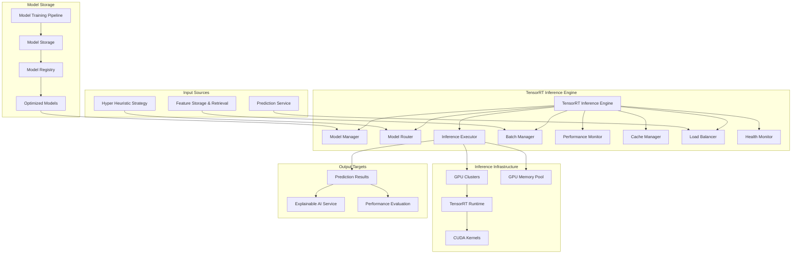

# TensorRT Inference Engine Module Specification

## Module Overview

The TensorRT Inference Engine provides high-performance, low-latency ML model inference for real-time trading predictions. It manages optimized model deployment, handles concurrent inference requests, implements model routing strategies, and provides comprehensive performance monitoring. The engine is designed to achieve sub-20ms prediction latency while maintaining high throughput.

## Module Architecture



## Core Responsibilities

### Primary Functions
1. **Model Deployment**: Load and manage TensorRT optimized models
2. **Inference Execution**: High-performance GPU-accelerated inference
3. **Request Routing**: Intelligent routing based on model versions and strategies
4. **Batch Processing**: Dynamic batching for throughput optimization
5. **Memory Management**: Efficient GPU memory allocation and pooling
6. **Performance Monitoring**: Real-time inference metrics and optimization
7. **Load Balancing**: Distribute inference load across multiple GPU instances
8. **Health Monitoring**: Model and infrastructure health checks

## Data Structures

### Inference Request/Response
```rust
#[derive(Debug, Clone, Serialize, Deserialize)]
pub struct InferenceRequest {
    pub request_id: String,
    pub model_name: String,
    pub model_version: Option<String>,
    pub input_features: Vec<f32>,
    pub feature_names: Vec<String>,
    pub batch_size: usize,
    pub priority: RequestPriority,
    pub timeout_ms: Option<u64>,
    pub strategy_context: Option<StrategyContext>,
}

#[derive(Debug, Clone, Serialize, Deserialize)]
pub enum RequestPriority {
    Low,
    Normal,
    High,
    Critical,
}

#[derive(Debug, Clone, Serialize, Deserialize)]
pub struct StrategyContext {
    pub strategy_name: String,
    pub model_routing_hint: Option<String>,
    pub feature_weights: Option<HashMap<String, f32>>,
    pub ensemble_config: Option<EnsembleConfig>,
}

#[derive(Debug, Clone, Serialize, Deserialize)]
pub struct InferenceResponse {
    pub request_id: String,
    pub predictions: Vec<Prediction>,
    pub model_metadata: ModelInferenceMetadata,
    pub performance_metrics: InferenceMetrics,
    pub error: Option<InferenceError>,
}

#[derive(Debug, Clone, Serialize, Deserialize)]
pub struct Prediction {
    pub value: f32,
    pub confidence: f32,
    pub timestamp: DateTime<Utc>,
    pub feature_contributions: Option<HashMap<String, f32>>,
}

#[derive(Debug, Clone, Serialize, Deserialize)]
pub struct ModelInferenceMetadata {
    pub model_name: String,
    pub model_version: String,
    pub architecture: String,
    pub input_shape: Vec<u32>,
    pub output_shape: Vec<u32>,
    pub inference_device: String,
    pub batch_size_used: usize,
}

#[derive(Debug, Clone, Serialize, Deserialize)]
pub struct InferenceMetrics {
    pub preprocessing_time_ms: f32,
    pub inference_time_ms: f32,
    pub postprocessing_time_ms: f32,
    pub total_time_ms: f32,
    pub gpu_utilization: f32,
    pub memory_used_mb: f32,
    pub throughput_samples_per_sec: f32,
}
```

### Model Management
```rust
#[derive(Debug, Clone, Serialize, Deserialize)]
pub struct LoadedModel {
    pub model_id: String,
    pub model_name: String,
    pub version: String,
    pub engine: TensorRTEngine,
    pub input_specs: Vec<TensorSpec>,
    pub output_specs: Vec<TensorSpec>,
    pub metadata: ModelMetadata,
    pub performance_profile: ModelPerformanceProfile,
    pub load_timestamp: DateTime<Utc>,
    pub last_used: DateTime<Utc>,
    pub usage_count: u64,
}

#[derive(Debug, Clone, Serialize, Deserialize)]
pub struct TensorSpec {
    pub name: String,
    pub data_type: DataType,
    pub shape: Vec<i32>,
    pub is_dynamic: bool,
    pub min_shape: Option<Vec<i32>>,
    pub max_shape: Option<Vec<i32>>,
    pub optimization_profile: u32,
}

#[derive(Debug, Clone, Serialize, Deserialize)]
pub enum DataType {
    Float32,
    Float16,
    Int32,
    Int8,
    Bool,
}

#[derive(Debug, Clone, Serialize, Deserialize)]
pub struct ModelPerformanceProfile {
    pub avg_inference_time_ms: f32,
    pub p50_inference_time_ms: f32,
    pub p95_inference_time_ms: f32,
    pub p99_inference_time_ms: f32,
    pub max_batch_size: u32,
    pub optimal_batch_size: u32,
    pub memory_usage_mb: f32,
    pub gpu_utilization: f32,
    pub throughput_samples_per_sec: f32,
}

#[derive(Debug, Clone, Serialize, Deserialize)]
pub struct ModelDeploymentConfig {
    pub max_models_per_gpu: u32,
    pub memory_fraction_per_model: f32,
    pub batch_timeout_ms: u32,
    pub max_batch_size: u32,
    pub warmup_requests: u32,
    pub health_check_interval_sec: u32,
    pub auto_unload_unused_hours: u32,
}
```

## Core Implementation

### Model Manager
```rust
pub struct ModelManager {
    loaded_models: Arc<RwLock<HashMap<String, LoadedModel>>>,
    model_registry_client: ModelRegistryClient,
    tensorrt_runtime: TensorRTRuntime,
    gpu_memory_pool: GpuMemoryPool,
    deployment_config: ModelDeploymentConfig,
    model_cache: ModelCache,
}

impl ModelManager {
    pub async fn load_model(
        &self,
        model_name: &str,
        version: Option<&str>,
    ) -> Result<String, InferenceError> {
        let model_key = format!("{}:{}", model_name, version.unwrap_or("latest"));
        
        // Check if model is already loaded
        {
            let models = self.loaded_models.read().await;
            if let Some(loaded_model) = models.get(&model_key) {
                // Update last used timestamp
                loaded_model.last_used = Utc::now();
                loaded_model.usage_count += 1;
                return Ok(model_key);
            }
        }
        
        info!("Loading model: {}", model_key);
        
        // Get model metadata from registry
        let model_metadata = self.model_registry_client
            .get_model_metadata(model_name, version).await?;
        
        // Download model artifacts if not cached
        let model_artifacts = self.model_cache
            .get_or_download(&model_metadata).await?;
        
        // Allocate GPU memory
        let memory_allocation = self.gpu_memory_pool
            .allocate(model_metadata.memory_requirements_mb).await?;
        
        // Load TensorRT engine
        let engine = self.tensorrt_runtime
            .deserialize_engine(&model_artifacts.engine_data)?;
        
        // Create execution context
        let context = engine.create_execution_context()?;
        
        // Extract tensor specifications
        let input_specs = self.extract_input_specs(&engine)?;
        let output_specs = self.extract_output_specs(&engine)?;
        
        // Run warmup inferences
        self.warmup_model(&context, &input_specs).await?;
        
        // Profile model performance
        let performance_profile = self.profile_model_performance(
            &context,
            &input_specs,
            &output_specs,
        ).await?;
        
        // Create loaded model instance
        let loaded_model = LoadedModel {
            model_id: model_metadata.id.clone(),
            model_name: model_name.to_string(),
            version: version.unwrap_or("latest").to_string(),
            engine: TensorRTEngine::new(engine, context),
            input_specs,
            output_specs,
            metadata: model_metadata,
            performance_profile,
            load_timestamp: Utc::now(),
            last_used: Utc::now(),
            usage_count: 0,
        };
        
        // Store in loaded models
        {
            let mut models = self.loaded_models.write().await;
            models.insert(model_key.clone(), loaded_model);
        }
        
        info!("Model loaded successfully: {}", model_key);
        Ok(model_key)
    }
    
    pub async fn unload_model(&self, model_key: &str) -> Result<(), InferenceError> {
        info!("Unloading model: {}", model_key);
        
        let mut models = self.loaded_models.write().await;
        
        if let Some(model) = models.remove(model_key) {
            // Free GPU memory
            self.gpu_memory_pool.deallocate(
                model.metadata.memory_requirements_mb
            ).await?;
            
            info!("Model unloaded: {}", model_key);
        }
        
        Ok(())
    }
    
    pub async fn auto_manage_models(&self) -> Result<(), InferenceError> {
        let current_time = Utc::now();
        let unload_threshold = Duration::hours(self.deployment_config.auto_unload_unused_hours as i64);
        
        let models_to_unload: Vec<String> = {
            let models = self.loaded_models.read().await;
            models.iter()
                .filter(|(_, model)| {
                    current_time - model.last_used > unload_threshold
                        && model.usage_count == 0
                })
                .map(|(key, _)| key.clone())
                .collect()
        };
        
        for model_key in models_to_unload {
            if let Err(e) = self.unload_model(&model_key).await {
                warn!("Failed to auto-unload model {}: {}", model_key, e);
            }
        }
        
        Ok(())
    }
    
    async fn warmup_model(
        &self,
        context: &TensorRTExecutionContext,
        input_specs: &[TensorSpec],
    ) -> Result<(), InferenceError> {
        let warmup_data = self.create_warmup_data(input_specs)?;
        
        for _ in 0..self.deployment_config.warmup_requests {
            let _ = context.execute_v2(&warmup_data);
        }
        
        Ok(())
    }
    
    async fn profile_model_performance(
        &self,
        context: &TensorRTExecutionContext,
        input_specs: &[TensorSpec],
        output_specs: &[TensorSpec],
    ) -> Result<ModelPerformanceProfile, InferenceError> {
        let profiling_data = self.create_profiling_data(input_specs)?;
        let num_iterations = 100;
        let mut inference_times = Vec::with_capacity(num_iterations);
        
        // Profile different batch sizes
        let batch_sizes = vec![1, 4, 8, 16, 32, 64];
        let mut optimal_batch_size = 1;
        let mut best_throughput = 0.0;
        
        for batch_size in batch_sizes {
            if batch_size > self.deployment_config.max_batch_size {
                continue;
            }
            
            let batch_data = self.create_batch_data(&profiling_data, batch_size)?;
            
            // Warmup for this batch size
            for _ in 0..10 {
                let _ = context.execute_v2(&batch_data);
            }
            
            // Measure performance
            let start_time = Instant::now();
            for _ in 0..num_iterations {
                context.execute_v2(&batch_data)?;
            }
            let total_time = start_time.elapsed();
            
            let avg_time_per_batch = total_time.as_millis() as f32 / num_iterations as f32;
            let throughput = (batch_size as f32 * 1000.0) / avg_time_per_batch;
            
            if throughput > best_throughput {
                best_throughput = throughput;
                optimal_batch_size = batch_size;
            }
            
            if batch_size == 1 {
                inference_times.push(avg_time_per_batch);
            }
        }
        
        // Calculate percentiles
        inference_times.sort_by(|a, b| a.partial_cmp(b).unwrap());
        let p50 = inference_times[inference_times.len() / 2];
        let p95 = inference_times[(inference_times.len() * 95) / 100];
        let p99 = inference_times[(inference_times.len() * 99) / 100];
        let avg = inference_times.iter().sum::<f32>() / inference_times.len() as f32;
        
        // Get memory usage
        let memory_usage = context.get_engine().get_device_memory_size() as f32 / (1024.0 * 1024.0);
        
        Ok(ModelPerformanceProfile {
            avg_inference_time_ms: avg,
            p50_inference_time_ms: p50,
            p95_inference_time_ms: p95,
            p99_inference_time_ms: p99,
            max_batch_size: self.deployment_config.max_batch_size,
            optimal_batch_size,
            memory_usage_mb: memory_usage,
            gpu_utilization: 0.0, // Would need NVML integration
            throughput_samples_per_sec: best_throughput,
        })
    }
}
```

### Inference Executor
```rust
pub struct InferenceExecutor {
    model_manager: Arc<ModelManager>,
    batch_manager: Arc<BatchManager>,
    gpu_memory_pool: Arc<GpuMemoryPool>,
    performance_monitor: Arc<PerformanceMonitor>,
    request_queue: Arc<PriorityQueue<InferenceRequest>>,
}

impl InferenceExecutor {
    pub async fn execute_inference(
        &self,
        request: InferenceRequest,
    ) -> Result<InferenceResponse, InferenceError> {
        let start_time = Instant::now();
        let request_id = request.request_id.clone();
        
        // Get or load model
        let model_key = self.model_manager
            .load_model(&request.model_name, request.model_version.as_deref()).await?;
        
        let loaded_model = {
            let models = self.model_manager.loaded_models.read().await;
            models.get(&model_key)
                .ok_or_else(|| InferenceError::ModelNotFound {
                    model_name: request.model_name.clone(),
                })?
                .clone()
        };
        
        // Preprocess input
        let preprocessing_start = Instant::now();
        let processed_input = self.preprocess_input(
            &request.input_features,
            &loaded_model.input_specs,
        )?;
        let preprocessing_time = preprocessing_start.elapsed();
        
        // Execute inference
        let inference_start = Instant::now();
        let raw_output = self.execute_model_inference(
            &loaded_model,
            &processed_input,
        ).await?;
        let inference_time = inference_start.elapsed();
        
        // Postprocess output
        let postprocessing_start = Instant::now();
        let predictions = self.postprocess_output(
            &raw_output,
            &loaded_model.output_specs,
            &request,
        )?;
        let postprocessing_time = postprocessing_start.elapsed();
        
        // Update model usage statistics
        {
            let mut models = self.model_manager.loaded_models.write().await;
            if let Some(model) = models.get_mut(&model_key) {
                model.last_used = Utc::now();
                model.usage_count += 1;
            }
        }
        
        // Record performance metrics
        let total_time = start_time.elapsed();
        let metrics = InferenceMetrics {
            preprocessing_time_ms: preprocessing_time.as_millis() as f32,
            inference_time_ms: inference_time.as_millis() as f32,
            postprocessing_time_ms: postprocessing_time.as_millis() as f32,
            total_time_ms: total_time.as_millis() as f32,
            gpu_utilization: self.get_current_gpu_utilization(),
            memory_used_mb: loaded_model.performance_profile.memory_usage_mb,
            throughput_samples_per_sec: 1000.0 / total_time.as_millis() as f32,
        };
        
        // Record metrics
        self.performance_monitor.record_inference(
            &model_key,
            &metrics,
            predictions.len(),
        ).await;
        
        Ok(InferenceResponse {
            request_id,
            predictions,
            model_metadata: ModelInferenceMetadata {
                model_name: loaded_model.model_name.clone(),
                model_version: loaded_model.version.clone(),
                architecture: loaded_model.metadata.architecture.clone(),
                input_shape: loaded_model.input_specs[0].shape.iter().map(|&x| x as u32).collect(),
                output_shape: loaded_model.output_specs[0].shape.iter().map(|&x| x as u32).collect(),
                inference_device: "cuda".to_string(),
                batch_size_used: 1, // Would be dynamic with batching
            },
            performance_metrics: metrics,
            error: None,
        })
    }
    
    async fn execute_model_inference(
        &self,
        model: &LoadedModel,
        input_data: &[f32],
    ) -> Result<Vec<f32>, InferenceError> {
        // Allocate GPU memory for input and output
        let input_size = model.input_specs[0].shape.iter().product::<i32>() as usize;
        let output_size = model.output_specs[0].shape.iter().product::<i32>() as usize;
        
        let input_buffer = self.gpu_memory_pool
            .allocate_buffer(input_size * std::mem::size_of::<f32>()).await?;
        let output_buffer = self.gpu_memory_pool
            .allocate_buffer(output_size * std::mem::size_of::<f32>()).await?;
        
        // Copy input data to GPU
        unsafe {
            cudart::cudaMemcpy(
                input_buffer.as_mut_ptr() as *mut std::ffi::c_void,
                input_data.as_ptr() as *const std::ffi::c_void,
                input_size * std::mem::size_of::<f32>(),
                cudart::cudaMemcpyKind::cudaMemcpyHostToDevice,
            );
        }
        
        // Execute inference
        let success = model.engine.context.execute_v2(&[
            input_buffer.as_ptr() as *mut std::ffi::c_void,
            output_buffer.as_ptr() as *mut std::ffi::c_void,
        ]);
        
        if !success {
            return Err(InferenceError::ExecutionFailed {
                model_name: model.model_name.clone(),
            });
        }
        
        // Copy output data from GPU
        let mut output_data = vec![0.0f32; output_size];
        unsafe {
            cudart::cudaMemcpy(
                output_data.as_mut_ptr() as *mut std::ffi::c_void,
                output_buffer.as_ptr() as *const std::ffi::c_void,
                output_size * std::mem::size_of::<f32>(),
                cudart::cudaMemcpyKind::cudaMemcpyDeviceToHost,
            );
        }
        
        // Free GPU memory
        self.gpu_memory_pool.deallocate_buffer(input_buffer).await?;
        self.gpu_memory_pool.deallocate_buffer(output_buffer).await?;
        
        Ok(output_data)
    }
    
    fn preprocess_input(
        &self,
        input_features: &[f32],
        input_specs: &[TensorSpec],
    ) -> Result<Vec<f32>, InferenceError> {
        let expected_size = input_specs[0].shape.iter().product::<i32>() as usize;
        
        if input_features.len() != expected_size {
            return Err(InferenceError::InvalidInputShape {
                expected: expected_size,
                actual: input_features.len(),
            });
        }
        
        // Apply any necessary preprocessing (normalization, etc.)
        let mut processed = input_features.to_vec();
        
        // Example: Apply Z-score normalization if needed
        // This would typically be model-specific
        if input_specs[0].name.contains("normalized") {
            let mean = processed.iter().sum::<f32>() / processed.len() as f32;
            let variance = processed.iter()
                .map(|x| (x - mean).powi(2))
                .sum::<f32>() / processed.len() as f32;
            let std_dev = variance.sqrt();
            
            if std_dev > 0.0 {
                for value in &mut processed {
                    *value = (*value - mean) / std_dev;
                }
            }
        }
        
        Ok(processed)
    }
    
    fn postprocess_output(
        &self,
        raw_output: &[f32],
        output_specs: &[TensorSpec],
        request: &InferenceRequest,
    ) -> Result<Vec<Prediction>, InferenceError> {
        let mut predictions = Vec::new();
        
        // For single output models (typical case)
        if output_specs.len() == 1 {
            let prediction_value = raw_output[0];
            
            // Calculate confidence based on model uncertainty
            // This is a simplified approach - in practice, you'd use more sophisticated methods
            let confidence = if raw_output.len() > 1 {
                // If model outputs uncertainty estimates
                1.0 - raw_output[1].abs().min(1.0)
            } else {
                // Simple confidence based on prediction magnitude
                1.0 / (1.0 + (-prediction_value.abs()).exp())
            };
            
            predictions.push(Prediction {
                value: prediction_value,
                confidence,
                timestamp: Utc::now(),
                feature_contributions: None, // Would be calculated separately if needed
            });
        } else {
            // Multi-output models
            for (i, &value) in raw_output.iter().enumerate() {
                let confidence = 0.8; // Default confidence for multi-output
                
                predictions.push(Prediction {
                    value,
                    confidence,
                    timestamp: Utc::now(),
                    feature_contributions: None,
                });
            }
        }
        
        Ok(predictions)
    }
    
    fn get_current_gpu_utilization(&self) -> f32 {
        // This would use NVML to get actual GPU utilization
        // Placeholder implementation
        0.75
    }
}
```

### Batch Manager
```rust
pub struct BatchManager {
    pending_requests: Arc<Mutex<VecDeque<InferenceRequest>>>,
    batch_config: BatchConfiguration,
    batch_timer: Arc<Mutex<Option<Instant>>>,
    executor: Arc<InferenceExecutor>,
}

#[derive(Debug, Clone)]
pub struct BatchConfiguration {
    pub max_batch_size: usize,
    pub batch_timeout_ms: u64,
    pub min_batch_size: usize,
    pub enable_dynamic_batching: bool,
    pub priority_based_batching: bool,
}

impl BatchManager {
    pub async fn submit_request(
        &self,
        request: InferenceRequest,
    ) -> Result<tokio::sync::oneshot::Receiver<InferenceResponse>, InferenceError> {
        let (tx, rx) = tokio::sync::oneshot::channel();
        
        // Add response channel to request
        let mut request_with_channel = request;
        request_with_channel.response_channel = Some(tx);
        
        // Add to pending requests
        {
            let mut pending = self.pending_requests.lock().await;
            pending.push_back(request_with_channel);
            
            // Start batch timer if not already started
            let mut timer = self.batch_timer.lock().await;
            if timer.is_none() {
                *timer = Some(Instant::now());
            }
        }
        
        // Check if we should process batch immediately
        self.check_batch_ready().await?;
        
        Ok(rx)
    }
    
    async fn check_batch_ready(&self) -> Result<(), InferenceError> {
        let should_process = {
            let pending = self.pending_requests.lock().await;
            let timer = self.batch_timer.lock().await;
            
            // Check if batch is ready based on size or timeout
            pending.len() >= self.batch_config.max_batch_size ||
            (pending.len() >= self.batch_config.min_batch_size &&
             timer.map_or(false, |t| t.elapsed().as_millis() >= self.batch_config.batch_timeout_ms as u128))
        };
        
        if should_process {
            self.process_batch().await?;
        }
        
        Ok(())
    }
    
    async fn process_batch(&self) -> Result<(), InferenceError> {
        // Extract batch of requests
        let batch = {
            let mut pending = self.pending_requests.lock().await;
            let mut timer = self.batch_timer.lock().await;
            
            let batch_size = if self.batch_config.enable_dynamic_batching {
                self.calculate_optimal_batch_size(&pending)
            } else {
                pending.len().min(self.batch_config.max_batch_size)
            };
            
            let batch: Vec<InferenceRequest> = pending
                .drain(..batch_size.min(pending.len()))
                .collect();
            
            // Reset timer if queue is empty
            if pending.is_empty() {
                *timer = None;
            } else {
                *timer = Some(Instant::now());
            }
            
            batch
        };
        
        if batch.is_empty() {
            return Ok(());
        }
        
        // Group requests by model for efficient batching
        let mut model_batches: HashMap<String, Vec<InferenceRequest>> = HashMap::new();
        
        for request in batch {
            let model_key = format!("{}:{}", 
                request.model_name, 
                request.model_version.as_deref().unwrap_or("latest")
            );
            model_batches.entry(model_key).or_default().push(request);
        }
        
        // Process each model batch
        for (model_key, requests) in model_batches {
            tokio::spawn(async move {
                if let Err(e) = self.process_model_batch(requests).await {
                    error!("Failed to process batch for {}: {}", model_key, e);
                }
            });
        }
        
        Ok(())
    }
    
    async fn process_model_batch(
        &self,
        requests: Vec<InferenceRequest>,
    ) -> Result<(), InferenceError> {
        if requests.is_empty() {
            return Ok(());
        }
        
        info!("Processing batch of {} requests for model: {}", 
            requests.len(), requests[0].model_name);
        
        // Create batched input
        let batched_input = self.create_batched_input(&requests)?;
        
        // Execute batch inference
        let batch_response = self.executor.execute_batch_inference(batched_input).await?;
        
        // Split response and send to individual request channels
        for (request, prediction) in requests.into_iter().zip(batch_response.predictions.into_iter()) {
            let response = InferenceResponse {
                request_id: request.request_id.clone(),
                predictions: vec![prediction],
                model_metadata: batch_response.model_metadata.clone(),
                performance_metrics: batch_response.performance_metrics.clone(),
                error: None,
            };
            
            // Send response through channel
            if let Some(tx) = request.response_channel {
                let _ = tx.send(response); // Ignore if receiver is dropped
            }
        }
        
        Ok(())
    }
    
    fn calculate_optimal_batch_size(&self, pending: &VecDeque<InferenceRequest>) -> usize {
        if !self.batch_config.enable_dynamic_batching {
            return self.batch_config.max_batch_size.min(pending.len());
        }
        
        // Simple heuristic: balance latency vs throughput
        let queue_length = pending.len();
        let base_size = self.batch_config.min_batch_size;
        
        if queue_length <= base_size {
            queue_length
        } else if queue_length >= self.batch_config.max_batch_size {
            self.batch_config.max_batch_size
        } else {
            // Dynamic sizing based on queue pressure
            let pressure_factor = queue_length as f32 / self.batch_config.max_batch_size as f32;
            let dynamic_size = base_size + 
                ((self.batch_config.max_batch_size - base_size) as f32 * pressure_factor) as usize;
            
            dynamic_size.min(queue_length).min(self.batch_config.max_batch_size)
        }
    }
    
    fn create_batched_input(&self, requests: &[InferenceRequest]) -> Result<BatchedInferenceRequest, InferenceError> {
        if requests.is_empty() {
            return Err(InferenceError::EmptyBatch);
        }
        
        // Validate all requests are for the same model
        let model_name = &requests[0].model_name;
        let model_version = &requests[0].model_version;
        
        for request in requests.iter().skip(1) {
            if request.model_name != *model_name || request.model_version != *model_version {
                return Err(InferenceError::BatchModelMismatch {
                    expected: format!("{}:{}", model_name, model_version.as_deref().unwrap_or("latest")),
                    actual: format!("{}:{}", request.model_name, request.model_version.as_deref().unwrap_or("latest")),
                });
            }
        }
        
        // Combine input features
        let batch_size = requests.len();
        let feature_size = requests[0].input_features.len();
        let mut batched_features = Vec::with_capacity(batch_size * feature_size);
        
        for request in requests {
            if request.input_features.len() != feature_size {
                return Err(InferenceError::BatchFeatureSizeMismatch {
                    expected: feature_size,
                    actual: request.input_features.len(),
                });
            }
            batched_features.extend_from_slice(&request.input_features);
        }
        
        Ok(BatchedInferenceRequest {
            model_name: model_name.clone(),
            model_version: model_version.clone(),
            batch_size,
            input_features: batched_features,
            feature_names: requests[0].feature_names.clone(),
            request_ids: requests.iter().map(|r| r.request_id.clone()).collect(),
        })
    }
}

#[derive(Debug, Clone)]
pub struct BatchedInferenceRequest {
    pub model_name: String,
    pub model_version: Option<String>,
    pub batch_size: usize,
    pub input_features: Vec<f32>,
    pub feature_names: Vec<String>,
    pub request_ids: Vec<String>,
}
```

## Performance Monitoring

### Performance Monitor Implementation
```rust
pub struct PerformanceMonitor {
    metrics_storage: Arc<Mutex<HashMap<String, ModelPerformanceMetrics>>>,
    historical_metrics: Arc<ClickHouseClient>,
    alert_thresholds: PerformanceThresholds,
    metrics_publisher: MetricsPublisher,
}

#[derive(Debug, Clone)]
pub struct ModelPerformanceMetrics {
    pub model_key: String,
    pub total_requests: u64,
    pub successful_requests: u64,
    pub failed_requests: u64,
    pub avg_latency_ms: f32,
    pub p95_latency_ms: f32,
    pub p99_latency_ms: f32,
    pub throughput_rps: f32,
    pub error_rate: f32,
    pub gpu_utilization: f32,
    pub memory_usage_mb: f32,
    pub last_updated: DateTime<Utc>,
}

#[derive(Debug, Clone)]
pub struct PerformanceThresholds {
    pub max_latency_ms: f32,
    pub max_error_rate: f32,
    pub min_throughput_rps: f32,
    pub max_memory_usage_mb: f32,
    pub min_gpu_utilization: f32,
}

impl PerformanceMonitor {
    pub async fn record_inference(
        &self,
        model_key: &str,
        metrics: &InferenceMetrics,
        batch_size: usize,
    ) {
        let mut storage = self.metrics_storage.lock().await;
        
        let model_metrics = storage.entry(model_key.to_string())
            .or_insert_with(|| ModelPerformanceMetrics {
                model_key: model_key.to_string(),
                total_requests: 0,
                successful_requests: 0,
                failed_requests: 0,
                avg_latency_ms: 0.0,
                p95_latency_ms: 0.0,
                p99_latency_ms: 0.0,
                throughput_rps: 0.0,
                error_rate: 0.0,
                gpu_utilization: 0.0,
                memory_usage_mb: 0.0,
                last_updated: Utc::now(),
            });
        
        // Update counters
        model_metrics.total_requests += batch_size as u64;
        model_metrics.successful_requests += batch_size as u64;
        
        // Update latency metrics (exponential moving average)
        let alpha = 0.1; // Smoothing factor
        model_metrics.avg_latency_ms = 
            alpha * metrics.total_time_ms + (1.0 - alpha) * model_metrics.avg_latency_ms;
        
        // Update throughput
        model_metrics.throughput_rps = metrics.throughput_samples_per_sec;
        
        // Update resource usage
        model_metrics.gpu_utilization = metrics.gpu_utilization;
        model_metrics.memory_usage_mb = metrics.memory_used_mb;
        
        // Update error rate
        model_metrics.error_rate = 
            model_metrics.failed_requests as f32 / model_metrics.total_requests as f32;
        
        model_metrics.last_updated = Utc::now();
        
        // Check thresholds and alert if necessary
        self.check_performance_thresholds(model_metrics).await;
        
        // Publish metrics to external systems
        self.metrics_publisher.publish_inference_metrics(model_key, metrics).await;
    }
    
    pub async fn record_error(
        &self,
        model_key: &str,
        error: &InferenceError,
    ) {
        let mut storage = self.metrics_storage.lock().await;
        
        if let Some(model_metrics) = storage.get_mut(model_key) {
            model_metrics.failed_requests += 1;
            model_metrics.total_requests += 1;
            model_metrics.error_rate = 
                model_metrics.failed_requests as f32 / model_metrics.total_requests as f32;
            model_metrics.last_updated = Utc::now();
        }
        
        // Log error details
        error!("Inference error for {}: {:?}", model_key, error);
        
        // Publish error metrics
        self.metrics_publisher.publish_error_metrics(model_key, error).await;
    }
    
    async fn check_performance_thresholds(&self, metrics: &ModelPerformanceMetrics) {
        let mut alerts = Vec::new();
        
        if metrics.avg_latency_ms > self.alert_thresholds.max_latency_ms {
            alerts.push(format!(
                "High latency: {:.2}ms > {:.2}ms threshold",
                metrics.avg_latency_ms, self.alert_thresholds.max_latency_ms
            ));
        }
        
        if metrics.error_rate > self.alert_thresholds.max_error_rate {
            alerts.push(format!(
                "High error rate: {:.2}% > {:.2}% threshold",
                metrics.error_rate * 100.0, self.alert_thresholds.max_error_rate * 100.0
            ));
        }
        
        if metrics.throughput_rps < self.alert_thresholds.min_throughput_rps {
            alerts.push(format!(
                "Low throughput: {:.2} RPS < {:.2} RPS threshold",
                metrics.throughput_rps, self.alert_thresholds.min_throughput_rps
            ));
        }
        
        if metrics.memory_usage_mb > self.alert_thresholds.max_memory_usage_mb {
            alerts.push(format!(
                "High memory usage: {:.2}MB > {:.2}MB threshold",
                metrics.memory_usage_mb, self.alert_thresholds.max_memory_usage_mb
            ));
        }
        
        if metrics.gpu_utilization < self.alert_thresholds.min_gpu_utilization {
            alerts.push(format!(
                "Low GPU utilization: {:.2}% < {:.2}% threshold",
                metrics.gpu_utilization * 100.0, self.alert_thresholds.min_gpu_utilization * 100.0
            ));
        }
        
        if !alerts.is_empty() {
            warn!("Performance alerts for {}: {}", metrics.model_key, alerts.join(", "));
            // Send alerts to monitoring system
            self.send_alerts(&metrics.model_key, &alerts).await;
        }
    }
    
    pub async fn get_model_metrics(&self, model_key: &str) -> Option<ModelPerformanceMetrics> {
        let storage = self.metrics_storage.lock().await;
        storage.get(model_key).cloned()
    }
    
    pub async fn get_all_metrics(&self) -> HashMap<String, ModelPerformanceMetrics> {
        let storage = self.metrics_storage.lock().await;
        storage.clone()
    }
}
```

## API Endpoints & Configuration

### Internal API Interface
```rust
#[derive(OpenApi)]
struct TensorRTInferenceEngineApi;

#[utoipa::path(
    post,
    path = "/api/v1/internal/inference/predict",
    request_body = InferenceRequest,
    responses(
        (status = 200, description = "Prediction completed", body = InferenceResponse),
        (status = 400, description = "Invalid request"),
        (status = 500, description = "Inference error")
    )
)]
pub async fn predict(
    State(engine): State<TensorRTInferenceEngine>,
    Json(request): Json<InferenceRequest>,
) -> Result<Json<InferenceResponse>, InferenceError>;

#[utoipa::path(
    post,
    path = "/api/v1/internal/inference/batch-predict",
    request_body = Vec<InferenceRequest>,
    responses(
        (status = 200, description = "Batch prediction completed", body = Vec<InferenceResponse>)
    )
)]
pub async fn batch_predict(
    State(engine): State<TensorRTInferenceEngine>,
    Json(requests): Json<Vec<InferenceRequest>>,
) -> Result<Json<Vec<InferenceResponse>>, InferenceError>;

#[utoipa::path(
    get,
    path = "/api/v1/internal/inference/models/loaded",
    responses(
        (status = 200, description = "Loaded models", body = Vec<LoadedModelInfo>)
    )
)]
pub async fn get_loaded_models(
    State(engine): State<TensorRTInferenceEngine>,
) -> Result<Json<Vec<LoadedModelInfo>>, InferenceError>;

#[utoipa::path(
    get,
    path = "/api/v1/internal/inference/performance/{model_key}",
    params(
        ("model_key" = String, Path, description = "Model key")
    ),
    responses(
        (status = 200, description = "Performance metrics", body = ModelPerformanceMetrics)
    )
)]
pub async fn get_model_performance(
    State(engine): State<TensorRTInferenceEngine>,
    Path(model_key): Path<String>,
) -> Result<Json<ModelPerformanceMetrics>, InferenceError>;
```

### Service Configuration
```toml
[tensorrt_inference_engine]
service_name = "tensorrt-inference-engine"
port = 8087
worker_threads = 4
max_concurrent_requests = 1000

[model_deployment]
max_models_per_gpu = 4
memory_fraction_per_model = 0.25
warmup_requests = 10
auto_unload_unused_hours = 24
health_check_interval_sec = 30

[batch_processing]
max_batch_size = 64
batch_timeout_ms = 50
min_batch_size = 4
enable_dynamic_batching = true
priority_based_batching = true

[performance_thresholds]
max_latency_ms = 20.0
max_error_rate = 0.01
min_throughput_rps = 100.0
max_memory_usage_mb = 4096.0
min_gpu_utilization = 0.7

[gpu_config]
device_ids = [0, 1]  # GPU device IDs to use
memory_pool_size_mb = 8192
enable_cuda_graphs = true
enable_tensorrt_profiling = false
```

### Performance Requirements & Error Handling

#### Performance Targets
- **Inference Latency**: < 20ms (95th percentile)
- **Batch Throughput**: > 1000 samples/second
- **GPU Utilization**: > 70% average
- **Model Loading**: < 30 seconds for large models
- **Memory Efficiency**: < 4GB per model

### Error Types
```rust
#[derive(Error, Debug)]
pub enum InferenceError {
    #[error("Model not found: {model_name}")]
    ModelNotFound { model_name: String },
    
    #[error("Invalid input shape: expected {expected}, got {actual}")]
    InvalidInputShape { expected: usize, actual: usize },
    
    #[error("Execution failed for model: {model_name}")]
    ExecutionFailed { model_name: String },
    
    #[error("GPU out of memory: requested {requested_mb}MB")]
    OutOfMemory { requested_mb: usize },
    
    #[error("Batch processing error: {operation}")]
    BatchProcessingError { operation: String },
    
    #[error("TensorRT engine error: {error}")]
    TensorRTError { error: String },
}
```

### Dependencies
- **Model Training Pipeline**: Source of optimized models
- **Feature Storage & Retrieval**: Input features for inference
- **Hyper Heuristic Strategy**: Model routing decisions
- **Prediction Service**: Consumer of inference results
- **GPU Infrastructure**: CUDA/TensorRT runtime environment

This TensorRT Inference Engine provides high-performance, scalable ML model serving capabilities that enable real-time trading predictions with minimal latency while maintaining high throughput and reliability.