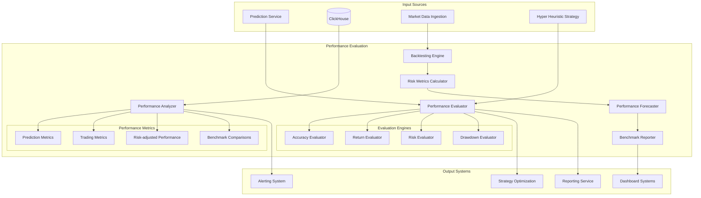

# Performance Evaluation - Technical Specification

## Module Overview

The Performance Evaluation module continuously monitors and evaluates the accuracy and effectiveness of trading predictions, strategies, and overall system performance. It provides real-time performance tracking, backtesting capabilities, risk-adjusted return calculations, and comprehensive performance analytics to drive continuous improvement of the QuantumTrade AI system.

## Architecture Diagram



## Responsibilities

### **Primary Functions**
- **Prediction Accuracy Assessment**: Real-time evaluation of prediction accuracy across timeframes
- **Strategy Performance Tracking**: Monitor strategy effectiveness and risk-adjusted returns
- **Backtesting Execution**: Historical performance testing with realistic market conditions
- **Risk Metrics Calculation**: Comprehensive risk analysis including VaR, Sharpe ratio, maximum drawdown
- **Benchmark Comparison**: Performance comparison against market indices and competitor strategies
- **Performance Attribution**: Identify sources of alpha and performance drivers

### **Evaluation Categories**
- **Prediction Performance**: Accuracy, precision, recall, F1-score for predictions
- **Trading Performance**: Returns, Sharpe ratio, Sortino ratio, Calmar ratio
- **Risk Performance**: Maximum drawdown, Value at Risk, Expected Shortfall
- **Operational Performance**: Execution latency, system uptime, data quality
- **Comparative Performance**: Benchmark comparisons and peer analysis

## API Contract

### **Core Interface**
```rust
#[async_trait]
pub trait PerformanceEvaluator {
    // Real-time performance evaluation
    async fn evaluate_prediction_accuracy(&self, 
        prediction_id: &str
    ) -> Result<PredictionAccuracyResult>;
    
    async fn evaluate_strategy_performance(&self, 
        strategy_name: &str, 
        timeframe: TimeFrame
    ) -> Result<StrategyPerformanceResult>;
    
    async fn calculate_portfolio_performance(&self, 
        portfolio_id: &str, 
        timeframe: TimeFrame
    ) -> Result<PortfolioPerformanceResult>;
    
    // Risk metrics calculation
    async fn calculate_risk_metrics(&self, 
        strategy_name: &str, 
        timeframe: TimeFrame
    ) -> Result<RiskMetrics>;
    
    async fn calculate_var(&self, 
        portfolio_id: &str, 
        confidence_level: f64, 
        horizon_days: u32
    ) -> Result<VarResult>;
    
    async fn calculate_expected_shortfall(&self, 
        portfolio_id: &str, 
        confidence_level: f64
    ) -> Result<f64>;
    
    // Backtesting operations
    async fn run_backtest(&self, 
        strategy_config: StrategyConfig, 
        backtest_config: BacktestConfig
    ) -> Result<BacktestResult>;
    
    async fn run_walk_forward_analysis(&self, 
        strategy_config: StrategyConfig, 
        analysis_config: WalkForwardConfig
    ) -> Result<WalkForwardResult>;
    
    // Performance analytics
    async fn get_performance_attribution(&self, 
        strategy_name: &str, 
        timeframe: TimeFrame
    ) -> Result<AttributionAnalysis>;
    
    async fn compare_with_benchmark(&self, 
        strategy_name: &str, 
        benchmark: BenchmarkType, 
        timeframe: TimeFrame
    ) -> Result<BenchmarkComparison>;
    
    // Performance monitoring
    async fn get_real_time_performance(&self, 
        strategy_name: &str
    ) -> Result<RealTimePerformance>;
    
    async fn detect_performance_anomalies(&self, 
        strategy_name: &str
    ) -> Result<Vec<PerformanceAnomaly>>;
    
    // Reporting
    async fn generate_performance_report(&self, 
        report_config: ReportConfig
    ) -> Result<PerformanceReport>;
}
```

### **Data Structures**
```rust
#[derive(Debug, Clone, Serialize, Deserialize)]
pub struct PredictionAccuracyResult {
    pub prediction_id: String,
    pub symbol: String,
    pub prediction_timestamp: DateTime<Utc>,
    pub evaluation_timestamp: DateTime<Utc>,
    pub predicted_price: f64,
    pub actual_price: f64,
    pub prediction_horizon_minutes: u32,
    pub accuracy_metrics: AccuracyMetrics,
    pub error_analysis: ErrorAnalysis,
}

#[derive(Debug, Clone, Serialize, Deserialize)]
pub struct AccuracyMetrics {
    pub absolute_error: f64,
    pub relative_error: f64,
    pub percentage_error: f64,
    pub directional_accuracy: bool,
    pub confidence_score: f64,
    pub prediction_quality: PredictionQuality,
}

#[derive(Debug, Clone, Serialize, Deserialize)]
pub enum PredictionQuality {
    Excellent,  // Error < 0.5%
    Good,       // Error < 1.0%
    Fair,       // Error < 2.0%
    Poor,       // Error >= 2.0%
}

#[derive(Debug, Clone, Serialize, Deserialize)]
pub struct StrategyPerformanceResult {
    pub strategy_name: String,
    pub evaluation_period: TimeFrame,
    pub total_return: f64,
    pub annualized_return: f64,
    pub volatility: f64,
    pub sharpe_ratio: f64,
    pub sortino_ratio: f64,
    pub calmar_ratio: f64,
    pub maximum_drawdown: f64,
    pub win_rate: f64,
    pub profit_factor: f64,
    pub trade_statistics: TradeStatistics,
    pub risk_metrics: RiskMetrics,
}

#[derive(Debug, Clone, Serialize, Deserialize)]
pub struct RiskMetrics {
    pub value_at_risk_95: f64,
    pub value_at_risk_99: f64,
    pub expected_shortfall_95: f64,
    pub expected_shortfall_99: f64,
    pub beta: Option<f64>,
    pub alpha: Option<f64>,
    pub tracking_error: Option<f64>,
    pub information_ratio: Option<f64>,
    pub downside_deviation: f64,
    pub upside_capture: f64,
    pub downside_capture: f64,
}

#[derive(Debug, Clone, Serialize, Deserialize)]
pub struct TradeStatistics {
    pub total_trades: u32,
    pub winning_trades: u32,
    pub losing_trades: u32,
    pub average_win: f64,
    pub average_loss: f64,
    pub largest_win: f64,
    pub largest_loss: f64,
    pub average_trade_duration: Duration,
    pub average_trade_return: f64,
}

#[derive(Debug, Clone, Serialize, Deserialize)]
pub struct BacktestConfig {
    pub start_date: DateTime<Utc>,
    pub end_date: DateTime<Utc>,
    pub initial_capital: f64,
    pub commission_rate: f64,
    pub slippage_model: SlippageModel,
    pub market_impact_model: MarketImpactModel,
    pub benchmark: BenchmarkType,
    pub rebalancing_frequency: RebalancingFrequency,
}

#[derive(Debug, Clone, Serialize, Deserialize)]
pub struct BacktestResult {
    pub backtest_id: String,
    pub strategy_config: StrategyConfig,
    pub backtest_config: BacktestConfig,
    pub performance_summary: PerformanceSummary,
    pub risk_analysis: RiskAnalysis,
    pub trade_analysis: TradeAnalysis,
    pub drawdown_analysis: DrawdownAnalysis,
    pub benchmark_comparison: BenchmarkComparison,
    pub execution_statistics: ExecutionStatistics,
}
```

## Input Interfaces

### **From Prediction Service**
- **Prediction Records**: All predictions with timestamps and metadata
- **Prediction Outcomes**: Actual market outcomes for accuracy calculation
- **Model Performance Data**: Model-specific performance metrics

### **Prediction Accuracy Evaluation**
```rust
impl PredictionAccuracyEvaluator {
    pub async fn evaluate_prediction(&self, prediction_id: &str) -> Result<PredictionAccuracyResult> {
        // Retrieve prediction details
        let prediction = self.get_prediction_details(prediction_id).await?;
        
        // Get actual market price at prediction horizon
        let actual_price = self.get_actual_price(
            &prediction.symbol,
            prediction.timestamp + Duration::minutes(prediction.horizon_minutes as i64)
        ).await?;
        
        // Calculate accuracy metrics
        let accuracy_metrics = self.calculate_accuracy_metrics(
            prediction.predicted_price,
            actual_price
        );
        
        // Perform error analysis
        let error_analysis = self.analyze_prediction_error(
            &prediction,
            actual_price
        ).await?;
        
        // Store evaluation result
        let result = PredictionAccuracyResult {
            prediction_id: prediction_id.to_string(),
            symbol: prediction.symbol.clone(),
            prediction_timestamp: prediction.timestamp,
            evaluation_timestamp: Utc::now(),
            predicted_price: prediction.predicted_price,
            actual_price,
            prediction_horizon_minutes: prediction.horizon_minutes,
            accuracy_metrics,
            error_analysis,
        };
        
        self.store_accuracy_result(&result).await?;
        
        Ok(result)
    }
    
    fn calculate_accuracy_metrics(&self, predicted: f64, actual: f64) -> AccuracyMetrics {
        let absolute_error = (predicted - actual).abs();
        let relative_error = absolute_error / actual.abs();
        let percentage_error = relative_error * 100.0;
        
        let prediction_quality = match percentage_error {
            e if e < 0.5 => PredictionQuality::Excellent,
            e if e < 1.0 => PredictionQuality::Good,
            e if e < 2.0 => PredictionQuality::Fair,
            _ => PredictionQuality::Poor,
        };
        
        AccuracyMetrics {
            absolute_error,
            relative_error,
            percentage_error,
            directional_accuracy: (predicted > 0.0) == (actual > 0.0),
            confidence_score: 1.0 - (percentage_error / 100.0).min(1.0),
            prediction_quality,
        }
    }
}
```

### **From ClickHouse**
- **Historical Market Data**: Price and volume data for backtesting
- **Trade Execution Data**: Actual trade executions and performance
- **Strategy Performance History**: Historical strategy performance data

### **From Hyper Heuristic Strategy**
- **Strategy Performance Data**: Real-time strategy effectiveness metrics
- **Parameter Performance**: Performance of different parameter combinations
- **Strategy Selection History**: Historical strategy selection decisions

## Strategy Performance Evaluation

### **Real-time Performance Tracking**
```rust
impl StrategyPerformanceEvaluator {
    pub async fn evaluate_strategy_performance(&self, 
        strategy_name: &str, 
        timeframe: TimeFrame
    ) -> Result<StrategyPerformanceResult> {
        // Get strategy trades for the timeframe
        let trades = self.get_strategy_trades(strategy_name, &timeframe).await?;
        
        // Calculate return metrics
        let return_metrics = self.calculate_return_metrics(&trades).await?;
        
        // Calculate risk metrics
        let risk_metrics = self.calculate_risk_metrics(&trades).await?;
        
        // Calculate trade statistics
        let trade_statistics = self.calculate_trade_statistics(&trades);
        
        // Calculate performance ratios
        let sharpe_ratio = self.calculate_sharpe_ratio(&return_metrics, &risk_metrics);
        let sortino_ratio = self.calculate_sortino_ratio(&return_metrics, &risk_metrics);
        let calmar_ratio = self.calculate_calmar_ratio(&return_metrics, &risk_metrics);
        
        Ok(StrategyPerformanceResult {
            strategy_name: strategy_name.to_string(),
            evaluation_period: timeframe,
            total_return: return_metrics.total_return,
            annualized_return: return_metrics.annualized_return,
            volatility: risk_metrics.volatility,
            sharpe_ratio,
            sortino_ratio,
            calmar_ratio,
            maximum_drawdown: risk_metrics.maximum_drawdown,
            win_rate: trade_statistics.win_rate,
            profit_factor: trade_statistics.profit_factor,
            trade_statistics,
            risk_metrics,
        })
    }
    
    async fn calculate_return_metrics(&self, trades: &[Trade]) -> Result<ReturnMetrics> {
        let mut cumulative_return = 0.0;
        let mut daily_returns = Vec::new();
        
        for trade in trades {
            let trade_return = (trade.exit_price - trade.entry_price) / trade.entry_price;
            cumulative_return += trade_return;
            daily_returns.push(trade_return);
        }
        
        let total_return = cumulative_return;
        let trading_days = trades.len() as f64;
        let annualized_return = if trading_days > 0.0 {
            (1.0 + total_return).powf(252.0 / trading_days) - 1.0
        } else {
            0.0
        };
        
        Ok(ReturnMetrics {
            total_return,
            annualized_return,
            daily_returns,
        })
    }
    
    async fn calculate_risk_metrics(&self, trades: &[Trade]) -> Result<RiskMetrics> {
        let returns: Vec<f64> = trades.iter()
            .map(|t| (t.exit_price - t.entry_price) / t.entry_price)
            .collect();
        
        let volatility = self.calculate_volatility(&returns);
        let maximum_drawdown = self.calculate_maximum_drawdown(&returns);
        let downside_deviation = self.calculate_downside_deviation(&returns);
        
        // Calculate VaR and Expected Shortfall
        let value_at_risk_95 = self.calculate_var(&returns, 0.95);
        let value_at_risk_99 = self.calculate_var(&returns, 0.99);
        let expected_shortfall_95 = self.calculate_expected_shortfall(&returns, 0.95);
        let expected_shortfall_99 = self.calculate_expected_shortfall(&returns, 0.99);
        
        Ok(RiskMetrics {
            value_at_risk_95,
            value_at_risk_99,
            expected_shortfall_95,
            expected_shortfall_99,
            beta: None, // Calculate against benchmark if available
            alpha: None,
            tracking_error: None,
            information_ratio: None,
            downside_deviation,
            upside_capture: 0.0, // Calculate if benchmark available
            downside_capture: 0.0,
        })
    }
}
```

## Backtesting Engine

### **Historical Simulation**
```rust
impl BacktestingEngine {
    pub async fn run_backtest(&self, 
        strategy_config: StrategyConfig, 
        backtest_config: BacktestConfig
    ) -> Result<BacktestResult> {
        let backtest_id = Uuid::new_v4().to_string();
        
        // Initialize backtest state
        let mut backtest_state = BacktestState::new(
            backtest_config.initial_capital,
            backtest_config.commission_rate,
            backtest_config.slippage_model.clone(),
        );
        
        // Get historical market data
        let market_data = self.get_historical_data(
            &backtest_config.start_date,
            &backtest_config.end_date
        ).await?;
        
        // Run simulation
        let mut trades = Vec::new();
        let mut equity_curve = Vec::new();
        
        for data_point in market_data {
            // Generate trading signals using strategy
            let signals = self.generate_signals(&strategy_config, &data_point).await?;
            
            // Execute trades based on signals
            let executed_trades = self.execute_trades(
                &mut backtest_state,
                &signals,
                &data_point
            ).await?;
            
            trades.extend(executed_trades);
            
            // Update equity curve
            equity_curve.push(EquityPoint {
                timestamp: data_point.timestamp,
                equity: backtest_state.current_equity,
                positions: backtest_state.positions.clone(),
            });
        }
        
        // Calculate performance metrics
        let performance_summary = self.calculate_performance_summary(&trades, &equity_curve);
        let risk_analysis = self.calculate_risk_analysis(&equity_curve);
        let trade_analysis = self.calculate_trade_analysis(&trades);
        let drawdown_analysis = self.calculate_drawdown_analysis(&equity_curve);
        
        // Compare with benchmark
        let benchmark_comparison = self.compare_with_benchmark(
            &equity_curve,
            &backtest_config.benchmark,
            &backtest_config
        ).await?;
        
        Ok(BacktestResult {
            backtest_id,
            strategy_config,
            backtest_config,
            performance_summary,
            risk_analysis,
            trade_analysis,
            drawdown_analysis,
            benchmark_comparison,
            execution_statistics: ExecutionStatistics::from_trades(&trades),
        })
    }
    
    async fn execute_trades(&self,
        state: &mut BacktestState,
        signals: &[TradingSignal],
        market_data: &MarketDataPoint
    ) -> Result<Vec<ExecutedTrade>> {
        let mut executed_trades = Vec::new();
        
        for signal in signals {
            match signal.action {
                TradeAction::Buy => {
                    if let Some(trade) = self.execute_buy_order(state, signal, market_data).await? {
                        executed_trades.push(trade);
                    }
                },
                TradeAction::Sell => {
                    if let Some(trade) = self.execute_sell_order(state, signal, market_data).await? {
                        executed_trades.push(trade);
                    }
                },
                TradeAction::Hold => {
                    // No action required
                },
            }
        }
        
        Ok(executed_trades)
    }
}
```

## Risk Analysis

### **Value at Risk Calculation**
```rust
impl RiskAnalyzer {
    pub fn calculate_var(&self, returns: &[f64], confidence_level: f64) -> f64 {
        if returns.is_empty() {
            return 0.0;
        }
        
        let mut sorted_returns = returns.to_vec();
        sorted_returns.sort_by(|a, b| a.partial_cmp(b).unwrap());
        
        let index = ((1.0 - confidence_level) * returns.len() as f64) as usize;
        sorted_returns[index.min(sorted_returns.len() - 1)]
    }
    
    pub fn calculate_expected_shortfall(&self, returns: &[f64], confidence_level: f64) -> f64 {
        if returns.is_empty() {
            return 0.0;
        }
        
        let var = self.calculate_var(returns, confidence_level);
        let tail_returns: Vec<f64> = returns.iter()
            .filter(|&&r| r <= var)
            .cloned()
            .collect();
        
        if tail_returns.is_empty() {
            var
        } else {
            tail_returns.iter().sum::<f64>() / tail_returns.len() as f64
        }
    }
    
    pub fn calculate_maximum_drawdown(&self, returns: &[f64]) -> f64 {
        if returns.is_empty() {
            return 0.0;
        }
        
        let mut cumulative_returns = Vec::new();
        let mut cumulative = 1.0;
        
        for &ret in returns {
            cumulative *= 1.0 + ret;
            cumulative_returns.push(cumulative);
        }
        
        let mut max_drawdown = 0.0;
        let mut peak = cumulative_returns[0];
        
        for &value in &cumulative_returns {
            if value > peak {
                peak = value;
            }
            
            let drawdown = (peak - value) / peak;
            if drawdown > max_drawdown {
                max_drawdown = drawdown;
            }
        }
        
        max_drawdown
    }
}
```

## Output Interfaces

### **To Strategy Optimization**
- **Performance Feedback**: Strategy performance data for optimization
- **Risk Metrics**: Risk-adjusted performance metrics
- **Attribution Analysis**: Performance drivers and factor contributions

### **To Alerting System**
- **Performance Alerts**: Alerts for performance degradation or anomalies
- **Risk Alerts**: Alerts for risk threshold breaches
- **Benchmark Alerts**: Alerts for significant underperformance

### **To Dashboard Systems**
- **Real-time Performance**: Live performance metrics and visualizations
- **Performance Reports**: Comprehensive performance analysis reports
- **Risk Dashboards**: Risk exposure and metrics dashboards

## Data Storage

### **Performance Data Schema**
```sql
-- Strategy performance table
CREATE TABLE strategy_performance (
    id UUID DEFAULT generateUUIDv4(),
    strategy_name LowCardinality(String),
    evaluation_date Date,
    evaluation_timestamp DateTime64(3, 'UTC'),
    total_return Float64,
    annualized_return Float64,
    volatility Float64,
    sharpe_ratio Float64,
    sortino_ratio Float64,
    maximum_drawdown Float64,
    win_rate Float64,
    total_trades UInt32,
    risk_metrics Map(String, Float64),
    trade_statistics Map(String, Float64)
) ENGINE = MergeTree()
PARTITION BY (strategy_name, toYYYYMM(evaluation_date))
ORDER BY (strategy_name, evaluation_date);

-- Prediction accuracy table
CREATE TABLE prediction_accuracy (
    prediction_id String,
    symbol LowCardinality(String),
    prediction_timestamp DateTime64(3, 'UTC'),
    evaluation_timestamp DateTime64(3, 'UTC'),
    predicted_price Decimal64(4),
    actual_price Decimal64(4),
    absolute_error Float64,
    relative_error Float64,
    percentage_error Float64,
    directional_accuracy Boolean,
    prediction_quality LowCardinality(String)
) ENGINE = MergeTree()
PARTITION BY toYYYYMM(evaluation_timestamp)
ORDER BY (symbol, prediction_timestamp);

-- Backtest results table
CREATE TABLE backtest_results (
    backtest_id String,
    strategy_name LowCardinality(String),
    backtest_date Date,
    start_date Date,
    end_date Date,
    initial_capital Float64,
    final_equity Float64,
    total_return Float64,
    annualized_return Float64,
    sharpe_ratio Float64,
    maximum_drawdown Float64,
    performance_metrics Map(String, Float64),
    risk_metrics Map(String, Float64),
    trade_statistics Map(String, UInt32)
) ENGINE = MergeTree()
PARTITION BY (strategy_name, toYYYYMM(backtest_date))
ORDER BY (strategy_name, backtest_date);
```

## Performance Requirements

### **Latency Targets**
- **Real-time Performance Calculation**: <500ms
- **Prediction Accuracy Evaluation**: <100ms per prediction
- **Risk Metrics Calculation**: <1 second for complex metrics
- **Backtest Execution**: <10 minutes for 1-year backtest

### **Throughput Targets**
- **Performance Evaluations**: 1,000 evaluations/second
- **Accuracy Calculations**: 10,000 predictions/second
- **Risk Calculations**: 500 portfolios/second

## Integration Points

### **Dependencies**
- **Prediction Service**: Prediction data and outcomes
- **ClickHouse**: Historical performance and market data
- **Market Data Ingestion**: Real-time market data for evaluation
- **Configuration Management**: Evaluation parameters and thresholds

### **Service Dependencies**
- **Strategy Optimization**: Performance feedback for optimization
- **Hyper Heuristic Strategy**: Strategy performance data
- **Alerting System**: Performance and risk alerts
- **Dashboard Systems**: Performance visualization data

This Performance Evaluation module provides comprehensive assessment of all aspects of system performance, enabling continuous improvement and risk management of the QuantumTrade AI system.
