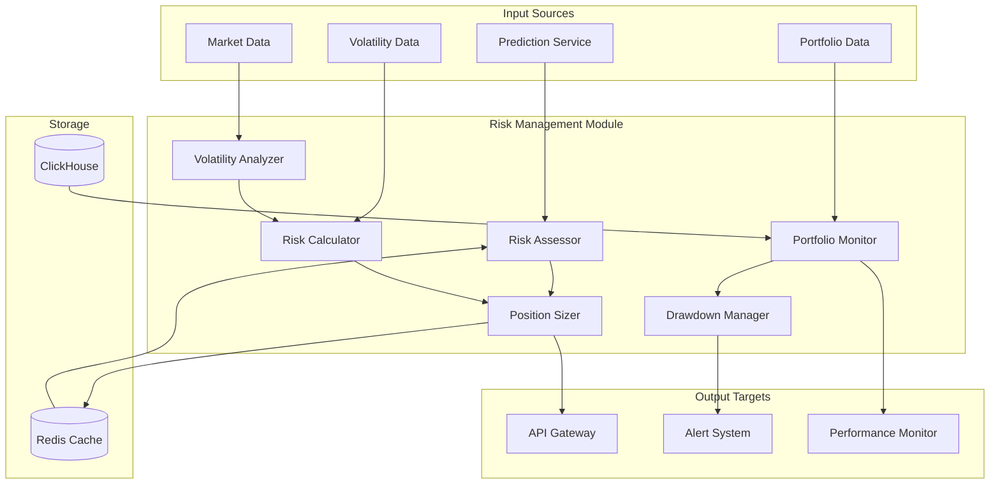

# Risk Management Module Specification

## Module Overview

The Risk Management Module is a critical business logic component that assesses, monitors, and controls financial risk across all predictions and trading recommendations. It works in conjunction with the Prediction Service to ensure that all outputs meet defined risk parameters and regulatory requirements.

## Core Responsibilities

- **Real-time Risk Assessment**: Evaluate risk for each prediction request
- **Position Sizing**: Calculate appropriate position sizes based on risk tolerance
- **Portfolio Risk Monitoring**: Track aggregate portfolio risk across positions
- **Drawdown Management**: Monitor and prevent excessive drawdowns
- **Volatility Adjustment**: Adjust recommendations based on market volatility
- **Regulatory Compliance**: Ensure all recommendations comply with risk regulations

## Architecture Diagram



## Data Inputs

### From Prediction Service
```json
{
  "prediction_request": {
    "symbol": "AAPL",
    "predicted_price": 185.75,
    "confidence": 0.78,
    "horizon_minutes": 60,
    "current_price": 182.50,
    "strategy_name": "momentum_transformer"
  }
}
```

### From Market Data (via Database Abstraction Layer)
```json
{
  "market_data": {
    "symbol": "AAPL",
    "current_volatility": 0.25,
    "average_volume": 95000000,
    "bid_ask_spread": 0.02,
    "market_cap": 3000000000000
  }
}
```

### From Portfolio Data (via Database)
```json
{
  "portfolio": {
    "user_id": "user_12345",
    "total_value": 1000000,
    "cash_available": 250000,
    "current_positions": [
      {
        "symbol": "AAPL",
        "quantity": 1000,
        "avg_cost": 175.00,
        "current_value": 182500
      }
    ],
    "risk_tolerance": "moderate",
    "max_drawdown_limit": 0.15
  }
}
```

## Data Outputs

### Risk Assessment Response
```json
{
  "risk_assessment": {
    "symbol": "AAPL",
    "prediction_id": "pred_20250726_103000_AAPL_60min",
    "risk_score": 0.35,
    "risk_level": "moderate",
    "max_position_size": 500,
    "recommended_position_size": 350,
    "stop_loss_price": 179.25,
    "take_profit_price": 188.50,
    "risk_reward_ratio": 2.4,
    "portfolio_impact": {
      "new_portfolio_risk": 0.42,
      "concentration_risk": 0.28,
      "sector_exposure": 0.35
    },
    "risk_factors": [
      {
        "factor": "high_volatility",
        "impact": 0.15,
        "description": "Above average volatility detected"
      },
      {
        "factor": "sector_concentration",
        "impact": 0.10,
        "description": "High exposure to technology sector"
      }
    ],
    "compliance_status": "approved",
    "timestamp": "2025-07-26T10:30:00Z"
  }
}
```

### Position Sizing Response
```json
{
  "position_sizing": {
    "symbol": "AAPL",
    "user_id": "user_12345",
    "recommended_quantity": 350,
    "max_quantity": 500,
    "capital_allocation": 63875.00,
    "percentage_of_portfolio": 0.064,
    "position_sizing_method": "kelly_criterion",
    "kelly_fraction": 0.12,
    "risk_adjusted_size": 350,
    "rationale": "Kelly criterion suggests 12% allocation, reduced to 6.4% due to portfolio concentration limits"
  }
}
```

## Core Components

### 1. Risk Assessor
**Purpose**: Evaluate overall risk for prediction requests
**Technology**: Rust with statistical libraries
**Key Functions**:
- Calculate Value at Risk (VaR)
- Assess prediction confidence impact on risk
- Evaluate market condition risk factors
- Generate risk scores and classifications

### 2. Position Sizer
**Purpose**: Calculate optimal position sizes based on risk parameters
**Technology**: Rust with mathematical optimization
**Key Functions**:
- Kelly Criterion implementation
- Fixed fractional position sizing
- Volatility-adjusted sizing
- Portfolio heat management

### 3. Portfolio Monitor
**Purpose**: Track aggregate portfolio risk and exposure
**Technology**: Rust with real-time data processing
**Key Functions**:
- Real-time portfolio risk calculation
- Sector and asset concentration monitoring
- Correlation risk assessment
- Drawdown tracking

### 4. Volatility Analyzer
**Purpose**: Assess and adjust for market volatility
**Technology**: Rust with time series analysis
**Key Functions**:
- Historical volatility calculation
- Implied volatility analysis
- Volatility regime detection
- Risk adjustment factors

## API Endpoints

### Internal APIs (Service-to-Service)

#### POST /api/v1/internal/risk/assess
**Purpose**: Assess risk for a prediction request
**Input**: Prediction data + user portfolio context
**Output**: Risk assessment with recommendations

#### POST /api/v1/internal/risk/position-size
**Purpose**: Calculate optimal position size
**Input**: Risk assessment + user preferences
**Output**: Position sizing recommendations

#### GET /api/v1/internal/risk/portfolio/{user_id}
**Purpose**: Get current portfolio risk metrics
**Input**: User ID
**Output**: Portfolio risk analysis

#### POST /api/v1/internal/risk/validate
**Purpose**: Validate a proposed trade against risk limits
**Input**: Trade proposal + portfolio context
**Output**: Validation result with risk impact

### Public APIs (via API Gateway)

#### GET /api/v1/public/risk/profile/{user_id}
**Purpose**: Get user's risk profile and current exposure
**Input**: User ID (from JWT)
**Output**: Risk profile and current portfolio risk

#### POST /api/v1/public/risk/simulate
**Purpose**: Simulate risk impact of a proposed trade
**Input**: Trade proposal
**Output**: Risk simulation results

## Database Interactions

### ClickHouse Queries

#### Store Risk Assessments
```sql
INSERT INTO risk_assessments (
    user_id, symbol, prediction_id, timestamp, risk_score, 
    risk_level, max_position_size, recommended_position_size,
    stop_loss_price, take_profit_price, risk_factors, compliance_status
) VALUES (?, ?, ?, ?, ?, ?, ?, ?, ?, ?, ?, ?)
```

#### Get Portfolio Risk History
```sql
SELECT 
    timestamp,
    portfolio_value,
    portfolio_risk,
    max_drawdown,
    var_95,
    sector_exposures
FROM portfolio_risk_history 
WHERE user_id = ? 
    AND timestamp >= ? 
ORDER BY timestamp DESC
```

#### Calculate Correlation Matrix
```sql
SELECT 
    symbol_a,
    symbol_b,
    correlation_coefficient
FROM asset_correlations 
WHERE timestamp >= now() - INTERVAL 30 DAY
    AND (symbol_a IN (?) OR symbol_b IN (?))
```

### Redis Caching

#### Real-time Risk Metrics
```
risk:portfolio:{user_id}:current -> {
    "total_risk": 0.42,
    "var_95": 45000,
    "max_drawdown": 0.08,
    "last_updated": "2025-07-26T10:30:00Z",
    "ttl": 300
}
```

#### Volatility Cache
```
risk:volatility:{symbol}:current -> {
    "historical_vol": 0.25,
    "implied_vol": 0.28,
    "vol_regime": "high",
    "last_updated": "2025-07-26T10:30:00Z",
    "ttl": 900
}
```

## Integration Points

### With Prediction Service
- **Inbound**: Prediction requests requiring risk assessment
- **Outbound**: Risk-adjusted predictions with position sizing
- **Protocol**: Synchronous REST API calls
- **Data Format**: JSON with prediction and risk metadata

### With Market Data Ingestion
- **Inbound**: Real-time market data for volatility calculations
- **Protocol**: Redis pub/sub for real-time updates
- **Data Format**: Market data events with OHLCV + volatility

### With Performance Evaluation
- **Inbound**: Actual trade outcomes for risk model validation
- **Outbound**: Risk assessment accuracy metrics
- **Protocol**: Asynchronous via database
- **Data Format**: Performance metrics with risk attribution

### With Alert System
- **Outbound**: Risk limit breaches and warnings
- **Protocol**: Event-driven via message queue
- **Data Format**: Alert events with risk context

## Risk Models and Algorithms

### 1. Value at Risk (VaR) Calculation
```rust
// Historical Simulation VaR
pub fn calculate_var(returns: &[f64], confidence: f64, horizon_days: u32) -> f64 {
    let sorted_returns = sort_returns(returns);
    let index = ((1.0 - confidence) * returns.len() as f64) as usize;
    sorted_returns[index] * (horizon_days as f64).sqrt()
}
```

### 2. Kelly Criterion Position Sizing
```rust
// Kelly Criterion for position sizing
pub fn kelly_position_size(win_prob: f64, avg_win: f64, avg_loss: f64, capital: f64) -> f64 {
    let b = avg_win / avg_loss.abs();
    let p = win_prob;
    let q = 1.0 - p;
    
    let kelly_fraction = (b * p - q) / b;
    let conservative_kelly = kelly_fraction * 0.25; // Use quarter Kelly for safety
    
    capital * conservative_kelly.max(0.0).min(0.10) // Cap at 10% of capital
}
```

### 3. Portfolio Heat Calculation
```rust
// Portfolio heat (percentage of capital at risk)
pub fn calculate_portfolio_heat(positions: &[Position], portfolio_value: f64) -> f64 {
    let total_risk = positions.iter()
        .map(|pos| pos.quantity as f64 * (pos.entry_price - pos.stop_loss).abs())
        .sum::<f64>();
    
    total_risk / portfolio_value
}
```

## Performance Requirements

### Latency Targets
- **Risk Assessment**: < 50ms (95th percentile)
- **Position Sizing**: < 30ms (95th percentile)
- **Portfolio Risk Update**: < 100ms (95th percentile)
- **Risk Validation**: < 25ms (95th percentile)

### Throughput Targets
- **Risk Assessments**: 1,000 requests/minute sustained
- **Portfolio Updates**: 500 updates/minute sustained
- **Risk Validations**: 2,000 requests/minute sustained

### Accuracy Requirements
- **VaR Accuracy**: 95% confidence level validated monthly
- **Position Sizing**: Risk-adjusted returns within 5% of target
- **Risk Score Calibration**: Monthly backtesting validation

## Risk Limits and Controls

### Portfolio-Level Limits
- **Maximum Drawdown**: Configurable per user (default 15%)
- **Portfolio Heat**: Maximum 20% of capital at risk
- **Sector Concentration**: Maximum 40% in any single sector
- **Single Position Size**: Maximum 10% of portfolio value

### Position-Level Limits
- **Stop Loss**: Mandatory for all positions (default 3% below entry)
- **Take Profit**: Recommended 2:1 risk-reward ratio minimum
- **Hold Period**: Maximum recommended holding period based on strategy

### Real-time Monitoring
- **Circuit Breakers**: Automatic position reduction on drawdown limits
- **Correlation Limits**: Reduce position sizes when correlations spike
- **Volatility Adjustment**: Scale position sizes inversely with volatility

## Error Handling and Failsafes

### Data Validation
- **Price Data**: Validate against market bounds and circuit breakers
- **Portfolio Data**: Ensure data consistency and prevent negative balances
- **Risk Calculations**: Validate all mathematical operations for NaN/infinity

### Fallback Mechanisms
- **Conservative Defaults**: Use minimum position sizes when risk cannot be calculated
- **Stale Data Handling**: Use cached risk metrics with increased conservative buffers
- **Service Degradation**: Reduce position sizes when downstream services fail

### Compliance Monitoring
- **Regulatory Limits**: Enforce regulatory position limits and reporting requirements
- **Audit Trail**: Log all risk decisions and overrides
- **Exception Handling**: Alert on any risk limit breaches or system anomalies

## Configuration Management

### Risk Parameters (Environment Variables)
```bash
# Risk calculation parameters
RISK_VAR_CONFIDENCE=0.95
RISK_MAX_PORTFOLIO_HEAT=0.20
RISK_MAX_SINGLE_POSITION=0.10
RISK_DEFAULT_STOP_LOSS_PCT=0.03

# Performance parameters
RISK_CACHE_TTL_SECONDS=300
RISK_PORTFOLIO_UPDATE_INTERVAL=60
RISK_VOLATILITY_LOOKBACK_DAYS=30

# Integration parameters
RISK_PREDICTION_SERVICE_URL=http://prediction-service:8080
RISK_MARKET_DATA_REDIS_URL=redis://market-data-cache:6379
```

### User-Specific Risk Profiles
```json
{
  "risk_profiles": {
    "conservative": {
      "max_drawdown": 0.10,
      "max_position_size": 0.05,
      "kelly_fraction_multiplier": 0.25
    },
    "moderate": {
      "max_drawdown": 0.15,
      "max_position_size": 0.08,
      "kelly_fraction_multiplier": 0.35
    },
    "aggressive": {
      "max_drawdown": 0.25,
      "max_position_size": 0.12,
      "kelly_fraction_multiplier": 0.50
    }
  }
}
```

This Risk Management Module ensures that all trading recommendations are properly risk-adjusted and comply with both regulatory requirements and user-specified risk tolerances, while maintaining the high-performance requirements of the overall system.