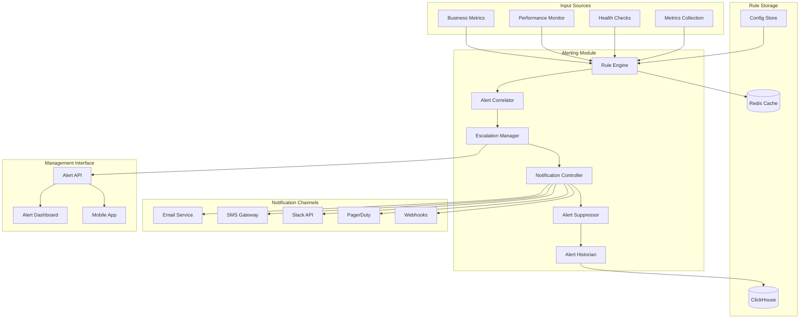

# Alerting Module Specification

## Module Overview

The Alerting Module provides comprehensive, intelligent alerting capabilities for the QuantumTrade AI system. It monitors system metrics, business KPIs, and performance indicators to detect issues early and notify the appropriate teams through multiple channels while minimizing alert fatigue through smart filtering and correlation.

## Core Responsibilities

- **Rule-based Alerting**: Define and evaluate complex alerting rules and conditions
- **Multi-channel Notifications**: Send alerts via email, SMS, Slack, PagerDuty, and webhooks
- **Alert Correlation**: Group related alerts to reduce noise and identify root causes
- **Escalation Management**: Implement escalation policies for critical alerts
- **Alert Suppression**: Intelligent suppression during maintenance and known issues
- **Historical Analysis**: Track alert patterns and effectiveness for continuous improvement

## Architecture Diagram



## Data Inputs

### Metric-based Alert Trigger
```json
{
  "metric_alert": {
    "alert_id": "alert_cpu_high_001",
    "rule_name": "high_cpu_usage",
    "timestamp": "2025-07-26T10:30:00Z",
    "severity": "warning",
    "service": "ml-inference",
    "instance": "ml-inference-001",
    "metric": {
      "name": "cpu_usage_percent",
      "current_value": 87.5,
      "threshold": 80.0,
      "evaluation_period": 300,
      "data_points_evaluated": 10
    },
    "context": {
      "labels": {
        "service": "ml-inference",
        "instance": "ml-inference-001",
        "region": "us-east-1"
      },
      "trend": "increasing",
      "duration_above_threshold": 420,
      "previous_value": 82.3
    },
    "suggested_actions": [
      "Check for resource-intensive processes",
      "Consider scaling up instance",
      "Review recent deployments"
    ]
  }
}
```

### Business Logic Alert
```json
{
  "business_alert": {
    "alert_id": "alert_pred_accuracy_low_001",
    "rule_name": "prediction_accuracy_degradation",
    "timestamp": "2025-07-26T10:30:00Z",
    "severity": "critical",
    "category": "business_kpi",
    "metric": {
      "name": "prediction_accuracy",
      "current_value": 0.634,
      "threshold": 0.65,
      "baseline_value": 0.742,
      "degradation_percent": 14.6
    },
    "impact_assessment": {
      "affected_users": 234,
      "affected_strategies": ["momentum_transformer", "trend_following"],
      "estimated_revenue_impact": 15420.50,
      "customer_complaints": 3
    },
    "root_cause_analysis": {
      "suspected_causes": [
        "model_drift",
        "data_quality_issues",
        "market_regime_change"
      ],
      "correlation_with": [
        "feature_service_errors",
        "data_ingestion_delays"
      ]
    }
  }
}
```

### Health Check Alert
```json
{
  "health_alert": {
    "alert_id": "alert_service_down_001",
    "rule_name": "service_availability",
    "timestamp": "2025-07-26T10:30:00Z",
    "severity": "critical",
    "service": "feature-engineering",
    "instance": "feature-engineering-002",
    "health_status": "unhealthy",
    "failure_details": {
      "check_type": "dependency_health",
      "failed_checks": [
        "database_connectivity",
        "external_api_access"
      ],
      "error_messages": [
        "Connection timeout to ClickHouse",
        "Alpha Vantage API rate limit exceeded"
      ]
    },
    "downstream_impact": {
      "dependent_services": ["ml-inference", "prediction-service"],
      "estimated_requests_affected": 1247,
      "business_functions_impacted": ["real_time_predictions", "feature_updates"]
    }
  }
}
```

### External System Alert
```json
{
  "external_alert": {
    "alert_id": "alert_external_api_001",
    "source": "alpha_vantage_monitor",
    "timestamp": "2025-07-26T10:30:00Z",
    "severity": "warning",
    "external_service": "alpha_vantage_api",
    "issue_type": "rate_limit_approaching",
    "details": {
      "current_usage": 950,
      "daily_limit": 1000,
      "usage_percent": 95.0,
      "reset_time": "2025-07-27T00:00:00Z",
      "estimated_time_to_limit": 1800
    },
    "mitigation_options": [
      "reduce_polling_frequency",
      "use_cached_data",
      "upgrade_api_plan"
    ]
  }
}
```

## Data Outputs

### Alert Notification
```json
{
  "alert_notification": {
    "notification_id": "notif_20250726_103000_001",
    "alert_id": "alert_cpu_high_001",
    "timestamp": "2025-07-26T10:30:00Z",
    "notification_channel": "slack",
    "severity": "warning",
    "recipient_info": {
      "team": "ml-team",
      "channel": "#alerts-ml",
      "on_call_engineer": "john.smith@quantumtrade.ai"
    },
    "alert_summary": {
      "title": "High CPU Usage - ML Inference Service",
      "description": "CPU usage on ml-inference-001 has been above 80% for 7 minutes",
      "current_value": 87.5,
      "threshold": 80.0,
      "service": "ml-inference",
      "instance": "ml-inference-001"
    },
    "alert_details": {
      "duration": "7 minutes",
      "trend": "increasing",  
      "previous_alerts": 0,
      "runbook_url": "https://docs.quantumtrade.ai/runbooks/high-cpu-usage",
      "dashboard_url": "https://dashboard.quantumtrade.ai/ml-inference",
      "logs_url": "https://logs.quantumtrade.ai/ml-inference-001"
    },
    "suggested_actions": [
      "Check resource usage on ml-inference-001",
      "Review recent deployments or traffic spikes",
      "Consider scaling up if sustained high usage"
    ],
    "escalation_info": {
      "escalates_at": "2025-07-26T10:45:00Z",
      "escalation_target": "ml-team-lead",
      "current_escalation_level": 1,
      "max_escalation_level": 3
    }
  }
}
```

### Correlated Alert Group
```json
{
  "alert_correlation": {
    "correlation_id": "corr_20250726_103000",
    "timestamp": "2025-07-26T10:30:00Z",
    "correlation_type": "service_impact_cascade",
    "root_cause_alert": "alert_service_down_001",
    "related_alerts": [
      {
        "alert_id": "alert_response_time_high_001",
        "service": "ml-inference",
        "relationship": "downstream_impact",
        "confidence": 0.89
      },
      {
        "alert_id": "alert_error_rate_high_001", 
        "service": "prediction-service",
        "relationship": "downstream_impact",
        "confidence": 0.76
      }
    ],
    "analysis": {
      "probable_root_cause": "feature-engineering service dependency failure",
      "impact_scope": "prediction_pipeline",
      "affected_users": 234,
      "estimated_resolution_time": 15,
      "business_impact": "high"
    },
    "recommended_response": {
      "priority": "high",
      "assign_to": "infrastructure-team",
      "primary_actions": [
        "Restart feature-engineering service",
        "Check database connectivity",
        "Verify external API status"
      ],
      "communication_template": "service_outage_customer_communication"
    }
  }
}
```

### Alert Status Update
```json
{
  "alert_status_update": {
    "alert_id": "alert_cpu_high_001",
    "timestamp": "2025-07-26T10:45:00Z",
    "status_change": {
      "from": "firing",
      "to": "acknowledged",
      "changed_by": "john.smith@quantumtrade.ai",
      "change_reason": "investigating_root_cause"
    },
    "current_state": {
      "status": "acknowledged",
      "severity": "warning",
      "acknowledged_at": "2025-07-26T10:45:00Z",
      "acknowledged_by": "john.smith@quantumtrade.ai",
      "estimated_resolution": "2025-07-26T11:00:00Z"
    },
    "investigation_notes": [
      {
        "timestamp": "2025-07-26T10:45:00Z",
        "author": "john.smith@quantumtrade.ai",
        "note": "Identified memory leak in inference worker. Deploying hotfix."
      }
    ],
    "affected_notifications": [
      "suppress_escalation",
      "notify_stakeholders_investigation_in_progress"
    ]
  }
}
```

### Alert Analytics Report
```json
{
  "alert_analytics": {
    "report_id": "analytics_20250726",
    "time_range": {
      "start": "2025-07-19T00:00:00Z",
      "end": "2025-07-26T23:59:59Z"
    },
    "summary_statistics": {
      "total_alerts": 127,
      "critical_alerts": 8,
      "warning_alerts": 45,
      "info_alerts": 74,
      "false_positives": 12,
      "mean_time_to_acknowledge": 180,
      "mean_time_to_resolve": 900
    },
    "alert_categories": [
      {
        "category": "system_performance",
        "count": 67,
        "percentage": 52.8,
        "trend": "increasing"
      },
      {
        "category": "business_kpi",
        "count": 23,
        "percentage": 18.1,
        "trend": "stable"
      },
      {
        "category": "external_dependencies",
        "count": 37,
        "percentage": 29.1,
        "trend": "decreasing"
      }
    ],
    "top_alerting_services": [
      {
        "service": "feature-engineering",
        "alert_count": 34,
        "most_common_alert": "high_memory_usage"
      },
      {
        "service": "ml-inference",
        "alert_count": 28,
        "most_common_alert": "slow_response_time"
      }
    ],
    "recommendations": [
      {
        "priority": "high",
        "category": "threshold_tuning",
        "description": "Adjust CPU usage threshold for feature-engineering service",
        "expected_noise_reduction": "25%"
      },
      {
        "priority": "medium",
        "category": "new_monitoring",
        "description": "Add monitoring for database connection pool exhaustion",
        "justification": "Root cause of 3 recent incidents"
      }
    ]
  }
}
```

## Core Components

### 1. Rule Engine
**Purpose**: Evaluate alerting rules against incoming metrics and events
**Technology**: Rust with expression evaluation and state management
**Key Functions**:
- Rule compilation and optimization
- Real-time rule evaluation
- State persistence for stateful rules
- Rule performance monitoring

### 2. Alert Correlator
**Purpose**: Identify relationships between alerts to reduce noise and find root causes
**Technology**: Rust with graph algorithms and pattern matching
**Key Functions**:
- Time-based alert correlation
- Service dependency correlation
- Pattern-based correlation using ML
- Root cause analysis

### 3. Escalation Manager
**Purpose**: Manage alert escalation policies and workflows
**Technology**: Rust with workflow engine
**Key Functions**:
- Escalation policy execution
- On-call schedule management
- Escalation timeout handling
- Custom escalation workflows

### 4. Notification Controller
**Purpose**: Send notifications through multiple channels with deduplication
**Technology**: Rust with async channel integrations
**Key Functions**:
- Multi-channel notification delivery
- Message templating and formatting
- Delivery confirmation and retry logic
- Channel preference management

### 5. Alert Suppressor
**Purpose**: Intelligently suppress alerts during maintenance and known issues
**Technology**: Rust with rule-based suppression
**Key Functions**:
- Maintenance window suppression
- Dependency-based suppression
- Alert storm protection
- Custom suppression rules

## API Endpoints

### Alert Management APIs

#### POST /api/v1/internal/alerts/trigger
**Purpose**: Trigger a new alert from system components
**Input**: Alert definition with context and metrics
**Output**: Alert creation confirmation with alert ID

#### GET /api/v1/internal/alerts/active
**Purpose**: Get currently active alerts
**Input**: Service filter, severity filter, time range
**Output**: List of active alerts with current status

#### POST /api/v1/internal/alerts/{alert_id}/acknowledge
**Purpose**: Acknowledge an alert
**Input**: Alert ID, acknowledger information, notes
**Output**: Acknowledgment confirmation

#### POST /api/v1/internal/alerts/{alert_id}/resolve
**Purpose**: Resolve an alert
**Input**: Alert ID, resolution information, root cause
**Output**: Resolution confirmation

### Rule Management APIs

#### POST /api/v1/admin/alerts/rules
**Purpose**: Create or update alerting rules
**Input**: Rule definition with conditions and actions
**Output**: Rule creation/update confirmation

#### GET /api/v1/admin/alerts/rules
**Purpose**: List all alerting rules
**Input**: Rule category filter, status filter
**Output**: List of alerting rules with metadata

#### DELETE /api/v1/admin/alerts/rules/{rule_id}
**Purpose**: Delete an alerting rule
**Input**: Rule ID
**Output**: Deletion confirmation

#### POST /api/v1/admin/alerts/rules/{rule_id}/test
**Purpose**: Test an alerting rule against historical data
**Input**: Rule ID, test time range, test data
**Output**: Test results with triggered alerts

### Notification Management APIs

#### POST /api/v1/admin/alerts/channels
**Purpose**: Configure notification channels
**Input**: Channel type, configuration, recipients
**Output**: Channel configuration confirmation

#### GET /api/v1/admin/alerts/escalations
**Purpose**: Get escalation policies
**Input**: Team filter, policy status
**Output**: List of escalation policies

#### POST /api/v1/admin/alerts/suppress
**Purpose**: Create alert suppression rules
**Input**: Suppression rule definition
**Output**: Suppression rule creation confirmation

### Public Alert APIs

#### GET /api/v1/public/alerts/my-alerts
**Purpose**: Get alerts relevant to authenticated user
**Input**: User context from JWT, time range
**Output**: User's relevant alerts and notifications

#### GET /api/v1/public/alerts/status
**Purpose**: Get system status page information
**Input**: None (public endpoint)
**Output**: High-level system status and active incidents

## Alert Rule Implementations

### 1. Threshold-based Rule Engine
```rust
use std::collections::HashMap;
use chrono::{DateTime, Utc, Duration};

pub struct ThresholdRule {
    pub rule_id: String,
    pub name: String,
    pub metric_name: String,
    pub threshold: f64,
    pub comparison: ComparisonOperator,
    pub evaluation_period: Duration,
    pub min_data_points: u32,
    pub severity: AlertSeverity,
    pub labels: HashMap<String, String>,
}

impl ThresholdRule {
    pub fn evaluate(&self, data_points: &[(DateTime<Utc>, f64)]) -> Option<Alert> {
        // Filter data points within evaluation period
        let now = Utc::now();
        let cutoff_time = now - self.evaluation_period;
        
        let relevant_points: Vec<_> = data_points
            .iter()
            .filter(|(timestamp, _)| *timestamp >= cutoff_time)
            .collect();
        
        if relevant_points.len() < self.min_data_points as usize {
            return None; // Insufficient data
        }
        
        // Calculate aggregated value (average for this example)
        let sum: f64 = relevant_points.iter().map(|(_, value)| *value).sum();
        let avg_value = sum / relevant_points.len() as f64;
        
        // Evaluate threshold condition
        let condition_met = match self.comparison {
            ComparisonOperator::GreaterThan => avg_value > self.threshold,
            ComparisonOperator::GreaterThanOrEqual => avg_value >= self.threshold,
            ComparisonOperator::LessThan => avg_value < self.threshold,
            ComparisonOperator::LessThanOrEqual => avg_value <= self.threshold,
            ComparisonOperator::Equal => (avg_value - self.threshold).abs() < f64::EPSILON,
        };
        
        if condition_met {
            Some(Alert {
                alert_id: format!("{}_{}", self.rule_id, now.timestamp()),
                rule_id: self.rule_id.clone(),
                rule_name: self.name.clone(),
                timestamp: now,
                severity: self.severity,
                metric_name: self.metric_name.clone(),
                current_value: avg_value,
                threshold: self.threshold,
                labels: self.labels.clone(),
                context: AlertContext {
                    evaluation_period: self.evaluation_period,
                    data_points_evaluated: relevant_points.len() as u32,
                    trend: self.calculate_trend(&relevant_points),
                },
            })
        } else {
            None
        }
    }
    
    fn calculate_trend(&self, data_points: &[&(DateTime<Utc>, f64)]) -> Trend {
        if data_points.len() < 2 {
            return Trend::Unknown;
        }
        
        // Simple linear regression for trend
        let n = data_points.len() as f64;
        let sum_x: f64 = (0..data_points.len()).map(|i| i as f64).sum();
        let sum_y: f64 = data_points.iter().map(|(_, value)| *value).sum();
        let sum_xy: f64 = data_points
            .iter()
            .enumerate()
            .map(|(i, (_, value))| i as f64 * value)
            .sum();
        let sum_x2: f64 = (0..data_points.len()).map(|i| (i as f64).powi(2)).sum();
        
        let slope = (n * sum_xy - sum_x * sum_y) / (n * sum_x2 - sum_x.powi(2));
        
        if slope > 0.01 {
            Trend::Increasing
        } else if slope < -0.01 {
            Trend::Decreasing
        } else {
            Trend::Stable
        }
    }
}

#[derive(Debug, Clone)]
pub enum ComparisonOperator {
    GreaterThan,
    GreaterThanOrEqual,
    LessThan,
    LessThanOrEqual,
    Equal,
}

#[derive(Debug, Clone, Copy)]
pub enum AlertSeverity {
    Info,
    Warning,
    Critical,
}

#[derive(Debug, Clone)]
pub enum Trend {
    Increasing,
    Decreasing,
    Stable,
    Unknown,
}
```

### 2. Correlation Engine
```rust
use std::collections::{HashMap, HashSet};
use chrono::{DateTime, Utc, Duration};

pub struct AlertCorrelator {
    correlation_rules: Vec<CorrelationRule>,
    time_window: Duration,
    min_correlation_score: f64,
}

impl AlertCorrelator {
    pub fn correlate_alerts(&self, alerts: &[Alert]) -> Vec<AlertCorrelation> {
        let mut correlations = Vec::new();
        let now = Utc::now();
        
        // Group alerts by time window
        let recent_alerts: Vec<_> = alerts
            .iter()
            .filter(|alert| now - alert.timestamp <= self.time_window)
            .collect();
        
        // Find correlations using different strategies
        correlations.extend(self.find_service_dependency_correlations(&recent_alerts));
        correlations.extend(self.find_temporal_correlations(&recent_alerts));
        correlations.extend(self.find_pattern_based_correlations(&recent_alerts));
        
        // Deduplicate and rank correlations
        self.deduplicate_and_rank_correlations(correlations)
    }
    
    fn find_service_dependency_correlations(&self, alerts: &[&Alert]) -> Vec<AlertCorrelation> {
        let mut correlations = Vec::new();
        
        // Group alerts by service
        let mut service_alerts: HashMap<String, Vec<&Alert>> = HashMap::new();
        for alert in alerts {
            if let Some(service) = alert.labels.get("service") {
                service_alerts.entry(service.clone()).or_default().push(*alert);
            }
        }
        
        // Look for upstream service failures causing downstream alerts
        for (service, service_specific_alerts) in &service_alerts {
            if let Some(dependencies) = self.get_service_dependencies(service) {
                for dependency in dependencies {
                    if let Some(dependency_alerts) = service_alerts.get(&dependency) {
                        // Check if dependency alert preceded service alerts
                        for dep_alert in dependency_alerts {
                            for svc_alert in service_specific_alerts {
                                if dep_alert.timestamp < svc_alert.timestamp
                                    && svc_alert.timestamp - dep_alert.timestamp <= Duration::minutes(10)
                                {
                                    correlations.push(AlertCorrelation {
                                        correlation_type: CorrelationType::ServiceDependency,
                                        root_cause_alert: dep_alert.alert_id.clone(),
                                        related_alerts: vec![svc_alert.alert_id.clone()],
                                        confidence_score: 0.85,
                                        analysis: format!(
                                            "Service {} failure likely caused issues in dependent service {}",
                                            dependency, service
                                        ),
                                    });
                                }
                            }
                        }
                    }
                }
            }
        }
        
        correlations
    }
    
    fn find_temporal_correlations(&self, alerts: &[&Alert]) -> Vec<AlertCorrelation> {
        let mut correlations = Vec::new();
        
        // Sort alerts by timestamp
        let mut sorted_alerts = alerts.to_vec();
        sorted_alerts.sort_by_key(|alert| alert.timestamp);
        
        // Look for clusters of alerts in short time windows
        let cluster_window = Duration::minutes(5);
        let mut current_cluster = Vec::new();
        let mut cluster_start = None;
        
        for alert in sorted_alerts {
            if let Some(start_time) = cluster_start {
                if alert.timestamp - start_time <= cluster_window {
                    current_cluster.push(alert);
                } else {
                    // Process completed cluster
                    if current_cluster.len() >= 3 {
                        correlations.push(self.create_temporal_correlation(&current_cluster));
                    }
                    
                    // Start new cluster
                    current_cluster = vec![alert];
                    cluster_start = Some(alert.timestamp);
                }
            } else {
                current_cluster = vec![alert];
                cluster_start = Some(alert.timestamp);
            }
        }
        
        // Process final cluster
        if current_cluster.len() >= 3 {
            correlations.push(self.create_temporal_correlation(&current_cluster));
        }
        
        correlations
    }
    
    fn create_temporal_correlation(&self, cluster: &[&Alert]) -> AlertCorrelation {
        // Find most severe alert as potential root cause
        let root_cause = cluster
            .iter()
            .max_by_key(|alert| match alert.severity {
                AlertSeverity::Critical => 3,
                AlertSeverity::Warning => 2,
                AlertSeverity::Info => 1,
            })
            .unwrap();
        
        let related_alerts: Vec<_> = cluster
            .iter()
            .filter(|alert| alert.alert_id != root_cause.alert_id)
            .map(|alert| alert.alert_id.clone())
            .collect();
        
        AlertCorrelation {
            correlation_type: CorrelationType::TemporalCluster,
            root_cause_alert: root_cause.alert_id.clone(),
            related_alerts,
            confidence_score: 0.70,
            analysis: format!(
                "Cluster of {} alerts within 5-minute window suggests common root cause",
                cluster.len()
            ),
        }
    }
    
    fn get_service_dependencies(&self, service: &str) -> Option<Vec<String>> {
        // This would typically come from a service registry or configuration
        match service {
            "ml-inference" => Some(vec!["feature-engineering".to_string(), "clickhouse".to_string()]),
            "prediction-service" => Some(vec!["ml-inference".to_string(), "risk-management".to_string()]),
            "feature-engineering" => Some(vec!["clickhouse".to_string(), "redis".to_string()]),
            _ => None,
        }
    }
}

#[derive(Debug, Clone)]
pub struct AlertCorrelation {
    pub correlation_type: CorrelationType,
    pub root_cause_alert: String,
    pub related_alerts: Vec<String>,
    pub confidence_score: f64,
    pub analysis: String,
}

#[derive(Debug, Clone)]
pub enum CorrelationType {
    ServiceDependency,
    TemporalCluster,
    PatternBased,
    MetricCorrelation,
}
```

### 3. Notification Controller
```rust
use std::collections::HashMap;
use async_trait::async_trait;
use serde_json::Value;

pub struct NotificationController {
    channels: HashMap<String, Box<dyn NotificationChannel>>,
    templates: HashMap<String, MessageTemplate>,
    delivery_tracking: DeliveryTracker,
}

impl NotificationController {
    pub async fn send_alert_notification(
        &self,
        alert: &Alert,
        escalation_level: u32,
    ) -> Result<NotificationResult> {
        // Determine notification channels based on severity and escalation level
        let channels = self.determine_notification_channels(alert, escalation_level);
        
        // Generate notification content
        let notification_content = self.generate_notification_content(alert, escalation_level)?;
        
        let mut results = Vec::new();
        
        // Send to all determined channels
        for channel_name in channels {
            if let Some(channel) = self.channels.get(&channel_name) {
                match channel.send_notification(&notification_content).await {
                    Ok(delivery_result) => {
                        self.delivery_tracking.record_success(
                            &alert.alert_id,
                            &channel_name,
                            &delivery_result,
                        ).await;
                        results.push(ChannelResult {
                            channel: channel_name,
                            status: DeliveryStatus::Success,
                            delivery_id: Some(delivery_result.delivery_id),
                            error: None,
                        });
                    }
                    Err(e) => {
                        self.delivery_tracking.record_failure(
                            &alert.alert_id,
                            &channel_name,
                            &e.to_string(),
                        ).await;
                        results.push(ChannelResult {
                            channel: channel_name,
                            status: DeliveryStatus::Failed,
                            delivery_id: None,
                            error: Some(e.to_string()),
                        });
                    }
                }
            }
        }
        
        Ok(NotificationResult {
            alert_id: alert.alert_id.clone(),
            channels: results,
            timestamp: Utc::now(),
        })
    }
    
    fn determine_notification_channels(&self, alert: &Alert, escalation_level: u32) -> Vec<String> {
        let mut channels = Vec::new();
        
        // Base channels by severity
        match alert.severity {
            AlertSeverity::Info => channels.push("slack".to_string()),
            AlertSeverity::Warning => {
                channels.push("slack".to_string());
                channels.push("email".to_string());
            }
            AlertSeverity::Critical => {
                channels.push("slack".to_string());
                channels.push("email".to_string());
                channels.push("sms".to_string());
                
                if escalation_level >= 2 {
                    channels.push("pagerduty".to_string());
                }
            }
        }
        
        // Add service-specific channels
        if let Some(service) = alert.labels.get("service") {
            if let Some(service_channels) = self.get_service_notification_channels(service) {
                channels.extend(service_channels);
            }
        }
        
        channels.into_iter().collect::<std::collections::HashSet<_>>().into_iter().collect()
    }
    
    fn generate_notification_content(
        &self,
        alert: &Alert,
        escalation_level: u32,
    ) -> Result<NotificationContent> {
        // Select appropriate template
        let template_name = format!("alert_{}_level_{}", 
            alert.severity.to_string().to_lowercase(),
            escalation_level
        );
        
        let template = self.templates.get(&template_name)
            .or_else(|| self.templates.get("alert_default"))
            .ok_or_else(|| NotificationError::TemplateNotFound(template_name))?;
        
        // Build template context
        let mut context = HashMap::new();
        context.insert("alert_id".to_string(), Value::String(alert.alert_id.clone()));
        context.insert("rule_name".to_string(), Value::String(alert.rule_name.clone()));
        context.insert("severity".to_string(), Value::String(alert.severity.to_string()));
        context.insert("current_value".to_string(), Value::Number(alert.current_value.into()));
        context.insert("threshold".to_string(), Value::Number(alert.threshold.into()));
        context.insert("timestamp".to_string(), Value::String(alert.timestamp.to_rfc3339()));
        
        // Add service-specific context
        for (key, value) in &alert.labels {
            context.insert(format!("label_{}", key), Value::String(value.clone()));
        }
        
        // Generate content for each channel type
        Ok(NotificationContent {
            subject: template.render_subject(&context)?,
            body: template.render_body(&context)?,
            priority: match alert.severity {
                AlertSeverity::Critical => NotificationPriority::High,
                AlertSeverity::Warning => NotificationPriority::Medium,
                AlertSeverity::Info => NotificationPriority::Low,
            },
            metadata: context,
        })
    }
}

#[async_trait]
pub trait NotificationChannel: Send + Sync {
    async fn send_notification(&self, content: &NotificationContent) -> Result<DeliveryResult>;
    fn channel_type(&self) -> &str;
    fn supports_rich_content(&self) -> bool;
}

pub struct SlackNotificationChannel {
    webhook_url: String,
    default_channel: String,
    http_client: reqwest::Client,
}

#[async_trait]
impl NotificationChannel for SlackNotificationChannel {
    async fn send_notification(&self, content: &NotificationContent) -> Result<DeliveryResult> {
        let slack_message = self.format_slack_message(content);
        
        let response = self.http_client
            .post(&self.webhook_url)
            .json(&slack_message)
            .send()
            .await?;
        
        if response.status().is_success() {
            Ok(DeliveryResult {
                delivery_id: format!("slack_{}", Utc::now().timestamp()),
                delivered_at: Utc::now(),
                channel_response: Some(response.text().await?),
            })
        } else {
            Err(NotificationError::DeliveryFailed(format!(
                "Slack API returned status: {}",
                response.status()
            )))
        }
    }
    
    fn channel_type(&self) -> &str {
        "slack"
    }
    
    fn supports_rich_content(&self) -> bool {
        true
    }
}

impl SlackNotificationChannel {
    fn format_slack_message(&self, content: &NotificationContent) -> Value {
        let color = match content.priority {
            NotificationPriority::High => "danger",
            NotificationPriority::Medium => "warning", 
            NotificationPriority::Low => "good",
        };
        
        serde_json::json!({
            "channel": self.default_channel,
            "attachments": [{
                "color": color,
                "title": content.subject,
                "text": content.body,
                "footer": "QuantumTrade AI Alerting",
                "ts": Utc::now().timestamp()
            }]
        })
    }
}
```

## Database Interactions

### ClickHouse Alert Storage

#### Alert Events Table
```sql
CREATE TABLE alert_events (
    alert_id String,
    rule_id String,
    rule_name LowCardinality(String),
    timestamp DateTime64(3, 'UTC'),
    severity LowCardinality(String),
    status LowCardinality(String), -- 'firing', 'acknowledged', 'resolved'
    metric_name LowCardinality(String),
    current_value Float64,
    threshold Float64,
    labels Map(String, String),
    context String, -- JSON context
    correlation_id String,
    acknowledged_by String,
    acknowledged_at DateTime64(3, 'UTC'),
    resolved_by String,
    resolved_at DateTime64(3, 'UTC'),
    resolution_notes String
) ENGINE = MergeTree()
PARTITION BY (toYYYYMM(timestamp), severity)
ORDER BY (timestamp, rule_id, alert_id)
SETTINGS index_granularity = 8192;
```

#### Notification Delivery Log
```sql
CREATE TABLE notification_deliveries (
    notification_id String,
    alert_id String,
    channel_type LowCardinality(String),
    recipient String,
    timestamp DateTime64(3, 'UTC'),
    delivery_status LowCardinality(String), -- 'sent', 'delivered', 'failed', 'bounced'
    delivery_id String,
    error_message String,
    retry_count UInt32,
    escalation_level UInt32
) ENGINE = MergeTree()
PARTITION BY (toYYYYMM(timestamp), channel_type)
ORDER BY (timestamp, alert_id, channel_type)  
SETTINGS index_granularity = 8192;
```

### Redis Alert State Cache

#### Active Alerts
```
alerts:active:{rule_id} -> {
    "alert_id": "alert_cpu_high_001", 
    "status": "firing",
    "severity": "warning",
    "triggered_at": "2025-07-26T10:30:00Z",
    "current_value": 87.5,
    "escalation_level": 1,
    "next_escalation": "2025-07-26T10:45:00Z",
    "ttl": 3600
}
```

#### Suppression Rules
```
alerts:suppress:{suppression_id} -> {
    "type": "maintenance_window",
    "services": ["ml-inference", "feature-engineering"],
    "start_time": "2025-07-26T12:00:00Z",
    "end_time": "2025-07-26T14:00:00Z",
    "created_by": "ops-team",
    "reason": "scheduled_maintenance",
    "ttl": 7200
}
```

## Integration Points

### With Metrics Collection
- **Inbound**: Real-time metrics for threshold evaluation
- **Protocol**: Direct function calls and Redis pub/sub
- **Data Format**: Time series metrics with labels

### With Health Checks  
- **Inbound**: Health status changes and service availability
- **Protocol**: Event-driven notifications
- **Data Format**: Health status events with context

### With Performance Monitoring
- **Inbound**: Performance degradation events and SLA breaches
- **Protocol**: API calls and event streaming
- **Data Format**: Performance metrics and trend analysis

### With External Systems
- **Outbound**: Alert notifications to incident management systems
- **Protocol**: HTTP webhooks, API integrations
- **Data Format**: Standardized alert payloads

## Performance Requirements

### Alert Processing
- **Rule Evaluation Latency**: < 5 seconds for complex rules
- **Alert Generation**: < 1 second from trigger to alert creation
- **Correlation Analysis**: < 10 seconds for complex correlations
- **Notification Delivery**: < 30 seconds to first notification

### System Throughput
- **Rule Evaluations**: 10,000 evaluations/minute
- **Concurrent Alerts**: Support 1,000 active alerts
- **Notification Rate**: 500 notifications/minute across all channels
- **Data Retention**: 1 year alert history with 5-second query performance

### Reliability Requirements
- **Alert Service Uptime**: 99.99% availability
- **Notification Delivery**: 99.5% successful delivery rate
- **False Positive Rate**: < 10% for critical alerts
- **Alert Storm Protection**: Automatic suppression when > 50 alerts/minute

## Configuration Management

### Alerting Configuration
```bash
# Rule Engine Settings
ALERTS_RULE_EVALUATION_INTERVAL=30s
ALERTS_MAX_CONCURRENT_EVALUATIONS=100
ALERTS_RULE_TIMEOUT=30s
ALERTS_CORRELATION_WINDOW=300s

# Notification Settings
ALERTS_NOTIFICATION_TIMEOUT=30s
ALERTS_MAX_RETRIES=3
ALERTS_RETRY_BACKOFF_SECONDS=60
ALERTS_BATCH_NOTIFICATIONS=true

# Storage Settings
ALERTS_REDIS_TTL=3600s
ALERTS_HISTORY_RETENTION_DAYS=365
ALERTS_CLEANUP_INTERVAL=3600s
```

### Sample Alert Rules Configuration
```yaml
alert_rules:
  - name: "high_cpu_usage"
    metric: "cpu_usage_percent"
    condition: "> 80"
    duration: "5m"
    severity: "warning"
    labels:
      category: "system_resources"
    annotations:
      summary: "High CPU usage detected"
      runbook_url: "https://docs.quantumtrade.ai/runbooks/high-cpu"
    
  - name: "prediction_accuracy_degradation"
    metric: "prediction_accuracy"
    condition: "< 0.65"
    duration: "10m"
    severity: "critical"
    labels:
      category: "business_kpi"
    annotations:
      summary: "Prediction accuracy below acceptable threshold"
      impact: "Customer experience degradation"
      
  - name: "service_down"
    metric: "service_up"
    condition: "== 0"
    duration: "1m"
    severity: "critical"
    labels:
      category: "availability"
    escalation_policy: "immediate"
```

This Alerting Module provides comprehensive, intelligent alerting capabilities that minimize noise while ensuring critical issues are promptly detected and communicated to the appropriate teams through multiple channels.