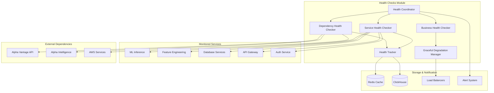

# Health Checks Module Specification

## Module Overview

The Health Checks Module provides comprehensive service health monitoring and availability checking across all system components. It implements sophisticated health check mechanisms that go beyond simple ping tests to validate actual service functionality, dependencies, and business logic integrity.

## Core Responsibilities

- **Service Health Validation**: Comprehensive health checks for all system services
- **Dependency Chain Monitoring**: Track health of service dependencies
- **Business Logic Validation**: Ensure core business functions are operational
- **Load Balancer Integration**: Provide health status for traffic routing decisions
- **Graceful Degradation Management**: Coordinate service degradation modes
- **Health History Tracking**: Maintain historical health data for analysis

## Architecture Diagram



## Data Inputs

### Service Health Check Request
```json
{
  "health_check_request": {
    "service_name": "ml-inference",
    "instance_id": "ml-inference-001",
    "check_type": "comprehensive",
    "timeout_seconds": 30,
    "include_dependencies": true,
    "validate_business_logic": true,
    "requested_by": "health-coordinator",
    "timestamp": "2025-07-26T10:30:00Z"
  }
}
```

### Dependency Status Update
```json
{
  "dependency_status": {
    "dependency_name": "alpha_vantage_api",
    "endpoint": "https://www.alphavantage.co/query",
    "status": "healthy",
    "response_time_ms": 234,
    "last_successful_call": "2025-07-26T10:29:45Z",
    "error_count_last_hour": 0,
    "rate_limit_remaining": 950,
    "data_freshness_minutes": 2
  }
}
```

### Business Logic Validation Request
```json
{
  "business_validation_request": {
    "validation_type": "end_to_end_prediction",
    "test_symbol": "AAPL",
    "expected_max_duration_ms": 1000,
    "validate_components": [
      "feature_engineering",
      "ml_inference", 
      "risk_management",
      "explanation_service"
    ],
    "test_data": {
      "symbol": "AAPL",
      "prediction_horizon": 60,
      "current_price": 182.50
    }
  }
}
```

## Data Outputs

### Comprehensive Health Status
```json
{
  "health_status": {
    "service_name": "ml-inference",
    "instance_id": "ml-inference-001",
    "timestamp": "2025-07-26T10:30:00Z",
    "overall_status": "healthy",
    "status_details": {
      "service_health": "healthy",
      "dependency_health": "healthy", 
      "business_logic_health": "healthy"
    },
    "checks_performed": {
      "basic_connectivity": {
        "status": "passed",
        "response_time_ms": 12,
        "details": "HTTP 200 response received"
      },
      "database_connectivity": {
        "status": "passed",
        "response_time_ms": 8,
        "details": "ClickHouse and Redis connections verified"
      },
      "model_availability": {
        "status": "passed",
        "response_time_ms": 45,
        "details": "All required models loaded and responding"
      },
      "feature_service_dependency": {
        "status": "passed",
        "response_time_ms": 23,
        "details": "Feature engineering service responding normally"
      },
      "prediction_pipeline": {
        "status": "passed",
        "response_time_ms": 156,
        "details": "End-to-end prediction completed successfully"
      }
    },
    "resource_status": {
      "cpu_usage_percent": 67.5,
      "memory_usage_percent": 72.1,
      "disk_space_available_gb": 45.2,
      "open_connections": 23,
      "thread_pool_utilization": 0.34
    },
    "performance_metrics": {
      "avg_response_time_ms": 18,
      "requests_per_second": 23.4,
      "error_rate_percent": 0.08,
      "success_rate_percent": 99.92
    },
    "degradation_status": {
      "current_mode": "normal",
      "available_modes": ["normal", "limited", "maintenance"],
      "auto_degradation_enabled": true
    },
    "next_check_scheduled": "2025-07-26T10:31:00Z"
  }
}
```

### Dependency Health Summary
```json
{
  "dependency_health": {
    "timestamp": "2025-07-26T10:30:00Z",
    "overall_dependency_health": "healthy",
    "dependencies": [
      {
        "name": "alpha_vantage_api",
        "type": "external_api",
        "status": "healthy",
        "response_time_ms": 234,
        "availability_percent": 99.8,
        "rate_limit_status": "normal",
        "last_error": null,
        "impact_on_service": "high"
      },
      {
        "name": "clickhouse_database",
        "type": "database",
        "status": "healthy",
        "response_time_ms": 8,
        "connection_pool_usage": 67,
        "query_success_rate": 99.95,
        "disk_usage_percent": 45,
        "impact_on_service": "critical"
      },
      {
        "name": "redis_cache",
        "type": "cache",
        "status": "healthy",
        "response_time_ms": 2,
        "hit_rate_percent": 89.3,
        "memory_usage_percent": 72,
        "eviction_rate": 0.02,
        "impact_on_service": "medium"
      }
    ],
    "dependency_chain_status": "all_healthy",
    "critical_path_dependencies": [
      "clickhouse_database",
      "feature_engineering_service"
    ],
    "risk_assessment": {
      "single_point_of_failure": false,
      "cascade_failure_risk": "low",
      "redundancy_available": true
    }
  }
}
```

### Business Health Validation Result
```json
{
  "business_health_result": {
    "validation_id": "biz_health_20250726_103000",
    "timestamp": "2025-07-26T10:30:00Z",
    "overall_business_health": "healthy",
    "validations_performed": [
      {
        "test_name": "end_to_end_prediction",
        "status": "passed",
        "duration_ms": 156,
        "details": {
          "prediction_generated": true,
          "prediction_id": "test_pred_20250726_103000",
          "confidence_score": 0.78,
          "risk_assessment_completed": true,
          "explanation_generated": true
        }
      },
      {
        "test_name": "data_freshness_validation",
        "status": "passed",
        "details": {
          "latest_market_data_age_minutes": 2,
          "latest_features_age_minutes": 1,
          "data_completeness_percent": 98.7
        }
      },
      {
        "test_name": "model_performance_validation",
        "status": "passed",
        "details": {
          "recent_accuracy": 0.742,
          "accuracy_trend": "stable",
          "model_drift_detected": false
        }
      }
    ],
    "business_kpis": {
      "prediction_success_rate": 99.92,
      "average_prediction_confidence": 0.678,
      "feature_availability": 98.7,
      "model_staleness_minutes": 0
    },
    "recommendations": [
      {
        "priority": "low",
        "category": "optimization",
        "description": "Consider refreshing feature cache more frequently",
        "impact": "minor performance improvement"
      }
    ]
  }
}
```

## Core Components

### 1. Health Coordinator
**Purpose**: Orchestrate all health checking activities across the system
**Technology**: Rust with async scheduling and coordination
**Key Functions**:
- Schedule and coordinate health checks
- Aggregate health status from multiple sources
- Manage health check priorities and frequencies
- Coordinate graceful degradation decisions

### 2. Service Health Checker
**Purpose**: Perform detailed health checks on individual services
**Technology**: Rust with HTTP clients and service discovery
**Key Functions**:
- Basic connectivity testing
- Resource utilization monitoring
- Performance metric validation
- Service-specific functionality testing

### 3. Dependency Health Checker
**Purpose**: Monitor health of external dependencies and service chains
**Technology**: Rust with external API clients
**Key Functions**:
- External API availability testing
- Database and cache connectivity
- Third-party service rate limit monitoring
- Dependency chain validation

### 4. Business Health Checker
**Purpose**: Validate end-to-end business functionality
**Technology**: Rust with business logic integration
**Key Functions**:
- End-to-end workflow testing
- Data quality validation
- Model performance verification
- Critical business KPI monitoring

### 5. Health Tracker
**Purpose**: Store and analyze health check results over time
**Technology**: Rust with time series data management
**Key Functions**:
- Historical health data storage
- Health trend analysis
- Availability reporting
- Health metric aggregation

## API Endpoints

### Internal APIs (Service-to-Service)

#### GET /api/v1/internal/health/status/{service_name}
**Purpose**: Get current health status for a specific service
**Input**: Service name and optional instance ID
**Output**: Comprehensive health status report

#### POST /api/v1/internal/health/check
**Purpose**: Trigger immediate health check for specified services
**Input**: Service list and check configuration
**Output**: Health check execution confirmation

#### GET /api/v1/internal/health/dependencies/{service_name}
**Purpose**: Get dependency health status for a service
**Input**: Service name
**Output**: Dependency health summary

#### POST /api/v1/internal/health/degradation
**Purpose**: Request service degradation mode change
**Input**: Service name, target degradation mode, reason
**Output**: Degradation request confirmation

### Public APIs (Health Check Endpoints for Load Balancers)

#### GET /health
**Purpose**: Basic liveness check for load balancer
**Input**: None
**Output**: Simple HTTP 200/503 status

#### GET /health/ready
**Purpose**: Readiness check including dependencies
**Input**: None
**Output**: HTTP 200/503 with readiness details

#### GET /health/deep
**Purpose**: Comprehensive health check including business logic
**Input**: None (authenticated requests only)
**Output**: Detailed health status

### Administrative APIs

#### GET /api/v1/admin/health/overview
**Purpose**: System-wide health overview
**Input**: Time range and service filters
**Output**: Comprehensive system health dashboard

#### POST /api/v1/admin/health/configure
**Purpose**: Configure health check settings
**Input**: Health check configuration
**Output**: Configuration update confirmation

#### GET /api/v1/admin/health/history
**Purpose**: Historical health data and trends
**Input**: Time range and service filters
**Output**: Health history and trend analysis

## Health Check Implementations

### 1. Basic Service Health Check
```rust
use reqwest::Client;
use std::time::{Duration, Instant};

pub struct ServiceHealthChecker {
    http_client: Client,
    timeout: Duration,
}

impl ServiceHealthChecker {
    pub async fn check_service_health(
        &self,
        service_endpoint: &str,
    ) -> Result<ServiceHealthResult> {
        let start_time = Instant::now();
        
        // Basic connectivity check
        let connectivity_result = self.check_connectivity(service_endpoint).await?;
        
        // Resource utilization check
        let resource_result = self.check_resources(service_endpoint).await?;
        
        // Performance metrics check
        let performance_result = self.check_performance(service_endpoint).await?;
        
        let total_duration = start_time.elapsed();
        
        Ok(ServiceHealthResult {
            overall_status: self.determine_overall_status(&[
                &connectivity_result,
                &resource_result,
                &performance_result,
            ]),
            connectivity: connectivity_result,
            resources: resource_result,
            performance: performance_result,
            check_duration: total_duration,
            timestamp: Utc::now(),
        })
    }
    
    async fn check_connectivity(&self, endpoint: &str) -> Result<HealthCheckResult> {
        let start = Instant::now();
        
        match self.http_client
            .get(&format!("{}/health/basic", endpoint))
            .timeout(self.timeout)
            .send()
            .await
        {
            Ok(response) => {
                let status = if response.status().is_success() {
                    HealthStatus::Healthy
                } else {
                    HealthStatus::Unhealthy
                };
                
                Ok(HealthCheckResult {
                    status,
                    response_time: start.elapsed(),
                    details: format!("HTTP {}", response.status()),
                    error: None,
                })
            }
            Err(e) => Ok(HealthCheckResult {
                status: HealthStatus::Unhealthy,
                response_time: start.elapsed(),
                details: "Connection failed".to_string(),
                error: Some(e.to_string()),
            }),
        }
    }
}
```

### 2. Dependency Chain Health Check
```rust
pub struct DependencyHealthChecker {
    service_registry: ServiceRegistry,
    external_apis: HashMap<String, ExternalApiConfig>,
}

impl DependencyHealthChecker {
    pub async fn check_dependency_chain(
        &self,
        service_name: &str,
    ) -> Result<DependencyHealthResult> {
        let dependencies = self.service_registry
            .get_dependencies(service_name)
            .await?;
        
        let mut dependency_results = Vec::new();
        let mut overall_healthy = true;
        
        for dependency in dependencies {
            let health_result = match dependency.dependency_type {
                DependencyType::InternalService => {
                    self.check_internal_service(&dependency).await?
                }
                DependencyType::Database => {
                    self.check_database(&dependency).await?
                }
                DependencyType::ExternalApi => {
                    self.check_external_api(&dependency).await?
                }
                DependencyType::Cache => {
                    self.check_cache(&dependency).await?
                }
            };
            
            if health_result.status != HealthStatus::Healthy {
                overall_healthy = false;
            }
            
            dependency_results.push(DependencyResult {
                dependency: dependency.clone(),
                health: health_result,
            });
        }
        
        Ok(DependencyHealthResult {
            overall_status: if overall_healthy {
                HealthStatus::Healthy
            } else {
                HealthStatus::Degraded
            },
            dependencies: dependency_results,
            critical_path_healthy: self.check_critical_path(&dependency_results),
            timestamp: Utc::now(),
        })
    }
    
    async fn check_external_api(
        &self,
        dependency: &Dependency,
    ) -> Result<HealthCheckResult> {
        let api_config = self.external_apis
            .get(&dependency.name)
            .ok_or_else(|| HealthCheckError::ConfigurationMissing)?;
        
        let start = Instant::now();
        
        // Check API availability
        let response = self.http_client
            .get(&api_config.health_endpoint)
            .timeout(Duration::from_secs(10))
            .send()
            .await;
        
        match response {
            Ok(resp) if resp.status().is_success() => {
                // Additional checks for rate limits, data freshness, etc.
                let rate_limit_remaining = resp.headers()
                    .get("X-RateLimit-Remaining")
                    .and_then(|v| v.to_str().ok())
                    .and_then(|s| s.parse::<u32>().ok())
                    .unwrap_or(0);
                
                let status = if rate_limit_remaining > 10 {
                    HealthStatus::Healthy
                } else {
                    HealthStatus::Degraded
                };
                
                Ok(HealthCheckResult {
                    status,
                    response_time: start.elapsed(),
                    details: format!("Rate limit remaining: {}", rate_limit_remaining),
                    error: None,
                })
            }
            Ok(resp) => Ok(HealthCheckResult {
                status: HealthStatus::Unhealthy,
                response_time: start.elapsed(),
                details: format!("HTTP {}", resp.status()),
                error: None,
            }),
            Err(e) => Ok(HealthCheckResult {
                status: HealthStatus::Unhealthy,
                response_time: start.elapsed(),
                details: "API unreachable".to_string(),
                error: Some(e.to_string()),
            }),
        }
    }
}
```

### 3. Business Logic Health Validation
```rust
pub struct BusinessHealthChecker {
    prediction_service: PredictionServiceClient,
    feature_service: FeatureServiceClient,
    risk_service: RiskServiceClient,
}

impl BusinessHealthChecker {
    pub async fn validate_prediction_pipeline(
        &self,
        test_symbol: &str,
    ) -> Result<BusinessHealthResult> {
        let start_time = Instant::now();
        
        // Test end-to-end prediction flow
        let prediction_result = self.test_prediction_flow(test_symbol).await?;
        
        // Validate data freshness
        let data_freshness_result = self.validate_data_freshness(test_symbol).await?;
        
        // Check model performance
        let model_performance_result = self.check_model_performance().await?;
        
        let total_duration = start_time.elapsed();
        
        Ok(BusinessHealthResult {
            overall_status: self.determine_business_health(&[
                &prediction_result,
                &data_freshness_result,
                &model_performance_result,
            ]),
            prediction_pipeline: prediction_result,
            data_freshness: data_freshness_result,
            model_performance: model_performance_result,
            validation_duration: total_duration,
            timestamp: Utc::now(),
        })
    }
    
    async fn test_prediction_flow(&self, symbol: &str) -> Result<ValidationResult> {
        let start = Instant::now();
        
        // Create a test prediction request
        let prediction_request = PredictionRequest {
            symbol: symbol.to_string(),
            horizon_minutes: 60,
            include_explanation: true,
            features: FeatureSelection {
                technical_indicators: true,
                sentiment_data: true,
                news_sentiment: false,
            },
        };
        
        match self.prediction_service.predict(prediction_request).await {
            Ok(prediction_response) => {
                // Validate prediction response
                let is_valid = self.validate_prediction_response(&prediction_response);
                
                if is_valid {
                    Ok(ValidationResult {
                        status: HealthStatus::Healthy,
                        duration: start.elapsed(),
                        details: format!(
                            "Prediction generated with confidence: {:.2}",
                            prediction_response.prediction.confidence
                        ),
                        metrics: Some(json!({
                            "prediction_id": prediction_response.prediction_id,
                            "confidence": prediction_response.prediction.confidence,
                            "strategy_used": prediction_response.strategy.selected_strategy
                        })),
                        error: None,
                    })
                } else {
                    Ok(ValidationResult {
                        status: HealthStatus::Unhealthy,
                        duration: start.elapsed(),
                        details: "Invalid prediction response".to_string(),
                        metrics: None,
                        error: Some("Prediction validation failed".to_string()),
                    })
                }
            }
            Err(e) => Ok(ValidationResult {
                status: HealthStatus::Unhealthy,
                duration: start.elapsed(),
                details: "Prediction request failed".to_string(),
                metrics: None,
                error: Some(e.to_string()),
            }),
        }
    }
    
    fn validate_prediction_response(&self, response: &PredictionResponse) -> bool {
        // Validate prediction response structure and values
        response.prediction.confidence > 0.0 
            && response.prediction.confidence <= 1.0
            && response.prediction.target_price > 0.0
            && !response.prediction_id.is_empty()
            && response.explanation.top_features.len() > 0
    }
}
```

## Database Interactions

### ClickHouse Health History Storage

#### Health Check Results Table
```sql
CREATE TABLE health_check_results (
    timestamp DateTime64(3, 'UTC'),
    service_name LowCardinality(String),
    instance_id String,
    check_type LowCardinality(String),
    overall_status LowCardinality(String),
    connectivity_status LowCardinality(String),
    dependency_status LowCardinality(String),
    business_logic_status LowCardinality(String),
    response_time_ms UInt32,
    error_details String,
    resource_metrics Map(String, Float64),
    check_metadata String
) ENGINE = MergeTree()
PARTITION BY (service_name, toYYYYMM(timestamp))
ORDER BY (timestamp, service_name, instance_id)
SETTINGS index_granularity = 8192;
```

#### Service Availability Summary
```sql
CREATE MATERIALIZED VIEW service_availability_summary
ENGINE = AggregatingMergeTree()
PARTITION BY toYYYYMM(timestamp)
ORDER BY (service_name, timestamp)
AS SELECT
    service_name,
    toStartOfHour(timestamp) as timestamp,
    countIf(overall_status = 'healthy') as healthy_checks,
    countIf(overall_status = 'unhealthy') as unhealthy_checks,
    count(*) as total_checks,
    avg(response_time_ms) as avg_response_time,
    max(response_time_ms) as max_response_time
FROM health_check_results
GROUP BY service_name, toStartOfHour(timestamp);
```

### Redis Health Status Cache

#### Current Service Health
```
health:current:{service_name}:{instance_id} -> {
    "status": "healthy",
    "last_check": "2025-07-26T10:30:00Z",
    "response_time_ms": 18,
    "connectivity": "healthy",
    "dependencies": "healthy",
    "business_logic": "healthy",
    "next_check": "2025-07-26T10:31:00Z",
    "ttl": 120
}
```

#### Degradation Mode Status
```
health:degradation:{service_name} -> {
    "current_mode": "normal",
    "available_modes": ["normal", "limited", "maintenance"],
    "auto_degradation_enabled": true,
    "last_mode_change": "2025-07-25T14:22:00Z",
    "reason": "manual_maintenance",
    "ttl": 3600
}
```

## Integration Points

### With Load Balancers
- **Outbound**: Health status for traffic routing decisions
- **Protocol**: HTTP health check endpoints
- **Data Format**: HTTP status codes with optional JSON details

### With Performance Monitoring
- **Outbound**: Health check results and availability metrics
- **Protocol**: Metrics push via monitoring infrastructure
- **Data Format**: Time series metrics and events

### With Alert System
- **Outbound**: Health degradation alerts and notifications
- **Protocol**: Event-driven via message queue
- **Data Format**: Structured alert events with health context

### With Service Discovery
- **Inbound**: Service registry information for health checking
- **Protocol**: Service discovery API integration
- **Data Format**: Service metadata and endpoint information

## Performance Requirements

### Health Check Frequency
- **Basic Health Checks**: Every 30 seconds for critical services
- **Dependency Checks**: Every 60 seconds for external dependencies
- **Business Logic Validation**: Every 5 minutes for end-to-end tests
- **Deep Health Checks**: Every 15 minutes for comprehensive validation

### Response Time Targets
- **Basic Health Check**: < 100ms response time
- **Dependency Health Check**: < 500ms for all dependencies
- **Business Validation**: < 2 seconds for end-to-end tests
- **Health Status Query**: < 50ms for cached status

### Availability Requirements
- **Health Check Service Uptime**: 99.99% availability
- **Health Data Retention**: 90 days detailed, 1 year aggregated
- **Health Check Reliability**: 99.9% successful completion rate

## Configuration Management

### Health Check Configuration
```bash
# Health Check Intervals
HEALTH_CHECK_BASIC_INTERVAL=30s
HEALTH_CHECK_DEPENDENCY_INTERVAL=60s
HEALTH_CHECK_BUSINESS_INTERVAL=300s
HEALTH_CHECK_DEEP_INTERVAL=900s

# Timeouts
HEALTH_CHECK_TIMEOUT=30s
HEALTH_CHECK_DEPENDENCY_TIMEOUT=10s
HEALTH_CHECK_BUSINESS_TIMEOUT=120s

# Degradation Settings
AUTO_DEGRADATION_ENABLED=true
DEGRADATION_THRESHOLD_FAILURES=3
DEGRADATION_RECOVERY_THRESHOLD=5
```

### Service Health Check Definitions
```yaml
health_checks:
  ml-inference:
    endpoints:
      basic: "/health"
      ready: "/health/ready"
      deep: "/health/deep"
    dependencies:
      - name: "feature-engineering"
        type: "internal_service"
        critical: true
      - name: "clickhouse"
        type: "database"
        critical: true
      - name: "redis"
        type: "cache"
        critical: false
    business_validations:
      - name: "prediction_pipeline"
        test_symbol: "AAPL"
        max_duration_ms: 2000
        critical: true
    degradation_modes:
      - name: "limited"
        description: "Reduce prediction accuracy for better performance"
        triggers: ["high_error_rate", "slow_response"]
      - name: "maintenance"
        description: "Maintenance mode with minimal functionality"
        triggers: ["manual", "critical_failure"]
```

This Health Checks Module provides comprehensive service health monitoring that goes beyond basic availability checking to ensure the entire system is functioning correctly from both technical and business perspectives.