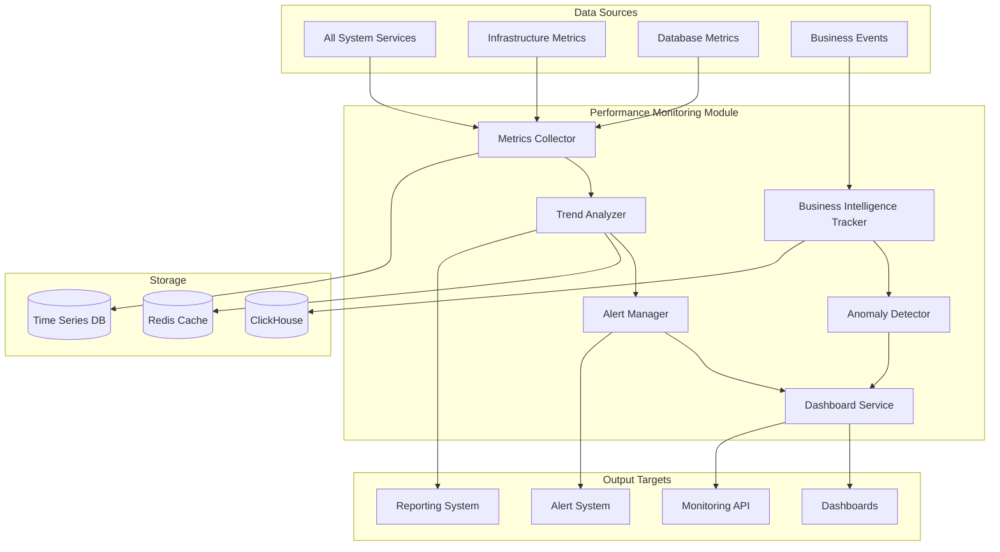

# Performance Monitoring Module Specification

## Module Overview

The Performance Monitoring Module provides comprehensive real-time monitoring, metrics collection, and performance analysis for the QuantumTrade AI system. It tracks system health, business metrics, and performance indicators across all components to ensure optimal operation and early detection of issues.

## Core Responsibilities

- **Real-time Metrics Collection**: Gather performance metrics from all system components
- **Business Intelligence Monitoring**: Track trading-specific KPIs and business metrics
- **Performance Trend Analysis**: Analyze performance trends and predict capacity needs
- **Alerting & Notifications**: Generate alerts based on threshold breaches and anomalies
- **Dashboard & Visualization**: Provide real-time dashboards for operations teams
- **SLA Monitoring**: Track and report on service level agreements

## Architecture Diagram



## Data Inputs

### System Metrics
```json
{
  "system_metrics": {
    "timestamp": "2025-07-26T10:30:00Z",
    "service_name": "ml-inference",
    "instance_id": "ml-inference-001",
    "metrics": {
      "cpu_usage_percent": 67.5,
      "memory_usage_percent": 72.1,
      "memory_usage_bytes": 2147483648,
      "disk_usage_percent": 45.2,
      "network_in_bytes_per_sec": 1048576,
      "network_out_bytes_per_sec": 2097152,
      "open_file_descriptors": 234,
      "thread_count": 16,
      "garbage_collection_time_ms": 23
    },
    "jvm_metrics": {
      "heap_used_bytes": 1073741824,
      "heap_committed_bytes": 1610612736,
      "non_heap_used_bytes": 134217728,
      "gc_collections_total": 145,
      "gc_time_total_ms": 2341
    }
  }
}
```

### Application Metrics
```json
{
  "application_metrics": {
    "timestamp": "2025-07-26T10:30:00Z",
    "service_name": "ml-inference",
    "metrics": {
      "requests_total": 15732,
      "requests_per_second": 23.4,
      "response_time_p50_ms": 18,
      "response_time_p95_ms": 45,
      "response_time_p99_ms": 127,
      "error_rate_percent": 0.12,
      "active_connections": 45,
      "queue_depth": 12,
      "cache_hit_rate_percent": 89.3,
      "predictions_generated": 1247,
      "model_inference_time_p95_ms": 12,
      "feature_fetch_time_p95_ms": 3
    }
  }
}
```

### Business Metrics
```json
{
  "business_metrics": {
    "timestamp": "2025-07-26T10:30:00Z",
    "metrics": {
      "active_users": 234,
      "predictions_generated": 1247,
      "prediction_accuracy": 0.742,
      "average_confidence_score": 0.678,
      "successful_trades": 89,
      "profitable_trades_percent": 67.4,
      "average_profit_per_trade": 127.45,
      "total_trading_volume": 2847293.50,
      "unique_symbols_traded": 127,
      "api_usage_by_tier": {
        "free": 234,
        "basic": 567,
        "premium": 890,
        "enterprise": 123
      }
    }
  }
}
```

### Database Performance Metrics
```json
{
  "database_metrics": {
    "timestamp": "2025-07-26T10:30:00Z",
    "database_type": "clickhouse",
    "instance": "clickhouse-main",
    "metrics": {
      "queries_per_second": 45.2,
      "avg_query_duration_ms": 23.4,
      "slow_queries_count": 3,
      "connection_pool_usage": 67,
      "cache_hit_ratio": 0.91,
      "disk_io_read_bytes_per_sec": 1048576,
      "disk_io_write_bytes_per_sec": 524288,
      "active_connections": 23,
      "waiting_connections": 2,
      "table_sizes": {
        "market_data": 12847293847,
        "predictions": 2847293847,
        "features": 5847293847
      }
    }
  }
}
```

## Data Outputs

### Performance Dashboard Data
```json
{
  "dashboard_data": {
    "timestamp": "2025-07-26T10:30:00Z",
    "overall_system_health": "healthy",
    "system_overview": {
      "total_requests_per_minute": 1247,
      "average_response_time_ms": 23,
      "error_rate_percent": 0.08,
      "active_users": 234,
      "system_uptime_percent": 99.97
    },
    "service_health": [
      {
        "service_name": "ml-inference",
        "status": "healthy",
        "cpu_usage": 67.5,
        "memory_usage": 72.1,
        "response_time_p95": 45,
        "error_rate": 0.12,
        "instances": 3,
        "healthy_instances": 3
      },
      {
        "service_name": "feature-engineering",
        "status": "warning",
        "cpu_usage": 87.3,
        "memory_usage": 91.2,
        "response_time_p95": 234,
        "error_rate": 0.45,
        "instances": 2,
        "healthy_instances": 2
      }
    ],
    "business_metrics": {
      "prediction_accuracy": 0.742,
      "daily_predictions": 18473,
      "active_strategies": 12,
      "profitable_trades_percent": 67.4
    },
    "alerts": [
      {
        "id": "alert_001",
        "severity": "warning",
        "service": "feature-engineering",
        "message": "High CPU usage detected",
        "timestamp": "2025-07-26T10:25:00Z"
      }
    ]
  }
}
```

### Performance Report
```json
{
  "performance_report": {
    "report_id": "perf_report_20250726",
    "time_range": {
      "start": "2025-07-19T00:00:00Z",
      "end": "2025-07-26T23:59:59Z"
    },
    "executive_summary": {
      "overall_performance": "excellent",
      "availability_percent": 99.97,
      "average_response_time_ms": 21.4,
      "total_requests_processed": 12847293,
      "business_impact": "positive"
    },
    "service_performance": [
      {
        "service_name": "ml-inference",
        "availability": 99.98,
        "avg_response_time": 18.3,
        "error_rate": 0.08,
        "throughput_improvement": 12.4,
        "cost_efficiency": 89.2
      }
    ],
    "trends": {
      "response_time_trend": "improving",
      "error_rate_trend": "stable",
      "throughput_trend": "increasing",
      "resource_utilization_trend": "optimizing"
    },
    "recommendations": [
      {
        "priority": "high",
        "category": "scaling",
        "description": "Consider scaling feature-engineering service",
        "expected_impact": "20% response time improvement"
      }
    ]
  }
}
```

### Alert Notification
```json
{
  "alert": {
    "alert_id": "alert_7829",
    "timestamp": "2025-07-26T10:30:00Z",
    "severity": "critical",
    "service": "ml-inference",
    "metric": "error_rate",
    "current_value": 5.2,
    "threshold": 3.0,
    "message": "Error rate exceeded critical threshold",
    "description": "ML inference service error rate has been above 3% for 5 minutes",
    "suggested_actions": [
      "Check model serving health",
      "Verify feature service connectivity",
      "Review recent deployments"
    ],
    "runbook_url": "https://docs.quantumtrade.ai/runbooks/ml-inference-errors",
    "escalation_policy": "ml-team-oncall",
    "correlation_id": "incident_20250726_001"
  }
}
```

## Core Components

### 1. Metrics Collector
**Purpose**: Collect and aggregate metrics from all system components
**Technology**: Rust with Prometheus client libraries
**Key Functions**:
- Pull metrics from service endpoints
- Push metrics to time series database
- Metric aggregation and transformation
- Custom metric collection for business KPIs

### 2. Business Intelligence Tracker
**Purpose**: Track and analyze business-specific metrics
**Technology**: Rust with statistical analysis libraries
**Key Functions**:
- Trading performance analysis
- User behavior tracking
- Revenue and usage analytics
- Strategy effectiveness measurement

### 3. Trend Analyzer
**Purpose**: Analyze performance trends and predict future behavior
**Technology**: Rust with time series analysis
**Key Functions**:
- Time series decomposition
- Trend detection and forecasting
- Seasonal pattern analysis
- Capacity planning recommendations

### 4. Anomaly Detector
**Purpose**: Detect unusual patterns and performance anomalies
**Technology**: Rust with machine learning libraries
**Key Functions**:
- Statistical anomaly detection
- Machine learning-based pattern recognition
- Baseline establishment and drift detection
- Contextual anomaly analysis

### 5. Alert Manager
**Purpose**: Generate and manage alerts based on monitoring rules
**Technology**: Rust with notification services
**Key Functions**:
- Rule-based alerting
- Alert deduplication and grouping
- Escalation policy management
- Multi-channel notifications

## API Endpoints

### Internal APIs (Service-to-Service)

#### POST /api/v1/internal/monitoring/metrics
**Purpose**: Submit metrics from services
**Input**: Metric data with timestamps and labels
**Output**: Ingestion confirmation

#### GET /api/v1/internal/monitoring/health/{service_name}
**Purpose**: Get health status for a specific service
**Input**: Service name
**Output**: Health status and key metrics

#### POST /api/v1/internal/monitoring/events
**Purpose**: Submit business events for tracking
**Input**: Event data with context
**Output**: Event processing confirmation

#### GET /api/v1/internal/monitoring/alerts/{service_name}
**Purpose**: Get active alerts for a service
**Input**: Service name
**Output**: List of active alerts

### Public APIs (via API Gateway)

#### GET /api/v1/public/monitoring/dashboard
**Purpose**: Get dashboard data for authenticated users
**Input**: Dashboard type and time range
**Output**: Dashboard data appropriate for user role

#### GET /api/v1/public/monitoring/performance
**Purpose**: Get performance metrics for user's services
**Input**: Time range and metric filters
**Output**: Performance data scoped to user's access

### Administrative APIs

#### GET /api/v1/admin/monitoring/overview
**Purpose**: Get system-wide monitoring overview
**Input**: Time range and aggregation level
**Output**: Comprehensive system metrics

#### POST /api/v1/admin/monitoring/alerts/rules
**Purpose**: Create or update alerting rules
**Input**: Alert rule configuration
**Output**: Rule creation/update confirmation

#### GET /api/v1/admin/monitoring/capacity
**Purpose**: Get capacity planning recommendations
**Input**: Service filter and forecast period
**Output**: Capacity analysis and recommendations

## Database Interactions

### Time Series Database (Prometheus/InfluxDB)

#### System Metrics Storage
```sql
-- CPU usage time series
cpu_usage_percent{service="ml-inference",instance="ml-inference-001"} 67.5 1722076800000

-- Response time percentiles
http_request_duration_seconds_bucket{service="api-gateway",endpoint="/predict",le="0.1"} 1247 1722076800000

-- Business metrics
predictions_generated_total{strategy="momentum_transformer",success="true"} 1247 1722076800000
```

### ClickHouse Analytics Storage

#### Performance Events Table
```sql
CREATE TABLE performance_events (
    timestamp DateTime64(3, 'UTC'),
    service_name LowCardinality(String),
    instance_id String,
    event_type LowCardinality(String),
    metric_name LowCardinality(String),
    metric_value Float64,
    labels Map(String, String),
    duration_ms UInt32,
    user_id String,
    correlation_id String
) ENGINE = MergeTree()
PARTITION BY (service_name, toYYYYMM(timestamp))
ORDER BY (timestamp, service_name, event_type)
SETTINGS index_granularity = 8192;
```

#### Alert History Table
```sql
CREATE TABLE alert_history (
    alert_id String,
    timestamp DateTime64(3, 'UTC'),
    service_name LowCardinality(String),
    severity LowCardinality(String),
    metric_name LowCardinality(String),
    threshold_value Float64,
    actual_value Float64,
    status LowCardinality(String), -- 'firing', 'resolved'
    duration_minutes UInt32,
    acknowledged_by String,
    resolution_notes String
) ENGINE = MergeTree()
PARTITION BY toYYYYMM(timestamp)
ORDER BY (timestamp, service_name, severity)
SETTINGS index_granularity = 8192;
```

### Redis Caching

#### Real-time Metrics Cache
```
metrics:realtime:{service_name} -> {
    "cpu_usage": 67.5,
    "memory_usage": 72.1,
    "response_time_p95": 45,
    "error_rate": 0.12,
    "last_updated": "2025-07-26T10:30:00Z",
    "ttl": 60
}
```

#### Alert State Cache
```
alerts:active:{service_name} -> [
    {
        "alert_id": "alert_001",
        "severity": "warning",
        "metric": "cpu_usage",
        "threshold": 80.0,
        "current_value": 87.3,
        "duration": 300,
        "last_evaluation": "2025-07-26T10:30:00Z"
    }
]
```

## Monitoring Rules and Thresholds

### System Health Rules
```yaml
monitoring_rules:
  system_health:
    - name: "high_cpu_usage"
      expression: "cpu_usage_percent > 80"
      duration: "5m"
      severity: "warning"
      labels:
        category: "resource"
      annotations:
        summary: "High CPU usage detected"
        description: "CPU usage has been above 80% for 5 minutes"
    
    - name: "critical_cpu_usage"
      expression: "cpu_usage_percent > 95"
      duration: "1m"
      severity: "critical"
      labels:
        category: "resource"
      annotations:
        summary: "Critical CPU usage"
        description: "CPU usage is critically high"
    
    - name: "high_memory_usage"
      expression: "memory_usage_percent > 85"
      duration: "3m"
      severity: "warning"
      labels:
        category: "resource"
    
    - name: "slow_response_time"
      expression: "http_request_duration_p95 > 1000"
      duration: "2m"
      severity: "warning"
      labels:
        category: "performance"
    
    - name: "high_error_rate"
      expression: "error_rate_percent > 1"
      duration: "1m"
      severity: "critical"
      labels:
        category: "availability"
```

### Business Metrics Rules
```yaml
business_rules:
  trading_performance:
    - name: "low_prediction_accuracy"
      expression: "prediction_accuracy < 0.65"
      duration: "10m"
      severity: "warning"
      labels:
        category: "business"
      annotations:
        summary: "Prediction accuracy below threshold"
        description: "Model prediction accuracy has dropped below 65%"
    
    - name: "high_unprofitable_trades"
      expression: "profitable_trades_percent < 55"
      duration: "15m"
      severity: "warning"
      labels:
        category: "business"
    
    - name: "api_usage_spike"
      expression: "rate(api_requests_total[5m]) > 1000"
      duration: "2m"
      severity: "info"
      labels:
        category: "usage"
```

## Performance Analysis Algorithms

### 1. Trend Detection Algorithm
```rust
use std::collections::VecDeque;

pub struct TrendAnalyzer {
    window_size: usize,
    sensitivity: f64,
}

impl TrendAnalyzer {
    pub fn detect_trend(&self, data_points: &[f64]) -> TrendDirection {
        if data_points.len() < self.window_size {
            return TrendDirection::Insufficient;
        }
        
        let recent_avg = data_points[data_points.len() - self.window_size..]
            .iter().sum::<f64>() / self.window_size as f64;
        
        let earlier_avg = data_points[data_points.len() - 2 * self.window_size..data_points.len() - self.window_size]
            .iter().sum::<f64>() / self.window_size as f64;
        
        let change_percent = (recent_avg - earlier_avg) / earlier_avg;
        
        if change_percent > self.sensitivity {
            TrendDirection::Increasing
        } else if change_percent < -self.sensitivity {
            TrendDirection::Decreasing
        } else {
            TrendDirection::Stable
        }
    }
}

#[derive(Debug, PartialEq)]
pub enum TrendDirection {
    Increasing,
    Decreasing,
    Stable,
    Insufficient,
}
```

### 2. Anomaly Detection Algorithm
```rust
pub struct StatisticalAnomalyDetector {
    baseline_window: usize,
    sensitivity: f64,
}

impl StatisticalAnomalyDetector {
    pub fn detect_anomaly(&self, historical_data: &[f64], current_value: f64) -> AnomalyResult {
        if historical_data.len() < self.baseline_window {
            return AnomalyResult::InsufficientData;
        }
        
        let baseline = &historical_data[historical_data.len() - self.baseline_window..];
        let mean = baseline.iter().sum::<f64>() / baseline.len() as f64;
        let variance = baseline.iter()
            .map(|x| (x - mean).powi(2))
            .sum::<f64>() / baseline.len() as f64;
        let std_dev = variance.sqrt();
        
        let z_score = (current_value - mean) / std_dev;
        let threshold = self.sensitivity; // typically 2.0 or 3.0
        
        if z_score.abs() > threshold {
            AnomalyResult::Anomaly {
                severity: if z_score.abs() > threshold * 1.5 {
                    AnomalySeverity::High
                } else {
                    AnomalySeverity::Medium
                },
                z_score,
                expected_range: (mean - threshold * std_dev, mean + threshold * std_dev),
            }
        } else {
            AnomalyResult::Normal
        }
    }
}

#[derive(Debug)]
pub enum AnomalyResult {
    Normal,
    Anomaly {
        severity: AnomalySeverity,
        z_score: f64,
        expected_range: (f64, f64),
    },
    InsufficientData,
}

#[derive(Debug)]
pub enum AnomalySeverity {
    Low,
    Medium,
    High,
}
```

### 3. Capacity Planning Algorithm
```rust
pub struct CapacityPlanner {
    growth_model: LinearRegressionModel,
    safety_margin: f64,
}

impl CapacityPlanner {
    pub fn predict_capacity_needs(
        &mut self,
        historical_usage: &[(DateTime<Utc>, f64)],
        forecast_days: u32,
    ) -> CapacityForecast {
        // Train regression model on historical data
        let (timestamps, values): (Vec<_>, Vec<_>) = historical_usage
            .iter()
            .map(|(ts, val)| (ts.timestamp() as f64, *val))
            .unzip();
        
        self.growth_model.fit(&timestamps, &values);
        
        // Predict future usage
        let current_time = Utc::now().timestamp() as f64;
        let forecast_time = current_time + (forecast_days as f64 * 24.0 * 3600.0);
        let predicted_usage = self.growth_model.predict(forecast_time);
        
        // Apply safety margin
        let recommended_capacity = predicted_usage * (1.0 + self.safety_margin);
        
        CapacityForecast {
            predicted_usage,
            recommended_capacity,
            confidence_interval: self.calculate_confidence_interval(&values),
            scaling_recommendation: self.generate_scaling_recommendation(
                predicted_usage,
                recommended_capacity,
            ),
        }
    }
}

#[derive(Debug)]
pub struct CapacityForecast {
    pub predicted_usage: f64,
    pub recommended_capacity: f64,
    pub confidence_interval: (f64, f64),
    pub scaling_recommendation: ScalingRecommendation,
}

#[derive(Debug)]
pub enum ScalingRecommendation {
    NoAction,
    ScaleUp { factor: f64, urgency: Urgency },
    ScaleDown { factor: f64, savings_potential: f64 },
}
```

## Integration Points

### With All System Services
- **Inbound**: Metrics, logs, and health status from all services
- **Protocol**: HTTP endpoints for metrics scraping + push notifications
- **Data Format**: Prometheus metrics format + structured JSON events

### With Alert System
- **Outbound**: Alert triggers and notifications
- **Protocol**: Event-driven via message queue
- **Data Format**: Structured alert objects with context

### With API Gateway
- **Inbound**: Request/response metrics and tracing data
- **Protocol**: Distributed tracing integration
- **Data Format**: OpenTelemetry traces and spans

### With Infrastructure Management
- **Inbound**: Infrastructure metrics from AWS CloudWatch
- **Protocol**: AWS CloudWatch API
- **Data Format**: CloudWatch metrics and logs

## Performance Requirements

### Metrics Collection
- **Collection Interval**: 15-second intervals for critical metrics
- **Ingestion Latency**: < 10 seconds from generation to storage
- **Query Performance**: < 2 seconds for dashboard queries
- **Data Retention**: 1 year for detailed metrics, 3 years for aggregated

### Alerting Performance
- **Alert Evaluation**: Every 30 seconds for critical rules
- **Notification Latency**: < 30 seconds from threshold breach
- **Alert Deduplication**: 95% effectiveness in reducing noise
- **False Positive Rate**: < 5% for critical alerts

### Dashboard Performance
- **Load Time**: < 3 seconds for standard dashboards
- **Real-time Updates**: 5-second refresh for critical metrics
- **Concurrent Users**: Support 100 concurrent dashboard users
- **Data Point Capacity**: 1M metrics per second ingestion

## Configuration Management

### Monitoring Configuration
```bash
# Metrics Collection
MONITORING_SCRAPE_INTERVAL=15s
MONITORING_RETENTION_DAYS=365
MONITORING_BATCH_SIZE=1000
MONITORING_COMPRESSION_ENABLED=true

# Alerting
ALERT_EVALUATION_INTERVAL=30s
ALERT_NOTIFICATION_TIMEOUT=30s
ALERT_MAX_RETRIES=3
ALERT_DEDUPLICATION_WINDOW=300s

# Performance
MONITORING_QUERY_TIMEOUT=30s
MONITORING_CACHE_TTL=300s
MONITORING_MAX_CONCURRENT_QUERIES=50
```

### Service Discovery Configuration
```yaml
service_discovery:
  consul:
    enabled: true
    refresh_interval: "30s"
  kubernetes:
    enabled: false
  static:
    services:
      - name: "ml-inference"
        endpoints:
          - "http://ml-inference-001:8080/metrics"
          - "http://ml-inference-002:8080/metrics"
        labels:
          team: "ml"
          tier: "critical"
```

This Performance Monitoring Module provides comprehensive visibility into system performance and business metrics while enabling proactive issue detection and resolution through sophisticated alerting and analysis capabilities.