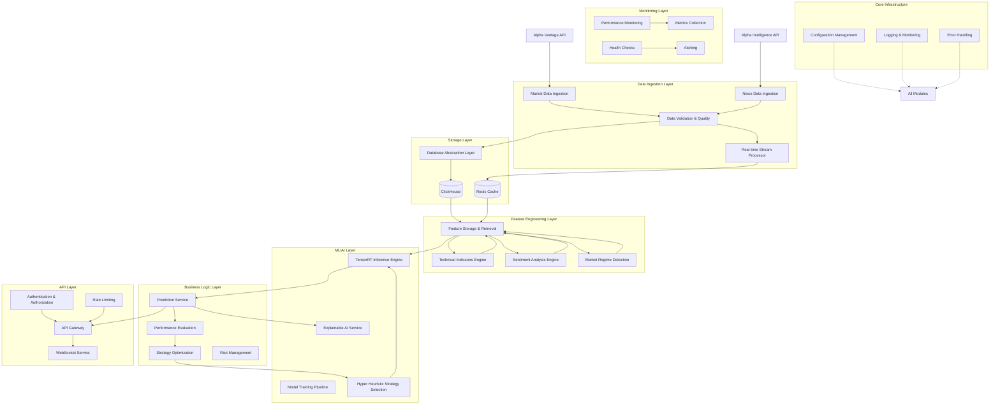

# QuantumTrade AI - Complete Modular System Architecture

## System Overview

QuantumTrade AI is designed as a highly modular, microservices-based financial forecasting system. Each module operates independently with well-defined interfaces, enabling independent development, testing, deployment, and scaling.

## High-Level Architecture Diagram

## Module Categories

### 1. **Core Infrastructure Modules**
- **Database Abstraction Layer**: Unified interface to ClickHouse and Redis
- **Configuration Management**: Centralized configuration with environment-specific settings
- **Logging & Monitoring**: Structured logging and distributed tracing
- **Error Handling**: Standardized error types and handling across all modules

### 2. **Data Ingestion Modules**
- **Market Data Ingestion**: Alpha Vantage market data collection and processing
- **News Data Ingestion**: Alpha Intelligence news data collection and processing
- **Data Validation & Quality**: Data quality checks, deduplication, and validation
- **Real-time Stream Processor**: Kinesis-based real-time data processing

### 3. **Feature Engineering Modules**
- **Technical Indicators Engine**: Modular technical indicator calculations
- **Sentiment Analysis Engine**: News and market sentiment analysis
- **Market Regime Detection**: Market condition and regime identification
- **Feature Storage & Retrieval**: Efficient feature caching and retrieval

### 4. **ML/AI Modules**
- **Model Training Pipeline**: PyTorch-based model training and optimization
- **TensorRT Inference Engine**: High-performance GPU-accelerated inference
- **Hyper Heuristic Strategy Selection**: Automated strategy selection and optimization
- **Explainable AI Service**: SHAP/LIME-based model explanations

### 5. **Business Logic Modules**
- **Prediction Service**: Core prediction logic and orchestration
- **Performance Evaluation**: Prediction accuracy tracking and evaluation
- **Strategy Optimization**: Real-time strategy parameter optimization
- **Risk Management**: Risk assessment and position sizing

### 6. **API Layer Modules**
- **API Gateway**: Request routing, transformation, and orchestration
- **WebSocket Service**: Real-time data streaming to clients
- **Authentication & Authorization**: JWT-based auth with role-based access
- **Rate Limiting**: API rate limiting and quota management

### 7. **Monitoring & Operations Modules**
- **Performance Monitoring**: System and business metric monitoring
- **Health Checks**: Service health monitoring and status reporting
- **Metrics Collection**: Custom metrics aggregation and reporting
- **Alerting**: Automated alerting based on thresholds and conditions

## Key Data Flows

### Primary Prediction Flow
1. **Market Data** → Data Ingestion → Feature Engineering → ML Inference → Prediction Service → API Gateway
2. **News Data** → Sentiment Analysis → Feature Engineering → ML Inference
3. **Performance Feedback** → Performance Evaluation → Strategy Optimization → Hyper Heuristic

### Real-time Flow
1. **Live Market Data** → Stream Processor → Redis → Feature Engine → WebSocket Service
2. **Real-time Predictions** → WebSocket Service → Client Applications

### Training Flow
1. **Historical Data** → Feature Engineering → Model Training Pipeline → TensorRT Models → Inference Engine

## Inter-Module Communication

### Synchronous Communication (REST APIs)
- Prediction requests and responses
- Feature retrieval and calculation
- Strategy selection and optimization
- Model serving and inference

### Asynchronous Communication (Events/Queues)
- Real-time data ingestion
- Performance feedback loops
- Model retraining triggers
- Alert notifications

### Data Storage Communication
- **ClickHouse**: Time series data, predictions, performance metrics
- **Redis**: Real-time features, session data, caching

## Scalability Design

### Horizontal Scaling
- All modules designed as stateless microservices
- Load balancing across multiple instances
- Database read replicas for query scaling

### Vertical Scaling
- GPU acceleration for ML inference
- Memory optimization for feature engineering
- CPU optimization for technical indicators

### Data Partitioning
- Time-based partitioning in ClickHouse
- Symbol-based sharding for Redis
- Model versioning for A/B testing

## Security Architecture

### Authentication Flow
1. Client → API Gateway → Authentication Service → JWT Token
2. Service-to-service communication via API keys
3. Database access via IAM roles

### Data Security
- Encryption at rest and in transit
- API rate limiting and DDoS protection
- Audit logging for all operations

## Deployment Architecture

### Container Orchestration
- Docker containers for all services
- ECS Fargate for CPU workloads
- EC2 with GPU for ML inference

### Infrastructure as Code
- Terraform for AWS infrastructure
- Environment-specific configurations
- Automated CI/CD pipelines

### Monitoring and Observability
- Distributed tracing with AWS X-Ray
- Centralized logging with CloudWatch
- Custom metrics and dashboards

## Development Guidelines

### Module Independence
- Each module has its own repository/directory
- Clearly defined API contracts
- Independent testing and deployment
- Versioned interfaces

### Data Contracts
- Standardized data formats across modules
- Schema evolution support
- Backward compatibility requirements
- API versioning strategy

### Performance Requirements
- Sub-20ms prediction latency
- 99.9% availability target
- Auto-scaling based on demand
- Efficient resource utilization

This modular architecture ensures that each component can be developed, tested, and deployed independently while maintaining system cohesion and performance requirements.