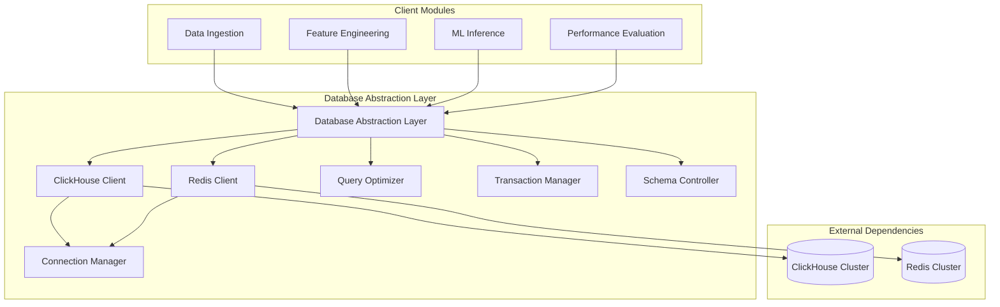

# Database Abstraction Layer (DAL) Module Specification

## Module Overview

The Database Abstraction Layer provides a unified, high-performance interface to both ClickHouse (time series data) and Redis (caching/real-time data). This module encapsulates all database operations, connection management, and query optimization.

## Module Architecture



## Core Responsibilities

### Primary Functions
1. **Unified Data Access**: Single interface for all database operations
2. **Connection Management**: Efficient connection pooling and health monitoring
3. **Query Optimization**: Automatic query optimization for time series data
4. **Schema Management**: Database schema creation, migration, and versioning
5. **Transaction Management**: ACID compliance where applicable
6. **Performance Monitoring**: Query performance tracking and optimization
7. **Error Handling**: Standardized error handling and retry logic
8. **Data Validation**: Input validation and sanitization

## Data Interfaces

### Input Data Structures
```rust
// Market data for time series storage
pub struct MarketDataBatch {
    pub records: Vec<MarketData>,
    pub source: String,
    pub timestamp: DateTime<Utc>,
}

// Feature data for ML processing
pub struct FeatureBatch {
    pub symbol: String,
    pub features: HashMap<String, f64>,
    pub metadata: HashMap<String, String>,
    pub version: u16,
}

// Prediction data for performance tracking
pub struct PredictionBatch {
    pub predictions: Vec<PredictionRecord>,
    pub model_version: String,
    pub strategy: String,
}

// Query parameters for data retrieval
pub struct QueryParams {
    pub symbol: Option<String>,
    pub start_time: Option<DateTime<Utc>>,
    pub end_time: Option<DateTime<Utc>>,
    pub limit: Option<u32>,
    pub filters: HashMap<String, String>,
}
```

### Output Data Structures
```rust
// Query results with metadata
pub struct QueryResult<T> {
    pub data: Vec<T>,
    pub total_count: u64,
    pub execution_time_ms: u64,
    pub cache_hit: bool,
}

// Batch operation results
pub struct BatchResult {
    pub inserted_count: u64,
    pub updated_count: u64,
    pub failed_count: u64,
    pub execution_time_ms: u64,
    pub errors: Vec<String>,
}

// Performance metrics
pub struct DatabaseMetrics {
    pub query_latency_p95: u64,
    pub query_latency_p99: u64,
    pub connection_count: u32,
    pub cache_hit_rate: f64,
    pub error_rate: f64,
}
```

## API Interface

### Core Database Operations
```rust
pub trait DatabaseAbstraction {
    // Market Data Operations
    async fn insert_market_data(&self, data: MarketDataBatch) -> Result<BatchResult>;
    async fn get_market_data(&self, params: QueryParams) -> Result<QueryResult<MarketData>>;
    async fn get_latest_market_data(&self, symbol: &str, limit: u32) -> Result<QueryResult<MarketData>>;
    
    // Feature Operations
    async fn insert_features(&self, features: FeatureBatch) -> Result<BatchResult>;
    async fn get_features(&self, params: QueryParams) -> Result<QueryResult<FeatureSet>>;
    async fn get_latest_features(&self, symbol: &str) -> Result<Option<FeatureSet>>;
    
    // Prediction Operations
    async fn insert_predictions(&self, predictions: PredictionBatch) -> Result<BatchResult>;
    async fn get_prediction(&self, prediction_id: &str) -> Result<Option<PredictionRecord>>;
    async fn get_predictions_for_evaluation(&self, horizon_minutes: u16) -> Result<QueryResult<PredictionRecord>>;
    
    // Cache Operations (Redis)
    async fn cache_set<T: Serialize>(&self, key: &str, value: T, ttl_seconds: u64) -> Result<()>;
    async fn cache_get<T: DeserializeOwned>(&self, key: &str) -> Result<Option<T>>;
    async fn cache_delete(&self, key: &str) -> Result<bool>;
    async fn cache_exists(&self, key: &str) -> Result<bool>;
    
    // Analytics Operations
    async fn get_aggregated_data(&self, params: AggregationParams) -> Result<QueryResult<AggregatedData>>;
    async fn get_performance_metrics(&self) -> Result<DatabaseMetrics>;
    
    // Schema Operations
    async fn initialize_schema(&self) -> Result<()>;
    async fn migrate_schema(&self, version: u32) -> Result<()>;
    async fn validate_schema(&self) -> Result<bool>;
}
```

## Database Schema Definitions

### ClickHouse Tables
```sql
-- Market data with optimized partitioning
CREATE TABLE market_data (
    symbol LowCardinality(String),
    timestamp DateTime64(3, 'UTC'),
    open Decimal64(8),
    high Decimal64(8),
    low Decimal64(8),
    close Decimal64(8),
    volume UInt64,
    adjusted_close Decimal64(8),
    source LowCardinality(String),
    quality_score UInt8
) ENGINE = MergeTree()
PARTITION BY (toYYYYMM(timestamp), symbol)
ORDER BY (symbol, timestamp)
SETTINGS index_granularity = 8192;

-- News sentiment data
CREATE TABLE sentiment_data (
    symbol LowCardinality(String),
    timestamp DateTime64(3, 'UTC'),
    source LowCardinality(String),
    sentiment_score Float32,
    confidence Float32,
    headline String,
    content_hash UInt64,
    relevance_score Float32
) ENGINE = ReplacingMergeTree(content_hash)
PARTITION BY (source, toYYYYMM(timestamp))
ORDER BY (symbol, timestamp)
SETTINGS index_granularity = 8192;

-- Technical indicators and features
CREATE TABLE features (
    symbol LowCardinality(String),
    timestamp DateTime64(3, 'UTC'),
    feature_name LowCardinality(String),
    feature_value Float64,
    feature_metadata String,
    feature_version UInt16,
    calculation_time_ms UInt32
) ENGINE = MergeTree()
PARTITION BY (feature_name, toYYYYMM(timestamp))
ORDER BY (symbol, feature_name, timestamp)
SETTINGS index_granularity = 8192;

-- ML predictions with strategy information
CREATE TABLE predictions (
    prediction_id String,
    symbol LowCardinality(String),
    timestamp DateTime64(3, 'UTC'),
    model_version LowCardinality(String),
    strategy_name LowCardinality(String),
    prediction_horizon UInt16,
    predicted_price Decimal64(8),
    confidence Float32,
    market_regime LowCardinality(String),
    features_used Array(String),
    model_latency_ms UInt16,
    strategy_parameters Map(String, Float64)
) ENGINE = MergeTree()
PARTITION BY (toYYYYMM(timestamp), model_version)
ORDER BY (symbol, timestamp, prediction_id)
SETTINGS index_granularity = 8192;

-- Performance tracking and outcomes
CREATE TABLE prediction_outcomes (
    prediction_id String,
    symbol LowCardinality(String),
    timestamp DateTime64(3, 'UTC'),
    actual_price Decimal64(8),
    predicted_price Decimal64(8),
    accuracy_score Float32,
    profit_loss Decimal64(8),
    strategy_name LowCardinality(String),
    market_regime LowCardinality(String),
    evaluation_timestamp DateTime64(3, 'UTC')
) ENGINE = MergeTree()
PARTITION BY toYYYYMM(timestamp)
ORDER BY (prediction_id, timestamp)
SETTINGS index_granularity = 8192;

-- Strategy performance metrics
CREATE TABLE strategy_performance (
    id UUID DEFAULT generateUUIDv4(),
    strategy_name LowCardinality(String),
    market_regime LowCardinality(String),
    timestamp DateTime64(3, 'UTC'),
    accuracy_rate Float32,
    profit_loss Decimal64(8),
    sharpe_ratio Float32,
    max_drawdown Float32,
    total_trades UInt32,
    win_rate Float32,
    parameters Map(String, Float64),
    market_conditions Map(String, Float64)
) ENGINE = MergeTree()
PARTITION BY (strategy_name, toYYYYMM(timestamp))
ORDER BY (strategy_name, market_regime, timestamp)
SETTINGS index_granularity = 8192;
```

### Redis Key Patterns
```redis
# Real-time features (TTL: 5 minutes)
features:{symbol}:latest -> FeatureSet JSON
features:{symbol}:{feature_name} -> Float64

# Market regime cache (TTL: 10 minutes)
regime:{symbol}:current -> MarketRegime JSON

# Strategy cache (TTL: 15 minutes)
strategy:{symbol}:selected -> SelectedStrategy JSON
strategy:{strategy_name}:performance -> StrategyMetrics JSON

# Prediction cache (TTL: 1 hour)
prediction:{prediction_id} -> PredictionRecord JSON

# Session and auth cache (TTL: 1 hour)
session:{user_id} -> SessionData JSON
auth:{token_hash} -> UserContext JSON

# Rate limiting (TTL: 1 minute sliding window)
rate_limit:{user_id}:{endpoint} -> RequestCount Int

# Real-time market data (TTL: 30 seconds)
market:{symbol}:latest -> MarketData JSON
market:{symbol}:stream -> List<MarketData>
```

## Configuration Requirements

### ClickHouse Configuration
```toml
[clickhouse]
url = "http://clickhouse-cluster:8123"
database = "quantumtrade"
username = "app_user"
password = "${CLICKHOUSE_PASSWORD}"
connection_timeout = 30
request_timeout = 120
max_connections = 20
compression = true
max_insert_block_size = 100000
max_query_size = 262144

[clickhouse.retry]
max_attempts = 3
initial_delay_ms = 100
max_delay_ms = 5000
backoff_multiplier = 2.0
```

### Redis Configuration
```toml
[redis]
url = "redis://redis-cluster:6379"
database = 0
password = "${REDIS_PASSWORD}"
connection_timeout = 5
command_timeout = 10
max_connections = 50
max_idle = 10
connection_lifetime = 300

[redis.cluster]
enabled = true
max_redirections = 3
retry_delay_ms = 100
```

## Performance Requirements

### Latency Targets
- **Point Queries**: < 5ms (95th percentile)
- **Range Queries**: < 50ms for 1 day of data
- **Batch Inserts**: < 100ms for 1000 records
- **Cache Operations**: < 1ms (99th percentile)

### Throughput Targets
- **Inserts**: 100,000 records/second sustained
- **Queries**: 10,000 queries/second
- **Cache Operations**: 1,000,000 operations/second

### Resource Utilization
- **Memory**: < 80% utilization under normal load
- **CPU**: < 70% utilization for query processing
- **Network**: Efficient compression and batching
- **Storage**: Automated cleanup and compression

## Error Handling Strategy

### Error Types
```rust
#[derive(Error, Debug)]
pub enum DatabaseError {
    #[error("Connection failed: {message}")]
    ConnectionError { message: String },
    
    #[error("Query execution failed: {query} - {error}")]
    QueryError { query: String, error: String },
    
    #[error("Data validation failed: {field} - {reason}")]
    ValidationError { field: String, reason: String },
    
    #[error("Schema migration failed: version {version}")]
    MigrationError { version: u32 },
    
    #[error("Cache operation failed: {operation}")]
    CacheError { operation: String },
    
    #[error("Timeout exceeded: {operation} took {duration_ms}ms")]
    TimeoutError { operation: String, duration_ms: u64 },
}
```

### Retry Logic
- **Connection Errors**: Exponential backoff with circuit breaker
- **Query Timeouts**: Automatic retry with query optimization
- **Cache Misses**: Fallback to primary database
- **Network Issues**: Automatic failover to backup instances

## Monitoring and Observability

### Key Metrics
- Query execution times (p50, p95, p99)
- Connection pool utilization
- Cache hit/miss rates
- Error rates by operation type
- Data ingestion rates
- Storage utilization

### Health Checks
```rust
pub struct HealthStatus {
    pub clickhouse_healthy: bool,
    pub redis_healthy: bool,
    pub schema_version: u32,
    pub connection_count: u32,
    pub last_successful_query: DateTime<Utc>,
}
```

### Logging Requirements
- Structured JSON logging
- Query execution logging with performance metrics
- Error logging with full context
- Audit logging for data modifications
- Debug logging for troubleshooting

## Dependencies

### External Dependencies
- **ClickHouse**: Primary time series database
- **Redis**: Caching and real-time data storage
- **AWS Secrets Manager**: Database credentials
- **CloudWatch**: Metrics and logging

### Internal Dependencies
- **Configuration Management**: Environment-specific settings
- **Logging Module**: Structured logging interface
- **Error Handling Module**: Standardized error types
- **Monitoring Module**: Metrics collection interface

## Deployment Considerations

### Container Configuration
- Multi-stage Docker builds for optimization
- Health check endpoints for orchestration
- Graceful shutdown handling
- Resource limits and requests

### Scaling Strategy
- Read replicas for query scaling
- Connection pooling optimization
- Query result caching
- Database sharding by symbol/time

### Backup and Recovery
- Automated daily backups to S3
- Point-in-time recovery capability
- Cross-region backup replication
- Automated restore testing

## Testing Strategy

### Unit Testing
- Mock database responses for unit tests
- Connection failure simulation
- Query optimization validation
- Error handling verification

### Integration Testing
- Real database integration tests
- Performance benchmark tests
- Load testing with realistic data volumes
- Failover and recovery testing

### Performance Testing
- Query performance regression tests
- Connection pool stress testing
- Cache performance validation
- Memory leak detection

This Database Abstraction Layer serves as the foundation for all data operations in the QuantumTrade AI system, providing reliable, high-performance, and scalable data access patterns.