# Explainable AI Service Module Specification

## Module Overview

The Explainable AI Service provides comprehensive model interpretability, prediction explanations, and transparency features for the QuantumTrade AI system. It implements advanced explainability techniques including SHAP, LIME, Integrated Gradients, and custom financial domain explanations to ensure all trading decisions are interpretable, auditable, and compliant with regulatory requirements.

## Module Architecture

```mermaid
graph TB
    subgraph "Explainable AI Service"
        EAS[Explainable AI Service]
        SE[SHAP Explainer]
        LE[LIME Explainer]
        IGE[Integrated Gradients Explainer]
        FE[Feature Attribution Engine]
        CE[Counterfactual Explainer]
        VE[Visualization Engine]
        EG[Explanation Generator]
        EA[Explanation Aggregator]
    end
    
    subgraph "Explanation Methods"
        SHAP[SHAP Values]
        LIME[Local Interpretable Explanations]
        IG[Integrated Gradients]
        GRAD[Gradient-based Methods]
        PERM[Permutation Importance]
        COUN[Counterfactual Analysis]
    end
    
    subgraph "Input Sources"
        TIE[TensorRT Inference Engine]
        FSR[Feature Storage & Retrieval]
        PS[Prediction Service]
        MTP[Model Training Pipeline]
    end
    
    subgraph "Output Targets"
        API[API Gateway]
        DASH[Dashboard]
        REP[Reporting System]
        AUD[Audit Trail]
    end
    
    EAS --> SE
    EAS --> LE
    EAS --> IGE
    EAS --> FE
    EAS --> CE
    EAS --> VE
    EAS --> EG
    EAS --> EA
    
    SE --> SHAP
    LE --> LIME
    IGE --> IG
    FE --> GRAD
    FE --> PERM
    CE --> COUN
    
    TIE --> FE
    FSR --> SE
    PS --> EG
    MTP --> IGE
    
    EA --> API
    VE --> DASH
    EG --> REP
    EA --> AUD
```



## Core Responsibilities

### Primary Functions
1. **Model Explanation**: Generate comprehensive explanations for ML model predictions
2. **Feature Attribution**: Identify and quantify the contribution of each feature to predictions
3. **Counterfactual Analysis**: Provide "what-if" scenarios showing how changes affect outcomes
4. **Global Interpretability**: Explain overall model behavior and decision patterns
5. **Local Interpretability**: Explain individual prediction decisions
6. **Visualization Generation**: Create intuitive visual explanations for stakeholders
7. **Regulatory Compliance**: Ensure explanations meet regulatory transparency requirements
8. **Audit Trail**: Maintain detailed records of all explanations for compliance and debugging

## Explanation Types and Methods

### Explanation Categories
```rust
#[derive(Debug, Clone, Serialize, Deserialize)]
pub enum ExplanationType {
    FeatureAttribution {
        method: AttributionMethod,
        scope: AttributionScope,
    },
    Counterfactual {
        scenario_type: CounterfactualType,
        change_magnitude: f64,
    },
    Example {
        example_type: ExampleType,
        similarity_metric: String,
    },
    Rule {
        rule_type: RuleType,
        confidence_threshold: f64,
    },
    Gradient {
        gradient_method: GradientMethod,
        layer_attribution: bool,
    },
}

#[derive(Debug, Clone, Serialize, Deserialize)]
pub enum AttributionMethod {
    SHAP,
    LIME,
    IntegratedGradients,
    DeepLift,
    GradientShap,
    PermutationImportance,
    Custom(String),
}

#[derive(Debug, Clone, Serialize, Deserialize)]
pub enum AttributionScope {
    Local,    // Single prediction
    Global,   // Model-wide patterns
    Cohort,   // Group of similar instances
}

#[derive(Debug, Clone, Serialize, Deserialize)]
pub enum CounterfactualType {
    MinimalChange,      // Smallest change to flip prediction
    Realistic,          // Realistic alternative scenarios
    Optimal,            // Best possible outcome scenarios
    Worst,              // Worst case scenarios
    Custom(String),
}

#[derive(Debug, Clone, Serialize, Deserialize)]
pub enum ExampleType {
    SimilarInstances,   // Most similar training examples
    Prototypes,         // Representative examples
    Criticisms,         // Examples that don't fit the pattern
    Anchors,            // Rule-based explanations
}

#[derive(Debug, Clone, Serialize, Deserialize)]
pub enum RuleType {
    DecisionRules,      // If-then rules
    LinearRules,        // Linear combinations
    TreeRules,          // Decision tree paths
    LogicalRules,       // Logical expressions
}

#[derive(Debug, Clone, Serialize, Deserialize)]
pub enum GradientMethod {
    Vanilla,            // Standard gradients
    SmoothGrad,         // Noise-averaged gradients
    GuidedBackprop,     // Guided backpropagation
    GradCAM,            // Gradient-weighted Class Activation Mapping
}
```

### Data Structures
```rust
#[derive(Debug, Clone, Serialize, Deserialize)]
pub struct ExplanationRequest {
    pub request_id: String,
    pub prediction_id: String,
    pub explanation_types: Vec<ExplanationType>,
    pub feature_names: Vec<String>,
    pub include_visualizations: bool,
    pub include_counterfactuals: bool,
    pub confidence_level: f64,
    pub max_features: Option<usize>,
    pub audience: ExplanationAudience,
}

#[derive(Debug, Clone, Serialize, Deserialize)]
pub enum ExplanationAudience {
    TechnicalUser,      // Data scientists, developers
    BusinessUser,       // Traders, analysts
    Regulator,          // Compliance, auditors
    Executive,          // High-level decision makers
}

#[derive(Debug, Clone, Serialize, Deserialize)]
pub struct ExplanationResponse {
    pub request_id: String,
    pub prediction_id: String,
    pub explanations: Vec<Explanation>,
    pub summary: ExplanationSummary,
    pub visualizations: Vec<Visualization>,
    pub metadata: ExplanationMetadata,
}

#[derive(Debug, Clone, Serialize, Deserialize)]
pub struct Explanation {
    pub explanation_id: String,
    pub explanation_type: ExplanationType,
    pub feature_attributions: HashMap<String, FeatureAttribution>,
    pub counterfactuals: Vec<CounterfactualScenario>,
    pub confidence: f64,
    pub reasoning: String,
    pub supporting_evidence: Vec<Evidence>,
}

#[derive(Debug, Clone, Serialize, Deserialize)]
pub struct FeatureAttribution {
    pub feature_name: String,
    pub attribution_value: f64,
    pub relative_importance: f64,  // 0-1 scale
    pub confidence_interval: (f64, f64),
    pub statistical_significance: f64,
    pub direction: AttributionDirection,
    pub explanation_text: String,
}

#[derive(Debug, Clone, Serialize, Deserialize)]
pub enum AttributionDirection {
    Positive,   // Increases prediction
    Negative,   // Decreases prediction
    Neutral,    // No significant effect
}

#[derive(Debug, Clone, Serialize, Deserialize)]
pub struct CounterfactualScenario {
    pub scenario_id: String,
    pub scenario_name: String,
    pub feature_changes: HashMap<String, f64>,
    pub original_prediction: f64,
    pub counterfactual_prediction: f64,
    pub prediction_change: f64,
    pub plausibility_score: f64,
    pub narrative: String,
}

#[derive(Debug, Clone, Serialize, Deserialize)]
pub struct Evidence {
    pub evidence_type: EvidenceType,
    pub description: String,
    pub confidence: f64,
    pub supporting_data: Option<serde_json::Value>,
}

#[derive(Debug, Clone, Serialize, Deserialize)]
pub enum EvidenceType {
    HistoricalExample,
    StatisticalTest,
    DomainKnowledge,
    ModelBehavior,
    DataPattern,
}
```

## Core Implementation

### SHAP Explainer
```rust
pub struct SHAPExplainer {
    model_client: TensorRTInferenceClient,
    background_data: Arc<BackgroundDataset>,
    shap_config: SHAPConfig,
    feature_processor: FeatureProcessor,
}

#[derive(Debug, Clone)]
pub struct SHAPConfig {
    pub explainer_type: SHAPExplainerType,
    pub n_background_samples: usize,
    pub max_evaluations: usize,
    pub feature_perturbation: PerturbationMethod,
    pub coalition_sampling: CoalitionSampling,
}

#[derive(Debug, Clone)]
pub enum SHAPExplainerType {
    TreeExplainer,      // For tree-based models
    DeepExplainer,      // For deep learning models
    KernelExplainer,    // Model-agnostic
    LinearExplainer,    // For linear models
    ExactExplainer,     // For small feature spaces
}

#[derive(Debug, Clone)]
pub enum PerturbationMethod {
    Marginal,           // Replace with marginal distribution
    Conditional,        // Replace with conditional distribution
    Gaussian,           // Add Gaussian noise
    Uniform,            // Uniform random replacement
}

#[derive(Debug, Clone)]
pub enum CoalitionSampling {
    Random,             // Random feature coalitions
    Paired,             // Paired sampling
    Owen,               // Owen sampling
    Permutation,        // Permutation sampling
}

impl SHAPExplainer {
    pub async fn explain_prediction(
        &self,
        prediction_id: &str,
        input_features: &HashMap<String, f64>,
        feature_names: &[String],
    ) -> Result<SHAPExplanation, ExplanationError> {
        info!("Generating SHAP explanation for prediction: {}", prediction_id);
        
        // Prepare input data
        let processed_features = self.feature_processor
            .process_for_explanation(input_features, feature_names)?;
        
        // Generate SHAP values based on explainer type
        let shap_values = match self.shap_config.explainer_type {
            SHAPExplainerType::DeepExplainer => {
                self.deep_shap_explanation(&processed_features).await?
            },
            SHAPExplainerType::KernelExplainer => {
                self.kernel_shap_explanation(&processed_features).await?
            },
            SHAPExplainerType::LinearExplainer => {
                self.linear_shap_explanation(&processed_features).await?
            },
            _ => {
                return Err(ExplanationError::UnsupportedExplainerType {
                    explainer_type: format!("{:?}", self.shap_config.explainer_type),
                });
            }
        };
        
        // Calculate feature attributions
        let feature_attributions = self.calculate_feature_attributions(
            &shap_values,
            feature_names,
            input_features,
        )?;
        
        // Generate confidence intervals
        let confidence_intervals = self.calculate_confidence_intervals(
            &feature_attributions,
            &processed_features,
        ).await?;
        
        // Create explanation text
        let explanation_text = self.generate_shap_explanation_text(
            &feature_attributions,
            prediction_id,
        );
        
        Ok(SHAPExplanation {
            prediction_id: prediction_id.to_string(),
            shap_values: shap_values.clone(),
            feature_attributions,
            confidence_intervals,
            explanation_text,
            base_value: self.calculate_base_value(&shap_values),
            expected_value: self.background_data.get_expected_prediction(),
            method_metadata: SHAPMethodMetadata {
                explainer_type: self.shap_config.explainer_type.clone(),
                n_background_samples: self.shap_config.n_background_samples,
                n_evaluations: shap_values.len(),
                computation_time_ms: 0, // Would be tracked in real implementation
            },
        })
    }
    
    async fn deep_shap_explanation(
        &self,
        features: &ProcessedFeatures,
    ) -> Result<Vec<f64>, ExplanationError> {
        // Deep SHAP implementation for neural networks
        let model_gradients = self.calculate_model_gradients(features).await?;
        let background_gradients = self.calculate_background_gradients().await?;
        
        // Compute integrated gradients with SHAP baseline
        let mut shap_values = Vec::new();
        let n_steps = 50; // Integration steps
        
        for (i, &feature_value) in features.values.iter().enumerate() {
            let baseline_value = self.background_data.get_feature_baseline(i);
            let mut integrated_gradient = 0.0;
            
            for step in 0..n_steps {
                let alpha = step as f64 / n_steps as f64;
                let interpolated_value = baseline_value + alpha * (feature_value - baseline_value);
                
                // Create interpolated feature vector
                let mut interpolated_features = features.values.clone();
                interpolated_features[i] = interpolated_value;
                
                // Get gradient at this point
                let gradient = self.get_feature_gradient(&interpolated_features, i).await?;
                integrated_gradient += gradient;
            }
            
            let shap_value = (feature_value - baseline_value) * integrated_gradient / n_steps as f64;
            shap_values.push(shap_value);
        }
        
        Ok(shap_values)
    }
    
    async fn kernel_shap_explanation(
        &self,
        features: &ProcessedFeatures,
    ) -> Result<Vec<f64>, ExplanationError> {
        // Kernel SHAP implementation (model-agnostic)
        let n_features = features.values.len();
        let n_samples = self.shap_config.max_evaluations;
        
        // Generate feature coalitions
        let coalitions = self.generate_coalitions(n_features, n_samples);
        
        // Evaluate model on coalitions
        let mut coalition_values = Vec::new();
        for coalition in &coalitions {
            let coalition_features = self.create_coalition_features(features, coalition)?;
            let prediction = self.model_client.predict(&coalition_features).await?;
            coalition_values.push(prediction);
        }
        
        // Solve linear system to get SHAP values
        let shap_values = self.solve_shap_linear_system(&coalitions, &coalition_values)?;
        
        Ok(shap_values)
    }
    
    fn generate_coalitions(&self, n_features: usize, n_samples: usize) -> Vec<Vec<bool>> {
        let mut coalitions = Vec::new();
        let mut rng = rand::thread_rng();
        
        // Always include empty and full coalitions
        coalitions.push(vec![false; n_features]);
        coalitions.push(vec![true; n_features]);
        
        // Generate random coalitions
        for _ in 2..n_samples {
            let mut coalition = vec![false; n_features];
            let coalition_size = rng.gen_range(1..n_features);
            
            let indices: Vec<usize> = (0..n_features).choose_multiple(&mut rng, coalition_size).cloned().collect();
            for idx in indices {
                coalition[idx] = true;
            }
            
            coalitions.push(coalition);
        }
        
        coalitions
    }
    
    fn solve_shap_linear_system(
        &self,
        coalitions: &[Vec<bool>],
        values: &[f64],
    ) -> Result<Vec<f64>, ExplanationError> {
        let n_features = coalitions[0].len();
        
        // Create design matrix for weighted least squares
        let mut design_matrix = Vec::new();
        let mut weights = Vec::new();
        
        for (coalition, &value) in coalitions.iter().zip(values.iter()) {
            let coalition_size = coalition.iter().filter(|&&x| x).count();
            
            // SHAP kernel weight
            let weight = if coalition_size == 0 || coalition_size == n_features {
                1000.0 // High weight for boundary conditions
            } else {
                let binom_coeff = binomial_coefficient(n_features - 1, coalition_size);
                (n_features - 1) as f64 / (coalition_size as f64 * binom_coeff)
            };
            
            design_matrix.push(coalition.iter().map(|&x| if x { 1.0 } else { 0.0 }).collect::<Vec<f64>>());
            weights.push(weight);
        }
        
        // Solve weighted least squares: (X^T W X)^(-1) X^T W y
        let shap_values = self.weighted_least_squares(&design_matrix, values, &weights)?;
        
        Ok(shap_values)
    }
    
    fn calculate_feature_attributions(
        &self,
        shap_values: &[f64],
        feature_names: &[String],
        input_features: &HashMap<String, f64>,
    ) -> Result<HashMap<String, FeatureAttribution>, ExplanationError> {
        let mut attributions = HashMap::new();
        
        // Calculate total absolute attribution for normalization
        let total_abs_attribution: f64 = shap_values.iter().map(|v| v.abs()).sum();
        
        for (i, feature_name) in feature_names.iter().enumerate() {
            let shap_value = shap_values.get(i).copied().unwrap_or(0.0);
            let relative_importance = if total_abs_attribution > 0.0 {
                shap_value.abs() / total_abs_attribution
            } else {
                0.0
            };
            
            let direction = if shap_value > 0.01 {
                AttributionDirection::Positive
            } else if shap_value < -0.01 {
                AttributionDirection::Negative
            } else {
                AttributionDirection::Neutral
            };
            
            let explanation_text = self.generate_feature_explanation(
                feature_name,
                shap_value,
                direction.clone(),
                input_features.get(feature_name).copied().unwrap_or(0.0),
            );
            
            attributions.insert(feature_name.clone(), FeatureAttribution {
                feature_name: feature_name.clone(),
                attribution_value: shap_value,
                relative_importance,
                confidence_interval: (shap_value * 0.9, shap_value * 1.1), // Simplified
                statistical_significance: self.calculate_statistical_significance(shap_value),
                direction,
                explanation_text,
            });
        }
        
        Ok(attributions)
    }
    
    fn generate_feature_explanation(
        &self,
        feature_name: &str,
        shap_value: f64,
        direction: AttributionDirection,
        feature_value: f64,
    ) -> String {
        let impact_magnitude = match shap_value.abs() {
            x if x > 0.1 => "strong",
            x if x > 0.05 => "moderate",
            x if x > 0.01 => "weak",
            _ => "minimal",
        };
        
        let direction_text = match direction {
            AttributionDirection::Positive => "increases",
            AttributionDirection::Negative => "decreases",
            AttributionDirection::Neutral => "has minimal effect on",
        };
        
        // Add domain-specific context for financial features
        let context = match feature_name {
            name if name.contains("rsi") => {
                if feature_value > 70.0 {
                    " (overbought condition)"
                } else if feature_value < 30.0 {
                    " (oversold condition)"
                } else {
                    " (neutral territory)"
                }
            },
            name if name.contains("sentiment") => {
                if feature_value > 0.6 {
                    " (positive market sentiment)"
                } else if feature_value < 0.4 {
                    " (negative market sentiment)"
                } else {
                    " (neutral sentiment)"
                }
            },
            name if name.contains("volatility") => {
                if feature_value > 0.25 {
                    " (high volatility environment)"
                } else if feature_value < 0.15 {
                    " (low volatility environment)"
                } else {
                    " (normal volatility)"
                }
            },
            _ => "",
        };
        
        format!(
            "{} (value: {:.3}) has a {} {} impact on the prediction{}",
            feature_name, feature_value, impact_magnitude, direction_text, context
        )
    }
}

#[derive(Debug, Clone, Serialize, Deserialize)]
pub struct SHAPExplanation {
    pub prediction_id: String,
    pub shap_values: Vec<f64>,
    pub feature_attributions: HashMap<String, FeatureAttribution>,
    pub confidence_intervals: HashMap<String, (f64, f64)>,
    pub explanation_text: String,
    pub base_value: f64,
    pub expected_value: f64,
    pub method_metadata: SHAPMethodMetadata,
}

#[derive(Debug, Clone, Serialize, Deserialize)]
pub struct SHAPMethodMetadata {
    pub explainer_type: SHAPExplainerType,
    pub n_background_samples: usize,
    pub n_evaluations: usize,
    pub computation_time_ms: u64,
}
```

### LIME Explainer
```rust
pub struct LIMEExplainer {
    model_client: TensorRTInferenceClient,
    lime_config: LIMEConfig,
    feature_processor: FeatureProcessor,
    perturbation_generator: PerturbationGenerator,
}

#[derive(Debug, Clone)]
pub struct LIMEConfig {
    pub n_samples: usize,
    pub n_features: usize,
    pub kernel_width: f64,
    pub feature_selection: FeatureSelectionMethod,
    pub discretization_method: DiscretizationMethod,
    pub distance_metric: DistanceMetric,
}

#[derive(Debug, Clone)]
pub enum FeatureSelectionMethod {
    Auto,               // Automatic selection
    TopK(usize),       // Top K features
    Lasso(f64),        // Lasso regularization
    Forward,           // Forward selection
    None,              // Use all features
}

#[derive(Debug, Clone)]
pub enum DiscretizationMethod {
    Quartiles,         // Quartile-based bins
    Uniform,           // Uniform bins
    KMeans,            // K-means clustering
    Custom(String),    // Custom method
}

#[derive(Debug, Clone)]
pub enum DistanceMetric {
    Euclidean,
    Manhattan,
    Cosine,
    Custom(String),
}

impl LIMEExplainer {
    pub async fn explain_prediction(
        &self,
        prediction_id: &str,
        input_features: &HashMap<String, f64>,
        feature_names: &[String],
    ) -> Result<LIMEExplanation, ExplanationError> {
        info!("Generating LIME explanation for prediction: {}", prediction_id);
        
        // Convert input to vector format
        let instance = self.feature_processor.to_vector(input_features, feature_names)?;
        
        // Generate original prediction
        let original_prediction = self.model_client.predict(&instance).await?;
        
        // Generate perturbations around the instance
        let perturbations = self.perturbation_generator.generate_perturbations(
            &instance,
            self.lime_config.n_samples,
        )?;
        
        // Get predictions for all perturbations
        let mut perturbation_predictions = Vec::new();
        for perturbation in &perturbations {
            let prediction = self.model_client.predict(perturbation).await?;
            perturbation_predictions.push(prediction);
        }
        
        // Calculate distances and weights
        let distances = self.calculate_distances(&instance, &perturbations);
        let weights = self.calculate_lime_weights(&distances);
        
        // Fit local linear model
        let local_model = self.fit_local_linear_model(
            &perturbations,
            &perturbation_predictions,
            &weights,
        )?;
        
        // Extract feature coefficients as explanations
        let feature_attributions = self.extract_feature_attributions(
            &local_model,
            feature_names,
            input_features,
        )?;
        
        // Generate explanation text
        let explanation_text = self.generate_lime_explanation_text(
            &feature_attributions,
            original_prediction,
            local_model.r_squared,
        );
        
        Ok(LIMEExplanation {
            prediction_id: prediction_id.to_string(),
            original_prediction,
            feature_attributions,
            local_model_r_squared: local_model.r_squared,
            explanation_text,
            perturbation_count: perturbations.len(),
            method_metadata: LIMEMethodMetadata {
                n_samples: self.lime_config.n_samples,
                kernel_width: self.lime_config.kernel_width,
                distance_metric: self.lime_config.distance_metric.clone(),
                feature_selection: self.lime_config.feature_selection.clone(),
            },
        })
    }
    
    fn calculate_distances(&self, instance: &[f64], perturbations: &[Vec<f64>]) -> Vec<f64> {
        perturbations.iter().map(|perturbation| {
            match self.lime_config.distance_metric {
                DistanceMetric::Euclidean => {
                    instance.iter()
                        .zip(perturbation.iter())
                        .map(|(a, b)| (a - b).powi(2))
                        .sum::<f64>()
                        .sqrt()
                },
                DistanceMetric::Manhattan => {
                    instance.iter()
                        .zip(perturbation.iter())
                        .map(|(a, b)| (a - b).abs())
                        .sum::<f64>()
                },
                DistanceMetric::Cosine => {
                    let dot_product: f64 = instance.iter().zip(perturbation.iter()).map(|(a, b)| a * b).sum();
                    let norm_a: f64 = instance.iter().map(|a| a.powi(2)).sum::<f64>().sqrt();
                    let norm_b: f64 = perturbation.iter().map(|b| b.powi(2)).sum::<f64>().sqrt();
                    
                    if norm_a == 0.0 || norm_b == 0.0 {
                        1.0 // Maximum distance for zero vectors
                    } else {
                        1.0 - (dot_product / (norm_a * norm_b))
                    }
                },
                DistanceMetric::Custom(_) => {
                    // Would implement custom distance metric
                    0.0
                }
            }
        }).collect()
    }
    
    fn calculate_lime_weights(&self, distances: &[f64]) -> Vec<f64> {
        // LIME kernel: exp(-distance^2 / kernel_width^2)
        distances.iter().map(|&distance| {
            (-distance.powi(2) / self.lime_config.kernel_width.powi(2)).exp()
        }).collect()
    }
    
    fn fit_local_linear_model(
        &self,
        perturbations: &[Vec<f64>],
        predictions: &[f64],
        weights: &[f64],
    ) -> Result<LocalLinearModel, ExplanationError> {
        let n_samples = perturbations.len();
        let n_features = perturbations[0].len();
        
        // Create design matrix X
        let mut x_matrix = vec![vec![0.0; n_features + 1]; n_samples]; // +1 for intercept
        for (i, perturbation) in perturbations.iter().enumerate() {
            x_matrix[i][0] = 1.0; // Intercept term
            for (j, &value) in perturbation.iter().enumerate() {
                x_matrix[i][j + 1] = value;
            }
        }
        
        // Solve weighted least squares: (X^T W X)^(-1) X^T W y
        let coefficients = self.solve_weighted_regression(&x_matrix, predictions, weights)?;
        
        // Calculate R-squared
        let r_squared = self.calculate_r_squared(&x_matrix, predictions, &coefficients, weights);
        
        Ok(LocalLinearModel {
            coefficients,
            r_squared,
            n_samples,
            n_features,
        })
    }
    
    fn extract_feature_attributions(
        &self,
        model: &LocalLinearModel,
        feature_names: &[String],
        input_features: &HashMap<String, f64>,
    ) -> Result<HashMap<String, FeatureAttribution>, ExplanationError> {
        let mut attributions = HashMap::new();
        
        // Skip intercept (coefficient 0) and process feature coefficients
        for (i, feature_name) in feature_names.iter().enumerate() {
            let coefficient = model.coefficients.get(i + 1).copied().unwrap_or(0.0);
            let feature_value = input_features.get(feature_name).copied().unwrap_or(0.0);
            
            // LIME attribution is the coefficient (local linear approximation)
            let attribution_value = coefficient;
            
            let direction = if coefficient > 0.01 {
                AttributionDirection::Positive
            } else if coefficient < -0.01 {
                AttributionDirection::Negative
            } else {
                AttributionDirection::Neutral
            };
            
            let explanation_text = format!(
                "Local linear model coefficient: {:.4}. This feature {} the prediction in this local region.",
                coefficient,
                match direction {
                    AttributionDirection::Positive => "increases",
                    AttributionDirection::Negative => "decreases",
                    AttributionDirection::Neutral => "has minimal effect on",
                }
            );
            
            attributions.insert(feature_name.clone(), FeatureAttribution {
                feature_name: feature_name.clone(),
                attribution_value,
                relative_importance: coefficient.abs() / model.coefficients.iter().skip(1).map(|c| c.abs()).sum::<f64>(),
                confidence_interval: (coefficient * 0.8, coefficient * 1.2), // Simplified
                statistical_significance: coefficient.abs(), // Simplified
                direction,
                explanation_text,
            });
        }
        
        Ok(attributions)
    }
}

#[derive(Debug, Clone)]
pub struct LocalLinearModel {
    pub coefficients: Vec<f64>,
    pub r_squared: f64,
    pub n_samples: usize,
    pub n_features: usize,
}

#[derive(Debug, Clone, Serialize, Deserialize)]
pub struct LIMEExplanation {
    pub prediction_id: String,
    pub original_prediction: f64,
    pub feature_attributions: HashMap<String, FeatureAttribution>,
    pub local_model_r_squared: f64,
    pub explanation_text: String,
    pub perturbation_count: usize,
    pub method_metadata: LIMEMethodMetadata,
}

#[derive(Debug, Clone, Serialize, Deserialize)]
pub struct LIMEMethodMetadata {
    pub n_samples: usize,
    pub kernel_width: f64,
    pub distance_metric: DistanceMetric,
    pub feature_selection: FeatureSelectionMethod,
}
```

### Counterfactual Explainer
```rust
pub struct CounterfactualExplainer {
    model_client: TensorRTInferenceClient,
    optimization_engine: OptimizationEngine,
    feature_constraints: FeatureConstraints,
    counterfactual_config: CounterfactualConfig,
}

#[derive(Debug, Clone)]
pub struct CounterfactualConfig {
    pub max_iterations: usize,
    pub convergence_threshold: f64,
    pub distance_metric: DistanceMetric,
    pub diversity_weight: f64,
    pub sparsity_weight: f64,
    pub plausibility_weight: f64,
}

#[derive(Debug, Clone)]
pub struct FeatureConstraints {
    pub immutable_features: HashSet<String>,
    pub feature_ranges: HashMap<String, (f64, f64)>,
    pub categorical_constraints: HashMap<String, Vec<String>>,
    pub monotonic_features: HashMap<String, MonotonicityType>,
}

#[derive(Debug, Clone)]
pub enum MonotonicityType {
    Increasing,   // Feature can only increase
    Decreasing,   // Feature can only decrease
    None,         // No constraint
}

impl CounterfactualExplainer {
    pub async fn generate_counterfactuals(
        &self,
        prediction_id: &str,
        input_features: &HashMap<String, f64>,
        target_prediction: Option<f64>,
        n_counterfactuals: usize,
    ) -> Result<Vec<CounterfactualScenario>, ExplanationError> {
        info!("Generating {} counterfactuals for prediction: {}", n_counterfactuals, prediction_id);
        
        // Get original prediction
        let original_prediction = self.model_client.predict_from_features(input_features).await?;
        
        // Determine target prediction if not provided
        let target = target_prediction.unwrap_or_else(|| {
            // Default: flip the prediction (for binary classification) or move significantly
            if original_prediction > 0.5 {
                0.2
            } else {
                0.8
            }
        });
        
        let mut counterfactuals = Vec::new();
        
        for i in 0..n_counterfactuals {
            let scenario = self.generate_single_counterfactual(
                input_features,
                original_prediction,
                target,
                i,
            ).await?;
            
            counterfactuals.push(scenario);
        }
        
        // Sort by plausibility score
        counterfactuals.sort_by(|a, b| b.plausibility_score.partial_cmp(&a.plausibility_score).unwrap());
        
        Ok(counterfactuals)
    }
    
    async fn generate_single_counterfactual(
        &self,
        original_features: &HashMap<String, f64>,
        original_prediction: f64,
        target_prediction: f64,
        scenario_index: usize,
    ) -> Result<CounterfactualScenario, ExplanationError> {
        // Initialize counterfactual features with original values
        let mut counterfactual_features = original_features.clone();
        
        // Define objective function for optimization
        let objective = |features: &HashMap<String, f64>| -> f64 {
            // Prediction loss
            let prediction = self.model_client.predict_from_features_sync(features);
            let prediction_loss = (prediction - target_prediction).powi(2);
            
            // Distance loss (minimize changes)
            let distance_loss = self.calculate_feature_distance(original_features, features);
            
            // Sparsity loss (minimize number of changed features)
            let sparsity_loss = self.calculate_sparsity_loss(original_features, features);
            
            // Plausibility loss (ensure realistic changes)
            let plausibility_loss = self.calculate_plausibility_loss(features);
            
            prediction_loss + 
            self.counterfactual_config.distance_metric_weight * distance_loss +
            self.counterfactual_config.sparsity_weight * sparsity_loss +
            self.counterfactual_config.plausibility_weight * plausibility_loss
        };
        
        // Optimize using gradient descent or genetic algorithm
        let optimized_features = self.optimization_engine.optimize(
            &counterfactual_features,
            objective,
            &self.feature_constraints,
            self.counterfactual_config.max_iterations,
        ).await?;
        
        // Get final prediction
        let final_prediction = self.model_client.predict_from_features(&optimized_features).await?;
        
        // Calculate feature changes
        let feature_changes = self.calculate_feature_changes(original_features, &optimized_features);
        
        // Calculate plausibility score
        let plausibility_score = self.calculate_final_plausibility_score(&optimized_features);
        
        // Generate narrative explanation
        let narrative = self.generate_counterfactual_narrative(
            &feature_changes,
            original_prediction,
            final_prediction,
        );
        
        Ok(CounterfactualScenario {
            scenario_id: format!("{}_{}", prediction_id, scenario_index),
            scenario_name: format!("Counterfactual Scenario {}", scenario_index + 1),
            feature_changes,
            original_prediction,
            counterfactual_prediction: final_prediction,
            prediction_change: final_prediction - original_prediction,
            plausibility_score,
            narrative,
        })
    }
    
    fn calculate_feature_distance(
        &self,
        original: &HashMap<String, f64>,
        counterfactual: &HashMap<String, f64>,
    ) -> f64 {
        let mut total_distance = 0.0;
        
        for (feature_name, &original_value) in original {
            let counterfactual_value = counterfactual.get(feature_name).copied().unwrap_or(original_value);
            
            // Normalize by feature range if available
            let distance = if let Some((min_val, max_val)) = self.feature_constraints.feature_ranges.get(feature_name) {
                let range = max_val - min_val;
                if range > 0.0 {
                    (counterfactual_value - original_value).abs() / range
                } else {
                    (counterfactual_value - original_value).abs()
                }
            } else {
                (counterfactual_value - original_value).abs()
            };
            
            total_distance += distance.powi(2);
        }
        
        total_distance.sqrt()
    }
    
    fn calculate_sparsity_loss(
        &self,
        original: &HashMap<String, f64>,
        counterfactual: &HashMap<String, f64>,
    ) -> f64 {
        let threshold = 0.01; // Minimum change to consider feature as "changed"
        let changed_features = original.iter()
            .filter(|(name, &original_value)| {
                let counterfactual_value = counterfactual.get(*name).copied().unwrap_or(original_value);
                (counterfactual_value - original_value).abs() > threshold
            })
            .count();
        
        changed_features as f64
    }
    
    fn generate_counterfactual_narrative(
        &self,
        feature_changes: &HashMap<String, f64>,
        original_prediction: f64,
        final_prediction: f64,
    ) -> String {
        let mut narrative_parts = Vec::new();
        
        // Sort changes by magnitude
        let mut sorted_changes: Vec<_> = feature_changes.iter().collect();
        sorted_changes.sort_by(|a, b| b.1.abs().partial_cmp(&a.1.abs()).unwrap());
        
        // Describe the most significant changes
        let top_changes = sorted_changes.iter().take(3);
        
        for (feature_name, &change) in top_changes {
            if change.abs() > 0.01 {
                let direction = if change > 0.0 { "increase" } else { "decrease" };
                let magnitude = match change.abs() {
                    x if x > 0.2 => "significantly",
                    x if x > 0.1 => "moderately",
                    _ => "slightly",
                };
                
                narrative_parts.push(format!(
                    "{} {} by {:.2}",
                    magnitude, direction, change.abs()
                ));
            }
        }
        
        let prediction_change = final_prediction - original_prediction;
        let prediction_direction = if prediction_change > 0.0 { "increase" } else { "decrease" };
        
        format!(
            "If we {}, the prediction would {} from {:.3} to {:.3} (change: {:+.3})",
            narrative_parts.join(", "),
            prediction_direction,
            original_prediction,
            final_prediction,
            prediction_change
        )
    }
}
```

## API Endpoints & Configuration

### Internal API Interface
```rust
#[derive(OpenApi)]
struct ExplainableAIServiceApi;

#[utoipa::path(
    post,
    path = "/api/v1/internal/explain/prediction",
    request_body = ExplanationRequest,
    responses(
        (status = 200, description = "Explanation generated", body = ExplanationResponse),
        (status = 400, description = "Invalid request"),
        (status = 500, description = "Explanation error")
    )
)]
pub async fn explain_prediction(
    State(service): State<ExplainableAIService>,
    Json(request): Json<ExplanationRequest>,
) -> Result<Json<ExplanationResponse>, ExplanationError>;

#[utoipa::path(
    post,
    path = "/api/v1/internal/explain/counterfactual",
    request_body = CounterfactualRequest,
    responses(
        (status = 200, description = "Counterfactuals generated", body = Vec<CounterfactualScenario>)
    )
)]
pub async fn generate_counterfactuals(
    State(service): State<ExplainableAIService>,
    Json(request): Json<CounterfactualRequest>,
) -> Result<Json<Vec<CounterfactualScenario>>, ExplanationError>;

#[utoipa::path(
    get,
    path = "/api/v1/internal/explain/model-behavior/{model_id}",
    params(
        ("model_id" = String, Path, description = "Model ID")
    ),
    responses(
        (status = 200, description = "Global model behavior", body = GlobalExplanation)
    )
)]
pub async fn explain_model_behavior(
    State(service): State<ExplainableAIService>,
    Path(model_id): Path<String>,
) -> Result<Json<GlobalExplanation>, ExplanationError>;
```

### Service Configuration
```toml
[explainable_ai_service]
service_name = "explainable-ai-service"
port = 8089
worker_threads = 6
max_concurrent_explanations = 50

[shap_config]
explainer_type = "deep"
n_background_samples = 100
max_evaluations = 1000
coalition_sampling = "random"

[lime_config]
n_samples = 5000
n_features = 10
kernel_width = 0.75
feature_selection = "auto"
distance_metric = "euclidean"

[counterfactual_config]
max_iterations = 500
convergence_threshold = 0.001
distance_weight = 1.0
sparsity_weight = 0.1
plausibility_weight = 0.5

[explanation_cache]
enable_caching = true
cache_ttl_seconds = 3600
max_cache_size = 10000

[visualization]
generate_plots = true
plot_formats = ["png", "svg"]
max_plot_size_mb = 5
```

### Performance Requirements & Error Handling

#### Performance Targets
- **SHAP Explanations**: < 5 seconds for local explanations
- **LIME Explanations**: < 10 seconds with 5000 samples
- **Counterfactual Generation**: < 30 seconds for 5 scenarios
- **Global Explanations**: < 2 minutes for model behavior analysis

### Error Types
```rust
#[derive(Error, Debug)]
pub enum ExplanationError {
    #[error("Prediction not found: {prediction_id}")]
    PredictionNotFound { prediction_id: String },
    
    #[error("Unsupported explainer type: {explainer_type}")]
    UnsupportedExplainerType { explainer_type: String },
    
    #[error("Feature mismatch: expected {expected}, got {actual}")]
    FeatureMismatch { expected: usize, actual: usize },
    
    #[error("Optimization failed: {method} - {error}")]
    OptimizationFailed { method: String, error: String },
    
    #[error("Insufficient data for explanation: {explanation_type}")]
    InsufficientData { explanation_type: String },
    
    #[error("Model communication error: {error}")]
    ModelCommunicationError { error: String },
}
```

### Dependencies
- **TensorRT Inference Engine**: Model predictions for explanations
- **Feature Storage & Retrieval**: Input features and metadata
- **Prediction Service**: Prediction context and results
- **Model Training Pipeline**: Model artifacts and metadata
- **Database Abstraction Layer**: Explanation storage and audit trail

This Explainable AI Service provides comprehensive model interpretability, ensuring all trading decisions are transparent, auditable, and compliant with regulatory requirements while maintaining high performance and accuracy.