# Feature Storage & Retrieval Module Specification

## Module Overview

The Feature Storage & Retrieval module serves as the central feature repository for the QuantumTrade AI system. It aggregates features from multiple sources, provides efficient storage and retrieval mechanisms, handles feature versioning and lineage, and offers real-time feature serving capabilities for ML inference and strategy optimization.

## Module Architecture

```mermaid
graph TB
    subgraph "Feature Storage & Retrieval Module"
        FSR[Feature Storage & Retrieval Service]
        FA[Feature Aggregator]
        FV[Feature Validator]
        FT[Feature Transformer]
        FC[Feature Cache Manager]
        FL[Feature Lineage Tracker]
        FR[Feature Registry]
        FS[Feature Serving Engine]
    end
    
    subgraph "Feature Sources"
        TIE[Technical Indicators Engine]
        SAE[Sentiment Analysis Engine]
        MRD[Market Regime Detection]
        MDI[Market Data Ingestion]
        NDI[News Data Ingestion]
    end
    
    subgraph "Storage Systems"
        DAL[Database Abstraction Layer]
        RC[(Redis Cache)]
        FS_STORE[(Feature Store)]
        TS[(Time Series DB)]
    end
    
    subgraph "Feature Consumers"
        MTP[Model Training Pipeline]
        TIE_INF[TensorRT Inference Engine]
        HHS[Hyper Heuristic Strategy]
        PS[Prediction Service]
    end
    
    FSR --> FA
    FSR --> FV
    FSR --> FT
    FSR --> FC
    FSR --> FL
    FSR --> FR
    FSR --> FS
    
    TIE --> FA
    SAE --> FA
    MRD --> FA
    MDI --> FA
    NDI --> FA
    
    FC --> RC
    FL --> DAL
    FR --> FS_STORE
    FS --> TS
    
    FS --> MTP
    FS --> TIE_INF
    FS --> HHS
    FS --> PS
```



## Core Responsibilities

### Primary Functions
1. **Feature Aggregation**: Collect and consolidate features from multiple sources
2. **Feature Validation**: Ensure data quality and consistency across features
3. **Feature Transformation**: Apply standardization, normalization, and encoding
4. **Feature Caching**: High-performance caching for real-time serving
5. **Feature Versioning**: Track feature schema evolution and backward compatibility
6. **Feature Lineage**: Maintain provenance and dependency tracking
7. **Feature Registry**: Centralized metadata and schema management
8. **Real-time Serving**: Low-latency feature retrieval for ML inference

## Feature Schema and Types

### Feature Categories
```rust
#[derive(Debug, Clone, Serialize, Deserialize, PartialEq)]
pub enum FeatureCategory {
    Technical {
        indicator_type: String,
        timeframe: String,
        parameters: HashMap<String, f64>,
    },
    Sentiment {
        source_type: String,
        analysis_method: String,
        entity_specific: bool,
    },
    Regime {
        regime_type: String,
        detection_method: String,
        confidence_level: f64,
    },
    Market {
        data_type: String,
        aggregation_period: String,
    },
    News {
        content_type: String,
        processing_method: String,
    },
    Macro {
        indicator_name: String,
        frequency: String,
        geography: String,
    },
    Custom {
        feature_type: String,
        computation_method: String,
    },
}

#[derive(Debug, Clone, Serialize, Deserialize)]
pub enum FeatureDataType {
    Float64,
    Float32,
    Int64,
    Int32,
    Boolean,
    String,
    Categorical(Vec<String>),
    Vector(Box<FeatureDataType>, usize),
    Embedding(usize),
}

#[derive(Debug, Clone, Serialize, Deserialize)]
pub enum FeatureNormalization {
    None,
    StandardScaling,      // (x - mean) / std
    MinMaxScaling,        // (x - min) / (max - min)
    RobustScaling,        // (x - median) / IQR
    QuantileUniform,      // Quantile transformation to uniform
    QuantileNormal,       // Quantile transformation to normal
    PowerTransformation,  // Box-Cox or Yeo-Johnson
}

#[derive(Debug, Clone, Serialize, Deserialize)]
pub struct FeatureMetadata {
    pub feature_id: String,
    pub feature_name: String,
    pub category: FeatureCategory,
    pub data_type: FeatureDataType,
    pub description: String,
    pub version: String,
    pub created_at: DateTime<Utc>,
    pub updated_at: DateTime<Utc>,
    pub source_system: String,
    pub computation_logic: String,
    pub dependencies: Vec<String>,
    pub normalization: FeatureNormalization,
    pub quality_metrics: FeatureQualityMetrics,
    pub usage_statistics: FeatureUsageStats,
}
```

### Data Structures
```rust
#[derive(Debug, Clone, Serialize, Deserialize)]
pub struct FeatureVector {
    pub entity_id: String,        // Symbol, portfolio ID, etc.
    pub timestamp: DateTime<Utc>,
    pub features: HashMap<String, FeatureValue>,
    pub metadata: FeatureVectorMetadata,
}

#[derive(Debug, Clone, Serialize, Deserialize)]
pub enum FeatureValue {
    Float(f64),
    Integer(i64),
    Boolean(bool),
    String(String),
    Vector(Vec<f64>),
    Categorical(String),
    Null,
}

#[derive(Debug, Clone, Serialize, Deserialize)]
pub struct FeatureVectorMetadata {
    pub computation_timestamp: DateTime<Utc>,
    pub data_freshness: Duration,
    pub quality_score: f64,
    pub completeness: f64,
    pub source_versions: HashMap<String, String>,
}

#[derive(Debug, Clone, Serialize, Deserialize)]
pub struct FeatureRequest {
    pub entity_ids: Vec<String>,
    pub feature_names: Vec<String>,
    pub timestamp: Option<DateTime<Utc>>,
    pub time_range: Option<TimeRange>,
    pub include_metadata: bool,
    pub normalization_method: Option<FeatureNormalization>,
    pub fill_method: FillMethod,
}

#[derive(Debug, Clone, Serialize, Deserialize)]
pub struct TimeRange {
    pub start: DateTime<Utc>,
    pub end: DateTime<Utc>,
    pub frequency: Option<String>, // "1min", "5min", "1hour", etc.
}

#[derive(Debug, Clone, Serialize, Deserialize)]
pub enum FillMethod {
    None,
    Forward,
    Backward,
    Linear,
    Mean,
    Median,
    Zero,
    Custom(String),
}

#[derive(Debug, Clone, Serialize, Deserialize)]
pub struct FeatureResponse {
    pub request_id: String,
    pub entity_features: HashMap<String, FeatureVector>,
    pub time_series_features: Option<HashMap<String, Vec<FeatureVector>>>,
    pub missing_features: Vec<String>,
    pub quality_warnings: Vec<String>,
    pub computation_metadata: ComputationMetadata,
}

#[derive(Debug, Clone, Serialize, Deserialize)]
pub struct ComputationMetadata {
    pub computation_time_ms: u64,
    pub cache_hit_rate: f64,
    pub data_sources_used: Vec<String>,
    pub feature_versions_used: HashMap<String, String>,
    pub quality_checks_passed: bool,
}
```

## Core Implementation

### Feature Aggregator
```rust
pub struct FeatureAggregator {
    source_processors: HashMap<String, Box<dyn FeatureSourceProcessor>>,
    aggregation_rules: Vec<AggregationRule>,
    quality_validator: FeatureQualityValidator,
    transformation_pipeline: TransformationPipeline,
}

pub trait FeatureSourceProcessor: Send + Sync {
    fn source_name(&self) -> &str;
    fn supported_feature_types(&self) -> Vec<FeatureCategory>;
    
    async fn process_features(
        &self,
        raw_features: RawFeatureData,
    ) -> Result<Vec<ProcessedFeature>, FeatureError>;
    
    fn get_schema(&self) -> FeatureSchema;
}

impl FeatureAggregator {
    pub async fn aggregate_features(
        &self,
        entity_id: &str,
        timestamp: DateTime<Utc>,
    ) -> Result<FeatureVector, FeatureError> {
        let mut aggregated_features = HashMap::new();
        let mut source_versions = HashMap::new();
        let mut quality_scores = Vec::new();
        
        // Process features from each source
        for (source_name, processor) in &self.source_processors {
            match self.collect_source_features(processor.as_ref(), entity_id, timestamp).await {
                Ok(source_features) => {
                    for feature in source_features {
                        // Validate feature quality
                        let quality_result = self.quality_validator
                            .validate_feature(&feature).await?;
                        
                        if quality_result.passed {
                            // Apply transformations
                            let transformed_feature = self.transformation_pipeline
                                .transform(&feature).await?;
                            
                            aggregated_features.insert(
                                feature.metadata.feature_name.clone(),
                                transformed_feature.value,
                            );
                            
                            source_versions.insert(
                                source_name.clone(),
                                feature.metadata.version.clone(),
                            );
                            
                            quality_scores.push(quality_result.score);
                        } else {
                            warn!("Feature quality validation failed: {} - {:?}",
                                feature.metadata.feature_name, quality_result.issues);
                        }
                    }
                },
                Err(e) => {
                    warn!("Failed to collect features from {}: {}", source_name, e);
                    continue;
                }
            }
        }
        
        // Calculate overall quality metrics
        let quality_score = quality_scores.iter().sum::<f64>() / quality_scores.len() as f64;
        let completeness = aggregated_features.len() as f64 / self.get_expected_feature_count() as f64;
        
        Ok(FeatureVector {
            entity_id: entity_id.to_string(),
            timestamp,
            features: aggregated_features,
            metadata: FeatureVectorMetadata {
                computation_timestamp: Utc::now(),
                data_freshness: self.calculate_data_freshness(timestamp),
                quality_score,
                completeness,
                source_versions,
            },
        })
    }
    
    async fn collect_source_features(
        &self,
        processor: &dyn FeatureSourceProcessor,
        entity_id: &str,
        timestamp: DateTime<Utc>,
    ) -> Result<Vec<ProcessedFeature>, FeatureError> {
        // Get raw feature data from source
        let raw_data = self.fetch_raw_data(processor.source_name(), entity_id, timestamp).await?;
        
        // Process features using source-specific processor
        let processed_features = processor.process_features(raw_data).await?;
        
        Ok(processed_features)
    }
}

// Technical Indicators Source Processor
pub struct TechnicalIndicatorsProcessor {
    indicator_mappings: HashMap<String, FeatureMetadata>,
}

impl FeatureSourceProcessor for TechnicalIndicatorsProcessor {
    fn source_name(&self) -> &str {
        "technical_indicators"
    }
    
    fn supported_feature_types(&self) -> Vec<FeatureCategory> {
        vec![
            FeatureCategory::Technical {
                indicator_type: "trend".to_string(),
                timeframe: "various".to_string(),
                parameters: HashMap::new(),
            },
            FeatureCategory::Technical {
                indicator_type: "momentum".to_string(),
                timeframe: "various".to_string(),
                parameters: HashMap::new(),
            },
            FeatureCategory::Technical {
                indicator_type: "volatility".to_string(),
                timeframe: "various".to_string(),
                parameters: HashMap::new(),
            },
        ]
    }
    
    async fn process_features(
        &self,
        raw_features: RawFeatureData,
    ) -> Result<Vec<ProcessedFeature>, FeatureError> {
        let mut processed_features = Vec::new();
        
        // Parse technical indicator results
        if let Some(indicators) = raw_features.get("technical_indicators") {
            for (indicator_name, indicator_value) in indicators.as_object().unwrap() {
                if let Some(metadata) = self.indicator_mappings.get(indicator_name) {
                    let processed_feature = ProcessedFeature {
                        value: self.convert_indicator_value(indicator_value)?,
                        metadata: metadata.clone(),
                        quality_metrics: self.calculate_indicator_quality(
                            indicator_name, 
                            indicator_value
                        )?,
                    };
                    
                    processed_features.push(processed_feature);
                }
            }
        }
        
        Ok(processed_features)
    }
    
    fn get_schema(&self) -> FeatureSchema {
        FeatureSchema {
            features: self.indicator_mappings.values().cloned().collect(),
            version: "1.0.0".to_string(),
            last_updated: Utc::now(),
        }
    }
}

impl TechnicalIndicatorsProcessor {
    fn convert_indicator_value(&self, value: &serde_json::Value) -> Result<FeatureValue, FeatureError> {
        match value {
            serde_json::Value::Number(n) => {
                if let Some(f) = n.as_f64() {
                    Ok(FeatureValue::Float(f))
                } else if let Some(i) = n.as_i64() {
                    Ok(FeatureValue::Integer(i))
                } else {
                    Err(FeatureError::InvalidDataType {
                        expected: "number".to_string(),
                        actual: value.to_string(),
                    })
                }
            },
            serde_json::Value::Array(arr) => {
                let vec_values: Result<Vec<f64>, _> = arr.iter()
                    .map(|v| v.as_f64().ok_or_else(|| FeatureError::InvalidDataType {
                        expected: "array of numbers".to_string(),
                        actual: v.to_string(),
                    }))
                    .collect();
                Ok(FeatureValue::Vector(vec_values?))
            },
            serde_json::Value::Bool(b) => Ok(FeatureValue::Boolean(*b)),
            serde_json::Value::String(s) => Ok(FeatureValue::String(s.clone())),
            serde_json::Value::Null => Ok(FeatureValue::Null),
            _ => Err(FeatureError::UnsupportedDataType {
                data_type: format!("{:?}", value),
            })
        }
    }
    
    fn calculate_indicator_quality(
        &self,
        indicator_name: &str,
        indicator_value: &serde_json::Value,
    ) -> Result<FeatureQualityMetrics, FeatureError> {
        let mut quality_score = 1.0;
        let mut issues = Vec::new();
        
        // Check for null values
        if indicator_value.is_null() {
            quality_score *= 0.0;
            issues.push("Null value".to_string());
        }
        
        // Check for infinite or NaN values
        if let Some(num_val) = indicator_value.as_f64() {
            if num_val.is_infinite() {
                quality_score *= 0.0;
                issues.push("Infinite value".to_string());
            }
            if num_val.is_nan() {
                quality_score *= 0.0;
                issues.push("NaN value".to_string());
            }
            
            // Indicator-specific quality checks
            match indicator_name {
                "rsi_14" => {
                    if num_val < 0.0 || num_val > 100.0 {
                        quality_score *= 0.5;
                        issues.push("RSI out of valid range [0, 100]".to_string());
                    }
                },
                name if name.starts_with("bb_") => {
                    // Bollinger Bands should be reasonable relative to price
                    if num_val <= 0.0 {
                        quality_score *= 0.2;
                        issues.push("Bollinger Band value <= 0".to_string());
                    }
                },
                _ => {} // Generic checks only
            }
        }
        
        Ok(FeatureQualityMetrics {
            quality_score,
            completeness: if indicator_value.is_null() { 0.0 } else { 1.0 },
            accuracy: quality_score,
            consistency: 1.0, // Would require historical comparison
            timeliness: 1.0,  // Would require timestamp comparison
            issues,
        })
    }
}
```

### Feature Cache Manager
```rust
pub struct FeatureCacheManager {
    redis_client: redis::Client,
    cache_config: CacheConfiguration,
    serialization_format: SerializationFormat,
}

#[derive(Debug, Clone)]
pub struct CacheConfiguration {
    pub default_ttl: Duration,
    pub feature_specific_ttl: HashMap<String, Duration>,
    pub max_cache_size: usize,
    pub eviction_policy: EvictionPolicy,
    pub compression_enabled: bool,
    pub compression_threshold: usize,
}

#[derive(Debug, Clone)]
pub enum EvictionPolicy {
    LRU,
    LFU,
    TTL,
    Custom(String),
}

#[derive(Debug, Clone)]
pub enum SerializationFormat {
    JSON,
    Bincode,
    MessagePack,
    Protobuf,
}

impl FeatureCacheManager {
    pub async fn get_features(
        &self,
        entity_id: &str,
        feature_names: &[String],
        timestamp: Option<DateTime<Utc>>,
    ) -> Result<Option<FeatureVector>, CacheError> {
        let cache_key = self.generate_cache_key(entity_id, feature_names, timestamp);
        
        let mut conn = self.redis_client.get_async_connection().await?;
        
        if let Some(cached_data) = redis::cmd("GET")
            .arg(&cache_key)
            .query_async::<_, Option<Vec<u8>>>(&mut conn)
            .await? {
            
            // Decompress if needed
            let data = if self.cache_config.compression_enabled {
                self.decompress(&cached_data)?
            } else {
                cached_data
            };
            
            // Deserialize based on format
            let feature_vector = match self.serialization_format {
                SerializationFormat::JSON => {
                    serde_json::from_slice(&data)?
                },
                SerializationFormat::Bincode => {
                    bincode::deserialize(&data)?
                },
                SerializationFormat::MessagePack => {
                    rmp_serde::from_slice(&data)?
                },
                SerializationFormat::Protobuf => {
                    // Would require protobuf implementation
                    return Err(CacheError::SerializationError {
                        format: "protobuf".to_string(),
                        error: "Not implemented".to_string(),
                    });
                }
            };
            
            return Ok(Some(feature_vector));
        }
        
        Ok(None)
    }
    
    pub async fn cache_features(
        &self,
        entity_id: &str,
        feature_vector: &FeatureVector,
    ) -> Result<(), CacheError> {
        let cache_key = self.generate_cache_key(
            entity_id, 
            &feature_vector.features.keys().cloned().collect::<Vec<_>>(),
            Some(feature_vector.timestamp),
        );
        
        // Serialize based on format
        let serialized = match self.serialization_format {
            SerializationFormat::JSON => {
                serde_json::to_vec(feature_vector)?
            },
            SerializationFormat::Bincode => {
                bincode::serialize(feature_vector)?
            },
            SerializationFormat::MessagePack => {
                rmp_serde::to_vec(feature_vector)?
            },
            SerializationFormat::Protobuf => {
                return Err(CacheError::SerializationError {
                    format: "protobuf".to_string(),
                    error: "Not implemented".to_string(),
                });
            }
        };
        
        // Compress if enabled and data is large enough
        let data = if self.cache_config.compression_enabled 
            && serialized.len() > self.cache_config.compression_threshold {
            self.compress(&serialized)?
        } else {
            serialized
        };
        
        // Determine TTL
        let ttl = self.determine_ttl(&feature_vector.features.keys().cloned().collect::<Vec<_>>());
        
        let mut conn = self.redis_client.get_async_connection().await?;
        
        redis::cmd("SETEX")
            .arg(&cache_key)
            .arg(ttl.as_secs())
            .arg(&data)
            .query_async::<_, ()>(&mut conn)
            .await?;
            
        Ok(())
    }
    
    pub async fn invalidate_features(
        &self,
        entity_id: &str,
        feature_names: Option<&[String]>,
    ) -> Result<u64, CacheError> {
        let mut conn = self.redis_client.get_async_connection().await?;
        
        let pattern = if let Some(features) = feature_names {
            // Create pattern for specific features
            let feature_hash = self.hash_feature_names(features);
            format!("features:{}:{}:*", entity_id, feature_hash)
        } else {
            // Pattern for all features for this entity
            format!("features:{}:*", entity_id)
        };
        
        // Get matching keys
        let keys: Vec<String> = redis::cmd("KEYS")
            .arg(&pattern)
            .query_async(&mut conn)
            .await?;
            
        if keys.is_empty() {
            return Ok(0);
        }
        
        // Delete matching keys
        let deleted_count: u64 = redis::cmd("DEL")
            .arg(&keys)
            .query_async(&mut conn)
            .await?;
            
        Ok(deleted_count)
    }
    
    fn generate_cache_key(
        &self,
        entity_id: &str,
        feature_names: &[String],
        timestamp: Option<DateTime<Utc>>,
    ) -> String {
        let feature_hash = self.hash_feature_names(feature_names);
        
        match timestamp {
            Some(ts) => format!(
                "features:{}:{}:{}",
                entity_id,
                feature_hash,
                ts.timestamp()
            ),
            None => format!(
                "features:{}:{}:latest",
                entity_id,
                feature_hash
            ),
        }
    }
    
    fn hash_feature_names(&self, feature_names: &[String]) -> String {
        use std::collections::hash_map::DefaultHasher;
        use std::hash::{Hash, Hasher};
        
        let mut sorted_names = feature_names.to_vec();
        sorted_names.sort();
        
        let mut hasher = DefaultHasher::new();
        sorted_names.hash(&mut hasher);
        
        format!("{:x}", hasher.finish())
    }
    
    fn determine_ttl(&self, feature_names: &[String]) -> Duration {
        // Use feature-specific TTL if available, otherwise default
        feature_names.iter()
            .filter_map(|name| self.cache_config.feature_specific_ttl.get(name))
            .min()
            .copied()
            .unwrap_or(self.cache_config.default_ttl)
    }
    
    fn compress(&self, data: &[u8]) -> Result<Vec<u8>, CacheError> {
        use flate2::write::GzEncoder;
        use flate2::Compression;
        use std::io::Write;
        
        let mut encoder = GzEncoder::new(Vec::new(), Compression::default());
        encoder.write_all(data)?;
        Ok(encoder.finish()?)
    }
    
    fn decompress(&self, data: &[u8]) -> Result<Vec<u8>, CacheError> {
        use flate2::read::GzDecoder;
        use std::io::Read;
        
        let mut decoder = GzDecoder::new(data);
        let mut decompressed = Vec::new();
        decoder.read_to_end(&mut decompressed)?;
        Ok(decompressed)
    }
}
```

## Feature Serving Engine

### Real-time Feature Serving
```rust
pub struct FeatureServingEngine {
    cache_manager: FeatureCacheManager,
    database_client: DatabaseClient,
    feature_registry: FeatureRegistry,
    transformation_engine: TransformationEngine,
    quality_monitor: QualityMonitor,
}

impl FeatureServingEngine {
    pub async fn get_features(
        &self,
        request: FeatureRequest,
    ) -> Result<FeatureResponse, FeatureError> {
        let start_time = Instant::now();
        let mut cache_hits = 0;
        let mut cache_total = 0;
        let mut entity_features = HashMap::new();
        let mut missing_features = Vec::new();
        let mut quality_warnings = Vec::new();
        let mut data_sources_used = HashSet::new();
        let mut feature_versions_used = HashMap::new();
        
        for entity_id in &request.entity_ids {
            cache_total += request.feature_names.len();
            
            // Try cache first
            if let Ok(Some(cached_features)) = self.cache_manager
                .get_features(entity_id, &request.feature_names, request.timestamp).await {
                
                cache_hits += request.feature_names.len();
                entity_features.insert(entity_id.clone(), cached_features);
                continue;
            }
            
            // Cache miss - compute features
            match self.compute_features(entity_id, &request).await {
                Ok(feature_vector) => {
                    // Check for missing features
                    for feature_name in &request.feature_names {
                        if !feature_vector.features.contains_key(feature_name) {
                            missing_features.push(format!("{}:{}", entity_id, feature_name));
                        }
                    }
                    
                    // Quality checks
                    if feature_vector.metadata.quality_score < 0.8 {
                        quality_warnings.push(format!(
                            "Low quality score ({:.2}) for entity {}",
                            feature_vector.metadata.quality_score,
                            entity_id
                        ));
                    }
                    
                    // Track metadata
                    for (source, version) in &feature_vector.metadata.source_versions {
                        data_sources_used.insert(source.clone());
                        feature_versions_used.insert(source.clone(), version.clone());
                    }
                    
                    // Cache the computed features
                    if let Err(e) = self.cache_manager.cache_features(entity_id, &feature_vector).await {
                        warn!("Failed to cache features for {}: {}", entity_id, e);
                    }
                    
                    entity_features.insert(entity_id.clone(), feature_vector);
                },
                Err(e) => {
                    warn!("Failed to compute features for {}: {}", entity_id, e);
                    for feature_name in &request.feature_names {
                        missing_features.push(format!("{}:{}", entity_id, feature_name));
                    }
                }
            }
        }
        
        // Handle time series requests
        let time_series_features = if let Some(time_range) = &request.time_range {
            Some(self.get_time_series_features(&request, time_range).await?)
        } else {
            None
        };
        
        let computation_time = start_time.elapsed();
        let cache_hit_rate = if cache_total > 0 {
            cache_hits as f64 / cache_total as f64
        } else {
            0.0
        };
        
        Ok(FeatureResponse {
            request_id: uuid::Uuid::new_v4().to_string(),
            entity_features,
            time_series_features,
            missing_features,
            quality_warnings,
            computation_metadata: ComputationMetadata {
                computation_time_ms: computation_time.as_millis() as u64,
                cache_hit_rate,
                data_sources_used: data_sources_used.into_iter().collect(),
                feature_versions_used,
                quality_checks_passed: quality_warnings.is_empty(),
            },
        })
    }
    
    async fn compute_features(
        &self,
        entity_id: &str,
        request: &FeatureRequest,
    ) -> Result<FeatureVector, FeatureError> {
        let timestamp = request.timestamp.unwrap_or_else(Utc::now);
        let mut computed_features = HashMap::new();
        let mut source_versions = HashMap::new();
        let mut quality_scores = Vec::new();
        
        // Group features by source system for efficient batch retrieval
        let features_by_source = self.group_features_by_source(&request.feature_names)?;
        
        for (source_name, feature_names) in features_by_source {
            match self.fetch_source_features(&source_name, entity_id, &feature_names, timestamp).await {
                Ok(source_features) => {
                    for (feature_name, feature_value) in source_features.features {
                        // Apply transformations if requested
                        let transformed_value = if let Some(normalization) = &request.normalization_method {
                            self.transformation_engine
                                .apply_normalization(&feature_value, normalization).await?
                        } else {
                            feature_value
                        };
                        
                        computed_features.insert(feature_name, transformed_value);
                    }
                    
                    source_versions.extend(source_features.metadata.source_versions);
                    quality_scores.push(source_features.metadata.quality_score);
                },
                Err(e) => {
                    warn!("Failed to fetch features from {}: {}", source_name, e);
                    
                    // Handle missing features based on fill method
                    for feature_name in &feature_names {
                        if let Ok(filled_value) = self.apply_fill_method(
                            entity_id,
                            feature_name,
                            timestamp,
                            &request.fill_method,
                        ).await {
                            computed_features.insert(feature_name.clone(), filled_value);
                        }
                    }
                }
            }
        }
        
        let overall_quality_score = if quality_scores.is_empty() {
            0.0
        } else {
            quality_scores.iter().sum::<f64>() / quality_scores.len() as f64
        };
        
        let completeness = computed_features.len() as f64 / request.feature_names.len() as f64;
        
        Ok(FeatureVector {
            entity_id: entity_id.to_string(),
            timestamp,
            features: computed_features,
            metadata: FeatureVectorMetadata {
                computation_timestamp: Utc::now(),
                data_freshness: self.calculate_data_freshness(timestamp),
                quality_score: overall_quality_score,
                completeness,
                source_versions,
            },
        })
    }
    
    async fn apply_fill_method(
        &self,
        entity_id: &str,
        feature_name: &str,
        timestamp: DateTime<Utc>,
        fill_method: &FillMethod,
    ) -> Result<FeatureValue, FeatureError> {
        match fill_method {
            FillMethod::None => Err(FeatureError::FeatureNotFound {
                entity_id: entity_id.to_string(),
                feature_name: feature_name.to_string(),
            }),
            FillMethod::Forward => {
                self.get_last_known_value(entity_id, feature_name, timestamp).await
            },
            FillMethod::Backward => {
                self.get_next_known_value(entity_id, feature_name, timestamp).await
            },
            FillMethod::Linear => {
                self.interpolate_linear(entity_id, feature_name, timestamp).await
            },
            FillMethod::Mean => {
                self.get_historical_mean(entity_id, feature_name, timestamp).await
            },
            FillMethod::Median => {
                self.get_historical_median(entity_id, feature_name, timestamp).await
            },
            FillMethod::Zero => Ok(FeatureValue::Float(0.0)),
            FillMethod::Custom(method) => {
                self.apply_custom_fill_method(entity_id, feature_name, timestamp, method).await
            },
        }
    }
}
```

## API Endpoints & Configuration

### Internal API Interface
```rust
#[derive(OpenApi)]
struct FeatureStorageRetrievalApi;

#[utoipa::path(
    post,
    path = "/api/v1/internal/features/get",
    request_body = FeatureRequest,
    responses(
        (status = 200, description = "Features retrieved", body = FeatureResponse),
        (status = 400, description = "Invalid request"),
        (status = 500, description = "Retrieval error")
    )
)]
pub async fn get_features(
    State(service): State<FeatureStorageRetrievalService>,
    Json(request): Json<FeatureRequest>,
) -> Result<Json<FeatureResponse>, FeatureError>;

#[utoipa::path(
    post,
    path = "/api/v1/internal/features/store",
    request_body = FeatureVector,
    responses(
        (status = 200, description = "Features stored"),
        (status = 400, description = "Invalid feature data"),
        (status = 500, description = "Storage error")
    )
)]
pub async fn store_features(
    State(service): State<FeatureStorageRetrievalService>,
    Json(features): Json<FeatureVector>,
) -> Result<Json<StorageResponse>, FeatureError>;

#[utoipa::path(
    get,
    path = "/api/v1/internal/features/schema",
    responses(
        (status = 200, description = "Feature schema", body = FeatureRegistry)
    )
)]
pub async fn get_feature_schema(
    State(service): State<FeatureStorageRetrievalService>,
) -> Result<Json<FeatureRegistry>, FeatureError>;
```

### Service Configuration
```toml
[feature_storage_retrieval]
service_name = "feature-storage-retrieval"
port = 8085
worker_threads = 8
max_concurrent_requests = 200

[caching]
default_ttl_seconds = 300
feature_specific_ttl = { "market_regime" = 600, "sentiment_score" = 180 }
max_cache_size = 100000
compression_enabled = true
compression_threshold = 1024
serialization_format = "bincode"

[quality]
min_quality_score = 0.7
max_missing_ratio = 0.2
enable_outlier_detection = true
outlier_threshold = 3.0

[transformation]
enable_auto_normalization = true
default_normalization = "standard_scaling"
enable_feature_selection = false
```

### Performance Requirements & Error Handling

#### Latency Targets
- **Feature Retrieval**: < 10ms for cached features
- **Feature Computation**: < 100ms for uncached features
- **Batch Requests**: < 500ms for 100 entities
- **Time Series Queries**: < 2 seconds for 1 year of data

### Error Types
```rust
#[derive(Error, Debug)]
pub enum FeatureError {
    #[error("Feature not found: {entity_id}:{feature_name}")]
    FeatureNotFound { entity_id: String, feature_name: String },
    
    #[error("Invalid data type: expected {expected}, got {actual}")]
    InvalidDataType { expected: String, actual: String },
    
    #[error("Cache error: {operation} - {error}")]
    CacheError { operation: String, error: String },
    
    #[error("Quality check failed: {feature_name} - score {score} < threshold {threshold}")]
    QualityCheckFailed { feature_name: String, score: f64, threshold: f64 },
    
    #[error("Transformation error: {method} - {error}")]
    TransformationError { method: String, error: String },
    
    #[error("Schema validation failed: {feature_name} - {error}")]
    SchemaValidationFailed { feature_name: String, error: String },
}
```

### Dependencies
- **Technical Indicators Engine**: Technical feature source
- **Sentiment Analysis Engine**: Sentiment feature source  
- **Market Regime Detection**: Regime feature source
- **Database Abstraction Layer**: Persistent feature storage
- **Redis Cache**: High-performance feature caching
- **Model Training Pipeline**: Feature consumer for training
- **TensorRT Inference Engine**: Feature consumer for inference

This Feature Storage & Retrieval module serves as the central nervous system for feature management, ensuring reliable, efficient, and high-quality feature delivery to all ML components in the QuantumTrade AI system.