# Model Training Pipeline Module Specification

## Module Overview

The Model Training Pipeline is responsible for training, validating, and optimizing machine learning models for financial forecasting. It provides automated model training workflows, hyperparameter optimization, model versioning, and TensorRT optimization for deployment. The pipeline supports multiple model architectures and training strategies with comprehensive experiment tracking.

## Module Architecture

```mermaid
graph TB
    subgraph "Model Training Pipeline"
        MTP[Model Training Pipeline]
        DTM[Data & Training Manager]
        MA[Model Architectures]
        HPO[Hyperparameter Optimizer]
        TV[Training & Validation]
        ME[Model Evaluator]
        MV[Model Versioning]
        TO[TensorRT Optimizer]
        ET[Experiment Tracker]
    end
    
    subgraph "Model Types"
        TRANS[Transformer Models]
        LSTM[LSTM/GRU Models]
        CNN[CNN Models]
        ENS[Ensemble Models]
        XGB[XGBoost Models]
        LR[Linear Models]
    end
    
    subgraph "Data Sources"
        FSR[Feature Storage & Retrieval]
        DAL[Database Abstraction Layer]
        MRD[Market Regime Detection]
    end
    
    subgraph "ML Infrastructure"
        GPU[GPU Clusters]
        MLF[MLflow Tracking]
        WB[Weights & Biases]
        OPT[Optuna Optimization]
    end
    
    subgraph "Output Targets"
        TIE[TensorRT Inference Engine]
        MR[Model Registry]
        MS[Model Storage]
    end
    
    MTP --> DTM
    MTP --> MA
    MTP --> HPO
    MTP --> TV
    MTP --> ME
    MTP --> MV
    MTP --> TO
    MTP --> ET
    
    MA --> TRANS
    MA --> LSTM
    MA --> CNN
    MA --> ENS
    MA --> XGB
    MA --> LR
    
    FSR --> DTM
    DAL --> DTM
    MRD --> DTM
    
    HPO --> OPT
    ET --> MLF
    ET --> WB
    TV --> GPU
    
    TO --> TIE
    MV --> MR
    ME --> MS
```



## Core Responsibilities

### Primary Functions
1. **Data Pipeline Management**: Efficient data loading, preprocessing, and feature engineering
2. **Model Architecture Management**: Support for multiple model types and architectures
3. **Training Orchestration**: Distributed training across multiple GPUs/nodes
4. **Hyperparameter Optimization**: Automated hyperparameter tuning using Optuna
5. **Model Validation**: Comprehensive validation strategies for financial time series
6. **Performance Evaluation**: Financial metrics and backtesting integration
7. **Model Versioning**: Complete model lifecycle management
8. **TensorRT Optimization**: Model optimization for inference deployment
9. **Experiment Tracking**: MLflow integration for experiment management

## Model Architectures

### Supported Model Types
```rust
#[derive(Debug, Clone, Serialize, Deserialize)]
pub enum ModelArchitecture {
    Transformer {
        num_layers: u32,
        num_heads: u32,
        hidden_dim: u32,
        sequence_length: u32,
        dropout: f32,
        activation: ActivationType,
    },
    LSTM {
        num_layers: u32,
        hidden_size: u32,
        dropout: f32,
        bidirectional: bool,
        sequence_length: u32,
    },
    GRU {
        num_layers: u32,
        hidden_size: u32,
        dropout: f32,
        bidirectional: bool,
        sequence_length: u32,
    },
    CNN {
        num_layers: u32,
        filters: Vec<u32>,
        kernel_sizes: Vec<u32>,
        pool_sizes: Vec<u32>,
        dropout: f32,
    },
    Ensemble {
        base_models: Vec<ModelArchitecture>,
        combination_method: EnsembleMethod,
        weights: Option<Vec<f32>>,
    },
    XGBoost {
        n_estimators: u32,
        max_depth: u32,
        learning_rate: f32,
        subsample: f32,
        colsample_bytree: f32,
    },
    LinearRegression {
        regularization: RegularizationType,
        alpha: f32,
    },
}

#[derive(Debug, Clone, Serialize, Deserialize)]
pub enum ActivationType {
    ReLU,
    GELU,
    Swish,
    Tanh,
    LeakyReLU(f32),
}

#[derive(Debug, Clone, Serialize, Deserialize)]
pub enum EnsembleMethod {
    Averaging,
    WeightedAveraging,
    Stacking,
    Boosting,
    Voting,
}

#[derive(Debug, Clone, Serialize, Deserialize)]
pub enum RegularizationType {
    None,
    L1(f32),
    L2(f32),
    ElasticNet(f32, f32),
}
```

### Training Configuration
```rust
#[derive(Debug, Clone, Serialize, Deserialize)]
pub struct TrainingConfig {
    pub model_architecture: ModelArchitecture,
    pub training_parameters: TrainingParameters,
    pub data_config: DataConfig,
    pub optimization_config: OptimizationConfig,
    pub validation_config: ValidationConfig,
    pub hardware_config: HardwareConfig,
}

#[derive(Debug, Clone, Serialize, Deserialize)]
pub struct TrainingParameters {
    pub batch_size: u32,
    pub learning_rate: f32,
    pub num_epochs: u32,
    pub weight_decay: f32,
    pub gradient_clip_norm: Option<f32>,
    pub warmup_steps: u32,
    pub scheduler_type: SchedulerType,
    pub early_stopping: EarlyStoppingConfig,
}

#[derive(Debug, Clone, Serialize, Deserialize)]
pub enum SchedulerType {
    ConstantLR,
    LinearWarmup,
    CosineAnnealing,
    ReduceLROnPlateau,
    OneCycleLR,
    Custom(String),
}

#[derive(Debug, Clone, Serialize, Deserialize)]
pub struct EarlyStoppingConfig {
    pub enabled: bool,
    pub patience: u32,
    pub min_delta: f32,
    pub monitor_metric: String,
    pub mode: MonitorMode,
}

#[derive(Debug, Clone, Serialize, Deserialize)]
pub enum MonitorMode {
    Min,
    Max,
}

#[derive(Debug, Clone, Serialize, Deserialize)]
pub struct DataConfig {
    pub feature_columns: Vec<String>,
    pub target_columns: Vec<String>,
    pub sequence_length: u32,
    pub prediction_horizon: u32,
    pub train_test_split: f32,
    pub validation_split: f32,
    pub cross_validation: CrossValidationConfig,
    pub data_augmentation: DataAugmentationConfig,
}

#[derive(Debug, Clone, Serialize, Deserialize)]
pub struct CrossValidationConfig {
    pub enabled: bool,
    pub method: CrossValidationMethod,
    pub n_splits: u32,
    pub shuffle: bool,
    pub random_state: Option<u64>,
}

#[derive(Debug, Clone, Serialize, Deserialize)]
pub enum CrossValidationMethod {
    KFold,
    TimeSeriesSplit,
    StratifiedKFold,
    LeaveOneOut,
    Custom(String),
}
```

## Data Pipeline Implementation

### Training Data Manager
```rust
pub struct TrainingDataManager {
    feature_client: FeatureStorageClient,
    data_preprocessor: DataPreprocessor,
    data_augmentor: DataAugmentor,
    cache_manager: TrainingCacheManager,
}

impl TrainingDataManager {
    pub async fn prepare_training_data(
        &self,
        config: &DataConfig,
        symbols: &[String],
        time_range: TimeRange,
    ) -> Result<TrainingDataset, TrainingError> {
        info!("Preparing training data for {} symbols", symbols.len());
        
        // Fetch features for all symbols
        let raw_features = self.fetch_training_features(
            symbols,
            &config.feature_columns,
            &time_range,
        ).await?;
        
        // Preprocess features
        let preprocessed_features = self.data_preprocessor
            .preprocess_features(&raw_features, config).await?;
        
        // Create sequences for time series prediction
        let sequences = self.create_sequences(
            &preprocessed_features,
            config.sequence_length,
            config.prediction_horizon,
        )?;
        
        // Apply data augmentation if configured
        let augmented_sequences = if config.data_augmentation.enabled {
            self.data_augmentor.augment_sequences(&sequences, &config.data_augmentation).await?
        } else {
            sequences
        };
        
        // Split data into train/validation/test sets
        let dataset_splits = self.split_dataset(&augmented_sequences, config)?;
        
        // Create final dataset
        let training_dataset = TrainingDataset {
            train_data: dataset_splits.train,
            validation_data: dataset_splits.validation,
            test_data: dataset_splits.test,
            feature_metadata: preprocessed_features.metadata,
            dataset_stats: self.calculate_dataset_statistics(&dataset_splits),
        };
        
        // Cache dataset for future use
        self.cache_manager.cache_dataset(&training_dataset, symbols, &time_range).await?;
        
        info!("Training data prepared: {} train samples, {} validation samples, {} test samples",
            training_dataset.train_data.len(),
            training_dataset.validation_data.len(),
            training_dataset.test_data.len()
        );
        
        Ok(training_dataset)
    }
    
    async fn fetch_training_features(
        &self,
        symbols: &[String],
        feature_columns: &[String],
        time_range: &TimeRange,
    ) -> Result<RawFeatureData, TrainingError> {
        let mut all_features = HashMap::new();
        
        for symbol in symbols {
            let feature_request = FeatureRequest {
                entity_ids: vec![symbol.clone()],
                feature_names: feature_columns.to_vec(),
                timestamp: None,
                time_range: Some(time_range.clone()),
                include_metadata: true,
                normalization_method: None,
                fill_method: FillMethod::Forward,
            };
            
            match self.feature_client.get_features(feature_request).await {
                Ok(response) => {
                    if let Some(time_series) = response.time_series_features {
                        all_features.insert(symbol.clone(), time_series);
                    }
                },
                Err(e) => {
                    warn!("Failed to fetch features for {}: {}", symbol, e);
                    continue;
                }
            }
        }
        
        Ok(RawFeatureData {
            features: all_features,
            time_range: time_range.clone(),
        })
    }
    
    fn create_sequences(
        &self,
        features: &PreprocessedFeatures,
        sequence_length: u32,
        prediction_horizon: u32,
    ) -> Result<Vec<TrainingSequence>, TrainingError> {
        let mut sequences = Vec::new();
        
        for (symbol, symbol_features) in &features.features {
            let feature_vectors = &symbol_features;
            
            if feature_vectors.len() < (sequence_length + prediction_horizon) as usize {
                warn!("Insufficient data for {}: {} points available, {} required",
                    symbol, feature_vectors.len(), sequence_length + prediction_horizon);
                continue;
            }
            
            // Create sliding window sequences
            for i in 0..=(feature_vectors.len() - (sequence_length + prediction_horizon) as usize) {
                let input_sequence: Vec<FeatureVector> = feature_vectors
                    .iter()
                    .skip(i)
                    .take(sequence_length as usize)
                    .cloned()
                    .collect();
                
                let target_sequence: Vec<FeatureVector> = feature_vectors
                    .iter()
                    .skip(i + sequence_length as usize)
                    .take(prediction_horizon as usize)
                    .cloned()
                    .collect();
                
                // Extract target values (typically price-related features)
                let targets = self.extract_target_values(&target_sequence)?;
                
                sequences.push(TrainingSequence {
                    symbol: symbol.clone(),
                    input_features: input_sequence,
                    targets,
                    sequence_id: format!("{}_{}", symbol, i),
                    metadata: SequenceMetadata {
                        start_timestamp: feature_vectors[i].timestamp,
                        end_timestamp: feature_vectors[i + sequence_length as usize - 1].timestamp,
                        target_timestamp: feature_vectors[i + sequence_length as usize + prediction_horizon as usize - 1].timestamp,
                    },
                });
            }
        }
        
        info!("Created {} training sequences", sequences.len());
        Ok(sequences)
    }
    
    fn split_dataset(
        &self,
        sequences: &[TrainingSequence],
        config: &DataConfig,
    ) -> Result<DatasetSplits, TrainingError> {
        // Sort sequences by timestamp to ensure temporal ordering
        let mut sorted_sequences = sequences.to_vec();
        sorted_sequences.sort_by_key(|seq| seq.metadata.start_timestamp);
        
        let total_len = sorted_sequences.len();
        let train_end = (total_len as f32 * config.train_test_split) as usize;
        let val_end = train_end + (total_len as f32 * config.validation_split) as usize;
        
        let train_data = sorted_sequences[..train_end].to_vec();
        let validation_data = sorted_sequences[train_end..val_end.min(total_len)].to_vec();
        let test_data = sorted_sequences[val_end.min(total_len)..].to_vec();
        
        Ok(DatasetSplits {
            train: train_data,
            validation: validation_data,
            test: test_data,
        })
    }
}

#[derive(Debug, Clone)]
pub struct TrainingSequence {
    pub symbol: String,
    pub input_features: Vec<FeatureVector>,
    pub targets: Vec<f64>,
    pub sequence_id: String,
    pub metadata: SequenceMetadata,
}

#[derive(Debug, Clone)]
pub struct SequenceMetadata {
    pub start_timestamp: DateTime<Utc>,
    pub end_timestamp: DateTime<Utc>,
    pub target_timestamp: DateTime<Utc>,
}

#[derive(Debug, Clone)]
pub struct TrainingDataset {
    pub train_data: Vec<TrainingSequence>,
    pub validation_data: Vec<TrainingSequence>,
    pub test_data: Vec<TrainingSequence>,
    pub feature_metadata: FeatureMetadata,
    pub dataset_stats: DatasetStatistics,
}
```

### Model Training Engine
```rust
pub struct ModelTrainingEngine {
    device: Device,
    model_factory: ModelFactory,
    optimizer_factory: OptimizerFactory,
    loss_function_factory: LossFunctionFactory,
    scheduler_factory: SchedulerFactory,
    evaluator: ModelEvaluator,
    checkpoint_manager: CheckpointManager,
}

impl ModelTrainingEngine {
    pub async fn train_model(
        &mut self,
        config: &TrainingConfig,
        dataset: &TrainingDataset,
        experiment_name: &str,
    ) -> Result<TrainedModel, TrainingError> {
        info!("Starting model training: {}", experiment_name);
        
        // Initialize model
        let mut model = self.model_factory.create_model(&config.model_architecture, &dataset.feature_metadata)?;
        model = model.to(&self.device);
        
        // Initialize optimizer
        let mut optimizer = self.optimizer_factory.create_optimizer(
            &config.training_parameters,
            model.parameters(),
        )?;
        
        // Initialize loss function
        let loss_fn = self.loss_function_factory.create_loss_function(&config.optimization_config)?;
        
        // Initialize scheduler
        let mut scheduler = self.scheduler_factory.create_scheduler(
            &config.training_parameters.scheduler_type,
            &mut optimizer,
        )?;
        
        // Initialize data loaders
        let train_loader = self.create_data_loader(&dataset.train_data, config.training_parameters.batch_size, true)?;
        let val_loader = self.create_data_loader(&dataset.validation_data, config.training_parameters.batch_size, false)?;
        
        // Training loop
        let mut best_val_loss = f32::INFINITY;
        let mut early_stopping_counter = 0;
        let mut training_history = TrainingHistory::new();
        
        for epoch in 0..config.training_parameters.num_epochs {
            let epoch_start = Instant::now();
            
            // Training phase
            model.train();
            let train_metrics = self.train_epoch(
                &mut model,
                &mut optimizer,
                &loss_fn,
                &train_loader,
                &config.training_parameters,
            ).await?;
            
            // Validation phase
            model.eval();
            let val_metrics = self.validate_epoch(
                &model,
                &loss_fn,
                &val_loader,
            ).await?;
            
            // Update scheduler
            scheduler.step(val_metrics.loss);
            
            // Record metrics
            training_history.add_epoch(epoch, train_metrics.clone(), val_metrics.clone());
            
            info!("Epoch {}: Train Loss: {:.4}, Val Loss: {:.4}, Time: {:.2}s",
                epoch, train_metrics.loss, val_metrics.loss, epoch_start.elapsed().as_secs_f32());
            
            // Early stopping check
            if val_metrics.loss < best_val_loss {
                best_val_loss = val_metrics.loss;
                early_stopping_counter = 0;
                
                // Save best model checkpoint
                self.checkpoint_manager.save_checkpoint(
                    &model,
                    &optimizer,
                    &scheduler,
                    epoch,
                    &val_metrics,
                    experiment_name,
                ).await?;
            } else {
                early_stopping_counter += 1;
                
                if config.training_parameters.early_stopping.enabled
                    && early_stopping_counter >= config.training_parameters.early_stopping.patience {
                    info!("Early stopping triggered at epoch {}", epoch);
                    break;
                }
            }
            
            // Save periodic checkpoints
            if epoch % 10 == 0 {
                self.checkpoint_manager.save_periodic_checkpoint(
                    &model,
                    &optimizer,
                    &scheduler,
                    epoch,
                    experiment_name,
                ).await?;
            }
        }
        
        // Load best model
        let best_model = self.checkpoint_manager.load_best_checkpoint(experiment_name).await?;
        
        // Final evaluation on test set
        let test_loader = self.create_data_loader(&dataset.test_data, config.training_parameters.batch_size, false)?;
        let test_metrics = self.evaluate_model(&best_model, &test_loader).await?;
        
        // Calculate financial metrics
        let financial_metrics = self.evaluator.calculate_financial_metrics(
            &best_model,
            &dataset.test_data,
        ).await?;
        
        let trained_model = TrainedModel {
            model: best_model,
            config: config.clone(),
            training_history,
            test_metrics,
            financial_metrics,
            model_metadata: ModelMetadata {
                experiment_name: experiment_name.to_string(),
                training_duration: training_history.total_training_time(),
                model_size_mb: self.calculate_model_size(&model),
                feature_importance: self.calculate_feature_importance(&model, &dataset).await?,
                created_at: Utc::now(),
            },
        };
        
        info!("Model training completed: {} - Test Loss: {:.4}, Sharpe: {:.2}",
            experiment_name, test_metrics.loss, financial_metrics.sharpe_ratio);
        
        Ok(trained_model)
    }
    
    async fn train_epoch(
        &self,
        model: &mut impl Module,
        optimizer: &mut impl Optimizer,
        loss_fn: &impl LossFunction,
        data_loader: &DataLoader,
        params: &TrainingParameters,
    ) -> Result<EpochMetrics, TrainingError> {
        let mut total_loss = 0.0;
        let mut num_batches = 0;
        let mut predictions = Vec::new();
        let mut targets = Vec::new();
        
        for batch in data_loader {
            // Forward pass
            optimizer.zero_grad();
            let outputs = model.forward(&batch.inputs);
            let loss = loss_fn.forward(&outputs, &batch.targets);
            
            // Backward pass
            loss.backward();
            
            // Gradient clipping if configured
            if let Some(clip_norm) = params.gradient_clip_norm {
                clip_grad_norm_(model.parameters(), clip_norm);
            }
            
            optimizer.step();
            
            // Accumulate metrics
            total_loss += loss.item();
            num_batches += 1;
            
            predictions.extend(outputs.to_vec());
            targets.extend(batch.targets.to_vec());
        }
        
        let avg_loss = total_loss / num_batches as f32;
        let accuracy = self.calculate_accuracy(&predictions, &targets);
        let mse = self.calculate_mse(&predictions, &targets);
        let mae = self.calculate_mae(&predictions, &targets);
        
        Ok(EpochMetrics {
            loss: avg_loss,
            accuracy,
            mse,
            mae,
            learning_rate: optimizer.get_lr(),
        })
    }
    
    async fn validate_epoch(
        &self,
        model: &impl Module,
        loss_fn: &impl LossFunction,
        data_loader: &DataLoader,
    ) -> Result<EpochMetrics, TrainingError> {
        let mut total_loss = 0.0;
        let mut num_batches = 0;
        let mut predictions = Vec::new();
        let mut targets = Vec::new();
        
        with_no_grad(|| {
            for batch in data_loader {
                let outputs = model.forward(&batch.inputs);
                let loss = loss_fn.forward(&outputs, &batch.targets);
                
                total_loss += loss.item();
                num_batches += 1;
                
                predictions.extend(outputs.to_vec());
                targets.extend(batch.targets.to_vec());
            }
        });
        
        let avg_loss = total_loss / num_batches as f32;
        let accuracy = self.calculate_accuracy(&predictions, &targets);
        let mse = self.calculate_mse(&predictions, &targets);
        let mae = self.calculate_mae(&predictions, &targets);
        
        Ok(EpochMetrics {
            loss: avg_loss,
            accuracy,
            mse,
            mae,
            learning_rate: 0.0, // Not applicable for validation
        })
    }
}

#[derive(Debug, Clone)]
pub struct EpochMetrics {
    pub loss: f32,
    pub accuracy: f32,
    pub mse: f32,
    pub mae: f32,
    pub learning_rate: f32,
}

#[derive(Debug, Clone)]
pub struct TrainingHistory {
    pub epochs: Vec<u32>,
    pub train_metrics: Vec<EpochMetrics>,
    pub validation_metrics: Vec<EpochMetrics>,
    pub start_time: DateTime<Utc>,
    pub end_time: Option<DateTime<Utc>>,
}

#[derive(Debug, Clone)]
pub struct TrainedModel {
    pub model: Box<dyn Module>,
    pub config: TrainingConfig,
    pub training_history: TrainingHistory,
    pub test_metrics: EpochMetrics,
    pub financial_metrics: FinancialMetrics,
    pub model_metadata: ModelMetadata,
}
```

### Hyperparameter Optimization
```rust
pub struct HyperparameterOptimizer {
    optuna_client: OptunaClient,
    search_space: SearchSpaceDefinition,
    optimization_objective: OptimizationObjective,
}

#[derive(Debug, Clone, Serialize, Deserialize)]
pub struct SearchSpaceDefinition {
    pub learning_rate: ParameterRange<f32>,
    pub batch_size: ParameterRange<u32>,
    pub hidden_size: ParameterRange<u32>,
    pub num_layers: ParameterRange<u32>,
    pub dropout_rate: ParameterRange<f32>,
    pub weight_decay: ParameterRange<f32>,
    pub architecture_choices: Vec<ModelArchitecture>,
}

#[derive(Debug, Clone, Serialize, Deserialize)]
pub enum ParameterRange<T> {
    Uniform { low: T, high: T },
    LogUniform { low: T, high: T },
    Categorical { choices: Vec<T> },
    Integer { low: T, high: T, step: Option<T> },
}

#[derive(Debug, Clone, Serialize, Deserialize)]
pub enum OptimizationObjective {
    MinimizeLoss,
    MaximizeSharpeRatio,
    MaximizeAccuracy,
    MinimizeMSE,
    MaximizeCustomMetric(String),
    MultiObjective(Vec<OptimizationObjective>),
}

impl HyperparameterOptimizer {
    pub async fn optimize(
        &self,
        base_config: &TrainingConfig,
        dataset: &TrainingDataset,
        n_trials: u32,
        timeout_seconds: Option<u64>,
    ) -> Result<OptimizationResult, OptimizationError> {
        info!("Starting hyperparameter optimization with {} trials", n_trials);
        
        let study = self.optuna_client.create_study(
            "quantumtrade_optimization",
            &self.optimization_objective,
        ).await?;
        
        let mut best_value = match self.optimization_objective {
            OptimizationObjective::MinimizeLoss | OptimizationObjective::MinimizeMSE => f64::INFINITY,
            _ => f64::NEG_INFINITY,
        };
        let mut best_params = HashMap::new();
        let mut trial_results = Vec::new();
        
        let start_time = Instant::now();
        
        for trial_number in 0..n_trials {
            // Check timeout
            if let Some(timeout) = timeout_seconds {
                if start_time.elapsed().as_secs() > timeout {
                    info!("Optimization timeout reached after {} trials", trial_number);
                    break;
                }
            }
            
            // Suggest parameters
            let trial_params = self.suggest_parameters(&study, trial_number).await?;
            
            // Create trial configuration
            let trial_config = self.create_trial_config(base_config, &trial_params)?;
            
            // Train model with trial parameters
            let experiment_name = format!("trial_{}", trial_number);
            
            match self.train_and_evaluate(&trial_config, dataset, &experiment_name).await {
                Ok(trial_result) => {
                    let objective_value = self.calculate_objective_value(&trial_result);
                    
                    info!("Trial {}: Objective = {:.4}, Params = {:?}",
                        trial_number, objective_value, trial_params);
                    
                    // Update best result
                    let is_better = match self.optimization_objective {
                        OptimizationObjective::MinimizeLoss | OptimizationObjective::MinimizeMSE => {
                            objective_value < best_value
                        },
                        _ => objective_value > best_value,
                    };
                    
                    if is_better {
                        best_value = objective_value;
                        best_params = trial_params.clone();
                    }
                    
                    trial_results.push(TrialResult {
                        trial_number,
                        parameters: trial_params,
                        objective_value,
                        model_metrics: trial_result,
                        duration: trial_result.training_duration,
                    });
                    
                    // Report to Optuna
                    self.optuna_client.report_trial_result(
                        &study,
                        trial_number,
                        objective_value,
                    ).await?;
                },
                Err(e) => {
                    warn!("Trial {} failed: {}", trial_number, e);
                    continue;
                }
            }
        }
        
        info!("Hyperparameter optimization completed. Best value: {:.4}", best_value);
        
        Ok(OptimizationResult {
            best_parameters: best_params,
            best_value,
            n_trials: trial_results.len() as u32,
            optimization_history: trial_results,
            total_duration: start_time.elapsed(),
        })
    }
    
    async fn suggest_parameters(
        &self,
        study: &OptunaStudy,
        trial_number: u32,
    ) -> Result<HashMap<String, ParameterValue>, OptimizationError> {
        let mut params = HashMap::new();
        
        // Suggest learning rate
        let lr = match &self.search_space.learning_rate {
            ParameterRange::LogUniform { low, high } => {
                study.suggest_float(trial_number, "learning_rate", *low as f64, *high as f64, true).await?
            },
            _ => return Err(OptimizationError::InvalidParameterRange),
        };
        params.insert("learning_rate".to_string(), ParameterValue::Float(lr as f32));
        
        // Suggest batch size
        let batch_size = match &self.search_space.batch_size {
            ParameterRange::Categorical { choices } => {
                let idx = study.suggest_categorical_index(trial_number, "batch_size", choices.len()).await?;
                choices[idx]
            },
            _ => return Err(OptimizationError::InvalidParameterRange),
        };
        params.insert("batch_size".to_string(), ParameterValue::Integer(batch_size as i64));
        
        // Suggest hidden size
        let hidden_size = match &self.search_space.hidden_size {
            ParameterRange::Integer { low, high, step } => {
                study.suggest_int(trial_number, "hidden_size", *low as i64, *high as i64, step.map(|s| s as i64)).await?
            },
            _ => return Err(OptimizationError::InvalidParameterRange),
        };
        params.insert("hidden_size".to_string(), ParameterValue::Integer(hidden_size));
        
        // Suggest dropout rate
        let dropout = match &self.search_space.dropout_rate {
            ParameterRange::Uniform { low, high } => {
                study.suggest_float(trial_number, "dropout_rate", *low as f64, *high as f64, false).await?
            },
            _ => return Err(OptimizationError::InvalidParameterRange),
        };
        params.insert("dropout_rate".to_string(), ParameterValue::Float(dropout as f32));
        
        Ok(params)
    }
}

#[derive(Debug, Clone)]
pub struct OptimizationResult {
    pub best_parameters: HashMap<String, ParameterValue>,
    pub best_value: f64,
    pub n_trials: u32,
    pub optimization_history: Vec<TrialResult>,
    pub total_duration: Duration,
}

#[derive(Debug, Clone)]
pub struct TrialResult {
    pub trial_number: u32,
    pub parameters: HashMap<String, ParameterValue>,
    pub objective_value: f64,
    pub model_metrics: ModelEvaluationResult,
    pub duration: Duration,
}
```

## TensorRT Optimization

### Model Optimization Pipeline
```rust
pub struct TensorRTOptimizer {
    tensorrt_builder: TensorRTBuilder,
    optimization_config: TensorRTConfig,
    calibration_data: Option<CalibrationDataset>,
}

#[derive(Debug, Clone)]
pub struct TensorRTConfig {
    pub precision_mode: PrecisionMode,
    pub max_workspace_size: usize,
    pub max_batch_size: u32,
    pub enable_fp16: bool,
    pub enable_int8: bool,
    pub enable_dla: bool,
    pub optimization_level: OptimizationLevel,
}

#[derive(Debug, Clone)]
pub enum PrecisionMode {
    FP32,
    FP16,
    INT8,
    Mixed,
}

#[derive(Debug, Clone)]
pub enum OptimizationLevel {
    Conservative,
    Balanced,
    Aggressive,
}

impl TensorRTOptimizer {
    pub async fn optimize_model(
        &self,
        trained_model: &TrainedModel,
        optimization_config: &TensorRTConfig,
    ) -> Result<OptimizedModel, OptimizationError> {
        info!("Starting TensorRT optimization for model: {}", 
            trained_model.model_metadata.experiment_name);
        
        // Export model to ONNX format
        let onnx_model = self.export_to_onnx(trained_model).await?;
        
        // Create TensorRT builder
        let mut builder = self.tensorrt_builder.create_builder();
        let network = builder.create_network_v2(NetworkCreationFlag::EXPLICIT_BATCH)?;
        
        // Parse ONNX model
        let parser = builder.create_onnx_parser(network)?;
        parser.parse_from_file(&onnx_model.path)?;
        
        // Configure optimization settings
        let config = builder.create_builder_config();
        config.set_max_workspace_size(optimization_config.max_workspace_size);
        
        // Set precision mode
        match optimization_config.precision_mode {
            PrecisionMode::FP16 => {
                if builder.platform_has_fast_fp16() {
                    config.set_flag(BuilderFlag::FP16);
                    info!("Enabled FP16 precision");
                } else {
                    warn!("FP16 not supported on this platform, using FP32");
                }
            },
            PrecisionMode::INT8 => {
                if builder.platform_has_fast_int8() {
                    config.set_flag(BuilderFlag::INT8);
                    
                    // Set up INT8 calibration
                    if let Some(calib_data) = &self.calibration_data {
                        let calibrator = self.create_int8_calibrator(calib_data)?;
                        config.set_int8_calibrator(calibrator);
                        info!("Enabled INT8 precision with calibration");
                    } else {
                        return Err(OptimizationError::MissingCalibrationData);
                    }
                } else {
                    warn!("INT8 not supported on this platform, using FP32");
                }
            },
            PrecisionMode::Mixed => {
                config.set_flag(BuilderFlag::FP16);
                config.set_flag(BuilderFlag::STRICT_TYPES);
                info!("Enabled mixed precision");
            },
            PrecisionMode::FP32 => {
                info!("Using FP32 precision");
            },
        }
        
        // Build TensorRT engine
        info!("Building TensorRT engine...");
        let engine = builder.build_engine(network, config)?;
        
        // Serialize engine
        let serialized_engine = engine.serialize()?;
        
        // Create optimized model wrapper
        let optimized_model = OptimizedModel {
            engine_data: serialized_engine,
            input_specs: self.extract_input_specs(&network)?,
            output_specs: self.extract_output_specs(&network)?,
            optimization_config: optimization_config.clone(),
            original_model_metadata: trained_model.model_metadata.clone(),
            optimization_metrics: self.benchmark_optimized_model(&engine).await?,
        };
        
        info!("TensorRT optimization completed. Speedup: {:.2}x, Memory reduction: {:.2}x",
            optimized_model.optimization_metrics.speedup_factor,
            optimized_model.optimization_metrics.memory_reduction_factor
        );
        
        Ok(optimized_model)
    }
    
    async fn export_to_onnx(&self, trained_model: &TrainedModel) -> Result<OnnxModel, OptimizationError> {
        let onnx_path = format!("/tmp/{}_model.onnx", trained_model.model_metadata.experiment_name);
        
        // Create dummy input for tracing
        let dummy_input = self.create_dummy_input(&trained_model.config.data_config)?;
        
        // Trace and export model
        trained_model.model.eval();
        
        let traced_model = torch::jit::trace(
            &trained_model.model,
            &[dummy_input],
        )?;
        
        // Export to ONNX
        traced_model.save_onnx(
            &onnx_path,
            &[dummy_input],
            None, // dynamic_axes
            true, // do_constant_folding
            true, // keep_initializers_as_inputs
            11,   // opset_version
        )?;
        
        Ok(OnnxModel {
            path: onnx_path,
            input_shape: dummy_input.size(),
            output_shape: self.infer_output_shape(&trained_model.model, &dummy_input)?,
        })
    }
    
    async fn benchmark_optimized_model(
        &self,
        engine: &TensorRTEngine,
    ) -> Result<OptimizationMetrics, OptimizationError> {
        let num_iterations = 100;
        let warmup_iterations = 10;
        
        // Create execution context
        let context = engine.create_execution_context()?;
        
        // Prepare input and output buffers
        let input_buffer = self.create_input_buffer(engine)?;
        let output_buffer = self.create_output_buffer(engine)?;
        
        // Warmup runs
        for _ in 0..warmup_iterations {
            context.execute_v2(&[input_buffer.as_ptr(), output_buffer.as_ptr()])?;
        }
        
        // Benchmark runs
        let start_time = Instant::now();
        for _ in 0..num_iterations {
            context.execute_v2(&[input_buffer.as_ptr(), output_buffer.as_ptr()])?;
        }
        let total_time = start_time.elapsed();
        
        let avg_inference_time = total_time / num_iterations;
        
        // Calculate memory usage
        let engine_memory = engine.get_device_memory_size();
        
        Ok(OptimizationMetrics {
            avg_inference_time_ms: avg_inference_time.as_millis() as f32,
            throughput_fps: 1000.0 / avg_inference_time.as_millis() as f32,
            memory_usage_mb: engine_memory as f32 / (1024.0 * 1024.0),
            speedup_factor: 1.0, // Would need baseline comparison
            memory_reduction_factor: 1.0, // Would need baseline comparison
        })
    }
}

#[derive(Debug, Clone)]
pub struct OptimizedModel {
    pub engine_data: Vec<u8>,
    pub input_specs: Vec<TensorSpec>,
    pub output_specs: Vec<TensorSpec>,
    pub optimization_config: TensorRTConfig,
    pub original_model_metadata: ModelMetadata,
    pub optimization_metrics: OptimizationMetrics,
}

#[derive(Debug, Clone)]
pub struct OptimizationMetrics {
    pub avg_inference_time_ms: f32,
    pub throughput_fps: f32,
    pub memory_usage_mb: f32,
    pub speedup_factor: f32,
    pub memory_reduction_factor: f32,
}
```

## API Endpoints & Configuration

### Internal API Interface
```rust
#[derive(OpenApi)]
struct ModelTrainingPipelineApi;

#[utoipa::path(
    post,
    path = "/api/v1/internal/training/start",
    request_body = TrainingJobRequest,
    responses(
        (status = 200, description = "Training job started", body = TrainingJobResponse),
        (status = 400, description = "Invalid training configuration"),
        (status = 500, description = "Training error")
    )
)]
pub async fn start_training_job(
    State(pipeline): State<ModelTrainingPipeline>,
    Json(request): Json<TrainingJobRequest>,
) -> Result<Json<TrainingJobResponse>, TrainingError>;

#[utoipa::path(
    post,
    path = "/api/v1/internal/training/optimize",
    request_body = OptimizationRequest,
    responses(
        (status = 200, description = "Optimization started", body = OptimizationJobResponse)
    )
)]
pub async fn start_hyperparameter_optimization(
    State(pipeline): State<ModelTrainingPipeline>,
    Json(request): Json<OptimizationRequest>,
) -> Result<Json<OptimizationJobResponse>, TrainingError>;

#[utoipa::path(
    get,
    path = "/api/v1/internal/training/jobs/{job_id}/status",
    params(
        ("job_id" = String, Path, description = "Training job ID")
    ),
    responses(
        (status = 200, description = "Job status", body = TrainingJobStatus)
    )
)]
pub async fn get_job_status(
    State(pipeline): State<ModelTrainingPipeline>,
    Path(job_id): Path<String>,
) -> Result<Json<TrainingJobStatus>, TrainingError>;
```

### Service Configuration
```toml
[model_training_pipeline]
service_name = "model-training-pipeline"
port = 8086
worker_threads = 2
max_concurrent_jobs = 4

[hardware]
device = "cuda"
gpu_memory_fraction = 0.8
mixed_precision = true
gradient_accumulation_steps = 1

[training_defaults]
batch_size = 64
learning_rate = 0.001
num_epochs = 100
early_stopping_patience = 10
gradient_clip_norm = 1.0

[optimization]
n_trials = 50
timeout_hours = 24
pruning_enabled = true
parallel_trials = 2

[tensorrt]
enable_optimization = true
precision_mode = "fp16"
max_workspace_size = 1073741824  # 1GB
optimization_level = "balanced"

[storage]
model_storage_path = "/models"
checkpoint_storage_path = "/checkpoints"
experiment_storage_path = "/experiments"
```

### Performance Requirements & Error Handling

#### Performance Targets
- **Training Throughput**: > 1000 samples/second on GPU
- **Model Optimization**: < 30 minutes for TensorRT conversion
- **Memory Efficiency**: < 8GB GPU memory for training
- **Checkpoint Saving**: < 30 seconds for large models

### Error Types
```rust
#[derive(Error, Debug)]
pub enum TrainingError {
    #[error("Insufficient training data: {samples} samples, need at least {minimum}")]
    InsufficientData { samples: usize, minimum: usize },
    
    #[error("Model architecture error: {architecture} - {error}")]
    ModelArchitectureError { architecture: String, error: String },
    
    #[error("Training convergence failed: loss {final_loss} after {epochs} epochs")]
    ConvergenceFailed { final_loss: f32, epochs: u32 },
    
    #[error("GPU out of memory: requested {requested_mb}MB, available {available_mb}MB")]
    OutOfMemory { requested_mb: usize, available_mb: usize },
    
    #[error("Hyperparameter optimization failed: {trial} - {error}")]
    OptimizationFailed { trial: u32, error: String },
    
    #[error("TensorRT optimization failed: {step} - {error}")]
    TensorRTOptimizationFailed { step: String, error: String },
}
```

### Dependencies
- **Feature Storage & Retrieval**: Training data source
- **Database Abstraction Layer**: Model metadata and metrics storage
- **TensorRT Inference Engine**: Model deployment target
- **MLflow**: Experiment tracking and model registry
- **GPU Infrastructure**: CUDA/TensorRT runtime environment

This Model Training Pipeline provides comprehensive model training capabilities with advanced optimization features, enabling the system to continuously improve its predictive performance through automated training workflows and hyperparameter optimization.