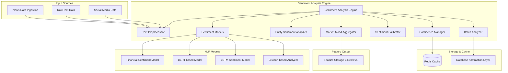

# Sentiment Analysis Engine Module Specification

## Module Overview

The Sentiment Analysis Engine processes textual data from news articles, social media, and financial documents to extract sentiment signals that influence trading decisions. It provides real-time sentiment scoring, entity-specific sentiment analysis, and market mood indicators using advanced NLP models and financial domain expertise.

## Module Architecture



## Core Responsibilities

### Primary Functions
1. **Text Preprocessing**: Clean, tokenize, and normalize textual content
2. **Sentiment Classification**: Multi-model sentiment scoring with confidence levels
3. **Entity-Specific Sentiment**: Extract sentiment for specific companies/sectors
4. **Market Mood Analysis**: Aggregate sentiment indicators for market conditions
5. **Real-time Processing**: Process breaking news and social media in real-time
6. **Sentiment Calibration**: Adjust scores based on source credibility and context
7. **Batch Processing**: Efficient processing of large text datasets
8. **Temporal Analysis**: Track sentiment changes over time

## Data Structures

### Input Data Structures
```rust
#[derive(Debug, Clone, Serialize, Deserialize)]
pub struct TextDocument {
    pub id: String,
    pub content: String,
    pub title: Option<String>,
    pub source: TextSource,
    pub timestamp: DateTime<Utc>,
    pub entities: Vec<String>, // Pre-extracted entities if available
    pub metadata: HashMap<String, String>,
}

#[derive(Debug, Clone, Serialize, Deserialize)]
pub struct TextSource {
    pub name: String,
    pub credibility_score: f32,
    pub bias_score: f32, // -1 (bearish bias) to 1 (bullish bias)
    pub source_type: SourceType,
}

#[derive(Debug, Clone, Serialize, Deserialize)]
pub enum SourceType {
    NewsArticle,
    SocialMedia,
    AnalystReport,
    EarningsTranscript,
    PressRelease,
    RegulatoryFiling,
    ForumPost,
}

#[derive(Debug, Clone, Serialize, Deserialize)]
pub struct SentimentRequest {
    pub documents: Vec<TextDocument>,
    pub target_entities: Vec<String>, // Specific entities to analyze
    pub analysis_type: AnalysisType,
    pub include_confidence: bool,
    pub include_explanations: bool,
}

#[derive(Debug, Clone, Serialize, Deserialize)]
pub enum AnalysisType {
    Overall,           // General sentiment
    EntitySpecific,    // Sentiment toward specific entities
    MarketMood,        // Overall market sentiment
    EventDriven,       // Sentiment around specific events
}
```

### Output Data Structures
```rust
#[derive(Debug, Clone, Serialize, Deserialize)]
pub struct SentimentResult {
    pub document_id: String,
    pub overall_sentiment: SentimentScore,
    pub entity_sentiments: HashMap<String, EntitySentiment>,
    pub market_indicators: MarketSentimentIndicators,
    pub processing_metadata: SentimentMetadata,
}

#[derive(Debug, Clone, Serialize, Deserialize)]
pub struct SentimentScore {
    pub polarity: f32,        // -1.0 (very negative) to 1.0 (very positive)
    pub magnitude: f32,       // 0.0 to 1.0 (strength of sentiment)
    pub confidence: f32,      // 0.0 to 1.0 (model confidence)
    pub label: SentimentLabel,
    pub raw_scores: HashMap<String, f32>, // Scores from different models
}

#[derive(Debug, Clone, Serialize, Deserialize)]
pub enum SentimentLabel {
    VeryNegative,
    Negative,
    SlightlyNegative,
    Neutral,
    SlightlyPositive,
    Positive,
    VeryPositive,
}

#[derive(Debug, Clone, Serialize, Deserialize)]
pub struct EntitySentiment {
    pub entity: String,
    pub sentiment: SentimentScore,
    pub relevance: f32,       // How relevant is this entity to the text
    pub context_snippets: Vec<String>, // Text snippets mentioning the entity
    pub sentiment_drivers: Vec<SentimentDriver>,
}

#[derive(Debug, Clone, Serialize, Deserialize)]
pub struct SentimentDriver {
    pub phrase: String,
    pub contribution: f32,    // How much this phrase contributes to sentiment
    pub context: String,
}

#[derive(Debug, Clone, Serialize, Deserialize)]
pub struct MarketSentimentIndicators {
    pub fear_greed_index: f32,     // 0 (extreme fear) to 100 (extreme greed)
    pub volatility_sentiment: f32, // Expected volatility based on sentiment
    pub sector_sentiments: HashMap<String, f32>,
    pub trending_topics: Vec<TrendingTopic>,
    pub sentiment_momentum: f32,   // Rate of sentiment change
}

#[derive(Debug, Clone, Serialize, Deserialize)]
pub struct TrendingTopic {
    pub topic: String,
    pub sentiment: f32,
    pub mention_count: u32,
    pub trend_direction: TrendDirection,
}

#[derive(Debug, Clone, Serialize, Deserialize)]
pub enum TrendDirection {
    Rising,
    Falling,
    Stable,
}
```

## Sentiment Models Implementation

### Multi-Model Ensemble
```rust
pub struct SentimentModelEnsemble {
    models: Vec<Box<dyn SentimentModel>>,
    weights: Vec<f32>,
    aggregation_strategy: AggregationStrategy,
}

pub trait SentimentModel: Send + Sync {
    fn name(&self) -> &'static str;
    fn confidence_threshold(&self) -> f32;
    
    async fn analyze_sentiment(
        &self,
        text: &str,
        context: &SentimentContext,
    ) -> Result<SentimentScore, SentimentError>;
    
    fn supports_entity_sentiment(&self) -> bool;
    
    async fn analyze_entity_sentiment(
        &self,
        text: &str,
        entity: &str,
        context: &SentimentContext,
    ) -> Result<EntitySentiment, SentimentError>;
}

#[derive(Debug, Clone)]
pub struct SentimentContext {
    pub source_type: SourceType,
    pub domain: String,           // finance, technology, etc.
    pub temporal_context: Option<DateTime<Utc>>,
    pub market_conditions: Option<MarketConditions>,
}

#[derive(Debug, Clone)]
pub struct MarketConditions {
    pub volatility_regime: String,
    pub market_trend: String,
    pub sector_performance: HashMap<String, f32>,
}

// Financial BERT Model Implementation
pub struct FinBertSentimentModel {
    tokenizer: Tokenizer,
    model: OnnxModel,
    max_sequence_length: usize,
}

impl SentimentModel for FinBertSentimentModel {
    fn name(&self) -> &'static str {
        "FinBERT"
    }
    
    fn confidence_threshold(&self) -> f32 {
        0.7
    }
    
    async fn analyze_sentiment(
        &self,
        text: &str,
        context: &SentimentContext,
    ) -> Result<SentimentScore, SentimentError> {
        // Tokenize input
        let tokens = self.tokenizer.encode(text, true)
            .map_err(|e| SentimentError::TokenizationFailed { 
                error: e.to_string() 
            })?;
            
        if tokens.len() > self.max_sequence_length {
            return Err(SentimentError::TextTooLong {
                length: tokens.len(),
                max_length: self.max_sequence_length,
            });
        }
        
        // Prepare input tensors
        let input_ids = Array2::from_shape_vec(
            (1, tokens.len()),
            tokens.get_ids().to_vec(),
        ).unwrap();
        
        let attention_mask = Array2::from_shape_vec(
            (1, tokens.len()),
            vec![1i64; tokens.len()],
        ).unwrap();
        
        // Run inference
        let outputs = self.model.run(vec![
            InputTensor::Int64Array(input_ids),
            InputTensor::Int64Array(attention_mask),
        ])?;
        
        // Extract logits and apply softmax
        let logits = outputs[0].as_float_array()?;
        let probabilities = self.softmax(&logits);
        
        // Convert to sentiment score
        let sentiment_score = self.logits_to_sentiment(&probabilities, context);
        
        Ok(sentiment_score)
    }
    
    fn supports_entity_sentiment(&self) -> bool {
        true
    }
    
    async fn analyze_entity_sentiment(
        &self,
        text: &str,
        entity: &str,
        context: &SentimentContext,
    ) -> Result<EntitySentiment, SentimentError> {
        // Extract sentences containing the entity
        let entity_sentences = self.extract_entity_context(text, entity);
        
        if entity_sentences.is_empty() {
            return Ok(EntitySentiment {
                entity: entity.to_string(),
                sentiment: SentimentScore::neutral(),
                relevance: 0.0,
                context_snippets: vec![],
                sentiment_drivers: vec![],
            });
        }
        
        // Analyze sentiment for each sentence
        let mut sentence_sentiments = Vec::new();
        let mut context_snippets = Vec::new();
        
        for sentence in &entity_sentences {
            let sentiment = self.analyze_sentiment(sentence, context).await?;
            sentence_sentiments.push(sentiment);
            context_snippets.push(sentence.clone());
        }
        
        // Aggregate sentiments
        let overall_sentiment = self.aggregate_sentence_sentiments(&sentence_sentiments);
        let relevance = self.calculate_entity_relevance(text, entity);
        let drivers = self.extract_sentiment_drivers(text, entity, &overall_sentiment);
        
        Ok(EntitySentiment {
            entity: entity.to_string(),
            sentiment: overall_sentiment,
            relevance,
            context_snippets,
            sentiment_drivers: drivers,
        })
    }
}

impl FinBertSentimentModel {
    fn logits_to_sentiment(
        &self,
        probabilities: &[f32],
        context: &SentimentContext,
    ) -> SentimentScore {
        // FinBERT typically outputs [negative, neutral, positive]
        let negative_prob = probabilities[0];
        let neutral_prob = probabilities[1];
        let positive_prob = probabilities[2];
        
        // Calculate polarity (-1 to 1)
        let polarity = positive_prob - negative_prob;
        
        // Calculate magnitude (strength of sentiment)
        let magnitude = 1.0 - neutral_prob;
        
        // Calculate confidence (max probability)
        let confidence = probabilities.iter()
            .copied()
            .fold(0.0f32, f32::max);
        
        // Determine label
        let label = if positive_prob > negative_prob && positive_prob > neutral_prob {
            if positive_prob > 0.8 {
                SentimentLabel::VeryPositive
            } else if positive_prob > 0.6 {
                SentimentLabel::Positive
            } else {
                SentimentLabel::SlightlyPositive
            }
        } else if negative_prob > positive_prob && negative_prob > neutral_prob {
            if negative_prob > 0.8 {
                SentimentLabel::VeryNegative
            } else if negative_prob > 0.6 {
                SentimentLabel::Negative
            } else {
                SentimentLabel::SlightlyNegative
            }
        } else {
            SentimentLabel::Neutral
        };
        
        // Apply source credibility adjustment
        let adjusted_confidence = confidence * context.source_credibility_factor();
        
        SentimentScore {
            polarity,
            magnitude,
            confidence: adjusted_confidence,
            label,
            raw_scores: [
                ("negative".to_string(), negative_prob),
                ("neutral".to_string(), neutral_prob),
                ("positive".to_string(), positive_prob),
            ].into_iter().collect(),
        }
    }
    
    fn extract_entity_context(&self, text: &str, entity: &str) -> Vec<String> {
        // Simple sentence extraction - in production, use proper NLP sentence segmentation
        let sentences: Vec<&str> = text.split(". ").collect();
        
        sentences.into_iter()
            .filter(|sentence| {
                sentence.to_lowercase().contains(&entity.to_lowercase())
            })
            .map(|s| s.to_string())
            .collect()
    }
    
    fn calculate_entity_relevance(&self, text: &str, entity: &str) -> f32 {
        let total_words = text.split_whitespace().count() as f32;
        let entity_mentions = text.matches(entity).count() as f32;
        
        // Simple relevance calculation
        (entity_mentions / total_words * 100.0).min(1.0)
    }
}
```

### Lexicon-Based Sentiment Analysis
```rust
pub struct LexiconSentimentModel {
    financial_lexicon: HashMap<String, f32>,
    general_lexicon: HashMap<String, f32>,
    negation_words: HashSet<String>,
    intensifiers: HashMap<String, f32>,
}

impl LexiconSentimentModel {
    pub fn new() -> Self {
        let financial_lexicon = Self::load_financial_lexicon();
        let general_lexicon = Self::load_general_lexicon();
        let negation_words = Self::load_negation_words();
        let intensifiers = Self::load_intensifiers();
        
        Self {
            financial_lexicon,
            general_lexicon,
            negation_words,
            intensifiers,
        }
    }
    
    fn load_financial_lexicon() -> HashMap<String, f32> {
        // Financial domain-specific sentiment words
        [
            // Positive financial terms
            ("bullish", 0.8),
            ("rally", 0.7),
            ("surge", 0.8),
            ("growth", 0.6),
            ("profit", 0.7),
            ("gain", 0.6),
            ("outperform", 0.7),
            ("upgrade", 0.8),
            ("beat", 0.7), // as in "beat earnings"
            ("strong", 0.6),
            ("robust", 0.7),
            ("solid", 0.5),
            
            // Negative financial terms
            ("bearish", -0.8),
            ("crash", -0.9),
            ("plunge", -0.8),
            ("decline", -0.6),
            ("loss", -0.7),
            ("fall", -0.5),
            ("underperform", -0.7),
            ("downgrade", -0.8),
            ("miss", -0.7), // as in "miss earnings"
            ("weak", -0.6),
            ("volatile", -0.4),
            ("risk", -0.5),
        ].into_iter()
        .map(|(word, score)| (word.to_string(), score))
        .collect()
    }
    
    fn calculate_lexicon_sentiment(&self, text: &str) -> SentimentScore {
        let words: Vec<&str> = text.to_lowercase()
            .split_whitespace()
            .collect();
            
        let mut total_score = 0.0;
        let mut word_count = 0;
        let mut sentiment_words = Vec::new();
        
        for (i, word) in words.iter().enumerate() {
            let base_score = self.financial_lexicon.get(*word)
                .or_else(|| self.general_lexicon.get(*word))
                .copied()
                .unwrap_or(0.0);
                
            if base_score != 0.0 {
                let mut adjusted_score = base_score;
                
                // Check for negation
                if i > 0 && self.negation_words.contains(words[i-1]) {
                    adjusted_score *= -1.0;
                }
                
                // Check for intensifiers
                if i > 0 {
                    if let Some(intensifier) = self.intensifiers.get(words[i-1]) {
                        adjusted_score *= intensifier;
                    }
                }
                
                total_score += adjusted_score;
                word_count += 1;
                sentiment_words.push((word.to_string(), adjusted_score));
            }
        }
        
        let polarity = if word_count > 0 {
            (total_score / word_count as f32).clamp(-1.0, 1.0)
        } else {
            0.0
        };
        
        let magnitude = polarity.abs();
        let confidence = if word_count > 0 {
            (word_count as f32 / words.len() as f32).min(1.0)
        } else {
            0.0
        };
        
        SentimentScore {
            polarity,
            magnitude,
            confidence,
            label: Self::polarity_to_label(polarity),
            raw_scores: [("lexicon_score".to_string(), polarity)].into_iter().collect(),
        }
    }
    
    fn polarity_to_label(polarity: f32) -> SentimentLabel {
        match polarity {
            p if p >= 0.6 => SentimentLabel::VeryPositive,
            p if p >= 0.2 => SentimentLabel::Positive,
            p if p >= 0.05 => SentimentLabel::SlightlyPositive,
            p if p <= -0.6 => SentimentLabel::VeryNegative,
            p if p <= -0.2 => SentimentLabel::Negative,
            p if p <= -0.05 => SentimentLabel::SlightlyNegative,
            _ => SentimentLabel::Neutral,
        }
    }
}
```

## Market Mood Aggregation

### Market Sentiment Aggregator
```rust
pub struct MarketMoodAggregator {
    sentiment_history: CircularBuffer<TimestampedSentiment>,
    sector_mappings: HashMap<String, String>,
    weight_config: AggregationWeights,
}

#[derive(Debug, Clone)]
pub struct TimestampedSentiment {
    pub timestamp: DateTime<Utc>,
    pub sentiment: SentimentScore,
    pub entity: String,
    pub source_weight: f32,
}

#[derive(Debug, Clone)]
pub struct AggregationWeights {
    pub recency_weight: f32,      // Weight newer sentiments more
    pub source_weight: f32,       // Weight based on source credibility  
    pub volume_weight: f32,       // Weight based on mention volume
    pub relevance_weight: f32,    // Weight based on entity relevance
}

impl MarketMoodAggregator {
    pub fn calculate_market_sentiment(
        &self,
        timeframe: Duration,
    ) -> MarketSentimentIndicators {
        let cutoff_time = Utc::now() - timeframe;
        
        let recent_sentiments: Vec<_> = self.sentiment_history
            .iter()
            .filter(|s| s.timestamp > cutoff_time)
            .collect();
            
        if recent_sentiments.is_empty() {
            return MarketSentimentIndicators::default();
        }
        
        // Calculate overall market sentiment
        let overall_sentiment = self.calculate_weighted_sentiment(&recent_sentiments);
        
        // Calculate fear and greed index
        let fear_greed_index = self.calculate_fear_greed_index(&recent_sentiments);
        
        // Calculate volatility sentiment
        let volatility_sentiment = self.calculate_volatility_sentiment(&recent_sentiments);
        
        // Calculate sector sentiments
        let sector_sentiments = self.calculate_sector_sentiments(&recent_sentiments);
        
        // Identify trending topics
        let trending_topics = self.identify_trending_topics(&recent_sentiments);
        
        // Calculate sentiment momentum
        let sentiment_momentum = self.calculate_sentiment_momentum(&recent_sentiments);
        
        MarketSentimentIndicators {
            fear_greed_index,
            volatility_sentiment,
            sector_sentiments,
            trending_topics,
            sentiment_momentum,
        }
    }
    
    fn calculate_fear_greed_index(&self, sentiments: &[&TimestampedSentiment]) -> f32 {
        // Convert sentiment to fear/greed scale (0 = extreme fear, 100 = extreme greed)
        let avg_sentiment = self.calculate_weighted_sentiment(sentiments);
        
        // Normalize from [-1, 1] to [0, 100]
        ((avg_sentiment.polarity + 1.0) * 50.0).clamp(0.0, 100.0)
    }
    
    fn calculate_volatility_sentiment(&self, sentiments: &[&TimestampedSentiment]) -> f32 {
        // Higher magnitude indicates higher expected volatility
        let avg_magnitude: f32 = sentiments.iter()
            .map(|s| s.sentiment.magnitude)
            .sum::<f32>() / sentiments.len() as f32;
            
        avg_magnitude
    }
    
    fn calculate_sector_sentiments(
        &self,
        sentiments: &[&TimestampedSentiment],
    ) -> HashMap<String, f32> {
        let mut sector_sentiments: HashMap<String, Vec<f32>> = HashMap::new();
        
        for sentiment in sentiments {
            if let Some(sector) = self.sector_mappings.get(&sentiment.entity) {
                sector_sentiments
                    .entry(sector.clone())
                    .or_default()
                    .push(sentiment.sentiment.polarity);
            }
        }
        
        sector_sentiments.into_iter()
            .map(|(sector, scores)| {
                let avg_score = scores.iter().sum::<f32>() / scores.len() as f32;
                (sector, avg_score)
            })
            .collect()
    }
    
    fn calculate_sentiment_momentum(&self, sentiments: &[&TimestampedSentiment]) -> f32 {
        if sentiments.len() < 2 {
            return 0.0;
        }
        
        // Split into two halves and compare
        let mid_point = sentiments.len() / 2;
        let (earlier, later) = sentiments.split_at(mid_point);
        
        let earlier_avg = earlier.iter()
            .map(|s| s.sentiment.polarity)
            .sum::<f32>() / earlier.len() as f32;
            
        let later_avg = later.iter()
            .map(|s| s.sentiment.polarity)
            .sum::<f32>() / later.len() as f32;
            
        later_avg - earlier_avg
    }
}
```

## API Endpoints

### Internal API Interface
```rust
#[derive(OpenApi)]
struct SentimentAnalysisApi;

#[utoipa::path(
    post,
    path = "/api/v1/internal/sentiment/analyze",
    request_body = SentimentRequest,
    responses(
        (status = 200, description = "Sentiment analysis completed", body = SentimentResult),
        (status = 400, description = "Invalid request"),
        (status = 500, description = "Analysis error")
    )
)]
pub async fn analyze_sentiment(
    State(engine): State<SentimentAnalysisEngine>,
    Json(request): Json<SentimentRequest>,
) -> Result<Json<SentimentResult>, SentimentError>;

#[utoipa::path(
    get,
    path = "/api/v1/internal/sentiment/market-mood",
    params(
        ("timeframe_hours" = Option<u32>, Query, description = "Timeframe in hours")
    ),
    responses(
        (status = 200, description = "Market sentiment indicators", body = MarketSentimentIndicators)
    )
)]
pub async fn get_market_mood(
    State(engine): State<SentimentAnalysisEngine>,
    Query(params): Query<MarketMoodParams>,
) -> Result<Json<MarketSentimentIndicators>, SentimentError>;

#[utoipa::path(
    get,
    path = "/api/v1/internal/sentiment/entity/{entity}",
    params(
        ("entity" = String, Path, description = "Entity symbol or name"),
        ("hours" = Option<u32>, Query, description = "Lookback hours")
    ),
    responses(
        (status = 200, description = "Entity sentiment history", body = Vec<EntitySentiment>)
    )
)]
pub async fn get_entity_sentiment_history(
    State(engine): State<SentimentAnalysisEngine>,
    Path(entity): Path<String>,
    Query(params): Query<EntitySentimentParams>,
) -> Result<Json<Vec<EntitySentiment>>, SentimentError>;
```

## Configuration

### Service Configuration
```toml
[sentiment_analysis]
service_name = "sentiment-analysis-engine"
port = 8083
worker_threads = 6
max_concurrent_analyses = 100

[models]
enable_finbert = true
enable_lexicon = true
enable_lstm = false
model_ensemble_weights = [0.6, 0.3, 0.1] # FinBERT, Lexicon, LSTM

[finbert]
model_path = "/models/finbert-sentiment"
tokenizer_path = "/models/finbert-tokenizer"
max_sequence_length = 512
batch_size = 16

[lexicon]
financial_lexicon_path = "/data/financial_sentiment_lexicon.json"
general_lexicon_path = "/data/general_sentiment_lexicon.json"
negation_words_path = "/data/negation_words.txt"

[aggregation]
market_mood_timeframe_hours = 24
sentiment_history_buffer_size = 10000
recency_weight = 0.4
source_weight = 0.3
volume_weight = 0.2
relevance_weight = 0.1

[caching]
enable_redis_cache = true
cache_ttl_seconds = 600
enable_result_compression = true

[performance]
analysis_timeout_seconds = 30
max_text_length = 10000
enable_gpu_acceleration = true
```

## Performance Requirements & Error Handling

### Latency Targets
- **Single Document**: < 200ms for analysis
- **Batch Processing**: < 5 seconds for 100 documents
- **Market Mood Calculation**: < 1 second
- **Entity Sentiment**: < 500ms per entity

### Throughput Targets
- **Document Analysis**: 5,000 documents per minute
- **Real-time Processing**: < 2 seconds from ingestion to sentiment
- **Concurrent Requests**: 50 simultaneous analyses

### Error Types
```rust
#[derive(Error, Debug)]
pub enum SentimentError {
    #[error("Text preprocessing failed: {error}")]
    PreprocessingFailed { error: String },
    
    #[error("Model inference failed: {model} - {error}")]
    ModelInferenceFailed { model: String, error: String },
    
    #[error("Text too long: {length} > {max_length}")]
    TextTooLong { length: usize, max_length: usize },
    
    #[error("Insufficient data for entity sentiment: {entity}")]
    InsufficientEntityData { entity: String },
    
    #[error("Model not available: {model}")]
    ModelNotAvailable { model: String },
    
    #[error("Analysis timeout: {duration_ms}ms")]
    AnalysisTimeout { duration_ms: u64 },
}
```

### Dependencies
- **News Data Ingestion**: Source of textual data
- **Database Abstraction Layer**: Sentiment history storage
- **Feature Storage & Retrieval**: Output sentiment features
- **Configuration Manager**: Model and parameter settings

This Sentiment Analysis Engine provides sophisticated sentiment analysis capabilities that enable the trading system to incorporate market mood and news sentiment into its decision-making process.