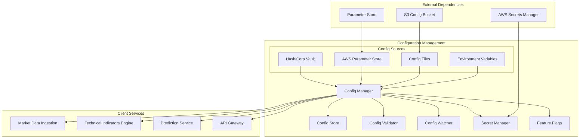

# Configuration Management - Technical Specification

## Module Overview

The Configuration Management module provides centralized, environment-aware configuration management for all QuantumTrade AI services. It supports dynamic configuration updates, secret management, feature flags, and environment-specific overrides with validation and audit trails.

## Architecture Diagram



## Responsibilities

### **Primary Functions**
- **Centralized Configuration**: Single source of truth for all service configurations
- **Environment Management**: Development, staging, and production environment isolation
- **Secret Management**: Secure storage and rotation of API keys, database credentials
- **Feature Flags**: Runtime feature toggling and gradual rollouts
- **Configuration Validation**: Schema validation and constraint checking
- **Dynamic Updates**: Hot-reload configuration changes without service restarts

### **Configuration Categories**
- **Service Configuration**: Database connections, API endpoints, resource limits
- **Business Parameters**: Trading thresholds, risk limits, feature weights
- **Infrastructure Settings**: AWS regions, scaling parameters, monitoring settings
- **Feature Flags**: A/B testing, feature rollouts, emergency toggles
- **Secrets**: API keys, database passwords, encryption keys

## API Contract

### **Core Interface**
```rust
#[async_trait]
pub trait ConfigurationManager {
    // Configuration retrieval
    async fn get_config<T: DeserializeOwned>(&self, key: &str) -> Result<T>;
    async fn get_config_with_default<T: DeserializeOwned>(&self, key: &str, default: T) -> Result<T>;
    async fn get_all_configs(&self, prefix: &str) -> Result<HashMap<String, Value>>;
    
    // Secret management
    async fn get_secret(&self, secret_name: &str) -> Result<String>;
    async fn set_secret(&self, secret_name: &str, value: &str) -> Result<()>;
    async fn rotate_secret(&self, secret_name: &str) -> Result<String>;
    
    // Feature flags
    async fn is_feature_enabled(&self, feature_name: &str) -> Result<bool>;
    async fn get_feature_config<T: DeserializeOwned>(&self, feature_name: &str) -> Result<Option<T>>;
    async fn enable_feature(&self, feature_name: &str, config: Option<Value>) -> Result<()>;
    async fn disable_feature(&self, feature_name: &str) -> Result<()>;
    
    // Configuration updates
    async fn update_config(&self, key: &str, value: Value) -> Result<()>;
    async fn reload_configuration(&self) -> Result<()>;
    async fn validate_configuration(&self) -> Result<ValidationResult>;
    
    // Watchers and notifications
    async fn watch_config(&self, key: &str) -> Result<ConfigWatcher>;
    async fn subscribe_to_changes(&self) -> Result<ConfigChangeStream>;
}
```

### **Data Structures**
```rust
#[derive(Debug, Clone, Serialize, Deserialize)]
pub struct ServiceConfig {
    pub service_name: String,
    pub environment: Environment,
    pub database: DatabaseConfig,
    pub apis: ApiConfig,
    pub logging: LoggingConfig,
    pub monitoring: MonitoringConfig,
    pub features: HashMap<String, FeatureConfig>,
}

#[derive(Debug, Clone, Serialize, Deserialize)]
pub struct DatabaseConfig {
    pub clickhouse: ClickHouseConfig,
    pub redis: RedisConfig,
    pub connection_pool: ConnectionPoolConfig,
}

#[derive(Debug, Clone, Serialize, Deserialize)]
pub struct ApiConfig {
    pub alpha_vantage: AlphaVantageConfig,
    pub alpha_intelligence: AlphaIntelligenceConfig,
    pub rate_limits: RateLimitConfig,
    pub timeout_ms: u32,
    pub retry_config: RetryConfig,
}

#[derive(Debug, Clone, Serialize, Deserialize)]
pub struct FeatureConfig {
    pub enabled: bool,
    pub rollout_percentage: f32,
    pub target_groups: Vec<String>,
    pub parameters: HashMap<String, Value>,
}

#[derive(Debug, Clone, Serialize, Deserialize)]
pub enum Environment {
    Development,
    Staging,
    Production,
}
```

## Input Interfaces

### **From External Sources**
- **Environment Variables**: Runtime environment configuration
- **Config Files**: YAML/JSON configuration files from S3
- **AWS Parameter Store**: Hierarchical configuration parameters
- **AWS Secrets Manager**: Encrypted secrets and credentials
- **HashiCorp Vault**: Additional secret management (if used)

### **Configuration Schema Examples**
```yaml
# Service configuration
service:
  name: "market-data-ingestion"
  environment: "production"
  version: "1.0.0"

database:
  clickhouse:
    host: "${CLICKHOUSE_HOST}"
    port: 8123
    database: "quantumtrade"
    connection_pool:
      max_connections: 20
      timeout_seconds: 30
  
  redis:
    host: "${REDIS_HOST}" 
    port: 6379
    db: 0
    connection_pool:
      max_connections: 50

apis:
  alpha_vantage:
    base_url: "https://www.alphavantage.co"
    api_key: "${ALPHA_VANTAGE_API_KEY}"
    rate_limit:
      requests_per_minute: 75
      burst_size: 5
    timeout_ms: 10000
    
  alpha_intelligence:
    base_url: "https://www.alphavantage.co/query"
    api_key: "${ALPHA_INTELLIGENCE_API_KEY}"
    rate_limit:
      requests_per_minute: 100

features:
  real_time_indicators:
    enabled: true
    rollout_percentage: 100.0
    parameters:
      max_symbols: 500
      update_interval_ms: 1000
      
  advanced_sentiment:
    enabled: false
    rollout_percentage: 0.0
    target_groups: ["beta_users"]
```

## Output Interfaces

### **To Client Services**
- **Configuration Objects**: Typed configuration structures
- **Feature Flags**: Boolean and parametric feature toggles
- **Secrets**: Decrypted credentials and API keys
- **Change Notifications**: Real-time configuration update events

### **Configuration Categories by Service**

#### **Market Data Ingestion**
```rust
pub struct MarketDataIngestionConfig {
    pub alpha_vantage: AlphaVantageConfig,
    pub symbols: Vec<String>,
    pub update_intervals: UpdateIntervalConfig,
    pub data_quality: DataQualityConfig,
    pub error_handling: ErrorHandlingConfig,
}
```

#### **Technical Indicators Engine**
```rust
pub struct TechnicalIndicatorsConfig {
    pub supported_indicators: Vec<IndicatorType>,
    pub calculation_modes: CalculationModeConfig,
    pub caching: CachingConfig,
    pub performance: PerformanceConfig,
}
```

#### **Prediction Service**
```rust
pub struct PredictionServiceConfig {
    pub models: ModelConfig,
    pub prediction_horizons: Vec<u32>,
    pub confidence_thresholds: ConfidenceConfig,
    pub performance_targets: PerformanceTargetConfig,
}
```

## Data Storage

### **Configuration Storage**
- **AWS Parameter Store**: Hierarchical configuration with encryption
- **S3 Buckets**: Configuration files with versioning
- **Local Cache**: Redis-based configuration caching
- **Memory Cache**: In-process configuration caching

### **Configuration Hierarchy**
```
/quantumtrade/
├── global/
│   ├── database/
│   ├── logging/
│   └── monitoring/
├── environment/{env}/
│   ├── database/
│   ├── apis/
│   └── features/
└── service/{service_name}/
    ├── config/
    ├── features/
    └── secrets/
```

## Integration Points

### **Dependencies**
- **AWS Parameter Store**: Configuration parameter storage
- **AWS Secrets Manager**: Secret storage and rotation
- **S3**: Configuration file storage
- **Redis**: Configuration caching

### **Service Dependencies**
- **All Services**: Configuration consumption
- **Logging & Monitoring**: Configuration change tracking
- **API Gateway**: Feature flag evaluation
- **Database Abstraction Layer**: Connection configuration

## Performance Requirements

### **Latency Targets**
- **Configuration Retrieval**: <5ms (99th percentile)
- **Feature Flag Evaluation**: <1ms (99th percentile)  
- **Secret Retrieval**: <10ms (99th percentile)
- **Configuration Reload**: <30 seconds

### **Availability Targets**
- **Service Availability**: 99.9%
- **Configuration Cache Hit Rate**: >95%
- **Secret Rotation Success Rate**: >99.9%

## Error Handling

### **Error Categories**
- **Configuration Not Found**: Default value handling
- **Invalid Configuration**: Validation error responses
- **Secret Access Denied**: Fallback and retry logic
- **Network Failures**: Cached configuration fallback

### **Fallback Strategies**
- **Local Configuration Cache**: Redis-based local caching
- **Default Values**: Sensible defaults for non-critical settings
- **Previous Version Rollback**: Automatic rollback on validation failure
- **Circuit Breaker**: Prevent cascading configuration failures

## Security Considerations

### **Secret Management**
- **Encryption at Rest**: AES-256 encryption for all secrets
- **Encryption in Transit**: TLS 1.3 for all communications
- **Access Control**: IAM-based access to secrets
- **Audit Logging**: All secret access logged and monitored

### **Configuration Security**
- **Parameter Validation**: Input sanitization and validation
- **Access Control**: Role-based access to configuration
- **Change Auditing**: All configuration changes logged
- **Secure Defaults**: Security-first default configurations

This Configuration Management module ensures consistent, secure, and maintainable configuration across all QuantumTrade AI services while supporting dynamic updates and environment-specific customization.
