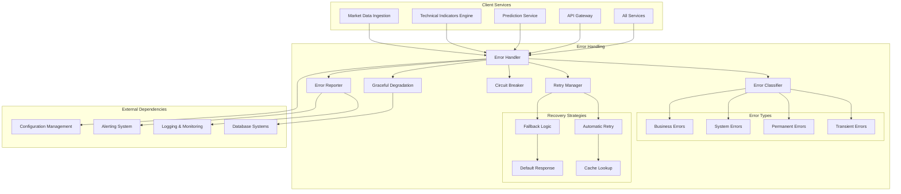

# Error Handling - Technical Specification

## Module Overview

The Error Handling module provides standardized error management across all QuantumTrade AI services. It implements consistent error types, automatic retry mechanisms, circuit breakers, graceful degradation, and comprehensive error tracking to ensure system resilience and reliability.

## Architecture Diagram



## Responsibilities

### **Primary Functions**
- **Error Classification**: Categorize errors by type, severity, and recoverability
- **Retry Logic**: Intelligent retry mechanisms with exponential backoff
- **Circuit Breaking**: Prevent cascading failures through circuit breaker patterns
- **Graceful Degradation**: Fallback mechanisms to maintain service availability
- **Error Reporting**: Comprehensive error tracking and alerting
- **Recovery Coordination**: Orchestrate error recovery across services

### **Error Categories**
- **Transient Errors**: Network timeouts, temporary service unavailability
- **Permanent Errors**: Invalid input, authentication failures, resource not found
- **System Errors**: Database connection failures, memory exhaustion
- **Business Errors**: Invalid trading parameters, market data quality issues
- **External API Errors**: Third-party service failures, rate limit exceeded

## API Contract

### **Core Interface**
```rust
#[async_trait]
pub trait ErrorHandler {
    // Error processing
    async fn handle_error(&self, error: Error, context: ErrorContext) -> Result<ErrorResponse>;
    async fn classify_error(&self, error: &Error) -> ErrorClassification;
    async fn should_retry(&self, error: &Error, attempt: u32) -> bool;
    
    // Retry management
    async fn execute_with_retry<T, F>(&self, operation: F, config: RetryConfig) -> Result<T>
    where
        F: Fn() -> Pin<Box<dyn Future<Output = Result<T>> + Send>> + Send + Sync;
    
    // Circuit breaker
    async fn execute_with_circuit_breaker<T, F>(&self, 
        operation: F, 
        circuit_name: &str
    ) -> Result<T>
    where
        F: Fn() -> Pin<Box<dyn Future<Output = Result<T>> + Send>> + Send + Sync;
    
    // Graceful degradation
    async fn execute_with_fallback<T, F, FB>(&self, 
        primary: F, 
        fallback: FB
    ) -> Result<T>
    where
        F: Fn() -> Pin<Box<dyn Future<Output = Result<T>> + Send>> + Send + Sync,
        FB: Fn() -> Pin<Box<dyn Future<Output = Result<T>> + Send>> + Send + Sync;
    
    // Error reporting
    async fn report_error(&self, error: &Error, context: ErrorContext) -> Result<()>;
    async fn get_error_stats(&self, timeframe: Duration) -> Result<ErrorStats>;
    
    // Circuit breaker management
    async fn get_circuit_status(&self, circuit_name: &str) -> Result<CircuitState>;
    async fn reset_circuit(&self, circuit_name: &str) -> Result<()>;
}
```

### **Data Structures**
```rust
#[derive(Error, Debug, Clone, Serialize, Deserialize)]
pub enum QuantumTradeError {
    // System errors
    #[error("Database connection failed: {message}")]
    DatabaseConnection { message: String, retryable: bool },
    
    #[error("External API error: {api} - {message}")]
    ExternalApi { api: String, message: String, status_code: Option<u16> },
    
    #[error("Configuration error: {message}")]
    Configuration { message: String },
    
    #[error("Resource exhausted: {resource}")]
    ResourceExhausted { resource: String },
    
    // Business errors
    #[error("Invalid trading parameters: {message}")]
    InvalidTradingParameters { message: String },
    
    #[error("Market data quality issue: {symbol} - {message}")]
    DataQualityIssue { symbol: String, message: String },
    
    #[error("Prediction confidence too low: {confidence}")]
    LowPredictionConfidence { confidence: f32 },
    
    #[error("Risk limit exceeded: {limit_type}")]
    RiskLimitExceeded { limit_type: String },
    
    // Network errors
    #[error("Request timeout: {operation}")]
    RequestTimeout { operation: String, timeout_ms: u64 },
    
    #[error("Rate limit exceeded: {api}")]
    RateLimitExceeded { api: String, reset_time: DateTime<Utc> },
    
    #[error("Network connection failed: {host}")]
    NetworkConnection { host: String },
    
    // Authentication errors
    #[error("Authentication failed: {reason}")]
    AuthenticationFailed { reason: String },
    
    #[error("Authorization denied: {resource}")]
    AuthorizationDenied { resource: String },
    
    #[error("Token expired")]
    TokenExpired,
    
    // Validation errors
    #[error("Input validation failed: {field} - {message}")]
    ValidationFailed { field: String, message: String },
    
    #[error("Schema validation failed: {schema}")]
    SchemaValidationFailed { schema: String },
    
    // Internal errors
    #[error("Internal server error: {message}")]
    Internal { message: String, correlation_id: String },
}

#[derive(Debug, Clone, Serialize, Deserialize)]
pub struct ErrorContext {
    pub service_name: String,
    pub operation: String,
    pub request_id: Option<String>,
    pub user_id: Option<String>,
    pub trace_id: Option<String>,
    pub timestamp: DateTime<Utc>,
    pub additional_data: HashMap<String, Value>,
}

#[derive(Debug, Clone, Serialize, Deserialize)]
pub struct ErrorClassification {
    pub error_type: ErrorType,
    pub severity: ErrorSeverity,
    pub retryable: bool,
    pub timeout_ms: Option<u64>,
    pub max_retries: Option<u32>,
}

#[derive(Debug, Clone, Serialize, Deserialize)]
pub enum ErrorType {
    Transient,
    Permanent,
    System,
    Business,
    Network,
    Authentication,
    Validation,
    RateLimit,
}

#[derive(Debug, Clone, Serialize, Deserialize)]
pub enum ErrorSeverity {
    Critical,  // System down, immediate attention required
    High,      // Significant impact, needs attention soon
    Medium,    // Some impact, should be addressed
    Low,       // Minor issue, can be handled later
    Info,      // Informational, no action needed
}

#[derive(Debug, Clone, Serialize, Deserialize)]
pub struct RetryConfig {
    pub max_attempts: u32,
    pub initial_delay_ms: u64,
    pub max_delay_ms: u64,
    pub backoff_multiplier: f64,
    pub jitter: bool,
    pub retryable_errors: Vec<ErrorType>,
}

#[derive(Debug, Clone, Serialize, Deserialize)]
pub struct CircuitBreakerConfig {
    pub failure_threshold: u32,
    pub success_threshold: u32,
    pub timeout_ms: u64,
    pub half_open_max_calls: u32,
}

#[derive(Debug, Clone, Serialize, Deserialize)]
pub enum CircuitState {
    Closed,    // Normal operation
    Open,      // Failing fast, not executing calls
    HalfOpen,  // Testing if service has recovered
}
```

## Input Interfaces

### **From All Services**
- **Error Objects**: Structured error instances with context
- **Operation Results**: Success/failure outcomes from service operations
- **Health Status**: Service health and availability information
- **Performance Metrics**: Latency and error rate data

### **Error Classification Rules**
```rust
impl ErrorClassifier {
    pub fn classify(&self, error: &QuantumTradeError) -> ErrorClassification {
        match error {
            // Transient errors - retry recommended
            QuantumTradeError::RequestTimeout { .. } => ErrorClassification {
                error_type: ErrorType::Transient,
                severity: ErrorSeverity::Medium,
                retryable: true,
                timeout_ms: Some(30000),
                max_retries: Some(3),
            },
            
            QuantumTradeError::NetworkConnection { .. } => ErrorClassification {
                error_type: ErrorType::Network,
                severity: ErrorSeverity::High,
                retryable: true,
                timeout_ms: Some(10000),
                max_retries: Some(5),
            },
            
            QuantumTradeError::RateLimitExceeded { .. } => ErrorClassification {
                error_type: ErrorType::RateLimit,
                severity: ErrorSeverity::Medium,
                retryable: true,
                timeout_ms: Some(60000),
                max_retries: Some(1),
            },
            
            // Permanent errors - no retry
            QuantumTradeError::ValidationFailed { .. } => ErrorClassification {
                error_type: ErrorType::Validation,
                severity: ErrorSeverity::Low,
                retryable: false,
                timeout_ms: None,
                max_retries: None,
            },
            
            QuantumTradeError::AuthenticationFailed { .. } => ErrorClassification {
                error_type: ErrorType::Authentication,
                severity: ErrorSeverity::High,
                retryable: false,
                timeout_ms: None,
                max_retries: None,
            },
            
            // System errors - critical
            QuantumTradeError::DatabaseConnection { retryable, .. } => ErrorClassification {
                error_type: ErrorType::System,
                severity: ErrorSeverity::Critical,
                retryable: *retryable,
                timeout_ms: Some(5000),
                max_retries: Some(3),
            },
        }
    }
}
```

## Output Interfaces

### **To Client Services**
- **Error Responses**: Standardized error response format
- **Retry Decisions**: Whether to retry and with what parameters
- **Fallback Results**: Alternative responses when primary operations fail
- **Circuit Breaker Status**: Current state of circuit breakers

### **To External Systems**
- **Error Logs**: Structured error information for logging
- **Alerts**: Critical error notifications
- **Metrics**: Error rate and pattern metrics
- **Status Updates**: Service health status changes

## Recovery Strategies

### **Retry Mechanisms**
```rust
pub struct ExponentialBackoffRetry {
    config: RetryConfig,
}

impl ExponentialBackoffRetry {
    pub async fn execute<T, F>(&self, mut operation: F) -> Result<T>
    where
        F: FnMut() -> Pin<Box<dyn Future<Output = Result<T>> + Send>> + Send,
    {
        let mut attempts = 0;
        let mut delay = self.config.initial_delay_ms;
        
        loop {
            attempts += 1;
            
            match operation().await {
                Ok(result) => return Ok(result),
                Err(error) => {
                    if attempts >= self.config.max_attempts {
                        return Err(error);
                    }
                    
                    let classification = self.classify_error(&error);
                    if !classification.retryable {
                        return Err(error);
                    }
                    
                    // Apply jitter to prevent thundering herd
                    let actual_delay = if self.config.jitter {
                        delay + (rand::random::<u64>() % (delay / 2))
                    } else {
                        delay
                    };
                    
                    tokio::time::sleep(Duration::from_millis(actual_delay)).await;
                    
                    delay = std::cmp::min(
                        (delay as f64 * self.config.backoff_multiplier) as u64,
                        self.config.max_delay_ms
                    );
                }
            }
        }
    }
}
```

### **Circuit Breaker Implementation**
```rust
pub struct CircuitBreaker {
    name: String,
    config: CircuitBreakerConfig,
    state: Arc<Mutex<CircuitState>>,
    failure_count: Arc<AtomicU32>,
    success_count: Arc<AtomicU32>,
    last_failure_time: Arc<Mutex<Option<DateTime<Utc>>>>,
}

impl CircuitBreaker {
    pub async fn execute<T, F>(&self, operation: F) -> Result<T>
    where
        F: Fn() -> Pin<Box<dyn Future<Output = Result<T>> + Send>> + Send + Sync,
    {
        match self.get_state().await {
            CircuitState::Open => {
                if self.should_attempt_reset().await {
                    self.set_state(CircuitState::HalfOpen).await;
                } else {
                    return Err(QuantumTradeError::Internal {
                        message: format!("Circuit breaker {} is open", self.name),
                        correlation_id: generate_correlation_id(),
                    });
                }
            },
            CircuitState::HalfOpen => {
                // Allow limited calls in half-open state
                if self.success_count.load(Ordering::Relaxed) >= self.config.half_open_max_calls {
                    return Err(QuantumTradeError::Internal {
                        message: format!("Circuit breaker {} half-open limit exceeded", self.name),
                        correlation_id: generate_correlation_id(),
                    });
                }
            },
            CircuitState::Closed => {
                // Normal operation
            }
        }
        
        match operation().await {
            Ok(result) => {
                self.on_success().await;
                Ok(result)
            },
            Err(error) => {
                self.on_failure().await;
                Err(error)
            }
        }
    }
}
```

### **Graceful Degradation Patterns**
```rust
pub struct GracefulDegradation;

impl GracefulDegradation {
    // Cache-based fallback
    pub async fn with_cache_fallback<T>(&self, 
        primary_fn: impl Future<Output = Result<T>>,
        cache_key: &str,
        cache: &dyn CacheProvider
    ) -> Result<T> 
    where 
        T: Serialize + DeserializeOwned + Clone 
    {
        match primary_fn.await {
            Ok(result) => {
                // Cache successful result
                let _ = cache.set(cache_key, &result, Duration::from_minutes(5)).await;
                Ok(result)
            },
            Err(_) => {
                // Try cache fallback
                match cache.get::<T>(cache_key).await {
                    Ok(Some(cached_result)) => Ok(cached_result),
                    _ => Err(QuantumTradeError::Internal {
                        message: "Primary operation failed and no cache available".to_string(),
                        correlation_id: generate_correlation_id(),
                    })
                }
            }
        }
    }
    
    // Default value fallback
    pub async fn with_default_fallback<T>(&self,
        primary_fn: impl Future<Output = Result<T>>,
        default_value: T
    ) -> Result<T> {
        match primary_fn.await {
            Ok(result) => Ok(result),
            Err(_) => {
                warn!("Primary operation failed, using default value");
                Ok(default_value)
            }
        }
    }
}
```

## Performance Requirements

### **Latency Targets**
- **Error Classification**: <1ms
- **Retry Decision**: <5ms
- **Circuit Breaker Check**: <2ms
- **Error Reporting**: <10ms (async)

### **Throughput Targets**
- **Error Processing**: 10,000 errors/second
- **Retry Operations**: 1,000 retries/second
- **Circuit Breaker Operations**: 50,000 ops/second

## Integration Points

### **Dependencies**
- **Logging & Monitoring**: Error event logging and metrics
- **Configuration Management**: Error handling configuration
- **Database Abstraction Layer**: Database error handling
- **External APIs**: API error handling and retry logic

### **Service Dependencies**
- **All Services**: Error handling integration
- **API Gateway**: HTTP error response formatting
- **Prediction Service**: Business logic error handling
- **Market Data Ingestion**: Data quality error handling

This Error Handling module ensures consistent, reliable error management across all QuantumTrade AI services while maintaining system resilience and user experience.
