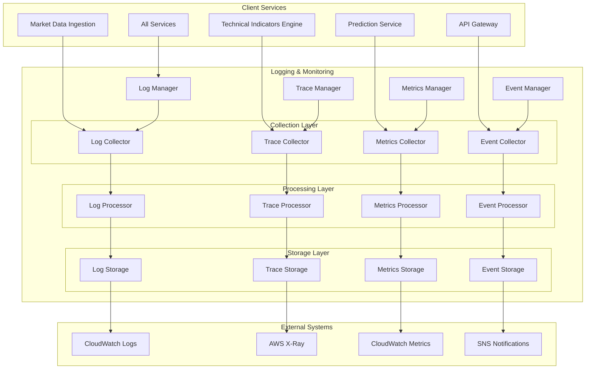

# Logging & Monitoring - Technical Specification

## Module Overview

The Logging & Monitoring module provides comprehensive observability across all QuantumTrade AI services through structured logging, distributed tracing, metrics collection, and real-time monitoring. It ensures system health visibility, performance tracking, and debugging capabilities with minimal performance overhead.

## Architecture Diagram



## Responsibilities

### **Primary Functions**
- **Structured Logging**: JSON-formatted logs with correlation IDs and context
- **Distributed Tracing**: Request flow tracking across microservices
- **Metrics Collection**: Business and system metrics aggregation
- **Event Monitoring**: Critical system and business event tracking
- **Performance Monitoring**: Latency, throughput, and error rate tracking
- **Health Monitoring**: Service health checks and availability monitoring

### **Observability Categories**
- **Application Logs**: Service-specific logs with structured format
- **Audit Logs**: Security and compliance event logging
- **Performance Metrics**: Latency, throughput, resource utilization
- **Business Metrics**: Prediction accuracy, trading performance, user activity
- **Infrastructure Metrics**: CPU, memory, network, database performance
- **Distributed Traces**: End-to-end request flow tracking

## API Contract

### **Core Interface**
```rust
#[async_trait]
pub trait LoggingMonitoring {
    // Logging operations
    async fn log_info(&self, message: &str, context: LogContext) -> Result<()>;
    async fn log_warn(&self, message: &str, context: LogContext) -> Result<()>;
    async fn log_error(&self, error: &Error, context: LogContext) -> Result<()>;
    async fn log_debug(&self, message: &str, context: LogContext) -> Result<()>;
    
    // Structured logging
    async fn log_structured(&self, level: LogLevel, event: StructuredEvent) -> Result<()>;
    async fn log_audit(&self, action: AuditAction, user: UserId, context: AuditContext) -> Result<()>;
    
    // Tracing operations
    async fn start_trace(&self, operation: &str) -> Result<TraceId>;
    async fn start_span(&self, parent: TraceId, operation: &str) -> Result<SpanId>;
    async fn end_span(&self, span: SpanId, result: SpanResult) -> Result<()>;
    async fn add_trace_annotation(&self, trace: TraceId, key: &str, value: &str) -> Result<()>;
    
    // Metrics operations
    async fn record_counter(&self, name: &str, value: i64, tags: Tags) -> Result<()>;
    async fn record_gauge(&self, name: &str, value: f64, tags: Tags) -> Result<()>;
    async fn record_histogram(&self, name: &str, value: f64, tags: Tags) -> Result<()>;
    async fn record_timer(&self, name: &str, duration: Duration, tags: Tags) -> Result<()>;
    
    // Event operations
    async fn emit_event(&self, event: SystemEvent) -> Result<()>;
    async fn emit_alert(&self, alert: Alert) -> Result<()>;
    async fn emit_notification(&self, notification: Notification) -> Result<()>;
    
    // Health monitoring
    async fn report_health(&self, service: &str, status: HealthStatus) -> Result<()>;
    async fn get_service_health(&self, service: &str) -> Result<HealthStatus>;
    async fn get_system_health(&self) -> Result<SystemHealthStatus>;
}
```

### **Data Structures**
```rust
#[derive(Debug, Clone, Serialize, Deserialize)]
pub struct LogContext {
    pub service_name: String,
    pub request_id: Option<String>,
    pub trace_id: Option<TraceId>,
    pub user_id: Option<UserId>,
    pub session_id: Option<String>,
    pub timestamp: DateTime<Utc>,
    pub additional_fields: HashMap<String, Value>,
}

#[derive(Debug, Clone, Serialize, Deserialize)]
pub struct StructuredEvent {
    pub event_type: EventType,
    pub level: LogLevel,
    pub message: String,
    pub context: LogContext,
    pub data: HashMap<String, Value>,
}

#[derive(Debug, Clone, Serialize, Deserialize)]
pub struct TraceSpan {
    pub trace_id: TraceId,
    pub span_id: SpanId,
    pub parent_span_id: Option<SpanId>,
    pub operation_name: String,
    pub start_time: DateTime<Utc>,
    pub end_time: Option<DateTime<Utc>>,
    pub duration_ms: Option<u64>,
    pub status: SpanStatus,
    pub annotations: HashMap<String, String>,
    pub tags: HashMap<String, String>,
}

#[derive(Debug, Clone, Serialize, Deserialize)]
pub struct MetricData {
    pub name: String,
    pub metric_type: MetricType,
    pub value: MetricValue,
    pub timestamp: DateTime<Utc>,
    pub tags: HashMap<String, String>,
    pub dimensions: HashMap<String, String>,
}

#[derive(Debug, Clone, Serialize, Deserialize)]
pub enum MetricType {
    Counter,
    Gauge,
    Histogram,
    Timer,
}

#[derive(Debug, Clone, Serialize, Deserialize)]
pub enum MetricValue {
    Integer(i64),
    Float(f64),
    Duration(Duration),
}
```

## Input Interfaces

### **From All Services**
- **Log Entries**: Structured and unstructured log messages
- **Trace Data**: Distributed trace spans and annotations
- **Metrics**: Counter, gauge, histogram, and timer metrics
- **Events**: System and business events
- **Health Status**: Service health and availability data

### **Log Entry Examples**
```json
{
  "timestamp": "2025-07-28T10:30:00.123Z",
  "level": "INFO",
  "service": "market-data-ingestion",
  "request_id": "req_123456789",
  "trace_id": "trace_abc123def",
  "message": "Successfully ingested market data",
  "context": {
    "symbol": "AAPL",
    "records_processed": 1000,
    "processing_time_ms": 45,
    "data_source": "alpha_vantage"
  }
}
```

### **Trace Example**
```json
{
  "trace_id": "trace_abc123def",
  "spans": [
    {
      "span_id": "span_001",
      "operation_name": "predict_price",
      "start_time": "2025-07-28T10:30:00.000Z",
      "end_time": "2025-07-28T10:30:00.156Z",
      "duration_ms": 156,
      "tags": {
        "service": "prediction-service",
        "symbol": "AAPL",
        "model": "transformer_v2"
      },
      "annotations": {
        "feature_computation_start": "2025-07-28T10:30:00.010Z",
        "ml_inference_start": "2025-07-28T10:30:00.045Z",
        "response_sent": "2025-07-28T10:30:00.156Z"
      }
    }
  ]
}
```

## Output Interfaces

### **To External Systems**
- **CloudWatch Logs**: Centralized log aggregation and storage
- **AWS X-Ray**: Distributed tracing data
- **CloudWatch Metrics**: System and business metrics
- **SNS Notifications**: Alert and notification delivery

### **To Monitoring Dashboards**
- **Real-time Metrics**: Live system performance data
- **Log Search Results**: Searchable log data with filtering
- **Trace Visualizations**: Request flow diagrams
- **Health Status**: Service availability and health indicators

## Data Storage

### **Log Storage Strategy**
- **CloudWatch Logs**: Primary log storage with retention policies
- **Local Buffering**: Redis-based log buffering for high throughput
- **Log Rotation**: Automatic rotation based on size and time
- **Compression**: Gzip compression for storage efficiency

### **Metrics Storage**
- **CloudWatch Metrics**: Time series metrics storage
- **Custom Dashboards**: Grafana-compatible metric exposition
- **Aggregation**: Pre-aggregated metrics for performance
- **Retention**: Configurable retention periods by metric type

### **Trace Storage**
- **AWS X-Ray**: Distributed trace storage and analysis
- **Sampling**: Intelligent trace sampling to manage volume
- **Indexing**: Efficient trace search and filtering
- **Retention**: 30-day trace retention with archival

## Performance Requirements

### **Latency Targets**
- **Log Ingestion**: <10ms (99th percentile)
- **Metric Recording**: <5ms (99th percentile)
- **Trace Span Creation**: <2ms (99th percentile)
- **Health Check Response**: <100ms

### **Throughput Targets**
- **Log Messages**: 100,000 messages/second
- **Metrics**: 50,000 data points/second
- **Trace Spans**: 10,000 spans/second
- **Events**: 1,000 events/second

### **Resource Utilization**
- **CPU Overhead**: <2% of service CPU
- **Memory Overhead**: <100MB per service
- **Network Overhead**: <1MB/s per service
- **Storage Growth**: <10GB/day total logs

## Error Handling

### **Error Categories**
- **Log Delivery Failures**: Local buffering and retry logic
- **Metric Submission Errors**: Best-effort delivery with fallback
- **Trace Collection Issues**: Graceful degradation without service impact
- **Storage Capacity**: Automatic log rotation and cleanup

### **Fallback Strategies**
- **Local Log Files**: Fallback to local file logging
- **Metric Buffering**: Redis-based metric buffering
- **Async Processing**: Non-blocking log and metric processing
- **Circuit Breaker**: Prevent monitoring from impacting services

## Security Considerations

### **Data Protection**
- **Log Sanitization**: Automatic PII and sensitive data redaction
- **Access Control**: IAM-based access to logs and metrics
- **Encryption**: TLS 1.3 for data in transit, AES-256 for data at rest
- **Audit Trails**: All monitoring access logged and audited

### **Compliance**
- **Data Retention**: Configurable retention policies
- **Data Classification**: Automatic classification of sensitive logs
- **Access Logging**: All access to monitoring data logged
- **Export Controls**: Secure data export and sharing

## Integration Points

### **Dependencies**
- **CloudWatch**: Log and metric storage
- **AWS X-Ray**: Distributed tracing
- **SNS**: Alert and notification delivery
- **Redis**: Local buffering and caching

### **Service Dependencies**
- **All Services**: Log and metric generation
- **Configuration Management**: Logging configuration
- **API Gateway**: Request tracing and monitoring
- **Database Abstraction Layer**: Database performance monitoring

## Monitoring and Alerting

### **Critical Alerts**
- **Service Down**: Service health check failures
- **High Error Rate**: Error rate exceeding thresholds
- **Performance Degradation**: Latency exceeding SLA
- **Resource Exhaustion**: CPU, memory, or storage limits

### **Business Alerts**
- **Prediction Accuracy Drop**: Model performance degradation
- **Data Quality Issues**: Missing or invalid data
- **API Rate Limits**: External API quota exhaustion
- **Trading Performance**: Unusual trading patterns or losses

This Logging & Monitoring module provides comprehensive observability while maintaining minimal performance impact on the core trading services.
