# Data Validation & Quality - Technical Specification

## Module Overview

The Data Validation & Quality module ensures data integrity and quality across all ingested financial data. It performs real-time validation, anomaly detection, data cleansing, deduplication, and quality scoring for market data from Alpha Vantage and news data from Alpha Intelligence.

## Architecture Diagram

```mermaid
graph TB
    subgraph "Data Validation & Quality"
        DVQ[Data Validator]
        DQ[Data Quality Scorer]
        AC[Anomaly Detector]
        DC[Data Cleanser]
        DD[Deduplicator]
        QM[Quality Monitor]
        
        subgraph "Validation Rules"
            SV[Schema Validator]
            BV[Business Rule Validator]
            CV[Consistency Validator]
            RV[Range Validator]
        end
        
        subgraph "Quality Metrics"
            CM[Completeness Metric]
            AM[Accuracy Metric]
            TM[Timeliness Metric]
            UM[Uniqueness Metric]
        end
    end
    
    subgraph "Input Sources"
        MDI[Market Data Ingestion]
        NDI[News Data Ingestion]
        EXT[External Data Sources]
    end
    
    subgraph "Storage Systems"
        CH[(ClickHouse)]
        RD[(Redis Cache)]
        QDB[(Quality Database)]
    end
    
    subgraph "Output Consumers"
        FSR[Feature Storage & Retrieval]
        TIE[Technical Indicators Engine]
        SAE[Sentiment Analysis Engine]
        AL[Alerting System]
    end
    
    %% Input flow
    MDI --> DVQ
    NDI --> DVQ
    EXT --> DVQ
    
    %% Internal processing
    DVQ --> SV
    DVQ --> BV
    DVQ --> CV
    DVQ --> RV
    
    DVQ --> DQ
    DQ --> CM
    DQ --> AM
    DQ --> TM
    DQ --> UM
    
    DVQ --> AC
    DVQ --> DC
    DVQ --> DD
    DVQ --> QM
    
    %% Storage connections
    DVQ --> CH
    DC --> RD
    QM --> QDB
    
    %% Output flow
    DVQ --> FSR
    DVQ --> TIE
    DVQ --> SAE
    QM --> AL
```



## Responsibilities

### **Primary Functions**
- **Data Schema Validation**: Ensure data conforms to expected schemas and formats
- **Business Rule Validation**: Apply financial market-specific validation rules
- **Anomaly Detection**: Identify unusual patterns and outliers in market data
- **Data Cleansing**: Standardize, normalize, and correct data issues
- **Deduplication**: Remove duplicate records and ensure data uniqueness
- **Quality Assessment**: Generate comprehensive data quality scores and reports

### **Validation Categories**
- **Market Data Validation**: OHLCV data validation, volume checks, price reasonableness
- **News Data Validation**: Content validation, source verification, timestamp accuracy
- **Real-time Validation**: Sub-second validation for streaming data
- **Historical Validation**: Batch validation for historical data backfills
- **Cross-source Validation**: Consistency checks across multiple data sources

## API Contract

### **Core Interface**
```rust
#[async_trait]
pub trait DataValidationQuality {
    // Primary validation operations
    async fn validate_market_data(&self, data: MarketDataBatch) -> Result<ValidationResult>;
    async fn validate_news_data(&self, data: NewsDataBatch) -> Result<ValidationResult>;
    async fn validate_real_time_data(&self, data: RealTimeDataPoint) -> Result<ValidationResult>;
    
    // Data quality assessment
    async fn assess_data_quality(&self, data: DataBatch) -> Result<QualityAssessment>;
    async fn calculate_quality_score(&self, data: DataBatch) -> Result<QualityScore>;
    async fn get_quality_report(&self, symbol: &str, timeframe: TimeFrame) -> Result<QualityReport>;
    
    // Data cleansing operations
    async fn cleanse_market_data(&self, data: MarketDataBatch) -> Result<CleanedDataBatch>;
    async fn standardize_data_format(&self, data: DataBatch) -> Result<StandardizedDataBatch>;
    async fn remove_duplicates(&self, data: DataBatch) -> Result<DeduplicatedDataBatch>;
    
    // Anomaly detection
    async fn detect_anomalies(&self, data: DataBatch) -> Result<AnomalyDetectionResult>;
    async fn flag_suspicious_data(&self, data: DataBatch) -> Result<SuspiciousDataFlags>;
    
    // Quality monitoring
    async fn get_quality_metrics(&self, timeframe: TimeFrame) -> Result<QualityMetrics>;
    async fn get_data_source_health(&self, source: DataSource) -> Result<SourceHealthStatus>;
    async fn trigger_quality_alert(&self, alert: QualityAlert) -> Result<()>;
}
```

### **Data Structures**
```rust
#[derive(Debug, Clone, Serialize, Deserialize)]
pub struct ValidationResult {
    pub data_id: String,
    pub timestamp: DateTime<Utc>,
    pub validation_status: ValidationStatus,
    pub validation_errors: Vec<ValidationError>,
    pub quality_score: f64,
    pub processing_time_ms: u64,
}

#[derive(Debug, Clone, Serialize, Deserialize)]
pub enum ValidationStatus {
    Valid,
    ValidWithWarnings,
    Invalid,
    RequiresManualReview,
}

#[derive(Debug, Clone, Serialize, Deserialize)]
pub struct ValidationError {
    pub error_type: ValidationErrorType,
    pub field: String,
    pub message: String,
    pub severity: ErrorSeverity,
    pub suggested_fix: Option<String>,
}

#[derive(Debug, Clone, Serialize, Deserialize)]
pub enum ValidationErrorType {
    SchemaViolation,
    RangeViolation,
    BusinessRuleViolation,
    DataInconsistency,
    MissingRequiredField,
    InvalidFormat,
    SuspiciousValue,
    Duplicate,
}

#[derive(Debug, Clone, Serialize, Deserialize)]
pub struct QualityAssessment {
    pub data_id: String,
    pub overall_score: f64,
    pub dimension_scores: QualityDimensions,
    pub anomalies_detected: Vec<DataAnomaly>,
    pub recommendations: Vec<QualityRecommendation>,
}

#[derive(Debug, Clone, Serialize, Deserialize)]
pub struct QualityDimensions {
    pub completeness: f64,      // 0.0 - 1.0
    pub accuracy: f64,          // 0.0 - 1.0
    pub consistency: f64,       // 0.0 - 1.0
    pub timeliness: f64,        // 0.0 - 1.0
    pub validity: f64,          // 0.0 - 1.0
    pub uniqueness: f64,        // 0.0 - 1.0
}

#[derive(Debug, Clone, Serialize, Deserialize)]
pub struct DataAnomaly {
    pub anomaly_type: AnomalyType,
    pub field: String,
    pub value: Value,
    pub expected_range: Option<(f64, f64)>,
    pub confidence: f64,
    pub impact: AnomalyImpact,
}

#[derive(Debug, Clone, Serialize, Deserialize)]
pub enum AnomalyType {
    StatisticalOutlier,
    BusinessRuleViolation,
    TemporalInconsistency,
    ValueSpike,
    MissingExpectedData,
    UnexpectedDataPresence,
}

#[derive(Debug, Clone, Serialize, Deserialize)]
pub enum AnomalyImpact {
    Critical,    // Data unusable
    High,        // Significantly affects quality
    Medium,      // Some impact on quality
    Low,         // Minor quality impact
}
```

## Input Interfaces

### **From Market Data Ingestion**
- **OHLCV Data**: Open, High, Low, Close, Volume data from Alpha Vantage
- **Market Metadata**: Symbol information, market hours, trading status
- **Timestamp Data**: Data collection and market timestamps

### **Market Data Validation Rules**
```rust
impl MarketDataValidator {
    pub async fn validate_ohlcv(&self, data: &OHLCVData) -> ValidationResult {
        let mut errors = Vec::new();
        
        // Price validation
        if data.high < data.low {
            errors.push(ValidationError {
                error_type: ValidationErrorType::BusinessRuleViolation,
                field: "high_low".to_string(),
                message: "High price cannot be less than low price".to_string(),
                severity: ErrorSeverity::Critical,
                suggested_fix: Some("Check data source and correct price values".to_string()),
            });
        }
        
        if data.close > data.high || data.close < data.low {
            errors.push(ValidationError {
                error_type: ValidationErrorType::BusinessRuleViolation,
                field: "close_price".to_string(),
                message: "Close price must be within high-low range".to_string(),
                severity: ErrorSeverity::High,
                suggested_fix: None,
            });
        }
        
        // Volume validation
        if data.volume == 0 && self.is_trading_hours(&data.timestamp, &data.symbol) {
            errors.push(ValidationError {
                error_type: ValidationErrorType::SuspiciousValue,
                field: "volume".to_string(),
                message: "Zero volume during trading hours is suspicious".to_string(),
                severity: ErrorSeverity::Medium,
                suggested_fix: Some("Verify with alternative data source".to_string()),
            });
        }
        
        // Price movement validation
        let max_daily_change = self.get_max_daily_change(&data.symbol);
        let price_change_percent = ((data.close - data.open) / data.open).abs() * 100.0;
        
        if price_change_percent > max_daily_change {
            errors.push(ValidationError {
                error_type: ValidationErrorType::SuspiciousValue,
                field: "price_change".to_string(),
                message: format!("Price change of {:.2}% exceeds normal range", price_change_percent),
                severity: ErrorSeverity::High,
                suggested_fix: Some("Verify with news and market events".to_string()),
            });
        }
        
        ValidationResult {
            data_id: generate_data_id(&data),
            timestamp: Utc::now(),
            validation_status: if errors.is_empty() { 
                ValidationStatus::Valid 
            } else { 
                ValidationStatus::ValidWithWarnings 
            },
            validation_errors: errors,
            quality_score: self.calculate_quality_score(&data, &errors),
            processing_time_ms: 0, // Set by caller
        }
    }
}
```

### **From News Data Ingestion**
- **News Articles**: Content, metadata, source information from Alpha Intelligence
- **Sentiment Scores**: Pre-computed sentiment analysis results
- **Entity Mentions**: Companies, people, locations mentioned in articles

### **News Data Validation Rules**
```rust
impl NewsDataValidator {
    pub async fn validate_news_article(&self, article: &NewsArticle) -> ValidationResult {
        let mut errors = Vec::new();
        
        // Content validation
        if article.title.is_empty() {
            errors.push(ValidationError {
                error_type: ValidationErrorType::MissingRequiredField,
                field: "title".to_string(),
                message: "Article title is required".to_string(),
                severity: ErrorSeverity::Critical,
                suggested_fix: Some("Extract title from content or mark as invalid".to_string()),
            });
        }
        
        if article.content.len() < 100 {
            errors.push(ValidationError {
                error_type: ValidationErrorType::SuspiciousValue,
                field: "content".to_string(),
                message: "Article content is unusually short".to_string(),
                severity: ErrorSeverity::Medium,
                suggested_fix: None,
            });
        }
        
        // Timestamp validation
        let now = Utc::now();
        if article.published_at > now {
            errors.push(ValidationError {
                error_type: ValidationErrorType::DataInconsistency,
                field: "published_at".to_string(),
                message: "Published date is in the future".to_string(),
                severity: ErrorSeverity::High,
                suggested_fix: Some("Correct timestamp or reject article".to_string()),
            });
        }
        
        // Source validation
        if !self.is_trusted_source(&article.source) {
            errors.push(ValidationError {
                error_type: ValidationErrorType::SuspiciousValue,
                field: "source".to_string(),
                message: "Article from untrusted or unknown source".to_string(),
                severity: ErrorSeverity::Medium,
                suggested_fix: Some("Verify source credibility".to_string()),
            });
        }
        
        ValidationResult {
            data_id: generate_data_id(&article),
            timestamp: Utc::now(),
            validation_status: self.determine_status(&errors),
            validation_errors: errors,
            quality_score: self.calculate_news_quality_score(&article, &errors),
            processing_time_ms: 0,
        }
    }
}
```

## Output Interfaces

### **To Feature Storage & Retrieval**
- **Validated Data**: Clean, validated data ready for feature engineering
- **Quality Metadata**: Data quality scores and assessment information
- **Anomaly Flags**: Data points flagged as anomalous or suspicious

### **To Alerting System**
- **Quality Alerts**: Data quality issues requiring attention
- **Anomaly Alerts**: Detected anomalies in market or news data
- **Source Health Alerts**: Data source availability and quality issues

## Data Quality Metrics

### **Completeness Assessment**
```rust
impl CompletenessCalculator {
    pub fn calculate_completeness(&self, data: &DataBatch) -> f64 {
        let total_expected_fields = self.get_expected_field_count(&data.data_type);
        let total_present_fields = data.records.iter()
            .map(|record| self.count_present_fields(record))
            .sum::<usize>();
        
        let total_expected = total_expected_fields * data.records.len();
        if total_expected == 0 {
            return 1.0;
        }
        
        total_present_fields as f64 / total_expected as f64
    }
}
```

### **Accuracy Assessment**
```rust
impl AccuracyCalculator {
    pub async fn calculate_accuracy(&self, data: &MarketDataBatch) -> f64 {
        let mut accuracy_scores = Vec::new();
        
        for record in &data.records {
            // Cross-validate with alternative sources
            let cross_validation_score = self.cross_validate_prices(record).await;
            
            // Historical consistency check
            let consistency_score = self.check_historical_consistency(record).await;
            
            // Business rule compliance
            let business_rule_score = self.check_business_rules(record);
            
            let combined_score = (cross_validation_score + consistency_score + business_rule_score) / 3.0;
            accuracy_scores.push(combined_score);
        }
        
        accuracy_scores.iter().sum::<f64>() / accuracy_scores.len() as f64
    }
}
```

### **Timeliness Assessment**
```rust
impl TimelinessCalculator {
    pub fn calculate_timeliness(&self, data: &DataBatch) -> f64 {
        let now = Utc::now();
        let mut timeliness_scores = Vec::new();
        
        for record in &data.records {
            let data_age = now.signed_duration_since(record.timestamp);
            let expected_max_age = self.get_expected_max_age(&record.data_type);
            
            let timeliness_score = if data_age <= expected_max_age {
                1.0
            } else {
                let age_ratio = data_age.num_seconds() as f64 / expected_max_age.num_seconds() as f64;
                (2.0 - age_ratio).max(0.0)
            };
            
            timeliness_scores.push(timeliness_score);
        }
        
        timeliness_scores.iter().sum::<f64>() / timeliness_scores.len() as f64
    }
}
```

## Data Storage

### **Quality Metrics Storage**
- **ClickHouse**: Time series quality metrics and validation results
- **Redis Cache**: Real-time quality scores and anomaly flags
- **Quality Database**: Historical quality reports and trends

### **Quality Data Schema**
```sql
-- Data quality metrics table
CREATE TABLE data_quality_metrics (
    id UUID DEFAULT generateUUIDv4(),
    data_source LowCardinality(String),
    symbol LowCardinality(String),
    data_type LowCardinality(String),
    timestamp DateTime64(3, 'UTC'),
    overall_quality_score Float64,
    completeness_score Float64,
    accuracy_score Float64,
    consistency_score Float64,
    timeliness_score Float64,
    uniqueness_score Float64,
    anomalies_detected UInt32,
    validation_errors Array(String),
    processing_time_ms UInt32
) ENGINE = MergeTree()
PARTITION BY (data_source, toYYYYMM(timestamp))
ORDER BY (symbol, data_type, timestamp);

-- Data anomalies table
CREATE TABLE data_anomalies (
    id UUID DEFAULT generateUUIDv4(),
    data_source LowCardinality(String),
    symbol LowCardinality(String),
    timestamp DateTime64(3, 'UTC'),
    anomaly_type LowCardinality(String),
    field_name LowCardinality(String),
    anomaly_value String,
    expected_range String,
    confidence Float64,
    impact LowCardinality(String),
    resolved Boolean DEFAULT false,
    resolution_timestamp DateTime64(3, 'UTC')
) ENGINE = MergeTree()
PARTITION BY (anomaly_type, toYYYYMM(timestamp))
ORDER BY (symbol, timestamp);
```

## Performance Requirements

### **Latency Targets**
- **Real-time Validation**: <50ms (95th percentile)
- **Batch Validation**: <5 minutes for 10,000 records
- **Quality Assessment**: <100ms per data batch
- **Anomaly Detection**: <200ms per data point

### **Throughput Targets**
- **Market Data Validation**: 5,000 records/second
- **News Data Validation**: 1,000 articles/second
- **Quality Score Calculation**: 10,000 calculations/second

## Integration Points

### **Dependencies**
- **Market Data Ingestion**: Raw market data input
- **News Data Ingestion**: Raw news data input
- **Configuration Management**: Validation rules and thresholds
- **Logging & Monitoring**: Quality metrics and alerts

### **Service Dependencies**
- **Feature Storage & Retrieval**: Validated data output
- **Technical Indicators Engine**: Clean market data
- **Sentiment Analysis Engine**: Validated news data
- **Alerting System**: Quality and anomaly notifications

This Data Validation & Quality module ensures high-quality, reliable data flows through the QuantumTrade AI system while providing comprehensive quality monitoring and anomaly detection capabilities.
