# Real-time Stream Processor - Technical Specification

## Module Overview

The Real-time Stream Processor handles high-throughput, low-latency processing of live market data and news feeds. It provides stream aggregation, windowing, real-time feature computation, and event-driven processing to support sub-second trading decisions with guaranteed message delivery and exactly-once processing semantics.

## Architecture Diagram

```mermaid
graph TB
    subgraph "Real-time Stream Processor"
        SP[Stream Processor]
        SA[Stream Aggregator]
        WM[Window Manager]
        EP[Event Processor]
        SF[Stream Filter]
        ST[Stream Transformer]
        
        subgraph "Processing Engines"
            CEP[Complex Event Processing]
            WA[Windowing Aggregator]
            RT[Real-time Transformer]
            ED[Event Dispatcher]
        end
        
        subgraph "Stream Windows"
            TW[Tumbling Windows]
            SW[Sliding Windows]
            SW2[Session Windows]
            HW[Hopping Windows]
        end
    end
    
    subgraph "Input Streams"
        KS[Kinesis Streams]
        WS[WebSocket Feeds]
        API[API Webhooks]
        MQ[Message Queues]
    end
    
    subgraph "Output Sinks"
        RD[(Redis Cache)]
        CH[(ClickHouse)]
        SNS[SNS Topics]
        WS_OUT[WebSocket Clients]
    end
    
    subgraph "Consumer Services"
        TIE[Technical Indicators Engine]
        PS[Prediction Service]
        FSR[Feature Storage & Retrieval]
        WSS[WebSocket Service]
    end
    
    %% Input connections
    KS --> SP
    WS --> SP
    API --> SP
    MQ --> SP
    
    %% Internal processing
    SP --> SA
    SP --> WM
    SP --> EP
    SP --> SF
    SP --> ST
    
    SA --> CEP
    WM --> WA
    EP --> RT
    ST --> ED
    
    %% Window types
    WM --> TW
    WM --> SW
    WM --> SW2
    WM --> HW
    
    %% Output connections
    SP --> RD
    SP --> CH
    SP --> SNS
    SP --> WS_OUT
    
    %% Consumer connections
    SP --> TIE
    SP --> PS
    SP --> FSR
    SP --> WSS
```



## Responsibilities

### **Primary Functions**
- **Stream Ingestion**: High-throughput ingestion from multiple data sources
- **Real-time Processing**: Sub-second data transformation and enrichment
- **Windowing Operations**: Time-based and count-based data aggregation
- **Event Pattern Detection**: Complex event processing for trading signals
- **Stream Routing**: Intelligent message routing to appropriate consumers
- **Fault Tolerance**: Guaranteed message delivery with automatic recovery

### **Processing Modes**
- **Real-time Processing**: <100ms latency for live market data
- **Micro-batch Processing**: Small batch processing for efficiency
- **Event-driven Processing**: Reactive processing based on market events
- **Windowed Aggregation**: Time-series aggregation and rollups
- **Pattern Detection**: Complex event pattern matching

## API Contract

### **Core Interface**
```rust
#[async_trait]
pub trait RealTimeStreamProcessor {
    // Stream management
    async fn start_stream_processing(&self, config: StreamConfig) -> Result<StreamId>;
    async fn stop_stream_processing(&self, stream_id: StreamId) -> Result<()>;
    async fn pause_stream(&self, stream_id: StreamId) -> Result<()>;
    async fn resume_stream(&self, stream_id: StreamId) -> Result<()>;
    
    // Stream operations
    async fn process_message(&self, message: StreamMessage) -> Result<ProcessingResult>;
    async fn filter_stream(&self, stream_id: StreamId, filter: StreamFilter) -> Result<()>;
    async fn transform_stream(&self, stream_id: StreamId, transformer: StreamTransformer) -> Result<()>;
    
    // Windowing operations
    async fn create_tumbling_window(&self, 
        stream_id: StreamId, 
        window_size: Duration
    ) -> Result<WindowId>;
    
    async fn create_sliding_window(&self, 
        stream_id: StreamId, 
        window_size: Duration, 
        slide_interval: Duration
    ) -> Result<WindowId>;
    
    async fn aggregate_window(&self, 
        window_id: WindowId, 
        aggregation: AggregationFunction
    ) -> Result<AggregatedResult>;
    
    // Event processing
    async fn register_event_pattern(&self, pattern: EventPattern) -> Result<PatternId>;
    async fn detect_pattern_matches(&self, pattern_id: PatternId) -> Result<Vec<PatternMatch>>;
    
    // Stream analytics
    async fn get_stream_metrics(&self, stream_id: StreamId) -> Result<StreamMetrics>;
    async fn get_processing_lag(&self, stream_id: StreamId) -> Result<Duration>;
    async fn get_throughput_stats(&self, timeframe: Duration) -> Result<ThroughputStats>;
}
```

### **Data Structures**
```rust
#[derive(Debug, Clone, Serialize, Deserialize)]
pub struct StreamMessage {
    pub message_id: String,
    pub stream_id: StreamId,
    pub timestamp: DateTime<Utc>,
    pub source: DataSource,
    pub message_type: MessageType,
    pub payload: StreamPayload,
    pub metadata: HashMap<String, Value>,
}

#[derive(Debug, Clone, Serialize, Deserialize)]
pub enum StreamPayload {
    MarketData(MarketDataPoint),
    NewsData(NewsArticle),
    TradingSignal(TradingSignal),
    SystemEvent(SystemEvent),
    CustomEvent(Value),
}

#[derive(Debug, Clone, Serialize, Deserialize)]
pub struct MarketDataPoint {
    pub symbol: String,
    pub timestamp: DateTime<Utc>,
    pub price: f64,
    pub volume: u64,
    pub bid: Option<f64>,
    pub ask: Option<f64>,
    pub market_status: MarketStatus,
}

#[derive(Debug, Clone, Serialize, Deserialize)]
pub struct StreamConfig {
    pub stream_name: String,
    pub source_type: StreamSourceType,
    pub processing_mode: ProcessingMode,
    pub parallelism: u32,
    pub checkpoint_interval: Duration,
    pub max_latency: Duration,
    pub error_handling: ErrorHandlingStrategy,
}

#[derive(Debug, Clone, Serialize, Deserialize)]
pub enum StreamSourceType {
    KinesisStream { stream_name: String, region: String },
    WebSocketFeed { url: String, authentication: AuthConfig },
    ApiWebhook { endpoint: String, port: u16 },
    MessageQueue { queue_name: String, provider: QueueProvider },
}

#[derive(Debug, Clone, Serialize, Deserialize)]
pub enum ProcessingMode {
    RealTime,
    MicroBatch { batch_size: u32, batch_timeout: Duration },
    EventDriven,
}

#[derive(Debug, Clone, Serialize, Deserialize)]
pub struct WindowConfig {
    pub window_type: WindowType,
    pub size: Duration,
    pub slide_interval: Option<Duration>,
    pub allowed_lateness: Duration,
    pub trigger: WindowTrigger,
}

#[derive(Debug, Clone, Serialize, Deserialize)]
pub enum WindowType {
    Tumbling,
    Sliding,
    Session { gap_duration: Duration },
    Hopping { hop_size: Duration },
}

#[derive(Debug, Clone, Serialize, Deserialize)]
pub enum AggregationFunction {
    Count,
    Sum { field: String },
    Average { field: String },
    Min { field: String },
    Max { field: String },
    StandardDeviation { field: String },
    Percentile { field: String, percentile: f64 },
    VWAP,  // Volume Weighted Average Price
    TWAP,  // Time Weighted Average Price
    Custom { function_name: String, parameters: HashMap<String, Value> },
}
```

## Input Interfaces

### **From External Data Sources**
- **Kinesis Streams**: AWS Kinesis data streams for high-throughput ingestion
- **WebSocket Feeds**: Real-time WebSocket connections to data providers
- **API Webhooks**: HTTP webhook endpoints for event-driven data
- **Message Queues**: SQS/SNS for reliable message delivery

### **Market Data Stream Processing**
```rust
impl MarketDataStreamProcessor {
    pub async fn process_market_tick(&self, tick: MarketTick) -> Result<ProcessedTick> {
        // Real-time validation
        let validated_tick = self.validate_tick(&tick).await?;
        
        // Enrich with metadata
        let enriched_tick = self.enrich_tick(validated_tick).await?;
        
        // Update real-time indicators
        let indicators = self.update_real_time_indicators(&enriched_tick).await?;
        
        // Detect price movements
        let movements = self.detect_price_movements(&enriched_tick).await?;
        
        // Generate derived events
        let events = self.generate_events(&enriched_tick, &indicators, &movements).await?;
        
        // Route to appropriate consumers
        self.route_to_consumers(&enriched_tick, &events).await?;
        
        Ok(ProcessedTick {
            original_tick: enriched_tick,
            indicators,
            movements,
            events,
            processing_timestamp: Utc::now(),
        })
    }
    
    async fn update_real_time_indicators(&self, tick: &MarketTick) -> Result<IndicatorUpdates> {
        let symbol = &tick.symbol;
        
        // Update moving averages
        let sma_5 = self.update_sma(symbol, tick.price, 5).await?;
        let sma_20 = self.update_sma(symbol, tick.price, 20).await?;
        let ema_12 = self.update_ema(symbol, tick.price, 12).await?;
        
        // Update momentum indicators
        let rsi = self.update_rsi(symbol, tick.price).await?;
        
        // Update volume indicators
        let vwap = self.update_vwap(symbol, tick.price, tick.volume).await?;
        
        Ok(IndicatorUpdates {
            sma_5,
            sma_20,
            ema_12,
            rsi,
            vwap,
            timestamp: tick.timestamp,
        })
    }
}
```

### **News Stream Processing**
```rust
impl NewsStreamProcessor {
    pub async fn process_news_article(&self, article: NewsArticle) -> Result<ProcessedNews> {
        // Extract entities and topics
        let entities = self.extract_entities(&article).await?;
        
        // Perform sentiment analysis
        let sentiment = self.analyze_sentiment(&article).await?;
        
        // Calculate relevance scores
        let relevance_scores = self.calculate_relevance(&article, &entities).await?;
        
        // Detect market-moving events
        let market_events = self.detect_market_events(&article, &entities).await?;
        
        // Route to interested subscribers
        self.route_news_updates(&article, &entities, &relevance_scores).await?;
        
        Ok(ProcessedNews {
            original_article: article,
            entities,
            sentiment,
            relevance_scores,
            market_events,
            processing_timestamp: Utc::now(),
        })
    }
}
```

## Windowing Operations

### **Tumbling Window Implementation**
```rust
pub struct TumblingWindow {
    window_id: WindowId,
    window_size: Duration,
    current_window_start: DateTime<Utc>,
    current_window_data: Vec<StreamMessage>,
    aggregation_function: AggregationFunction,
}

impl TumblingWindow {
    pub async fn add_message(&mut self, message: StreamMessage) -> Result<Option<WindowResult>> {
        let message_time = message.timestamp;
        let window_end = self.current_window_start + self.window_size;
        
        if message_time >= window_end {
            // Close current window and start new one
            let result = self.close_current_window().await?;
            self.start_new_window(message_time)?;
            self.current_window_data.push(message);
            Ok(Some(result))
        } else if message_time >= self.current_window_start {
            // Add to current window
            self.current_window_data.push(message);
            Ok(None)
        } else {
            // Late message - handle based on allowed lateness
            self.handle_late_message(message).await
        }
    }
    
    async fn close_current_window(&self) -> Result<WindowResult> {
        let aggregated_value = match &self.aggregation_function {
            AggregationFunction::VWAP => {
                self.calculate_vwap(&self.current_window_data)?
            },
            AggregationFunction::Average { field } => {
                self.calculate_average(&self.current_window_data, field)?
            },
            AggregationFunction::Count => {
                self.current_window_data.len() as f64
            },
            _ => self.apply_aggregation_function(&self.current_window_data)?,
        };
        
        Ok(WindowResult {
            window_id: self.window_id.clone(),
            window_start: self.current_window_start,
            window_end: self.current_window_start + self.window_size,
            message_count: self.current_window_data.len(),
            aggregated_value,
            timestamp: Utc::now(),
        })
    }
}
```

### **Sliding Window Implementation**
```rust
pub struct SlidingWindow {
    window_id: WindowId,
    window_size: Duration,
    slide_interval: Duration,
    messages: VecDeque<TimestampedMessage>,
    last_slide_time: DateTime<Utc>,
}

impl SlidingWindow {
    pub async fn add_message(&mut self, message: StreamMessage) -> Result<Vec<WindowResult>> {
        let mut results = Vec::new();
        
        // Add message to buffer
        self.messages.push_back(TimestampedMessage {
            message,
            ingestion_time: Utc::now(),
        });
        
        // Check if it's time to slide the window
        if Utc::now() - self.last_slide_time >= self.slide_interval {
            // Remove old messages outside the window
            self.evict_old_messages();
            
            // Calculate aggregation for current window
            let result = self.calculate_window_result().await?;
            results.push(result);
            
            self.last_slide_time = Utc::now();
        }
        
        Ok(results)
    }
    
    fn evict_old_messages(&mut self) {
        let cutoff_time = Utc::now() - self.window_size;
        
        while let Some(front) = self.messages.front() {
            if front.message.timestamp < cutoff_time {
                self.messages.pop_front();
            } else {
                break;
            }
        }
    }
}
```

## Complex Event Processing

### **Event Pattern Detection**
```rust
pub struct EventPatternDetector {
    patterns: HashMap<PatternId, EventPattern>,
    pattern_states: HashMap<PatternId, PatternState>,
}

impl EventPatternDetector {
    pub async fn detect_patterns(&mut self, event: StreamMessage) -> Result<Vec<PatternMatch>> {
        let mut matches = Vec::new();
        
        for (pattern_id, pattern) in &self.patterns {
            if let Some(pattern_match) = self.check_pattern(pattern_id, pattern, &event).await? {
                matches.push(pattern_match);
            }
        }
        
        Ok(matches)
    }
    
    async fn check_pattern(&mut self, 
        pattern_id: &PatternId, 
        pattern: &EventPattern, 
        event: &StreamMessage
    ) -> Result<Option<PatternMatch>> {
        match pattern {
            EventPattern::PriceBreakout { symbol, threshold, timeframe } => {
                self.check_price_breakout(pattern_id, symbol, *threshold, *timeframe, event).await
            },
            EventPattern::VolumeSpike { symbol, multiplier, baseline_period } => {
                self.check_volume_spike(pattern_id, symbol, *multiplier, *baseline_period, event).await
            },
            EventPattern::NewsImpact { keywords, sentiment_threshold, impact_timeframe } => {
                self.check_news_impact(pattern_id, keywords, *sentiment_threshold, *impact_timeframe, event).await
            },
            EventPattern::TechnicalSignal { signal_type, parameters } => {
                self.check_technical_signal(pattern_id, signal_type, parameters, event).await
            },
        }
    }
    
    async fn check_price_breakout(&mut self,
        pattern_id: &PatternId,
        symbol: &str,
        threshold: f64,
        timeframe: Duration,
        event: &StreamMessage
    ) -> Result<Option<PatternMatch>> {
        if let StreamPayload::MarketData(market_data) = &event.payload {
            if market_data.symbol == symbol {
                // Get historical price data for the timeframe
                let historical_high = self.get_historical_high(symbol, timeframe).await?;
                let current_price = market_data.price;
                
                if current_price > historical_high * (1.0 + threshold) {
                    return Ok(Some(PatternMatch {
                        pattern_id: pattern_id.clone(),
                        match_timestamp: event.timestamp,
                        confidence: self.calculate_breakout_confidence(current_price, historical_high),
                        details: json!({
                            "symbol": symbol,
                            "current_price": current_price,
                            "historical_high": historical_high,
                            "breakout_percentage": ((current_price - historical_high) / historical_high) * 100.0
                        }),
                    }));
                }
            }
        }
        
        Ok(None)
    }
}
```

## Output Interfaces

### **To Real-time Consumers**
- **Redis Cache**: Ultra-low latency data for immediate consumption
- **WebSocket Clients**: Real-time data streaming to connected clients
- **SNS Topics**: Event notifications and alerts

### **To Batch Consumers**
- **ClickHouse**: Time series data storage for historical analysis
- **S3**: Raw stream data archival and replay

### **Real-time Feature Updates**
```rust
impl RealTimeFeatureUpdater {
    pub async fn update_features(&self, processed_tick: ProcessedTick) -> Result<()> {
        let symbol = &processed_tick.original_tick.symbol;
        
        // Update real-time feature cache
        let feature_key = format!("features:{}:realtime", symbol);
        let features = json!({
            "timestamp": processed_tick.processing_timestamp,
            "price": processed_tick.original_tick.price,
            "volume": processed_tick.original_tick.volume,
            "sma_5": processed_tick.indicators.sma_5,
            "sma_20": processed_tick.indicators.sma_20,
            "rsi": processed_tick.indicators.rsi,
            "vwap": processed_tick.indicators.vwap,
        });
        
        self.redis_client.set_with_expiry(
            &feature_key, 
            &features, 
            Duration::from_secs(60)
        ).await?;
        
        // Notify feature subscribers
        let notification = FeatureUpdateNotification {
            symbol: symbol.clone(),
            timestamp: processed_tick.processing_timestamp,
            feature_updates: processed_tick.indicators.clone(),
        };
        
        self.notify_subscribers(&notification).await?;
        
        Ok(())
    }
}
```

## Performance Requirements

### **Latency Targets**
- **Message Processing**: <10ms (99th percentile)
- **Window Aggregation**: <50ms (95th percentile)
- **Pattern Detection**: <100ms (95th percentile)
- **End-to-end Latency**: <100ms from ingestion to output

### **Throughput Targets**
- **Message Ingestion**: 100,000 messages/second
- **Window Operations**: 10,000 windows/second
- **Event Pattern Detection**: 50,000 events/second

### **Reliability Targets**
- **Message Delivery**: 99.99% success rate
- **Processing Uptime**: 99.9% availability
- **Data Loss**: <0.01% message loss rate

## Error Handling and Recovery

### **Fault Tolerance Mechanisms**
- **Checkpointing**: Regular state checkpoints for recovery
- **Message Replay**: Ability to replay messages from specific points
- **Dead Letter Queues**: Failed message handling and analysis
- **Circuit Breakers**: Prevent cascading failures

### **Recovery Strategies**
```rust
impl StreamRecoveryManager {
    pub async fn handle_processing_failure(&self, 
        error: ProcessingError, 
        message: StreamMessage
    ) -> Result<RecoveryAction> {
        match error.error_type {
            ProcessingErrorType::TransientError => {
                // Retry with exponential backoff
                Ok(RecoveryAction::Retry { 
                    max_attempts: 3,
                    backoff_ms: 1000,
                })
            },
            ProcessingErrorType::PoisonMessage => {
                // Send to dead letter queue
                self.send_to_dlq(&message, &error).await?;
                Ok(RecoveryAction::Skip)
            },
            ProcessingErrorType::SystemError => {
                // Trigger circuit breaker
                self.trigger_circuit_breaker(&error.component).await?;
                Ok(RecoveryAction::Halt)
            },
        }
    }
}
```

## Integration Points

### **Dependencies**
- **AWS Kinesis**: Primary stream ingestion
- **Redis**: Real-time data caching
- **ClickHouse**: Stream data persistence
- **Configuration Management**: Stream processing configuration

### **Service Dependencies**
- **Technical Indicators Engine**: Real-time indicator updates
- **Prediction Service**: Live prediction inputs
- **WebSocket Service**: Real-time client updates
- **Feature Storage & Retrieval**: Feature cache updates

This Real-time Stream Processor provides the foundation for ultra-low latency data processing and real-time decision making in the QuantumTrade AI system.
