# Market Regime Detection Module Specification

## Module Overview

The Market Regime Detection module identifies and classifies different market conditions and regimes in real-time. It analyzes market microstructure, volatility patterns, correlation structures, and macroeconomic indicators to determine the current market state, enabling adaptive trading strategies that perform optimally in different market environments.

## Module Architecture

```mermaid
graph TB
    subgraph "Market Regime Detection Module"
        MRD[Market Regime Detection Engine]
        RDM[Regime Detection Models]
        VRA[Volatility Regime Analyzer]
        TRA[Trend Regime Analyzer]
        CRA[Correlation Regime Analyzer]
        LRA[Liquidity Regime Analyzer]
        MRA[Momentum Regime Analyzer]
        RA[Regime Aggregator]
        RT[Regime Tracker]
    end
    
    subgraph "Detection Models"
        HMM[Hidden Markov Model]
        MSR[Markov Switching Regression]
        GMM[Gaussian Mixture Model]
        ML[Machine Learning Classifier]
        TA[Threshold-based Analyzer]
    end
    
    subgraph "Input Data Sources"
        TIE[Technical Indicators Engine]
        MD[Market Data]
        VI[Volatility Indicators]
        CI[Correlation Matrix]
        MI[Macro Indicators]
    end
    
    subgraph "Output Targets"
        FSR[Feature Storage & Retrieval]
        HHS[Hyper Heuristic Strategy Selection]
    end
    
    MRD --> RDM
    MRD --> VRA
    MRD --> TRA
    MRD --> CRA
    MRD --> LRA
    MRD --> MRA
    MRD --> RA
    MRD --> RT
    
    RDM --> HMM
    RDM --> MSR
    RDM --> GMM
    RDM --> ML
    RDM --> TA
    
    TIE --> VRA
    MD --> TRA
    VI --> VRA
    CI --> CRA
    MI --> MRA
    
    RA --> FSR
    RT --> HHS
```



## Core Responsibilities

### Primary Functions
1. **Regime Classification**: Identify current market regime across multiple dimensions
2. **Volatility Regime Detection**: Classify volatility states (low, normal, high, crisis)
3. **Trend Regime Analysis**: Identify trend patterns (bull, bear, sideways, transitional)
4. **Correlation Regime Monitoring**: Track correlation structure changes
5. **Liquidity Regime Assessment**: Monitor market liquidity conditions
6. **Momentum Regime Detection**: Identify momentum and mean-reversion periods
7. **Real-time Processing**: Continuous regime monitoring and updates
8. **Regime Transition Prediction**: Forecast potential regime changes

## Market Regime Types

### Volatility Regimes
```rust
#[derive(Debug, Clone, Serialize, Deserialize, PartialEq)]
pub enum VolatilityRegime {
    LowVolatility {
        annualized_vol: f64,        // < 15%
        vix_level: f64,
        duration_days: u32,
    },
    NormalVolatility {
        annualized_vol: f64,        // 15-25%
        vix_level: f64,
        duration_days: u32,
    },
    HighVolatility {
        annualized_vol: f64,        // 25-40%
        vix_level: f64,
        duration_days: u32,
    },
    CrisisVolatility {
        annualized_vol: f64,        // > 40%
        vix_level: f64,
        spike_magnitude: f64,
        duration_days: u32,
    },
}

#[derive(Debug, Clone, Serialize, Deserialize, PartialEq)]
pub enum TrendRegime {
    BullMarket {
        trend_strength: f64,        // 0-1 scale
        duration_days: u32,
        drawdown_tolerance: f64,
    },
    BearMarket {
        trend_strength: f64,
        duration_days: u32,
        bounce_strength: f64,
    },
    SidewaysMarket {
        range_bound: bool,
        support_level: f64,
        resistance_level: f64,
        duration_days: u32,
    },
    Transitional {
        from_regime: Box<TrendRegime>,
        to_regime: Option<Box<TrendRegime>>,
        transition_probability: f64,
    },
}

#[derive(Debug, Clone, Serialize, Deserialize, PartialEq)]
pub enum CorrelationRegime {
    LowCorrelation {
        avg_correlation: f64,       // < 0.3
        dispersion: f64,
    },
    NormalCorrelation {
        avg_correlation: f64,       // 0.3-0.7
        dispersion: f64,
    },
    HighCorrelation {
        avg_correlation: f64,       // > 0.7
        dispersion: f64,
        crisis_mode: bool,
    },
}

#[derive(Debug, Clone, Serialize, Deserialize, PartialEq)]
pub enum LiquidityRegime {
    HighLiquidity {
        bid_ask_spread: f64,
        market_depth: f64,
        impact_cost: f64,
    },
    NormalLiquidity {
        bid_ask_spread: f64,
        market_depth: f64,
        impact_cost: f64,
    },
    LowLiquidity {
        bid_ask_spread: f64,
        market_depth: f64,
        impact_cost: f64,
        fragmentation: f64,
    },
    LiquidityCrisis {
        bid_ask_spread: f64,
        market_depth: f64,
        impact_cost: f64,
        freeze_probability: f64,
    },
}

#[derive(Debug, Clone, Serialize, Deserialize, PartialEq)]
pub enum MomentumRegime {
    StrongMomentum {
        momentum_score: f64,
        persistence: f64,
        direction: MomentumDirection,
    },
    WeakMomentum {
        momentum_score: f64,
        choppiness: f64,
    },
    MeanReversion {
        reversion_strength: f64,
        half_life: f64,
    },
    NoPattern {
        randomness_score: f64,
    },
}

#[derive(Debug, Clone, Serialize, Deserialize, PartialEq)]
pub enum MomentumDirection {
    Bullish,
    Bearish,
    Neutral,
}
```

## Data Structures

### Input Data Structures
```rust
#[derive(Debug, Clone, Serialize, Deserialize)]
pub struct MarketDataInput {
    pub symbol: String,
    pub timestamp: DateTime<Utc>,
    pub price_data: PriceData,
    pub volume_data: VolumeData,
    pub volatility_data: VolatilityData,
    pub correlation_data: Option<CorrelationData>,
    pub liquidity_data: Option<LiquidityData>,
}

#[derive(Debug, Clone, Serialize, Deserialize)]
pub struct PriceData {
    pub open: f64,
    pub high: f64,
    pub low: f64,
    pub close: f64,
    pub returns: f64,
    pub log_returns: f64,
}

#[derive(Debug, Clone, Serialize, Deserialize)]
pub struct VolatilityData {
    pub realized_vol: f64,
    pub implied_vol: Option<f64>,
    pub vol_of_vol: f64,
    pub skew: f64,
    pub kurtosis: f64,
}

#[derive(Debug, Clone, Serialize, Deserialize)]
pub struct CorrelationData {
    pub correlations: HashMap<String, f64>, // symbol -> correlation
    pub avg_correlation: f64,
    pub correlation_dispersion: f64,
}

#[derive(Debug, Clone, Serialize, Deserialize)]
pub struct LiquidityData {
    pub bid_ask_spread: f64,
    pub effective_spread: f64,
    pub market_depth: f64,
    pub turnover_ratio: f64,
    pub price_impact: f64,
}

#[derive(Debug, Clone, Serialize, Deserialize)]
pub struct RegimeDetectionRequest {
    pub symbols: Vec<String>,
    pub detection_methods: Vec<DetectionMethod>,
    pub lookback_periods: HashMap<String, u32>, // method -> periods
    pub confidence_threshold: f64,
    pub include_predictions: bool,
}

#[derive(Debug, Clone, Serialize, Deserialize)]
pub enum DetectionMethod {
    HiddenMarkovModel,
    MarkovSwitchingRegression,
    GaussianMixtureModel,
    MachineLearningClassifier,
    ThresholdBased,
    EnsembleMethod,
}
```

### Output Data Structures
```rust
#[derive(Debug, Clone, Serialize, Deserialize)]
pub struct RegimeDetectionResult {
    pub symbol: String,
    pub timestamp: DateTime<Utc>,
    pub current_regimes: CurrentRegimes,
    pub regime_probabilities: RegimeProbabilities,
    pub regime_transitions: Vec<RegimeTransition>,
    pub regime_stability: RegimeStability,
    pub predictions: Option<RegimePredictions>,
    pub metadata: DetectionMetadata,
}

#[derive(Debug, Clone, Serialize, Deserialize)]
pub struct CurrentRegimes {
    pub volatility_regime: VolatilityRegime,
    pub trend_regime: TrendRegime,
    pub correlation_regime: CorrelationRegime,
    pub liquidity_regime: LiquidityRegime,
    pub momentum_regime: MomentumRegime,
    pub overall_regime: OverallRegime,
}

#[derive(Debug, Clone, Serialize, Deserialize)]
pub struct OverallRegime {
    pub name: String,
    pub description: String,
    pub risk_level: RiskLevel,
    pub optimal_strategies: Vec<String>,
    pub regime_score: f64, // Composite score 0-100
}

#[derive(Debug, Clone, Serialize, Deserialize)]
pub enum RiskLevel {
    Low,
    Moderate,
    High,
    Extreme,
}

#[derive(Debug, Clone, Serialize, Deserialize)]
pub struct RegimeProbabilities {
    pub volatility_probs: HashMap<String, f64>,
    pub trend_probs: HashMap<String, f64>,
    pub correlation_probs: HashMap<String, f64>,
    pub liquidity_probs: HashMap<String, f64>,
    pub momentum_probs: HashMap<String, f64>,
}

#[derive(Debug, Clone, Serialize, Deserialize)]
pub struct RegimeTransition {
    pub from_regime: String,
    pub to_regime: String,
    pub transition_time: DateTime<Utc>,
    pub transition_probability: f64,
    pub duration_in_previous: Duration,
}

#[derive(Debug, Clone, Serialize, Deserialize)]
pub struct RegimeStability {
    pub current_regime_duration: Duration,
    pub expected_duration: Duration,
    pub stability_score: f64, // 0-1, higher = more stable
    pub transition_likelihood: f64, // 0-1, probability of regime change
}

#[derive(Debug, Clone, Serialize, Deserialize)]
pub struct RegimePredictions {
    pub next_regime_probabilities: HashMap<String, f64>,
    pub expected_transition_time: Option<DateTime<Utc>>,
    pub confidence_interval: (f64, f64),
    pub prediction_horizon: Duration,
}
```

## Core Implementation

### Hidden Markov Model for Regime Detection
```rust
pub struct HiddenMarkovRegimeDetector {
    model: HMM,
    num_states: usize,
    observation_dim: usize,
    trained: bool,
}

impl HiddenMarkovRegimeDetector {
    pub fn new(num_states: usize, observation_dim: usize) -> Self {
        Self {
            model: HMM::new(num_states, observation_dim),
            num_states,
            observation_dim,
            trained: false,
        }
    }
    
    pub async fn train(
        &mut self,
        observations: &[Vec<f64>],
        max_iterations: usize,
    ) -> Result<(), RegimeError> {
        if observations.is_empty() {
            return Err(RegimeError::InsufficientData);
        }
        
        // Prepare observations matrix
        let obs_matrix = self.prepare_observations(observations)?;
        
        // Train using Baum-Welch algorithm
        let initial_params = self.initialize_parameters(&obs_matrix);
        
        let mut current_likelihood = f64::NEG_INFINITY;
        let mut params = initial_params;
        
        for iteration in 0..max_iterations {
            // E-step: Forward-backward algorithm
            let (alpha, beta, log_likelihood) = self.forward_backward(&obs_matrix, &params);
            
            // Check for convergence
            if log_likelihood - current_likelihood < 1e-6 {
                break;
            }
            current_likelihood = log_likelihood;
            
            // M-step: Parameter updates
            params = self.update_parameters(&obs_matrix, &alpha, &beta, &params);
            
            if iteration % 10 == 0 {
                println!("Iteration {}: Log-likelihood = {:.4}", iteration, log_likelihood);
            }
        }
        
        self.model.set_parameters(params);
        self.trained = true;
        
        Ok(())
    }
    
    pub async fn detect_regime(
        &self,
        observations: &[Vec<f64>],
    ) -> Result<RegimeDetectionResult, RegimeError> {
        if !self.trained {
            return Err(RegimeError::ModelNotTrained);
        }
        
        if observations.is_empty() {
            return Err(RegimeError::InsufficientData);
        }
        
        // Viterbi algorithm to find most likely state sequence
        let state_sequence = self.viterbi(observations)?;
        
        // Calculate state probabilities using forward algorithm
        let state_probabilities = self.forward_probabilities(observations)?;
        
        // Map states to regime types
        let current_regimes = self.map_states_to_regimes(&state_sequence, observations)?;
        
        // Calculate regime probabilities
        let regime_probabilities = self.calculate_regime_probabilities(&state_probabilities);
        
        // Detect transitions
        let regime_transitions = self.detect_transitions(&state_sequence);
        
        // Calculate stability metrics
        let regime_stability = self.calculate_stability(&state_sequence);
        
        Ok(RegimeDetectionResult {
            symbol: "MARKET".to_string(), // Will be overridden by caller
            timestamp: Utc::now(),
            current_regimes,
            regime_probabilities,
            regime_transitions,
            regime_stability,
            predictions: None, // Can be added separately
            metadata: DetectionMetadata {
                method: DetectionMethod::HiddenMarkovModel,
                model_confidence: self.calculate_model_confidence(&state_probabilities),
                data_points_used: observations.len(),
                computation_time_ms: 0, // Set by caller
            },
        })
    }
    
    fn viterbi(&self, observations: &[Vec<f64>]) -> Result<Vec<usize>, RegimeError> {
        let t = observations.len();
        let n = self.num_states;
        
        if t == 0 {
            return Ok(vec![]);
        }
        
        let mut trellis = vec![vec![0.0; n]; t];
        let mut path = vec![vec![0; n]; t];
        
        // Initialize first time step
        for state in 0..n {
            trellis[0][state] = self.model.initial_prob(state) 
                + self.model.emission_prob(state, &observations[0]);
        }
        
        // Forward pass
        for time in 1..t {
            for curr_state in 0..n {
                let mut best_prob = f64::NEG_INFINITY;
                let mut best_prev_state = 0;
                
                for prev_state in 0..n {
                    let prob = trellis[time-1][prev_state] 
                        + self.model.transition_prob(prev_state, curr_state)
                        + self.model.emission_prob(curr_state, &observations[time]);
                    
                    if prob > best_prob {
                        best_prob = prob;
                        best_prev_state = prev_state;
                    }
                }
                
                trellis[time][curr_state] = best_prob;
                path[time][curr_state] = best_prev_state;
            }
        }
        
        // Backward pass - find best path
        let mut best_final_state = 0;
        let mut best_final_prob = f64::NEG_INFINITY;
        
        for state in 0..n {
            if trellis[t-1][state] > best_final_prob {
                best_final_prob = trellis[t-1][state];
                best_final_state = state;
            }
        }
        
        // Reconstruct path
        let mut state_sequence = vec![0; t];
        state_sequence[t-1] = best_final_state;
        
        for time in (0..t-1).rev() {
            state_sequence[time] = path[time+1][state_sequence[time+1]];
        }
        
        Ok(state_sequence)
    }
    
    fn map_states_to_regimes(
        &self,
        state_sequence: &[usize],
        observations: &[Vec<f64>],
    ) -> Result<CurrentRegimes, RegimeError> {
        if state_sequence.is_empty() || observations.is_empty() {
            return Err(RegimeError::InsufficientData);
        }
        
        let current_state = *state_sequence.last().unwrap();
        let current_obs = observations.last().unwrap();
        
        // Map HMM states to regime types based on observation characteristics
        let volatility_regime = self.classify_volatility_regime(current_state, current_obs);
        let trend_regime = self.classify_trend_regime(current_state, current_obs);
        let correlation_regime = self.classify_correlation_regime(current_state, current_obs);
        let liquidity_regime = self.classify_liquidity_regime(current_state, current_obs);
        let momentum_regime = self.classify_momentum_regime(current_state, current_obs);
        
        let overall_regime = self.determine_overall_regime(
            &volatility_regime,
            &trend_regime,
            &correlation_regime,
            &liquidity_regime,
            &momentum_regime,
        );
        
        Ok(CurrentRegimes {
            volatility_regime,
            trend_regime,
            correlation_regime,
            liquidity_regime,
            momentum_regime,
            overall_regime,
        })
    }
    
    fn classify_volatility_regime(&self, state: usize, obs: &[f64]) -> VolatilityRegime {
        // Assume first observation is volatility measure
        let vol = obs.get(0).unwrap_or(&0.0) * 100.0; // Convert to percentage
        
        match vol {
            v if v < 15.0 => VolatilityRegime::LowVolatility {
                annualized_vol: v,
                vix_level: v * 1.2, // Approximation
                duration_days: 0, // Would be calculated from historical data
            },
            v if v < 25.0 => VolatilityRegime::NormalVolatility {
                annualized_vol: v,
                vix_level: v * 1.1,
                duration_days: 0,
            },
            v if v < 40.0 => VolatilityRegime::HighVolatility {
                annualized_vol: v,
                vix_level: v * 1.0,
                duration_days: 0,
            },
            v => VolatilityRegime::CrisisVolatility {
                annualized_vol: v,
                vix_level: v * 0.9,
                spike_magnitude: v / 40.0,
                duration_days: 0,
            },
        }
    }
    
    fn classify_trend_regime(&self, state: usize, obs: &[f64]) -> TrendRegime {
        // Assume second observation is trend strength
        let trend_strength = obs.get(1).unwrap_or(&0.0);
        
        match trend_strength {
            t if *t > 0.3 => TrendRegime::BullMarket {
                trend_strength: *t,
                duration_days: 0,
                drawdown_tolerance: 0.1,
            },
            t if *t < -0.3 => TrendRegime::BearMarket {
                trend_strength: t.abs(),
                duration_days: 0,
                bounce_strength: 0.05,
            },
            t if t.abs() < 0.1 => TrendRegime::SidewaysMarket {
                range_bound: true,
                support_level: 0.0, // Would need more context
                resistance_level: 0.0,
                duration_days: 0,
            },
            t => TrendRegime::Transitional {
                from_regime: Box::new(TrendRegime::SidewaysMarket {
                    range_bound: false,
                    support_level: 0.0,
                    resistance_level: 0.0,
                    duration_days: 0,
                }),
                to_regime: None,
                transition_probability: t.abs(),
            },
        }
    }
}
```

### Volatility Regime Analyzer
```rust
pub struct VolatilityRegimeAnalyzer {
    lookback_periods: Vec<u32>,
    volatility_estimator: VolatilityEstimator,
    regime_thresholds: VolatilityThresholds,
}

#[derive(Debug, Clone)]
pub struct VolatilityThresholds {
    pub low_vol_threshold: f64,      // 15%
    pub normal_vol_threshold: f64,   // 25%
    pub high_vol_threshold: f64,     // 40%
    pub crisis_multiplier: f64,      // 2.0x recent average
}

impl VolatilityRegimeAnalyzer {
    pub async fn analyze_volatility_regime(
        &self,
        price_data: &[PriceData],
    ) -> Result<VolatilityRegime, RegimeError> {
        if price_data.len() < 20 {
            return Err(RegimeError::InsufficientData);
        }
        
        // Calculate various volatility measures
        let realized_vol = self.calculate_realized_volatility(price_data)?;
        let garch_vol = self.calculate_garch_volatility(price_data)?;
        let ewma_vol = self.calculate_ewma_volatility(price_data)?;
        
        // Combine volatility estimates
        let current_vol = (realized_vol * 0.4 + garch_vol * 0.4 + ewma_vol * 0.2) * 100.0;
        
        // Calculate volatility persistence
        let vol_persistence = self.calculate_volatility_persistence(price_data)?;
        
        // Calculate days in current regime
        let regime_duration = self.calculate_regime_duration(price_data, current_vol)?;
        
        // Classify regime
        let regime = match current_vol {
            v if v < self.regime_thresholds.low_vol_threshold => {
                VolatilityRegime::LowVolatility {
                    annualized_vol: v,
                    vix_level: self.estimate_vix_level(v),
                    duration_days: regime_duration,
                }
            },
            v if v < self.regime_thresholds.normal_vol_threshold => {
                VolatilityRegime::NormalVolatility {
                    annualized_vol: v,
                    vix_level: self.estimate_vix_level(v),
                    duration_days: regime_duration,
                }
            },
            v if v < self.regime_thresholds.high_vol_threshold => {
                VolatilityRegime::HighVolatility {
                    annualized_vol: v,
                    vix_level: self.estimate_vix_level(v),
                    duration_days: regime_duration,
                }
            },
            v => {
                let recent_avg = self.calculate_recent_average_volatility(price_data)?;
                let spike_magnitude = v / recent_avg;
                
                VolatilityRegime::CrisisVolatility {
                    annualized_vol: v,
                    vix_level: self.estimate_vix_level(v),
                    spike_magnitude,
                    duration_days: regime_duration,
                }
            }
        };
        
        Ok(regime)
    }
    
    fn calculate_realized_volatility(&self, price_data: &[PriceData]) -> Result<f64, RegimeError> {
        if price_data.len() < 2 {
            return Err(RegimeError::InsufficientData);
        }
        
        let returns: Vec<f64> = price_data.windows(2)
            .map(|window| (window[1].close / window[0].close).ln())
            .collect();
            
        let mean_return = returns.iter().sum::<f64>() / returns.len() as f64;
        
        let variance = returns.iter()
            .map(|r| (r - mean_return).powi(2))
            .sum::<f64>() / (returns.len() - 1) as f64;
            
        // Annualize (assuming daily data)
        Ok((variance * 252.0).sqrt())
    }
    
    fn calculate_garch_volatility(&self, price_data: &[PriceData]) -> Result<f64, RegimeError> {
        // Simplified GARCH(1,1) implementation
        let returns: Vec<f64> = price_data.windows(2)
            .map(|window| (window[1].close / window[0].close).ln())
            .collect();
            
        if returns.len() < 10 {
            return Err(RegimeError::InsufficientData);
        }
        
        // GARCH parameters (typically estimated via MLE)
        let alpha0 = 0.0001; // Long-term variance
        let alpha1 = 0.05;   // ARCH coefficient
        let beta1 = 0.9;     // GARCH coefficient
        
        let mut conditional_variance = returns[0].powi(2);
        
        for i in 1..returns.len() {
            conditional_variance = alpha0 
                + alpha1 * returns[i-1].powi(2) 
                + beta1 * conditional_variance;
        }
        
        // Annualize
        Ok((conditional_variance * 252.0).sqrt())
    }
    
    fn calculate_ewma_volatility(&self, price_data: &[PriceData]) -> Result<f64, RegimeError> {
        let returns: Vec<f64> = price_data.windows(2)
            .map(|window| (window[1].close / window[0].close).ln())
            .collect();
            
        if returns.is_empty() {
            return Err(RegimeError::InsufficientData);
        }
        
        let lambda = 0.94; // RiskMetrics decay factor
        let mut ewma_var = returns[0].powi(2);
        
        for return_val in returns.iter().skip(1) {
            ewma_var = lambda * ewma_var + (1.0 - lambda) * return_val.powi(2);
        }
        
        // Annualize
        Ok((ewma_var * 252.0).sqrt())
    }
}
```

## API Endpoints

### Internal API Interface
```rust
#[derive(OpenApi)]
struct MarketRegimeDetectionApi;

#[utoipa::path(
    post,
    path = "/api/v1/internal/regime/detect",
    request_body = RegimeDetectionRequest,
    responses(
        (status = 200, description = "Regime detection completed", body = RegimeDetectionResult),
        (status = 400, description = "Invalid request"),
        (status = 500, description = "Detection error")
    )
)]
pub async fn detect_market_regime(
    State(detector): State<MarketRegimeDetector>,
    Json(request): Json<RegimeDetectionRequest>,
) -> Result<Json<RegimeDetectionResult>, RegimeError>;

#[utoipa::path(
    get,
    path = "/api/v1/internal/regime/current/{symbol}",
    params(
        ("symbol" = String, Path, description = "Symbol or 'MARKET' for overall")
    ),
    responses(
        (status = 200, description = "Current regime", body = CurrentRegimes)
    )
)]
pub async fn get_current_regime(
    State(detector): State<MarketRegimeDetector>,
    Path(symbol): Path<String>,
) -> Result<Json<CurrentRegimes>, RegimeError>;

#[utoipa::path(
    get,
    path = "/api/v1/internal/regime/transitions",
    params(
        ("symbol" = Option<String>, Query, description = "Symbol filter"),
        ("hours" = Option<u32>, Query, description = "Lookback hours")
    ),
    responses(
        (status = 200, description = "Recent regime transitions", body = Vec<RegimeTransition>)
    )
)]
pub async fn get_regime_transitions(
    State(detector): State<MarketRegimeDetector>,
    Query(params): Query<RegimeTransitionParams>,
) -> Result<Json<Vec<RegimeTransition>>, RegimeError>;

#[utoipa::path(
    get,
    path = "/api/v1/internal/regime/predictions/{symbol}",
    params(
        ("symbol" = String, Path, description = "Symbol"),
        ("horizon_hours" = Option<u32>, Query, description = "Prediction horizon")
    ),
    responses(
        (status = 200, description = "Regime predictions", body = RegimePredictions)
    )
)]
pub async fn get_regime_predictions(
    State(detector): State<MarketRegimeDetector>,
    Path(symbol): Path<String>,
    Query(params): Query<RegimePredictionParams>,
) -> Result<Json<RegimePredictions>, RegimeError>;
```

## Configuration & Performance

### Service Configuration
```toml
[market_regime_detection]
service_name = "market-regime-detection"
port = 8084
worker_threads = 4
max_concurrent_detections = 50

[detection_methods]
enable_hmm = true
enable_markov_switching = true
enable_gaussian_mixture = false
enable_ml_classifier = true
enable_threshold_based = true

[hmm_config]
num_states = 4
max_training_iterations = 1000
convergence_threshold = 1e-6
min_data_points = 100

[volatility_thresholds]
low_vol_threshold = 15.0
normal_vol_threshold = 25.0
high_vol_threshold = 40.0
crisis_multiplier = 2.0

[correlation_thresholds]
low_corr_threshold = 0.3
normal_corr_threshold = 0.7
crisis_corr_threshold = 0.9

[caching]
enable_regime_cache = true
cache_ttl_seconds = 300
enable_transition_history = true
max_transition_history = 1000

[performance]
detection_timeout_seconds = 60
max_data_points = 5000
enable_parallel_processing = true
```

### Performance Requirements & Error Handling

### Latency Targets
- **Regime Detection**: < 2 seconds for single symbol
- **Current Regime Query**: < 100ms (cached)
- **Batch Detection**: < 30 seconds for 100 symbols
- **Regime Updates**: < 5 seconds from new data

### Error Types
```rust
#[derive(Error, Debug)]
pub enum RegimeError {
    #[error("Insufficient data: need at least {required} points, got {available}")]
    InsufficientData { required: usize, available: usize },
    
    #[error("Model not trained: {model}")]
    ModelNotTrained { model: String },
    
    #[error("Invalid detection method: {method}")]
    InvalidDetectionMethod { method: String },
    
    #[error("Regime detection timeout: {duration_ms}ms")]
    DetectionTimeout { duration_ms: u64 },
    
    #[error("Model convergence failed: {iterations} iterations")]
    ConvergenceFailed { iterations: usize },
    
    #[error("Invalid regime parameters: {parameter} = {value}")]
    InvalidParameters { parameter: String, value: String },
}
```

### Dependencies
- **Technical Indicators Engine**: Technical indicators for regime analysis
- **Market Data**: OHLCV data for regime detection
- **Database Abstraction Layer**: Historical regime data storage
- **Feature Storage & Retrieval**: Output regime features
- **Hyper Heuristic Strategy Selection**: Regime-based strategy selection

This Market Regime Detection module provides sophisticated market condition analysis that enables the trading system to adapt its strategies based on the current market environment, improving performance across different market cycles.