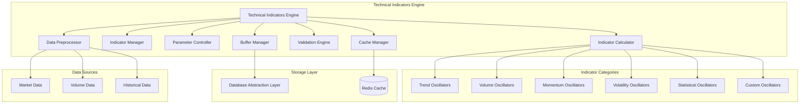

# Technical Indicators Engine Module Specification

## Module Overview

The Technical Indicators Engine is a high-performance, modular system for calculating technical indicators from market data. It provides real-time and batch calculation capabilities with extensive indicator support, customizable parameters, and efficient caching mechanisms for trading strategy development.

## Module Architecture



## Core Responsibilities

### Primary Functions
1. **Indicator Calculation**: Real-time and batch calculation of 100+ technical indicators
2. **Parameter Management**: Dynamic parameter configuration and optimization
3. **Data Buffering**: Efficient sliding window data management
4. **Result Caching**: High-performance caching of calculated indicators
5. **Validation**: Data quality and calculation accuracy validation
6. **Batching**: Optimized batch processing for multiple symbols/timeframes
7. **Custom Indicators**: Support for custom indicator development
8. **Performance Optimization**: SIMD and parallel processing optimizations

## Supported Technical Indicators

### Trend Indicators
```rust
pub enum TrendIndicator {
    // Moving Averages
    SMA { period: u32 },                    // Simple Moving Average
    EMA { period: u32 },                    // Exponential Moving Average
    WMA { period: u32 },                    // Weighted Moving Average
    DEMA { period: u32 },                   // Double Exponential Moving Average
    TEMA { period: u32 },                   // Triple Exponential Moving Average
    TRIMA { period: u32 },                  // Triangular Moving Average
    KAMA { period: u32 },                   // Kaufman Adaptive Moving Average
    T3 { period: u32, vfactor: f64 },       // T3 Moving Average
    
    // Trend Lines and Channels
    LinearRegression { period: u32 },        // Linear Regression Line
    TSF { period: u32 },                    // Time Series Forecast
    
    // Trend Strength
    ADX { period: u32 },                    // Average Directional Index
    ADXR { period: u32 },                   // ADX Rating
    DI { period: u32 },                     // Directional Indicator
    DMI { period: u32 },                    // Directional Movement Index
    
    // Parabolic Systems
    SAR { acceleration: f64, maximum: f64 }, // Parabolic SAR
    SAREXT { start_af: f64, increment_af: f64, max_af: f64 }, // Extended SAR
}
```

### Momentum Indicators
```rust
pub enum MomentumIndicator {
    // Rate of Change
    ROC { period: u32 },                    // Rate of Change
    ROCP { period: u32 },                   // Rate of Change Percentage
    ROCR { period: u32 },                   // Rate of Change Ratio
    MOM { period: u32 },                    // Momentum
    
    // Oscillators
    RSI { period: u32 },                    // Relative Strength Index
    STOCH { fastk_period: u32, slowk_period: u32, slowd_period: u32 }, // Stochastic
    STOCHF { fastk_period: u32, fastd_period: u32 }, // Fast Stochastic
    STOCHRSI { period: u32, fastk_period: u32, fastd_period: u32 }, // Stochastic RSI
    
    // MACD Family
    MACD { fastperiod: u32, slowperiod: u32, signalperiod: u32 }, // MACD
    MACDEXT { fastperiod: u32, slowperiod: u32, signalperiod: u32 }, // Extended MACD
    MACDFIX { signalperiod: u32 },          // Fixed MACD
    
    // Williams
    WILLR { period: u32 },                  // Williams %R
    
    // Ultimate Oscillator
    ULTOSC { timeperiod1: u32, timeperiod2: u32, timeperiod3: u32 }, // Ultimate Oscillator
    
    // Commodity Channel Index
    CCI { period: u32 },                    // Commodity Channel Index
    
    // Detrended Price Oscillator
    DPO { period: u32 },                    // Detrended Price Oscillator
    
    // TRIX
    TRIX { period: u32 },                   // TRIX
}
```

### Volume Indicators
```rust
pub enum VolumeIndicator {
    // Volume Moving Averages
    VWMA { period: u32 },                   // Volume Weighted Moving Average
    VWAP,                                   // Volume Weighted Average Price
    
    // Accumulation/Distribution
    AD,                                     // Accumulation/Distribution Line
    ADOSC { fastperiod: u32, slowperiod: u32 }, // A/D Oscillator
    
    // On Balance Volume
    OBV,                                    // On Balance Volume
    
    // Volume Oscillators
    VOSC { fastperiod: u32, slowperiod: u32 }, // Volume Oscillator
    
    // Money Flow
    MFI { period: u32 },                    // Money Flow Index
    CMF { period: u32 },                    // Chaikin Money Flow
    
    // Volume Rate of Change
    VROC { period: u32 },                   // Volume Rate of Change
    
    // Price Volume Trend
    PVT,                                    // Price Volume Trend
    
    // Negative Volume Index
    NVI,                                    // Negative Volume Index
    PVI,                                    // Positive Volume Index
}
```

### Volatility Indicators
```rust
pub enum VolatilityIndicator {
    // Standard Deviation
    STDDEV { period: u32 },                 // Standard Deviation
    VAR { period: u32 },                    // Variance
    
    // Bollinger Bands
    BBANDS { period: u32, deviation: f64 }, // Bollinger Bands
    
    // Average True Range
    ATR { period: u32 },                    // Average True Range
    NATR { period: u32 },                   // Normalized ATR
    TRANGE,                                 // True Range
    
    // Donchian Channel
    DONCHIAN { period: u32 },               // Donchian Channel
    
    // Keltner Channel
    KELTNER { period: u32, multiplier: f64 }, // Keltner Channel
    
    // Chaikin Volatility
    CHAIKINVOL { period: u32 },             // Chaikin Volatility
    
    // Historical Volatility
    HV { period: u32 },                     // Historical Volatility
    
    // Volatility System
    VOLSYS { period: u32 },                 // Volatility System
}
```

### Statistical Indicators
```rust
pub enum StatisticalIndicator {
    // Correlation
    CORREL { period: u32 },                 // Correlation Coefficient
    
    // Beta
    BETA { period: u32 },                   // Beta
    
    // Linear Regression
    LINEARREG { period: u32 },              // Linear Regression
    LINEARREG_ANGLE { period: u32 },        // Linear Regression Angle
    LINEARREG_INTERCEPT { period: u32 },    // Linear Regression Intercept
    LINEARREG_SLOPE { period: u32 },        // Linear Regression Slope
    
    // Statistical Functions
    MAX { period: u32 },                    // Maximum
    MIN { period: u32 },                    // Minimum
    MAXINDEX { period: u32 },               // Index of Maximum
    MININDEX { period: u32 },               // Index of Minimum
    MINMAX { period: u32 },                 // Min/Max
    MINMAXINDEX { period: u32 },            // Min/Max Index
    
    // Sum and Average
    SUM { period: u32 },                    // Sum
    AVGPRICE,                               // Average Price
    MEDPRICE,                               // Median Price
    TYPPRICE,                               // Typical Price
    WCLPRICE,                               // Weighted Close Price
}
```

## Data Structures

### Input Data Structures
```rust
#[derive(Debug, Clone, Serialize, Deserialize)]
pub struct OHLCVData {
    pub timestamp: DateTime<Utc>,
    pub open: f64,
    pub high: f64,
    pub low: f64,
    pub close: f64,
    pub volume: u64,
}

#[derive(Debug, Clone, Serialize, Deserialize)]
pub struct IndicatorRequest {
    pub symbol: String,
    pub indicator: IndicatorType,
    pub parameters: IndicatorParameters,
    pub timeframe: Timeframe,
    pub period_start: Option<DateTime<Utc>>,
    pub period_end: Option<DateTime<Utc>>,
    pub data_points: Option<u32>,
}

#[derive(Debug, Clone, Serialize, Deserialize)]
pub enum IndicatorType {
    Trend(TrendIndicator),
    Momentum(MomentumIndicator),
    Volume(VolumeIndicator),
    Volatility(VolatilityIndicator),
    Statistical(StatisticalIndicator),
    Custom(String),
}

#[derive(Debug, Clone, Serialize, Deserialize)]
pub struct IndicatorParameters {
    pub params: HashMap<String, f64>,
    pub use_cache: bool,
    pub force_recalculate: bool,
}

#[derive(Debug, Clone, Serialize, Deserialize)]
pub enum Timeframe {
    Minute1,
    Minute5,
    Minute15,
    Minute30,
    Hour1,
    Hour4,
    Day1,
    Week1,
    Month1,
}
```

### Output Data Structures
```rust
#[derive(Debug, Clone, Serialize, Deserialize)]
pub struct IndicatorResult {
    pub symbol: String,
    pub indicator_type: IndicatorType,
    pub timeframe: Timeframe,
    pub values: Vec<IndicatorValue>,
    pub metadata: CalculationMetadata,
    pub quality_score: u8,
}

#[derive(Debug, Clone, Serialize, Deserialize)]
pub struct IndicatorValue {
    pub timestamp: DateTime<Utc>,
    pub value: f64,
    pub confidence: Option<f32>,
    pub additional_data: HashMap<String, f64>, // For multi-value indicators
}

#[derive(Debug, Clone, Serialize, Deserialize)]
pub struct CalculationMetadata {
    pub calculation_time_ms: u64,
    pub data_points_used: u32,
    pub cache_hit: bool,
    pub algorithm_version: String,
    pub parameters_used: HashMap<String, f64>,
    pub warnings: Vec<String>,
}

// Batch calculation results
#[derive(Debug, Clone, Serialize, Deserialize)]
pub struct BatchIndicatorResult {
    pub batch_id: String,
    pub completed_count: u32,
    pub failed_count: u32,
    pub total_time_ms: u64,
    pub results: HashMap<String, IndicatorResult>, // symbol -> result
    pub errors: HashMap<String, String>, // symbol -> error
}
```

## Core Implementation

### Indicator Calculator Interface
```rust
pub trait IndicatorCalculator: Send + Sync {
    fn name(&self) -> &'static str;
    fn required_data_points(&self) -> u32;
    fn parameters(&self) -> Vec<ParameterDefinition>;
    
    async fn calculate(
        &self,
        data: &[OHLCVData],
        parameters: &IndicatorParameters,
    ) -> Result<Vec<IndicatorValue>, IndicatorError>;
    
    fn validate_parameters(&self, params: &IndicatorParameters) -> Result<(), IndicatorError>;
}

// Example RSI implementation
pub struct RSICalculator;

impl IndicatorCalculator for RSICalculator {
    fn name(&self) -> &'static str {
        "RSI"
    }
    
    fn required_data_points(&self) -> u32 {
        100 // Need more data for accurate calculation
    }
    
    fn parameters(&self) -> Vec<ParameterDefinition> {
        vec![
            ParameterDefinition {
                name: "period".to_string(),
                default_value: 14.0,
                min_value: Some(2.0),
                max_value: Some(200.0),
                description: "RSI calculation period".to_string(),
            }
        ]
    }
    
    async fn calculate(
        &self,
        data: &[OHLCVData],
        parameters: &IndicatorParameters,
    ) -> Result<Vec<IndicatorValue>, IndicatorError> {
        let period = parameters.params.get("period")
            .copied()
            .unwrap_or(14.0) as usize;
            
        if data.len() < period + 1 {
            return Err(IndicatorError::InsufficientData {
                required: period + 1,
                available: data.len(),
            });
        }
        
        let mut rsi_values = Vec::new();
        let mut gains = Vec::new();
        let mut losses = Vec::new();
        
        // Calculate price changes
        for window in data.windows(2) {
            let change = window[1].close - window[0].close;
            gains.push(if change > 0.0 { change } else { 0.0 });
            losses.push(if change < 0.0 { -change } else { 0.0 });
        }
        
        // Calculate initial averages
        let mut avg_gain = gains[..period].iter().sum::<f64>() / period as f64;
        let mut avg_loss = losses[..period].iter().sum::<f64>() / period as f64;
        
        // Calculate smoothed averages and RSI
        for i in period..gains.len() {
            avg_gain = ((avg_gain * (period - 1) as f64) + gains[i]) / period as f64;
            avg_loss = ((avg_loss * (period - 1) as f64) + losses[i]) / period as f64;
            
            let rs = if avg_loss != 0.0 { avg_gain / avg_loss } else { 100.0 };
            let rsi = 100.0 - (100.0 / (1.0 + rs));
            
            rsi_values.push(IndicatorValue {
                timestamp: data[i + 1].timestamp,
                value: rsi,
                confidence: Some(self.calculate_confidence(rsi)),
                additional_data: HashMap::new(),
            });
        }
        
        Ok(rsi_values)
    }
}

impl RSICalculator {
    fn calculate_confidence(&self, rsi: f64) -> f32 {
        // Higher confidence near extremes (oversold/overbought)
        let normalized = (rsi - 50.0).abs() / 50.0; // 0-1 scale
        (0.5 + normalized * 0.5) as f32
    }
}
```

### Buffer Management System
```rust
pub struct BufferManager {
    buffers: HashMap<String, CircularBuffer<OHLCVData>>,
    max_buffer_size: usize,
    buffer_retention: Duration,
}

impl BufferManager {
    pub fn new(max_buffer_size: usize, retention: Duration) -> Self {
        Self {
            buffers: HashMap::new(),
            max_buffer_size,
            buffer_retention: retention,
        }
    }
    
    pub fn update_data(&mut self, symbol: &str, data: OHLCVData) {
        let buffer = self.buffers
            .entry(symbol.to_string())
            .or_insert_with(|| CircularBuffer::new(self.max_buffer_size));
            
        buffer.push(data);
        
        // Clean old data
        buffer.retain(|item| {
            Utc::now() - item.timestamp < self.buffer_retention
        });
    }
    
    pub fn get_data(
        &self,
        symbol: &str,
        required_points: u32,
    ) -> Option<Vec<OHLCVData>> {
        self.buffers.get(symbol)
            .and_then(|buffer| {
                if buffer.len() >= required_points as usize {
                    Some(buffer.as_slice().to_vec())
                } else {
                    None
                }
            })
    }
    
    pub fn get_latest(&self, symbol: &str) -> Option<&OHLCVData> {
        self.buffers.get(symbol)
            .and_then(|buffer| buffer.back())
    }
}

pub struct CircularBuffer<T> {
    data: VecDeque<T>,
    capacity: usize,
}

impl<T> CircularBuffer<T> {
    pub fn new(capacity: usize) -> Self {
        Self {
            data: VecDeque::with_capacity(capacity),
            capacity,
        }
    }
    
    pub fn push(&mut self, item: T) {
        if self.data.len() >= self.capacity {
            self.data.pop_front();
        }
        self.data.push_back(item);
    }
    
    pub fn as_slice(&self) -> Vec<&T> {
        self.data.iter().collect()
    }
    
    pub fn len(&self) -> usize {
        self.data.len()
    }
    
    pub fn back(&self) -> Option<&T> {
        self.data.back()
    }
    
    pub fn retain<F>(&mut self, mut f: F)
    where
        F: FnMut(&T) -> bool,
    {
        self.data.retain(|item| f(item));
    }
}
```

### Caching Strategy
```rust
pub struct IndicatorCacheManager {
    redis_client: redis::Client,
    cache_ttl: Duration,
    compression_enabled: bool,
}

impl IndicatorCacheManager {
    pub async fn get_cached_result(
        &self,
        symbol: &str,
        indicator_type: &IndicatorType,
        parameters: &IndicatorParameters,
        timeframe: &Timeframe,
    ) -> Result<Option<IndicatorResult>, CacheError> {
        let cache_key = self.generate_cache_key(symbol, indicator_type, parameters, timeframe);
        
        let mut conn = self.redis_client.get_async_connection().await?;
        
        if let Some(cached_data) = redis::cmd("GET")
            .arg(&cache_key)
            .query_async::<_, Option<Vec<u8>>>(&mut conn)
            .await? {
            
            let decompressed = if self.compression_enabled {
                self.decompress(&cached_data)?
            } else {
                cached_data
            };
            
            let result: IndicatorResult = bincode::deserialize(&decompressed)?;
            return Ok(Some(result));
        }
        
        Ok(None)
    }
    
    pub async fn cache_result(
        &self,
        symbol: &str,
        indicator_type: &IndicatorType,
        parameters: &IndicatorParameters,
        timeframe: &Timeframe,
        result: &IndicatorResult,
    ) -> Result<(), CacheError> {
        let cache_key = self.generate_cache_key(symbol, indicator_type, parameters, timeframe);
        
        let serialized = bincode::serialize(result)?;
        let data = if self.compression_enabled {
            self.compress(&serialized)?
        } else {
            serialized
        };
        
        let mut conn = self.redis_client.get_async_connection().await?;
        
        redis::cmd("SETEX")
            .arg(&cache_key)
            .arg(self.cache_ttl.as_secs())
            .arg(&data)
            .query_async::<_, ()>(&mut conn)
            .await?;
            
        Ok(())
    }
    
    fn generate_cache_key(
        &self,
        symbol: &str,
        indicator_type: &IndicatorType,
        parameters: &IndicatorParameters,
        timeframe: &Timeframe,
    ) -> String {
        use std::collections::hash_map::DefaultHasher;
        use std::hash::{Hash, Hasher};
        
        let mut hasher = DefaultHasher::new();
        symbol.hash(&mut hasher);
        indicator_type.hash(&mut hasher);
        parameters.hash(&mut hasher);
        timeframe.hash(&mut hasher);
        
        format!("indicator:{}:{:x}", symbol, hasher.finish())
    }
}
```

## API Endpoints

### Internal API Interface
```rust
#[derive(OpenApi)]
struct TechnicalIndicatorsApi;

#[utoipa::path(
    post,
    path = "/api/v1/internal/indicators/calculate",
    request_body = IndicatorRequest,
    responses(
        (status = 200, description = "Indicator calculated", body = IndicatorResult),
        (status = 400, description = "Invalid parameters"),
        (status = 500, description = "Calculation error")
    )
)]
pub async fn calculate_indicator(
    State(engine): State<TechnicalIndicatorsEngine>,
    Json(request): Json<IndicatorRequest>,
) -> Result<Json<IndicatorResult>, IndicatorError>;

#[utoipa::path(
    post,
    path = "/api/v1/internal/indicators/batch",
    request_body = BatchIndicatorRequest,
    responses(
        (status = 200, description = "Batch calculation completed", body = BatchIndicatorResult)
    )
)]
pub async fn calculate_batch_indicators(
    State(engine): State<TechnicalIndicatorsEngine>,
    Json(request): Json<BatchIndicatorRequest>,
) -> Result<Json<BatchIndicatorResult>, IndicatorError>;

#[utoipa::path(
    get,
    path = "/api/v1/internal/indicators/latest/{symbol}",
    params(
        ("symbol" = String, Path, description = "Stock symbol"),
        ("indicators" = Option<Vec<String>>, Query, description = "Specific indicators")
    ),
    responses(
        (status = 200, description = "Latest indicator values", body = HashMap<String, IndicatorValue>)
    )
)]
pub async fn get_latest_indicators(
    State(engine): State<TechnicalIndicatorsEngine>,
    Path(symbol): Path<String>,
    Query(params): Query<LatestIndicatorParams>,
) -> Result<Json<HashMap<String, IndicatorValue>>, IndicatorError>;

#[utoipa::path(
    get,
    path = "/api/v1/internal/indicators/supported",
    responses(
        (status = 200, description = "Supported indicators", body = Vec<IndicatorInfo>)
    )
)]
pub async fn get_supported_indicators(
    State(engine): State<TechnicalIndicatorsEngine>,
) -> Result<Json<Vec<IndicatorInfo>>, IndicatorError>;
```

## Configuration

### Service Configuration
```toml
[technical_indicators]
service_name = "technical-indicators-engine"
port = 8082
worker_threads = 8
max_concurrent_calculations = 200

[calculation]
default_buffer_size = 1000
buffer_retention_hours = 24
enable_simd = true
enable_parallel_processing = true
max_batch_size = 100

[caching]
enable_redis_cache = true
cache_ttl_seconds = 300
enable_compression = true
compression_level = 6

[data_sources]
market_data_service = "market-data-ingestion"
historical_data_lookback_days = 365
min_data_points = 50

[performance]
calculation_timeout_seconds = 30
memory_limit_mb = 2048
enable_performance_profiling = true

[validation]
enable_data_validation = true
outlier_detection_threshold = 3.0
missing_data_tolerance = 0.05
```

## Performance Requirements

### Latency Targets
- **Single Indicator**: < 10ms for cached results
- **Single Indicator**: < 100ms for calculated results
- **Batch Calculation**: < 5 seconds for 50 indicators
- **Real-time Update**: < 50ms for buffer updates

### Throughput Targets
- **Calculations**: 10,000 indicator calculations per minute
- **Concurrent Requests**: 100 simultaneous calculations
- **Data Updates**: 1,000 symbol updates per second

### Resource Utilization
- **Memory**: < 1GB under normal load
- **CPU**: Utilize SIMD instructions for optimization
- **Cache**: > 90% cache hit rate for frequently requested indicators

## Error Handling and Dependencies

### Error Types
```rust
#[derive(Error, Debug)]
pub enum IndicatorError {
    #[error("Insufficient data: required {required}, available {available}")]
    InsufficientData { required: usize, available: usize },
    
    #[error("Invalid parameters: {parameter} = {value}")]
    InvalidParameters { parameter: String, value: String },
    
    #[error("Calculation timeout: {indicator} took > {timeout_ms}ms")]
    CalculationTimeout { indicator: String, timeout_ms: u64 },
    
    #[error("Data quality error: {issue}")]
    DataQuality { issue: String },
    
    #[error("Cache error: {operation}")]
    CacheError { operation: String },
    
    #[error("Unknown indicator: {name}")]
    UnknownIndicator { name: String },
}
```

### Dependencies
- **Database Abstraction Layer**: Historical market data
- **Redis Cache**: Indicator result caching
- **Configuration Manager**: Parameter management
- **Market Data Ingestion**: Real-time data updates

This Technical Indicators Engine provides a comprehensive, high-performance foundation for technical analysis in the QuantumTrade AI system, enabling sophisticated trading strategies through reliable and efficient indicator calculations.