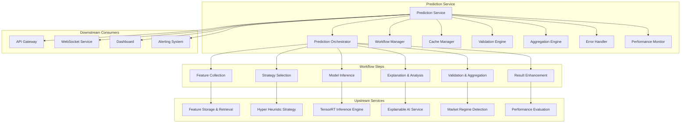

# Prediction Service Module Specification

## Module Overview

The Prediction Service is the central orchestration layer that coordinates all components of the QuantumTrade AI system to deliver comprehensive trading predictions. It manages the end-to-end prediction workflow from feature retrieval through model inference to explainable results, implementing sophisticated caching, error handling, and performance optimization strategies.

## Module Architecture



## Core Responsibilities

### Primary Functions
1. **Prediction Orchestration**: Coordinate the complete prediction pipeline workflow
2. **Feature Integration**: Aggregate features from multiple sources with consistency checks
3. **Strategy Coordination**: Interface with strategy selection for optimal model routing
4. **Model Ensemble**: Combine predictions from multiple models when applicable
5. **Quality Assurance**: Validate predictions against business rules and quality thresholds
6. **Result Enhancement**: Enrich predictions with explanations, confidence metrics, and context
7. **Performance Optimization**: Implement caching, batching, and parallel processing
8. **Error Recovery**: Robust error handling with fallback strategies and graceful degradation

## Data Structures

### Prediction Request/Response
```rust
#[derive(Debug, Clone, Serialize, Deserialize)]
pub struct PredictionRequest {
    pub request_id: String,
    pub symbol: String,
    pub prediction_horizon: PredictionHorizon,
    pub prediction_type: PredictionType,
    pub include_explanations: bool,
    pub include_confidence_intervals: bool,
    pub include_alternatives: bool,
    pub strategy_preferences: Option<StrategyPreferences>,
    pub risk_constraints: Option<RiskConstraints>,
    pub timestamp: Option<DateTime<Utc>>,
    pub client_metadata: ClientMetadata,
}

#[derive(Debug, Clone, Serialize, Deserialize)]
pub enum PredictionHorizon {
    Minute(u32),        // 1-60 minutes
    Hour(u32),          // 1-24 hours
    Day(u32),           // 1-30 days
    Week(u32),          // 1-52 weeks
    Custom(Duration),   // Custom duration
}

#[derive(Debug, Clone, Serialize, Deserialize)]
pub enum PredictionType {
    Price {
        target_type: PriceTarget,
        confidence_level: f64,
    },
    Direction {
        classification_type: DirectionClassification,
        probability_threshold: f64,
    },
    Volatility {
        volatility_measure: VolatilityMeasure,
        percentile_range: (f64, f64),
    },
    Signal {
        signal_type: SignalType,
        strength_threshold: f64,
    },
    Risk {
        risk_metric: RiskMetric,
        risk_horizon: Duration,
    },
}

#[derive(Debug, Clone, Serialize, Deserialize)]
pub enum PriceTarget {
    Absolute,           // Absolute price value
    Relative,           // Percentage change
    LogReturns,         // Log returns
    Standardized,       // Z-score relative to history
}

#[derive(Debug, Clone, Serialize, Deserialize)]
pub enum DirectionClassification {
    Binary,             // Up/Down
    Ternary,            // Up/Neutral/Down
    Quintile,           // Strong Up/Up/Neutral/Down/Strong Down
}

#[derive(Debug, Clone, Serialize, Deserialize)]
pub struct StrategyPreferences {
    pub preferred_strategies: Vec<String>,
    pub excluded_strategies: Vec<String>,
    pub strategy_weights: HashMap<String, f64>,
    pub allow_ensemble: bool,
}

#[derive(Debug, Clone, Serialize, Deserialize)]
pub struct ClientMetadata {
    pub client_id: String,
    pub client_type: ClientType,
    pub priority: RequestPriority,
    pub rate_limit_tier: String,
    pub request_source: String,
}

#[derive(Debug, Clone, Serialize, Deserialize)]
pub enum ClientType {
    WebInterface,       // Web dashboard
    APIClient,          // Direct API consumer
    AlgorithmicTrader,  // Automated trading system
    Backtester,         // Backtesting system
    DataAnalyst,        // Analysis tools
}

#[derive(Debug, Clone, Serialize, Deserialize)]
pub enum RequestPriority {
    Low,
    Normal,
    High,
    Critical,
    RealTime,
}

#[derive(Debug, Clone, Serialize, Deserialize)]
pub struct PredictionResponse {
    pub request_id: String,
    pub prediction_id: String,
    pub symbol: String,
    pub predictions: Vec<Prediction>,
    pub ensemble_metadata: Option<EnsembleMetadata>,
    pub explanations: Option<PredictionExplanations>,
    pub confidence_metrics: ConfidenceMetrics,
    pub alternative_scenarios: Vec<AlternativeScenario>,
    pub market_context: MarketContext,
    pub performance_metadata: PredictionPerformanceMetadata,
    pub warnings: Vec<PredictionWarning>,
    pub timestamp: DateTime<Utc>,
}

#[derive(Debug, Clone, Serialize, Deserialize)]
pub struct Prediction {
    pub prediction_type: PredictionType,
    pub value: f64,
    pub confidence: f64,
    pub confidence_interval: Option<(f64, f64)>,
    pub model_metadata: ModelMetadata,
    pub feature_attributions: Option<HashMap<String, f64>>,
    pub prediction_quality_score: f64,
}

#[derive(Debug, Clone, Serialize, Deserialize)]
pub struct EnsembleMetadata {
    pub ensemble_method: EnsembleMethod,
    pub model_weights: HashMap<String, f64>,
    pub diversity_score: f64,
    pub consensus_level: f64,
    pub individual_predictions: HashMap<String, f64>,
}

#[derive(Debug, Clone, Serialize, Deserialize)]
pub enum EnsembleMethod {
    WeightedAverage,
    MedianBlend,
    StackedGeneralization,
    BayesianAveraging,
    DynamicWeighting,
    VotingClassifier,
}

#[derive(Debug, Clone, Serialize, Deserialize)]
pub struct PredictionExplanations {
    pub primary_explanation: String,
    pub key_factors: Vec<KeyFactor>,
    pub supporting_evidence: Vec<Evidence>,
    pub alternative_interpretations: Vec<String>,
    pub explanation_confidence: f64,
}

#[derive(Debug, Clone, Serialize, Deserialize)]
pub struct KeyFactor {
    pub factor_name: String,
    pub importance: f64,
    pub contribution: f64,
    pub current_value: f64,
    pub historical_context: String,
    pub interpretation: String,
}

#[derive(Debug, Clone, Serialize, Deserialize)]
pub struct ConfidenceMetrics {
    pub prediction_confidence: f64,
    pub model_confidence: f64,
    pub data_quality_confidence: f64,
    pub regime_stability_confidence: f64,
    pub overall_confidence: f64,
    pub confidence_breakdown: HashMap<String, f64>,
}

#[derive(Debug, Clone, Serialize, Deserialize)]
pub struct AlternativeScenario {
    pub scenario_name: String,
    pub probability: f64,
    pub predicted_value: f64,
    pub key_assumptions: Vec<String>,
    pub scenario_description: String,
}

#[derive(Debug, Clone, Serialize, Deserialize)]
pub struct PredictionWarning {
    pub warning_type: WarningType,
    pub severity: WarningSeverity,
    pub message: String,
    pub recommendation: String,
}

#[derive(Debug, Clone, Serialize, Deserialize)]
pub enum WarningType {
    DataQuality,
    ModelUncertainty,
    RegimeChange,
    HighVolatility,
    LowLiquidity,
    StaleData,
    OutOfSample,
}

#[derive(Debug, Clone, Serialize, Deserialize)]
pub enum WarningSeverity {
    Info,
    Warning,
    Critical,
}
```

## Core Implementation

### Prediction Orchestrator
```rust
pub struct PredictionOrchestrator {
    feature_client: Arc<FeatureStorageClient>,
    strategy_client: Arc<HyperHeuristicClient>,
    inference_client: Arc<TensorRTInferenceClient>,
    explanation_client: Arc<ExplainableAIClient>,
    regime_client: Arc<MarketRegimeClient>,
    cache_manager: Arc<PredictionCacheManager>,
    validation_engine: Arc<ValidationEngine>,
    performance_monitor: Arc<PerformanceMonitor>,
    config: PredictionServiceConfig,
}

impl PredictionOrchestrator {
    pub async fn generate_prediction(
        &self,
        request: PredictionRequest,
    ) -> Result<PredictionResponse, PredictionError> {
        let start_time = Instant::now();
        let prediction_id = self.generate_prediction_id(&request);
        
        info!("Starting prediction workflow for {} (ID: {})", request.symbol, prediction_id);
        
        // Check cache first
        if let Some(cached_prediction) = self.check_cache(&request).await? {
            info!("Returning cached prediction for {}", request.symbol);
            return Ok(cached_prediction);
        }
        
        // Initialize workflow context
        let mut workflow_context = WorkflowContext::new(&request, &prediction_id);
        
        // Step 1: Market Regime Detection
        let market_regime = self.detect_market_regime(&request, &mut workflow_context).await?;
        
        // Step 2: Feature Collection and Validation
        let features = self.collect_and_validate_features(&request, &mut workflow_context).await?;
        
        // Step 3: Strategy Selection
        let selected_strategy = self.select_strategy(&request, &market_regime, &mut workflow_context).await?;
        
        // Step 4: Model Inference (potentially ensemble)
        let raw_predictions = self.run_model_inference(&request, &features, &selected_strategy, &mut workflow_context).await?;
        
        // Step 5: Prediction Validation and Quality Checks
        let validated_predictions = self.validate_predictions(&raw_predictions, &features, &mut workflow_context).await?;
        
        // Step 6: Generate Explanations (if requested)
        let explanations = if request.include_explanations {
            Some(self.generate_explanations(&validated_predictions, &features, &mut workflow_context).await?)
        } else {
            None
        };
        
        // Step 7: Calculate Confidence Metrics
        let confidence_metrics = self.calculate_confidence_metrics(&validated_predictions, &features, &market_regime, &mut workflow_context).await?;
        
        // Step 8: Generate Alternative Scenarios (if requested)
        let alternative_scenarios = if request.include_alternatives {
            self.generate_alternative_scenarios(&validated_predictions, &features, &mut workflow_context).await?
        } else {
            Vec::new()
        };
        
        // Step 9: Assemble Final Response
        let prediction_response = PredictionResponse {
            request_id: request.request_id.clone(),
            prediction_id: prediction_id.clone(),
            symbol: request.symbol.clone(),
            predictions: validated_predictions,
            ensemble_metadata: workflow_context.ensemble_metadata,
            explanations,
            confidence_metrics,
            alternative_scenarios,
            market_context: MarketContext {
                regime: market_regime,
                volatility_environment: workflow_context.volatility_environment,
                liquidity_conditions: workflow_context.liquidity_conditions,
                sentiment_backdrop: workflow_context.sentiment_backdrop,
            },
            performance_metadata: PredictionPerformanceMetadata {
                total_processing_time_ms: start_time.elapsed().as_millis() as u64,
                feature_collection_time_ms: workflow_context.feature_collection_time,
                model_inference_time_ms: workflow_context.model_inference_time,
                explanation_time_ms: workflow_context.explanation_time,
                components_used: workflow_context.components_used,
            },
            warnings: workflow_context.warnings,
            timestamp: Utc::now(),
        };
        
        // Cache the result
        self.cache_prediction(&request, &prediction_response).await?;
        
        // Record performance metrics
        self.performance_monitor.record_prediction_request(
            &request,
            &prediction_response,
            start_time.elapsed(),
        ).await;
        
        info!("Prediction workflow completed for {} in {:.2}s", 
            request.symbol, start_time.elapsed().as_secs_f64());
        
        Ok(prediction_response)
    }
    
    async fn detect_market_regime(
        &self,
        request: &PredictionRequest,
        context: &mut WorkflowContext,
    ) -> Result<MarketRegime, PredictionError> {
        let regime_start = Instant::now();
        
        let regime_request = RegimeDetectionRequest {
            symbols: vec![request.symbol.clone()],
            detection_methods: vec![DetectionMethod::EnsembleMethod],
            lookback_periods: [("technical".to_string(), 100)].into_iter().collect(),
            confidence_threshold: 0.7,
            include_predictions: false,
        };
        
        let regime_result = self.regime_client
            .detect_market_regime(regime_request).await
            .map_err(|e| PredictionError::RegimeDetectionFailed {
                symbol: request.symbol.clone(),
                error: e.to_string(),
            })?;
        
        context.regime_detection_time = regime_start.elapsed().as_millis() as u64;
        context.components_used.push("market_regime_detection".to_string());
        
        Ok(regime_result.current_regimes.overall_regime)
    }
    
    async fn collect_and_validate_features(
        &self,
        request: &PredictionRequest,
        context: &mut WorkflowContext,
    ) -> Result<FeatureCollection, PredictionError> {
        let feature_start = Instant::now();
        
        // Determine required features based on prediction type
        let required_features = self.determine_required_features(&request.prediction_type);
        
        // Request features from feature service
        let feature_request = FeatureRequest {
            entity_ids: vec![request.symbol.clone()],
            feature_names: required_features,
            timestamp: request.timestamp,
            time_range: None,
            include_metadata: true,
            normalization_method: Some(FeatureNormalization::StandardScaling),
            fill_method: FillMethod::Forward,
        };
        
        let feature_response = self.feature_client
            .get_features(feature_request).await
            .map_err(|e| PredictionError::FeatureCollectionFailed {
                symbol: request.symbol.clone(),
                error: e.to_string(),
            })?;
        
        // Validate feature quality
        let features = feature_response.entity_features
            .get(&request.symbol)
            .ok_or_else(|| PredictionError::FeatureCollectionFailed {
                symbol: request.symbol.clone(),
                error: "No features returned for symbol".to_string(),
            })?;
        
        // Check feature completeness
        if feature_response.missing_features.len() > 5 {
            context.warnings.push(PredictionWarning {
                warning_type: WarningType::DataQuality,
                severity: WarningSeverity::Warning,
                message: format!("Missing {} features", feature_response.missing_features.len()),
                recommendation: "Prediction may be less accurate due to missing features".to_string(),
            });
        }
        
        // Check data freshness
        let data_age = Utc::now() - features.timestamp;
        if data_age > Duration::minutes(10) {
            context.warnings.push(PredictionWarning {
                warning_type: WarningType::StaleData,
                severity: WarningSeverity::Info,
                message: format!("Data is {} minutes old", data_age.num_minutes()),
                recommendation: "Consider refreshing data for more accurate predictions".to_string(),
            });
        }
        
        context.feature_collection_time = feature_start.elapsed().as_millis() as u64;
        context.components_used.push("feature_storage_retrieval".to_string());
        
        Ok(FeatureCollection {
            features: features.clone(),
            feature_metadata: feature_response.computation_metadata,
            quality_score: features.metadata.quality_score,
            completeness: features.metadata.completeness,
        })
    }
    
    async fn select_strategy(
        &self,
        request: &PredictionRequest,
        market_regime: &MarketRegime,
        context: &mut WorkflowContext,
    ) -> Result<SelectedStrategy, PredictionError> {
        let strategy_start = Instant::now();
        
        // Build strategy context
        let strategy_context = StrategyContext {
            symbol: request.symbol.clone(),
            timestamp: request.timestamp.unwrap_or_else(Utc::now),
            market_regime: market_regime.clone(),
            market_conditions: MarketConditions {
                volatility_regime: market_regime.volatility_regime.to_string(),
                trend_strength: 0.5, // Would be extracted from features
                correlation_environment: 0.6,
                liquidity_conditions: 0.8,
                sentiment_score: 0.5,
                macro_indicators: HashMap::new(),
            },
            portfolio_context: PortfolioContext {
                current_positions: HashMap::new(),
                available_capital: 1000000.0, // Default
                portfolio_volatility: 0.12,
                concentration_limits: HashMap::new(),
                sector_exposure: HashMap::new(),
            },
            risk_constraints: request.risk_constraints.clone().unwrap_or_default(),
            performance_history: PerformanceHistory {
                strategy_returns: HashMap::new(),
                regime_performance: HashMap::new(),
                risk_metrics: HashMap::new(),
                recent_performance: HashMap::new(),
            },
        };
        
        let strategy_request = StrategySelectionRequest {
            context: strategy_context,
            preferences: request.strategy_preferences.clone(),
        };
        
        let selected_strategy = self.strategy_client
            .select_strategy(strategy_request).await
            .map_err(|e| PredictionError::StrategySelectionFailed {
                symbol: request.symbol.clone(),
                error: e.to_string(),
            })?;
        
        context.strategy_selection_time = strategy_start.elapsed().as_millis() as u64;
        context.components_used.push("hyper_heuristic_strategy".to_string());
        
        Ok(selected_strategy)
    }
    
    async fn run_model_inference(
        &self,
        request: &PredictionRequest,
        features: &FeatureCollection,
        strategy: &SelectedStrategy,
        context: &mut WorkflowContext,
    ) -> Result<Vec<Prediction>, PredictionError> {
        let inference_start = Instant::now();
        
        // Prepare inference request
        let inference_request = InferenceRequest {
            request_id: format!("{}_inference", request.request_id),
            model_name: self.determine_model_name(&strategy.strategy_type),
            model_version: None,
            input_features: self.prepare_model_input(&features.features)?,
            feature_names: features.features.features.keys().cloned().collect(),
            batch_size: 1,
            priority: match request.client_metadata.priority {
                RequestPriority::RealTime => crate::inference::RequestPriority::Critical,
                RequestPriority::High => crate::inference::RequestPriority::High,
                _ => crate::inference::RequestPriority::Normal,
            },
            timeout_ms: Some(5000),
            strategy_context: Some(StrategyContext {
                strategy_name: strategy.strategy_name.clone(),
                model_routing_hint: None,
                feature_weights: Some(strategy.parameters.clone()),
                ensemble_config: None,
            }),
        };
        
        // Check if ensemble is required
        let predictions = if self.should_use_ensemble(request, strategy) {
            self.run_ensemble_inference(&inference_request, strategy, context).await?
        } else {
            // Single model inference
            let inference_response = self.inference_client
                .predict(inference_request).await
                .map_err(|e| PredictionError::ModelInferenceFailed {
                    model_name: strategy.strategy_name.clone(),
                    error: e.to_string(),
                })?;
            
            vec![Prediction {
                prediction_type: request.prediction_type.clone(),
                value: inference_response.predictions[0].value,
                confidence: inference_response.predictions[0].confidence,
                confidence_interval: None,
                model_metadata: ModelMetadata {
                    model_name: strategy.strategy_name.clone(),
                    model_version: inference_response.model_metadata.model_version,
                    architecture: inference_response.model_metadata.architecture,
                    strategy_used: Some(strategy.strategy_name.clone()),
                },
                feature_attributions: inference_response.predictions[0].feature_contributions.clone(),
                prediction_quality_score: self.calculate_prediction_quality_score(&inference_response),
            }]
        };
        
        context.model_inference_time = inference_start.elapsed().as_millis() as u64;
        context.components_used.push("tensorrt_inference_engine".to_string());
        
        Ok(predictions)
    }
    
    async fn run_ensemble_inference(
        &self,
        base_request: &InferenceRequest,
        strategy: &SelectedStrategy,
        context: &mut WorkflowContext,
    ) -> Result<Vec<Prediction>, PredictionError> {
        // Get ensemble configuration
        let ensemble_models = self.get_ensemble_models(strategy)?;
        
        // Run inference on all ensemble models
        let mut individual_predictions = HashMap::new();
        let mut model_weights = HashMap::new();
        
        for (model_name, weight) in &ensemble_models {
            let mut model_request = base_request.clone();
            model_request.model_name = model_name.clone();
            
            let response = self.inference_client.predict(model_request).await?;
            individual_predictions.insert(model_name.clone(), response.predictions[0].value);
            model_weights.insert(model_name.clone(), *weight);
        }
        
        // Combine predictions using ensemble method
        let ensemble_method = EnsembleMethod::WeightedAverage; // Could be dynamic
        let combined_prediction = self.combine_predictions(&individual_predictions, &model_weights, &ensemble_method)?;
        
        // Calculate ensemble metrics
        let diversity_score = self.calculate_ensemble_diversity(&individual_predictions);
        let consensus_level = self.calculate_consensus_level(&individual_predictions);
        
        context.ensemble_metadata = Some(EnsembleMetadata {
            ensemble_method,
            model_weights,
            diversity_score,
            consensus_level,
            individual_predictions,
        });
        
        Ok(vec![combined_prediction])
    }
    
    async fn validate_predictions(
        &self,
        predictions: &[Prediction],
        features: &FeatureCollection,
        context: &mut WorkflowContext,
    ) -> Result<Vec<Prediction>, PredictionError> {
        let validation_start = Instant::now();
        let mut validated_predictions = predictions.to_vec();
        
        for prediction in &mut validated_predictions {
            // Range validation
            if !self.is_prediction_in_valid_range(prediction) {
                context.warnings.push(PredictionWarning {
                    warning_type: WarningType::OutOfSample,
                    severity: WarningSeverity::Warning,
                    message: "Prediction value outside expected range".to_string(),
                    recommendation: "Review input features and model performance".to_string(),
                });
            }
            
            // Confidence validation
            if prediction.confidence < 0.3 {
                context.warnings.push(PredictionWarning {
                    warning_type: WarningType::ModelUncertainty,
                    severity: WarningSeverity::Warning,
                    message: format!("Low prediction confidence: {:.2}", prediction.confidence),
                    recommendation: "Consider waiting for more data or using alternative models".to_string(),
                });
            }
            
            // Feature quality impact
            if features.quality_score < 0.7 {
                prediction.prediction_quality_score *= 0.9; // Reduce quality score
                context.warnings.push(PredictionWarning {
                    warning_type: WarningType::DataQuality,
                    severity: WarningSeverity::Info,
                    message: "Prediction quality affected by input data quality".to_string(),
                    recommendation: "Verify data sources and feature calculations".to_string(),
                });
            }
        }
        
        context.validation_time = validation_start.elapsed().as_millis() as u64;
        Ok(validated_predictions)
    }
    
    async fn calculate_confidence_metrics(
        &self,
        predictions: &[Prediction],
        features: &FeatureCollection,
        market_regime: &MarketRegime,
        context: &mut WorkflowContext,
    ) -> Result<ConfidenceMetrics, PredictionError> {
        let confidence_start = Instant::now();
        
        // Prediction confidence (from model)
        let prediction_confidence = predictions.iter()
            .map(|p| p.confidence)
            .fold(0.0, f64::max);
        
        // Model confidence (based on historical performance in current regime)
        let model_confidence = 0.8; // Would be calculated from performance history
        
        // Data quality confidence
        let data_quality_confidence = features.quality_score;
        
        // Regime stability confidence
        let regime_stability_confidence = match market_regime.regime_stability.transition_likelihood {
            x if x < 0.2 => 0.9,
            x if x < 0.4 => 0.7,
            x if x < 0.6 => 0.5,
            _ => 0.3,
        };
        
        // Overall confidence (weighted combination)
        let overall_confidence = 
            0.4 * prediction_confidence +
            0.3 * model_confidence +
            0.2 * data_quality_confidence +
            0.1 * regime_stability_confidence;
        
        let confidence_breakdown = [
            ("prediction_confidence".to_string(), prediction_confidence),
            ("model_confidence".to_string(), model_confidence),
            ("data_quality_confidence".to_string(), data_quality_confidence),
            ("regime_stability_confidence".to_string(), regime_stability_confidence),
        ].into_iter().collect();
        
        context.confidence_calculation_time = confidence_start.elapsed().as_millis() as u64;
        
        Ok(ConfidenceMetrics {
            prediction_confidence,
            model_confidence,
            data_quality_confidence,
            regime_stability_confidence,
            overall_confidence,
            confidence_breakdown,
        })
    }
    
    async fn generate_explanations(
        &self,
        predictions: &[Prediction],
        features: &FeatureCollection,
        context: &mut WorkflowContext,
    ) -> Result<PredictionExplanations, PredictionError> {
        let explanation_start = Instant::now();
        
        // Generate explanation for the primary prediction
        let primary_prediction = &predictions[0];
        
        let explanation_request = ExplanationRequest {
            request_id: format!("{}_explanation", context.prediction_id),
            prediction_id: context.prediction_id.clone(),
            explanation_types: vec![
                ExplanationType::FeatureAttribution {
                    method: AttributionMethod::SHAP,
                    scope: AttributionScope::Local,
                }
            ],
            feature_names: features.features.features.keys().cloned().collect(),
            include_visualizations: false,
            include_counterfactuals: false,
            confidence_level: 0.95,
            max_features: Some(10),
            audience: ExplanationAudience::TechnicalUser,
        };
        
        let explanation_response = self.explanation_client
            .explain_prediction(explanation_request).await
            .map_err(|e| PredictionError::ExplanationFailed {
                prediction_id: context.prediction_id.clone(),
                error: e.to_string(),
            })?;
        
        // Extract key factors from explanations
        let key_factors = self.extract_key_factors(&explanation_response.explanations[0]);
        
        // Generate primary explanation text
        let primary_explanation = self.generate_primary_explanation_text(primary_prediction, &key_factors);
        
        context.explanation_time = explanation_start.elapsed().as_millis() as u64;
        context.components_used.push("explainable_ai_service".to_string());
        
        Ok(PredictionExplanations {
            primary_explanation,
            key_factors,
            supporting_evidence: Vec::new(), // Would be populated from explanation response
            alternative_interpretations: Vec::new(),
            explanation_confidence: explanation_response.explanations[0].confidence,
        })
    }
    
    fn generate_prediction_id(&self, request: &PredictionRequest) -> String {
        format!("pred_{}_{}_{}",
            request.symbol,
            Utc::now().format("%Y%m%d_%H%M%S"),
            &request.request_id[..8]
        )
    }
    
    fn determine_required_features(&self, prediction_type: &PredictionType) -> Vec<String> {
        let mut features = vec![
            "close_price".to_string(),
            "volume".to_string(),
            "rsi_14".to_string(),
            "macd_signal".to_string(),
            "bollinger_upper".to_string(),
            "bollinger_lower".to_string(),
            "sma_20".to_string(),
            "ema_50".to_string(),
        ];
        
        match prediction_type {
            PredictionType::Volatility { .. } => {
                features.extend(vec![
                    "volatility_20d".to_string(),
                    "atr_14".to_string(),
                    "implied_volatility".to_string(),
                ]);
            },
            PredictionType::Signal { .. } => {
                features.extend(vec![
                    "momentum_10d".to_string(),
                    "sentiment_score".to_string(),
                    "news_sentiment".to_string(),
                ]);
            },
            _ => {}
        }
        
        features
    }
    
    fn should_use_ensemble(&self, request: &PredictionRequest, strategy: &SelectedStrategy) -> bool {
        // Use ensemble for high priority requests or when strategy recommends it
        match request.client_metadata.priority {
            RequestPriority::High | RequestPriority::Critical | RequestPriority::RealTime => true,
            _ => strategy.confidence < 0.8, // Use ensemble when strategy confidence is low
        }
    }
}

#[derive(Debug)]
pub struct WorkflowContext {
    pub prediction_id: String,
    pub regime_detection_time: u64,
    pub feature_collection_time: u64,
    pub strategy_selection_time: u64,
    pub model_inference_time: u64,
    pub validation_time: u64,
    pub explanation_time: u64,
    pub confidence_calculation_time: u64,
    pub components_used: Vec<String>,
    pub warnings: Vec<PredictionWarning>,
    pub ensemble_metadata: Option<EnsembleMetadata>,
    pub volatility_environment: String,
    pub liquidity_conditions: String,
    pub sentiment_backdrop: String,
}

impl WorkflowContext {
    pub fn new(request: &PredictionRequest, prediction_id: &str) -> Self {
        Self {
            prediction_id: prediction_id.to_string(),
            regime_detection_time: 0,
            feature_collection_time: 0,
            strategy_selection_time: 0,
            model_inference_time: 0,
            validation_time: 0,
            explanation_time: 0,
            confidence_calculation_time: 0,
            components_used: Vec::new(),
            warnings: Vec::new(),
            ensemble_metadata: None,
            volatility_environment: "normal".to_string(),
            liquidity_conditions: "good".to_string(),
            sentiment_backdrop: "neutral".to_string(),
        }
    }
}

#[derive(Debug, Clone)]
pub struct FeatureCollection {
    pub features: FeatureVector,
    pub feature_metadata: ComputationMetadata,
    pub quality_score: f64,
    pub completeness: f64,
}
```

## Batch Processing and Optimization

### Batch Prediction Manager
```rust
pub struct BatchPredictionManager {
    orchestrator: Arc<PredictionOrchestrator>,
    batch_config: BatchConfiguration,
    execution_queue: Arc<Mutex<VecDeque<BatchPredictionJob>>>,
    active_jobs: Arc<Mutex<HashMap<String, BatchJobHandle>>>,
}

#[derive(Debug, Clone)]
pub struct BatchConfiguration {
    pub max_batch_size: usize,
    pub max_concurrent_batches: usize,
    pub batch_timeout_minutes: u32,
    pub optimization_strategy: BatchOptimizationStrategy,
    pub priority_queuing: bool,
}

#[derive(Debug, Clone)]
pub enum BatchOptimizationStrategy {
    FirstInFirstOut,
    PriorityBased,
    SymbolGrouping,
    ResourceOptimized,
    Adaptive,
}

#[derive(Debug, Clone, Serialize, Deserialize)]
pub struct BatchPredictionRequest {
    pub batch_id: String,
    pub requests: Vec<PredictionRequest>,
    pub batch_priority: RequestPriority,
    pub completion_deadline: Option<DateTime<Utc>>,
    pub partial_results_allowed: bool,
}

#[derive(Debug, Clone, Serialize, Deserialize)]
pub struct BatchPredictionResponse {
    pub batch_id: String,
    pub responses: HashMap<String, Result<PredictionResponse, PredictionError>>,
    pub batch_metadata: BatchMetadata,
    pub completion_time: DateTime<Utc>,
    pub partial_completion: bool,
}

impl BatchPredictionManager {
    pub async fn process_batch(
        &self,
        batch_request: BatchPredictionRequest,
    ) -> Result<BatchPredictionResponse, PredictionError> {
        info!("Processing batch {} with {} requests", 
            batch_request.batch_id, batch_request.requests.len());
        
        let start_time = Instant::now();
        
        // Optimize batch processing order
        let optimized_requests = self.optimize_batch_order(&batch_request.requests)?;
        
        // Group requests for parallel processing
        let request_groups = self.group_requests_for_parallel_processing(&optimized_requests)?;
        
        // Process groups in parallel
        let mut all_responses = HashMap::new();
        let mut completed_count = 0;
        
        for group in request_groups {
            // Check if we should continue processing
            if let Some(deadline) = batch_request.completion_deadline {
                if Utc::now() > deadline && batch_request.partial_results_allowed {
                    warn!("Batch {} deadline exceeded, returning partial results", batch_request.batch_id);
                    break;
                }
            }
            
            // Process group concurrently
            let group_tasks: Vec<_> = group.into_iter()
                .map(|request| {
                    let orchestrator = Arc::clone(&self.orchestrator);
                    tokio::spawn(async move {
                        let request_id = request.request_id.clone();
                        let result = orchestrator.generate_prediction(request).await;
                        (request_id, result)
                    })
                })
                .collect();
            
            // Wait for group completion
            for task in group_tasks {
                match task.await {
                    Ok((request_id, result)) => {
                        all_responses.insert(request_id, result);
                        completed_count += 1;
                    },
                    Err(e) => {
                        error!("Batch processing task failed: {}", e);
                        // Continue with other tasks
                    }
                }
            }
        }
        
        let batch_metadata = BatchMetadata {
            total_requests: batch_request.requests.len(),
            completed_requests: completed_count,
            failed_requests: batch_request.requests.len() - completed_count,
            processing_time_ms: start_time.elapsed().as_millis() as u64,
            optimization_strategy: self.batch_config.optimization_strategy.clone(),
        };
        
        Ok(BatchPredictionResponse {
            batch_id: batch_request.batch_id,
            responses: all_responses,
            batch_metadata,
            completion_time: Utc::now(),
            partial_completion: completed_count < batch_request.requests.len(),
        })
    }
    
    fn optimize_batch_order(&self, requests: &[PredictionRequest]) -> Result<Vec<PredictionRequest>, PredictionError> {
        let mut optimized_requests = requests.to_vec();
        
        match self.batch_config.optimization_strategy {
            BatchOptimizationStrategy::PriorityBased => {
                optimized_requests.sort_by(|a, b| {
                    b.client_metadata.priority.cmp(&a.client_metadata.priority)
                });
            },
            BatchOptimizationStrategy::SymbolGrouping => {
                optimized_requests.sort_by(|a, b| a.symbol.cmp(&b.symbol));
            },
            BatchOptimizationStrategy::ResourceOptimized => {
                // Sort by complexity (simple predictions first)
                optimized_requests.sort_by(|a, b| {
                    let complexity_a = self.estimate_request_complexity(a);
                    let complexity_b = self.estimate_request_complexity(b);
                    complexity_a.cmp(&complexity_b)
                });
            },
            _ => {
                // Keep original order for FIFO or use adaptive strategy
            }
        }
        
        Ok(optimized_requests)
    }
    
    fn group_requests_for_parallel_processing(
        &self,
        requests: &[PredictionRequest],
    ) -> Result<Vec<Vec<PredictionRequest>>, PredictionError> {
        let group_size = self.batch_config.max_batch_size.min(
            requests.len() / self.batch_config.max_concurrent_batches.max(1)
        ).max(1);
        
        let groups = requests.chunks(group_size)
            .map(|chunk| chunk.to_vec())
            .collect();
        
        Ok(groups)
    }
    
    fn estimate_request_complexity(&self, request: &PredictionRequest) -> u32 {
        let mut complexity = 1;
        
        // Add complexity for explanations
        if request.include_explanations {
            complexity += 3;
        }
        
        // Add complexity for alternatives
        if request.include_alternatives {
            complexity += 2;
        }
        
        // Add complexity for confidence intervals
        if request.include_confidence_intervals {
            complexity += 1;
        }
        
        // Add complexity based on prediction horizon
        match request.prediction_horizon {
            PredictionHorizon::Day(days) if days > 7 => complexity += 2,
            PredictionHorizon::Week(_) => complexity += 3,
            _ => {}
        }
        
        complexity
    }
}

#[derive(Debug, Clone)]
pub struct BatchMetadata {
    pub total_requests: usize,
    pub completed_requests: usize,
    pub failed_requests: usize,
    pub processing_time_ms: u64,
    pub optimization_strategy: BatchOptimizationStrategy,
}
```

## API Endpoints & Configuration

### Public API Interface
```rust
#[derive(OpenApi)]
struct PredictionServiceApi;

#[utoipa::path(
    post,
    path = "/api/v1/public/predictions/predict",
    request_body = PredictionRequest,
    responses(
        (status = 200, description = "Prediction generated", body = PredictionResponse),
        (status = 400, description = "Invalid request"),
        (status = 429, description = "Rate limit exceeded"),
        (status = 500, description = "Prediction error")
    )
)]
pub async fn generate_prediction(
    State(service): State<PredictionService>,
    Json(request): Json<PredictionRequest>,
) -> Result<Json<PredictionResponse>, PredictionError>;

#[utoipa::path(
    post,
    path = "/api/v1/public/predictions/batch",
    request_body = BatchPredictionRequest,
    responses(
        (status = 200, description = "Batch prediction completed", body = BatchPredictionResponse),
        (status = 202, description = "Batch prediction accepted, processing", body = BatchJobStatus),
        (status = 400, description = "Invalid batch request")
    )
)]
pub async fn generate_batch_predictions(
    State(service): State<PredictionService>,
    Json(request): Json<BatchPredictionRequest>,
) -> Result<impl IntoResponse, PredictionError>;

#[utoipa::path(
    get,
    path = "/api/v1/public/predictions/{prediction_id}",
    params(
        ("prediction_id" = String, Path, description = "Prediction ID")
    ),
    responses(
        (status = 200, description = "Prediction details", body = PredictionResponse),
        (status = 404, description = "Prediction not found")
    )
)]
pub async fn get_prediction(
    State(service): State<PredictionService>,
    Path(prediction_id): Path<String>,
) -> Result<Json<PredictionResponse>, PredictionError>;

#[utoipa::path(
    get,
    path = "/api/v1/public/predictions/batch/{batch_id}/status",
    params(
        ("batch_id" = String, Path, description = "Batch ID")
    ),
    responses(
        (status = 200, description = "Batch status", body = BatchJobStatus)
    )
)]
pub async fn get_batch_status(
    State(service): State<PredictionService>,
    Path(batch_id): Path<String>,
) -> Result<Json<BatchJobStatus>, PredictionError>;
```

### Service Configuration
```toml
[prediction_service]
service_name = "prediction-service"
port = 8090
worker_threads = 8
max_concurrent_predictions = 100

[workflow]
enable_caching = true
cache_ttl_seconds = 300
enable_explanations_by_default = false
enable_alternatives_by_default = false
default_confidence_level = 0.95

[batch_processing]
max_batch_size = 50
max_concurrent_batches = 5
batch_timeout_minutes = 30
optimization_strategy = "resource_optimized"
enable_priority_queuing = true

[validation]
enable_range_validation = true
enable_confidence_validation = true
min_confidence_threshold = 0.1
max_prediction_age_minutes = 60

[performance]
prediction_timeout_seconds = 30
feature_collection_timeout_seconds = 10
model_inference_timeout_seconds = 5
explanation_timeout_seconds = 15

[quality_control]
min_feature_completeness = 0.7
min_data_quality_score = 0.6
enable_outlier_detection = true
outlier_z_score_threshold = 3.0
```

### Performance Requirements & Error Handling

#### Performance Targets
- **Single Prediction**: < 2 seconds end-to-end
- **Batch Processing**: > 20 predictions/second sustained
- **Cache Hit Rate**: > 80% for repeated requests
- **Explanation Generation**: < 5 seconds additional latency

### Error Types
```rust
#[derive(Error, Debug)]
pub enum PredictionError {
    #[error("Feature collection failed for {symbol}: {error}")]
    FeatureCollectionFailed { symbol: String, error: String },
    
    #[error("Strategy selection failed for {symbol}: {error}")]
    StrategySelectionFailed { symbol: String, error: String },
    
    #[error("Model inference failed for {model_name}: {error}")]
    ModelInferenceFailed { model_name: String, error: String },
    
    #[error("Explanation generation failed for {prediction_id}: {error}")]
    ExplanationFailed { prediction_id: String, error: String },
    
    #[error("Market regime detection failed for {symbol}: {error}")]
    RegimeDetectionFailed { symbol: String, error: String },
    
    #[error("Validation failed: {validation_type} - {message}")]
    ValidationFailed { validation_type: String, message: String },
    
    #[error("Prediction timeout: {operation} took longer than {timeout_seconds}s")]
    PredictionTimeout { operation: String, timeout_seconds: u64 },
    
    #[error("Insufficient data quality: {quality_score} < {threshold}")]
    InsufficientDataQuality { quality_score: f64, threshold: f64 },
}
```

### Dependencies
- **Feature Storage & Retrieval**: Input features and metadata
- **Hyper Heuristic Strategy**: Strategy selection and optimization
- **TensorRT Inference Engine**: Model predictions
- **Explainable AI Service**: Prediction explanations
- **Market Regime Detection**: Market context analysis
- **Performance Evaluation**: Historical performance data
- **Database Abstraction Layer**: Prediction storage and caching

This Prediction Service serves as the central orchestration hub that coordinates all components to deliver comprehensive, high-quality trading predictions with full transparency and performance optimization.