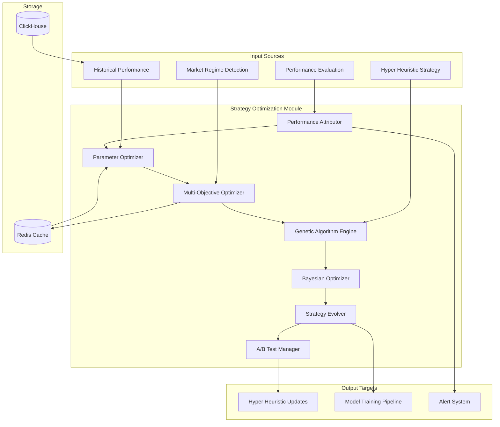

# Strategy Optimization Module Specification

## Module Overview

The Strategy Optimization Module continuously optimizes trading strategy parameters based on real-time performance feedback and changing market conditions. It works closely with the Hyper Heuristic Strategy Selection system to provide dynamic parameter tuning and strategy improvement recommendations.

## Core Responsibilities

- **Parameter Optimization**: Continuously optimize strategy parameters based on performance
- **Multi-Objective Optimization**: Balance accuracy, profitability, and risk metrics
- **Regime-Adaptive Optimization**: Adjust optimization targets based on market regimes
- **Performance Attribution**: Analyze which parameters contribute most to performance
- **Strategy Evolution**: Suggest structural improvements to existing strategies
- **A/B Testing Coordination**: Manage strategy parameter experiments

## Architecture Diagram



## Data Inputs

### From Performance Evaluation
```json
{
  "performance_data": {
    "strategy_name": "momentum_transformer",
    "regime": "high_volatility_trending",
    "time_period": {
      "start": "2025-07-20T00:00:00Z",
      "end": "2025-07-26T23:59:59Z"
    },
    "metrics": {
      "accuracy": 0.72,
      "sharpe_ratio": 1.45,
      "profit_loss": 15420.50,
      "max_drawdown": 0.08,
      "win_rate": 0.68,
      "avg_holding_period": 45.5,
      "trade_count": 124,
      "volatility": 0.18
    },
    "parameter_performance": {
      "rsi_period": {
        "value": 14,
        "contribution_to_returns": 0.23
      },
      "momentum_lookback": {
        "value": 20,
        "contribution_to_returns": 0.31
      },
      "volatility_threshold": {
        "value": 0.15,
        "contribution_to_returns": 0.19
      }
    }
  }
}
```

### From Market Regime Detection
```json
{
  "regime_context": {
    "current_regime": "high_volatility_trending",
    "regime_probability": 0.87,
    "regime_duration": 72,
    "regime_characteristics": {
      "volatility_level": "high",
      "trend_strength": "strong",
      "market_sentiment": "bullish",
      "correlation_environment": "low"
    },
    "expected_regime_duration": 120,
    "regime_transition_probability": 0.13
  }
}
```

### From Historical Performance Database
```json
{
  "historical_optimization": {
    "strategy_name": "momentum_transformer",
    "optimization_history": [
      {
        "timestamp": "2025-07-19T10:00:00Z",
        "parameters": {
          "rsi_period": 12,
          "momentum_lookback": 18,
          "volatility_threshold": 0.12
        },
        "performance_after": {
          "sharpe_ratio": 1.32,
          "accuracy": 0.69
        },
        "regime": "low_volatility_trending"
      }
    ],
    "parameter_bounds": {
      "rsi_period": [5, 30],
      "momentum_lookback": [10, 50],
      "volatility_threshold": [0.05, 0.30]
    }
  }
}
```

## Data Outputs

### Optimized Parameters
```json
{
  "optimization_result": {
    "strategy_name": "momentum_transformer",
    "regime": "high_volatility_trending",
    "timestamp": "2025-07-26T10:30:00Z",
    "optimization_method": "bayesian_optimization",
    "current_parameters": {
      "rsi_period": 14,
      "momentum_lookback": 20,
      "volatility_threshold": 0.15
    },
    "optimized_parameters": {
      "rsi_period": 16,
      "momentum_lookback": 22,
      "volatility_threshold": 0.18
    },
    "expected_improvement": {
      "sharpe_ratio": 0.12,
      "accuracy": 0.04,
      "expected_return": 0.08
    },
    "confidence_interval": {
      "sharpe_improvement": [0.05, 0.19],
      "accuracy_improvement": [0.01, 0.07]
    },
    "optimization_metadata": {
      "iterations": 50,
      "convergence_achieved": true,
      "objective_function_value": 0.89,
      "parameter_sensitivity": {
        "rsi_period": 0.31,
        "momentum_lookback": 0.45,
        "volatility_threshold": 0.24
      }
    }
  }
}
```

### A/B Test Configuration
```json
{
  "ab_test_config": {
    "test_id": "momentum_transformer_opt_20250726",
    "strategy_name": "momentum_transformer",
    "test_variants": [
      {
        "variant_id": "control",
        "parameters": {
          "rsi_period": 14,
          "momentum_lookback": 20,
          "volatility_threshold": 0.15
        },
        "traffic_allocation": 0.5
      },
      {
        "variant_id": "optimized",
        "parameters": {
          "rsi_period": 16,
          "momentum_lookback": 22,
          "volatility_threshold": 0.18
        },
        "traffic_allocation": 0.5
      }
    ],
    "success_metrics": ["sharpe_ratio", "accuracy", "max_drawdown"],
    "test_duration_hours": 168,
    "minimum_sample_size": 100,
    "statistical_significance_threshold": 0.05
  }
}
```

## Core Components

### 1. Parameter Optimizer
**Purpose**: Core optimization engine for strategy parameters
**Technology**: Rust with optimization libraries (argmin, optimization crate)
**Key Functions**:
- Multi-dimensional parameter optimization
- Constraint handling for parameter bounds
- Gradient-free optimization algorithms
- Parameter sensitivity analysis

### 2. Multi-Objective Optimizer
**Purpose**: Balance multiple competing objectives (returns, risk, accuracy)
**Technology**: Rust with NSGA-II implementation
**Key Functions**:
- Pareto frontier calculation
- Objective function weighting
- Trade-off analysis between objectives
- Solution ranking and selection

### 3. Genetic Algorithm Engine
**Purpose**: Evolutionary optimization for complex parameter spaces
**Technology**: Rust with genetic algorithm libraries
**Key Functions**:
- Population-based optimization
- Crossover and mutation operations
- Fitness function evaluation
- Convergence monitoring

### 4. Bayesian Optimizer
**Purpose**: Efficient optimization with uncertainty quantification
**Technology**: Rust with Gaussian Process libraries
**Key Functions**:
- Acquisition function optimization
- Uncertainty estimation
- Sequential model-based optimization
- Expected improvement calculation

### 5. Performance Attributor
**Purpose**: Analyze parameter contributions to performance
**Technology**: Rust with statistical analysis
**Key Functions**:
- Shapley value calculation for parameter attribution
- Correlation analysis between parameters and performance
- Feature importance ranking
- Interaction effect detection

## API Endpoints

### Internal APIs (Service-to-Service)

#### POST /api/v1/internal/optimization/optimize
**Purpose**: Trigger optimization for a specific strategy
**Input**: Strategy name, current parameters, performance data
**Output**: Optimized parameters with expected improvement

#### GET /api/v1/internal/optimization/status/{optimization_id}
**Purpose**: Get status of an ongoing optimization
**Input**: Optimization ID
**Output**: Current optimization progress and intermediate results

#### POST /api/v1/internal/optimization/evaluate
**Purpose**: Evaluate a specific parameter set
**Input**: Strategy name, parameter set, evaluation context
**Output**: Performance estimation for the parameter set

#### POST /api/v1/internal/optimization/ab-test/create
**Purpose**: Create A/B test for parameter optimization
**Input**: Strategy name, parameter variants, test configuration
**Output**: A/B test configuration and tracking ID

#### GET /api/v1/internal/optimization/ab-test/{test_id}/results
**Purpose**: Get A/B test results
**Input**: Test ID
**Output**: Statistical test results and recommendations

### Public APIs (via API Gateway)

#### GET /api/v1/public/optimization/performance/{strategy_name}
**Purpose**: Get optimization performance history for a strategy
**Input**: Strategy name, time range
**Output**: Optimization history and performance improvements

#### POST /api/v1/public/optimization/suggest
**Purpose**: Get optimization suggestions for user's strategies
**Input**: User ID, strategy preferences
**Output**: Optimization recommendations and expected benefits

## Database Interactions

### ClickHouse Queries

#### Store Optimization Results
```sql
INSERT INTO optimization_results (
    strategy_name, regime, timestamp, optimization_method,
    original_parameters, optimized_parameters, expected_improvement,
    actual_improvement, confidence_intervals, metadata
) VALUES (?, ?, ?, ?, ?, ?, ?, ?, ?, ?)
```

#### Get Parameter Performance History
```sql
SELECT 
    timestamp,
    parameters,
    performance_metrics,
    regime,
    improvement_over_baseline
FROM optimization_results 
WHERE strategy_name = ?
    AND regime = ?
    AND timestamp >= ?
ORDER BY timestamp DESC
LIMIT 100
```

#### Calculate Parameter Sensitivity
```sql
SELECT 
    parameter_name,
    parameter_value,
    avg(sharpe_ratio) as avg_sharpe,
    stddev(sharpe_ratio) as sharpe_volatility,
    count(*) as sample_size
FROM strategy_performance sp
JOIN strategy_parameters param ON sp.id = param.strategy_performance_id
WHERE strategy_name = ?
    AND timestamp >= now() - INTERVAL 30 DAY
GROUP BY parameter_name, parameter_value
ORDER BY parameter_name, parameter_value
```

### A/B Test Results Tracking
```sql
SELECT 
    test_id,
    variant_id,
    count(*) as sample_size,
    avg(sharpe_ratio) as avg_sharpe,
    stddev(sharpe_ratio) as sharpe_std,
    avg(accuracy) as avg_accuracy,
    avg(max_drawdown) as avg_drawdown
FROM ab_test_results
WHERE test_id = ?
    AND timestamp >= ?
GROUP BY test_id, variant_id
```

### Redis Caching

#### Optimization Progress Cache
```
optimization:progress:{optimization_id} -> {
    "status": "running",
    "current_iteration": 35,
    "total_iterations": 100,
    "best_objective_value": 0.89,
    "current_parameters": {...},
    "estimated_completion": "2025-07-26T11:45:00Z",
    "ttl": 3600
}
```

#### Parameter Sensitivity Cache
```
optimization:sensitivity:{strategy_name}:{regime} -> {
    "rsi_period": 0.31,
    "momentum_lookback": 0.45,
    "volatility_threshold": 0.24,
    "last_updated": "2025-07-26T10:00:00Z",
    "ttl": 1800
}
```

## Optimization Algorithms

### 1. Bayesian Optimization Implementation
```rust
pub struct BayesianOptimizer {
    gp_model: GaussianProcess,
    acquisition_function: ExpectedImprovement,
    parameter_bounds: Vec<(f64, f64)>,
    history: Vec<(Vec<f64>, f64)>,
}

impl BayesianOptimizer {
    pub async fn optimize(
        &mut self, 
        objective_fn: &dyn Fn(&[f64]) -> f64,
        max_iterations: usize
    ) -> OptimizationResult {
        for iteration in 0..max_iterations {
            // Find next point to evaluate using acquisition function
            let next_point = self.acquisition_function
                .maximize(&self.gp_model, &self.parameter_bounds)?;
            
            // Evaluate objective function at next point
            let objective_value = objective_fn(&next_point);
            
            // Update GP model with new data point
            self.gp_model.add_data_point(next_point.clone(), objective_value);
            self.history.push((next_point, objective_value));
            
            // Check convergence
            if self.check_convergence() {
                break;
            }
        }
        
        self.get_best_result()
    }
}
```

### 2. Multi-Objective Optimization (NSGA-II)
```rust
pub struct MultiObjectiveOptimizer {
    population_size: usize,
    objectives: Vec<Box<dyn Fn(&[f64]) -> f64>>,
    constraints: Vec<Box<dyn Fn(&[f64]) -> bool>>,
}

impl MultiObjectiveOptimizer {
    pub fn optimize(&mut self, generations: usize) -> ParetoFrontier {
        let mut population = self.initialize_population();
        
        for generation in 0..generations {
            // Evaluate all objectives for population
            let fitness_values = self.evaluate_population(&population);
            
            // Non-dominated sorting
            let fronts = self.non_dominated_sort(&fitness_values);
            
            // Selection and reproduction
            population = self.selection_and_reproduction(&population, &fronts);
            
            // Mutation and crossover
            population = self.mutate_and_crossover(population);
        }
        
        self.extract_pareto_frontier(&population)
    }
}
```

### 3. Parameter Attribution Analysis
```rust
pub fn calculate_shapley_values(
    parameters: &HashMap<String, f64>,
    performance_fn: &dyn Fn(&HashMap<String, f64>) -> f64,
    baseline_performance: f64
) -> HashMap<String, f64> {
    let param_names: Vec<String> = parameters.keys().cloned().collect();
    let mut shapley_values = HashMap::new();
    
    // Calculate Shapley values using sampling approximation
    for target_param in &param_names {
        let mut marginal_contributions = Vec::new();
        
        // Generate random coalitions
        for _ in 0..1000 {
            let coalition = generate_random_coalition(&param_names, target_param);
            
            // Performance with target parameter
            let mut with_param = baseline_parameters();
            for param in &coalition {
                with_param.insert(param.clone(), parameters[param]);
            }
            with_param.insert(target_param.clone(), parameters[target_param]);
            let perf_with = performance_fn(&with_param);
            
            // Performance without target parameter
            let mut without_param = baseline_parameters();
            for param in &coalition {
                without_param.insert(param.clone(), parameters[param]);
            }
            let perf_without = performance_fn(&without_param);
            
            marginal_contributions.push(perf_with - perf_without);
        }
        
        let shapley_value = marginal_contributions.iter().sum::<f64>() 
            / marginal_contributions.len() as f64;
        shapley_values.insert(target_param.clone(), shapley_value);
    }
    
    shapley_values
}
```

## Integration Points

### With Hyper Heuristic Strategy Selection
- **Inbound**: Current strategy parameters and performance targets
- **Outbound**: Optimized parameters and performance predictions
- **Protocol**: Synchronous REST API calls with async optimization jobs
- **Data Format**: Strategy configuration with parameter bounds and objectives

### With Performance Evaluation
- **Inbound**: Real-time performance metrics and attribution data
- **Protocol**: Event-driven updates via database triggers
- **Data Format**: Performance metrics with parameter attribution

### With Model Training Pipeline
- **Outbound**: Optimized hyperparameters for model retraining
- **Protocol**: Asynchronous via message queue
- **Data Format**: Training configuration with optimized parameters

### With Market Regime Detection
- **Inbound**: Current market regime and regime transition probabilities
- **Protocol**: Real-time updates via Redis pub/sub
- **Data Format**: Regime classification with confidence metrics

## Performance Requirements

### Optimization Latency
- **Simple Parameter Optimization**: < 5 minutes for 100 iterations
- **Multi-Objective Optimization**: < 15 minutes for complex problems
- **Real-time Parameter Suggestions**: < 2 seconds response time
- **A/B Test Setup**: < 1 second response time

### Optimization Quality
- **Convergence Rate**: 95% of optimizations should converge within max iterations
- **Improvement Accuracy**: Predicted vs actual improvement within 20% MAPE
- **Statistical Significance**: A/B tests achieve 95% confidence level

### System Throughput
- **Concurrent Optimizations**: Support 10 simultaneous optimization jobs
- **Parameter Evaluations**: 1,000 parameter evaluations per minute
- **A/B Test Management**: Support 50 concurrent A/B tests

## Error Handling and Validation

### Parameter Validation
- **Bounds Checking**: Ensure all parameters within specified bounds
- **Constraint Satisfaction**: Validate parameter combinations meet strategy constraints
- **Sanity Checks**: Detect unrealistic parameter combinations

### Optimization Convergence
- **Convergence Detection**: Monitor objective function improvement
- **Early Stopping**: Stop optimization if no improvement for N iterations
- **Timeout Handling**: Graceful handling of optimization timeouts

### A/B Test Integrity
- **Sample Size Validation**: Ensure minimum sample sizes for statistical validity
- **Bias Detection**: Monitor for selection bias in test assignments
- **Performance Monitoring**: Track test performance and stop if significant degradation

## Configuration Management

### Optimization Parameters
```bash
# Bayesian Optimization
OPTIMIZATION_MAX_ITERATIONS=100
OPTIMIZATION_ACQUISITION_FUNCTION=expected_improvement
OPTIMIZATION_GP_KERNEL=rbf
OPTIMIZATION_NOISE_LEVEL=0.01

# Multi-Objective Optimization
MULTI_OBJ_POPULATION_SIZE=50
MULTI_OBJ_GENERATIONS=100
MULTI_OBJ_CROSSOVER_RATE=0.8
MULTI_OBJ_MUTATION_RATE=0.1

# A/B Testing
AB_TEST_MIN_SAMPLE_SIZE=100
AB_TEST_SIGNIFICANCE_THRESHOLD=0.05
AB_TEST_MAX_DURATION_HOURS=168
AB_TEST_EARLY_STOPPING_ENABLED=true
```

### Strategy-Specific Configuration
```json
{
  "strategies": {
    "momentum_transformer": {
      "parameter_bounds": {
        "rsi_period": [5, 30],
        "momentum_lookback": [10, 50],
        "volatility_threshold": [0.05, 0.30]
      },
      "optimization_objectives": [
        {"name": "sharpe_ratio", "weight": 0.4, "direction": "maximize"},
        {"name": "accuracy", "weight": 0.3, "direction": "maximize"},
        {"name": "max_drawdown", "weight": 0.3, "direction": "minimize"}
      ],
      "constraints": [
        "rsi_period < momentum_lookback",
        "volatility_threshold > 0.05"
      ]
    }
  }
}
```

This Strategy Optimization Module provides sophisticated parameter optimization capabilities that continuously improve strategy performance while maintaining statistical rigor through A/B testing and multi-objective optimization approaches.