# API Gateway - Technical Specification

## Module Overview

The API Gateway serves as the primary entry point for all external client requests to the QuantumTrade AI system. It provides request routing, transformation, orchestration, and aggregation capabilities while implementing security, rate limiting, and monitoring. The gateway acts as a reverse proxy that abstracts the internal microservices architecture from external clients.

## Architecture Diagram

```mermaid
graph TB
    subgraph "API Gateway"
        AG[API Gateway]
        RR[Request Router]
        TR[Request Transformer]
        OR[Orchestrator]
        AGGR[Aggregator]
        CACHE[Response Cache]
        LB[Load Balancer]
        COMP[Composition Engine]
    end
    
    subgraph "Security Layer"
        AUTH[Authentication]
        AUTZ[Authorization]
        RL[Rate Limiter]
        VAL[Request Validator]
        ENC[Encryption]
    end
    
    subgraph "Monitoring"
        LOG[Request Logger]
        MET[Metrics Collector]
        TRACE[Distributed Tracer]
        ALERT[Alert Manager]
    end
    
    subgraph "Upstream Services"
        PS[Prediction Service]
        WS[WebSocket Service]
        PE[Performance Evaluation]
        EAI[Explainable AI Service]
        HHS[Hyper Heuristic Strategy]
    end
    
    subgraph "External Clients"
        WEB[Web Applications]
        MOB[Mobile Apps]
        API[Third-party APIs]
        DASH[Dashboard]
    end
    
    %% External client connections
    WEB --> AG
    MOB --> AG
    API --> AG
    DASH --> AG
    
    %% Security flow
    AG --> AUTH
    AG --> AUTZ
    AG --> RL
    AG --> VAL
    AG --> ENC
    
    %% Core gateway flow
    AG --> RR
    AG --> TR
    AG --> OR
    AG --> AGGR
    AG --> CACHE
    AG --> LB
    AG --> COMP
    
    %% Monitoring flow
    AG --> LOG
    AG --> MET
    AG --> TRACE
    AG --> ALERT
    
    %% Upstream service connections
    RR --> PS
    RR --> WS
    RR --> PE
    RR --> EAI
    RR --> HHS
    
    OR --> PS
    OR --> PE
    OR --> EAI
    
    AGGR --> PS
    AGGR --> PE
    AGGR --> EAI
```



## Responsibilities

### **Primary Functions**
- **Request Routing**: Route incoming requests to appropriate microservices based on URL patterns and HTTP methods
- **Request Transformation**: Transform requests between different formats (JSON, Protocol Buffers, GraphQL)
- **Response Aggregation**: Combine responses from multiple services into unified responses
- **Service Orchestration**: Coordinate complex workflows involving multiple microservices
- **Load Balancing**: Distribute requests across multiple service instances
- **Response Caching**: Cache frequently requested data to improve performance
- **Request Composition**: Combine multiple API calls into single requests for efficiency

### **Security Functions**
- **Authentication**: Verify client identity using JWT tokens, API keys, or OAuth
- **Authorization**: Enforce role-based access control and resource permissions
- **Rate Limiting**: Prevent API abuse through request throttling and quotas
- **Request Validation**: Validate request payloads against schemas and business rules
- **Encryption**: Ensure data encryption in transit and at rest

### **Monitoring Functions**
- **Request Logging**: Log all incoming requests with metadata and performance metrics
- **Metrics Collection**: Collect API usage statistics, response times, and error rates
- **Distributed Tracing**: Track requests across multiple services for debugging
- **Alert Management**: Trigger alerts for performance issues or security threats

## API Contract

### **Core Interface**
```rust
#[async_trait]
pub trait ApiGateway {
    // Request handling
    async fn handle_request(&self, request: HttpRequest) -> Result<HttpResponse>;
    async fn route_request(&self, request: &HttpRequest) -> Result<ServiceEndpoint>;
    async fn transform_request(&self, request: HttpRequest, target_service: &str) -> Result<HttpRequest>;
    
    // Response handling
    async fn aggregate_responses(&self, responses: Vec<ServiceResponse>) -> Result<HttpResponse>;
    async fn cache_response(&self, key: &str, response: &HttpResponse, ttl: Duration) -> Result<()>;
    async fn get_cached_response(&self, key: &str) -> Result<Option<HttpResponse>>;
    
    // Service orchestration
    async fn orchestrate_workflow(&self, workflow: WorkflowDefinition) -> Result<WorkflowResult>;
    async fn compose_requests(&self, composition: RequestComposition) -> Result<ComposedResponse>;
    
    // Security
    async fn authenticate_request(&self, request: &HttpRequest) -> Result<AuthResult>;
    async fn authorize_request(&self, request: &HttpRequest, user: &User) -> Result<bool>;
    async fn apply_rate_limit(&self, client_id: &str, endpoint: &str) -> Result<bool>;
    
    // Monitoring
    async fn log_request(&self, request: &HttpRequest, response: &HttpResponse, duration: Duration) -> Result<()>;
    async fn collect_metrics(&self, metrics: RequestMetrics) -> Result<()>;
    async fn trace_request(&self, trace_id: &str, span_data: SpanData) -> Result<()>;
}
```

### **Data Structures**
```rust
#[derive(Debug, Clone, Serialize, Deserialize)]
pub struct HttpRequest {
    pub method: HttpMethod,
    pub uri: String,
    pub headers: HashMap<String, String>,
    pub body: Option<Vec<u8>>,
    pub query_params: HashMap<String, String>,
    pub client_ip: IpAddr,
    pub user_agent: Option<String>,
    pub request_id: String,
    pub timestamp: DateTime<Utc>,
}

#[derive(Debug, Clone, Serialize, Deserialize)]
pub struct HttpResponse {
    pub status_code: u16,
    pub headers: HashMap<String, String>,
    pub body: Option<Vec<u8>>,
    pub request_id: String,
    pub timestamp: DateTime<Utc>,
    pub processing_time: Duration,
}

#[derive(Debug, Clone, Serialize, Deserialize)]
pub struct ServiceEndpoint {
    pub service_name: String,
    pub endpoint: String,
    pub method: HttpMethod,
    pub timeout: Duration,
    pub retry_config: RetryConfig,
    pub circuit_breaker: CircuitBreakerConfig,
}

#[derive(Debug, Clone, Serialize, Deserialize)]
pub struct WorkflowDefinition {
    pub workflow_id: String,
    pub steps: Vec<WorkflowStep>,
    pub timeout: Duration,
    pub fallback_strategy: FallbackStrategy,
    pub parallel_execution: bool,
}

#[derive(Debug, Clone, Serialize, Deserialize)]
pub struct WorkflowStep {
    pub step_id: String,
    pub service_name: String,
    pub endpoint: String,
    pub method: HttpMethod,
    pub input_mapping: HashMap<String, String>,
    pub output_mapping: HashMap<String, String>,
    pub dependencies: Vec<String>,
    pub timeout: Duration,
}

#[derive(Debug, Clone, Serialize, Deserialize)]
pub struct AuthResult {
    pub authenticated: bool,
    pub user_id: Option<String>,
    pub roles: Vec<String>,
    pub permissions: Vec<String>,
    pub token_expiry: Option<DateTime<Utc>>,
}

#[derive(Debug, Clone, Serialize, Deserialize)]
pub struct RequestMetrics {
    pub request_id: String,
    pub endpoint: String,
    pub method: HttpMethod,
    pub status_code: u16,
    pub response_time: Duration,
    pub client_id: Option<String>,
    pub user_id: Option<String>,
    pub timestamp: DateTime<Utc>,
    pub error_type: Option<String>,
}
```

## Configuration

### **Gateway Configuration**
```toml
[api_gateway]
# Server configuration
host = "0.0.0.0"
port = 8080
workers = 4
max_connections = 10000
connection_timeout = "30s"
read_timeout = "60s"
write_timeout = "60s"

# Routing configuration
default_timeout = "30s"
max_retries = 3
circuit_breaker_threshold = 5
circuit_breaker_timeout = "60s"

# Caching configuration
cache_enabled = true
cache_ttl = "300s"
cache_max_size = 10000
cache_eviction_policy = "lru"

# Security configuration
auth_enabled = true
rate_limit_enabled = true
rate_limit_requests_per_minute = 100
rate_limit_burst_size = 20

# Monitoring configuration
metrics_enabled = true
tracing_enabled = true
log_level = "info"
request_logging = true

[routing]
# Service routing rules
[[routing.rules]]
pattern = "/api/v1/predictions/*"
service = "prediction-service"
timeout = "45s"
retries = 2

[[routing.rules]]
pattern = "/api/v1/performance/*"
service = "performance-evaluation"
timeout = "30s"
retries = 1

[[routing.rules]]
pattern = "/api/v1/explanations/*"
service = "explainable-ai-service"
timeout = "60s"
retries = 3

[[routing.rules]]
pattern = "/api/v1/strategies/*"
service = "hyper-heuristic-strategy"
timeout = "30s"
retries = 2

[caching]
# Cache configuration for different endpoints
[[caching.rules]]
pattern = "/api/v1/predictions/*"
ttl = "60s"
max_size = 1000

[[caching.rules]]
pattern = "/api/v1/performance/*"
ttl = "300s"
max_size = 500

[security]
# Authentication configuration
jwt_secret = "${JWT_SECRET}"
jwt_expiry = "24h"
api_key_header = "X-API-Key"
oauth_enabled = true

# Rate limiting configuration
[[security.rate_limits]]
endpoint = "/api/v1/predictions/*"
requests_per_minute = 50
burst_size = 10

[[security.rate_limits]]
endpoint = "/api/v1/performance/*"
requests_per_minute = 100
burst_size = 20

[monitoring]
# Metrics configuration
metrics_port = 9090
metrics_path = "/metrics"
custom_metrics = true

# Tracing configuration
tracing_endpoint = "http://jaeger:14268/api/traces"
sampling_rate = 0.1

# Logging configuration
log_format = "json"
log_fields = ["request_id", "user_id", "endpoint", "status_code", "response_time"]
```

## Service Integration

### **Prediction Service Integration**
```rust
impl ApiGateway {
    async fn handle_prediction_request(&self, request: HttpRequest) -> Result<HttpResponse> {
        // Route to prediction service
        let endpoint = self.route_request(&request).await?;
        
        // Transform request if needed
        let transformed_request = self.transform_request(request, "prediction-service").await?;
        
        // Forward to prediction service
        let response = self.forward_request(transformed_request, &endpoint).await?;
        
        // Cache response if appropriate
        if self.should_cache_response(&response) {
            self.cache_response(&self.generate_cache_key(&request), &response, Duration::from_secs(60)).await?;
        }
        
        Ok(response)
    }
    
    async fn handle_complex_prediction(&self, request: HttpRequest) -> Result<HttpResponse> {
        // Define workflow for complex prediction
        let workflow = WorkflowDefinition {
            workflow_id: format!("prediction_{}", Uuid::new_v4()),
            steps: vec![
                WorkflowStep {
                    step_id: "feature_retrieval".to_string(),
                    service_name: "feature-storage-retrieval".to_string(),
                    endpoint: "/api/v1/features".to_string(),
                    method: HttpMethod::POST,
                    input_mapping: HashMap::new(),
                    output_mapping: HashMap::new(),
                    dependencies: vec![],
                    timeout: Duration::from_secs(10),
                },
                WorkflowStep {
                    step_id: "prediction".to_string(),
                    service_name: "prediction-service".to_string(),
                    endpoint: "/api/v1/predict".to_string(),
                    method: HttpMethod::POST,
                    input_mapping: HashMap::new(),
                    output_mapping: HashMap::new(),
                    dependencies: vec!["feature_retrieval".to_string()],
                    timeout: Duration::from_secs(30),
                },
                WorkflowStep {
                    step_id: "explanation".to_string(),
                    service_name: "explainable-ai-service".to_string(),
                    endpoint: "/api/v1/explain".to_string(),
                    method: HttpMethod::POST,
                    input_mapping: HashMap::new(),
                    output_mapping: HashMap::new(),
                    dependencies: vec!["prediction".to_string()],
                    timeout: Duration::from_secs(15),
                },
            ],
            timeout: Duration::from_secs(60),
            fallback_strategy: FallbackStrategy::ReturnPartial,
            parallel_execution: false,
        };
        
        self.orchestrate_workflow(workflow).await
    }
}
```

### **Performance Evaluation Integration**
```rust
impl ApiGateway {
    async fn handle_performance_request(&self, request: HttpRequest) -> Result<HttpResponse> {
        // Route to performance evaluation service
        let endpoint = self.route_request(&request).await?;
        
        // Check cache first for performance data
        if let Some(cached_response) = self.get_cached_response(&self.generate_cache_key(&request)).await? {
            return Ok(cached_response);
        }
        
        // Forward to performance service
        let response = self.forward_request(request, &endpoint).await?;
        
        // Cache performance data with longer TTL
        self.cache_response(&self.generate_cache_key(&request), &response, Duration::from_secs(300)).await?;
        
        Ok(response)
    }
}
```

## Error Handling

### **Error Types**
```rust
#[derive(Debug, thiserror::Error)]
pub enum ApiGatewayError {
    #[error("Service unavailable: {service}")]
    ServiceUnavailable { service: String },
    
    #[error("Request timeout: {timeout:?}")]
    RequestTimeout { timeout: Duration },
    
    #[error("Rate limit exceeded: {limit}")]
    RateLimitExceeded { limit: u32 },
    
    #[error("Authentication failed: {reason}")]
    AuthenticationFailed { reason: String },
    
    #[error("Authorization denied: {resource}")]
    AuthorizationDenied { resource: String },
    
    #[error("Invalid request: {field}")]
    InvalidRequest { field: String },
    
    #[error("Circuit breaker open: {service}")]
    CircuitBreakerOpen { service: String },
    
    #[error("Workflow execution failed: {workflow_id}")]
    WorkflowExecutionFailed { workflow_id: String },
}
```

### **Error Handling Strategies**
```rust
impl ApiGateway {
    async fn handle_service_error(&self, error: &ApiGatewayError, request: &HttpRequest) -> Result<HttpResponse> {
        match error {
            ApiGatewayError::ServiceUnavailable { service } => {
                // Try fallback service or return cached response
                self.handle_service_fallback(service, request).await
            }
            ApiGatewayError::RequestTimeout { timeout } => {
                // Return timeout response with retry information
                self.create_timeout_response(request, *timeout).await
            }
            ApiGatewayError::RateLimitExceeded { limit } => {
                // Return rate limit response with retry-after header
                self.create_rate_limit_response(request, *limit).await
            }
            ApiGatewayError::CircuitBreakerOpen { service } => {
                // Return service unavailable with circuit breaker status
                self.create_circuit_breaker_response(request, service).await
            }
            _ => {
                // Return generic error response
                self.create_error_response(request, error).await
            }
        }
    }
    
    async fn handle_service_fallback(&self, service: &str, request: &HttpRequest) -> Result<HttpResponse> {
        // Check if we have a cached response
        if let Some(cached_response) = self.get_cached_response(&self.generate_cache_key(request)).await? {
            return Ok(cached_response);
        }
        
        // Try fallback service if configured
        if let Some(fallback_service) = self.get_fallback_service(service).await? {
            let endpoint = ServiceEndpoint {
                service_name: fallback_service,
                endpoint: request.uri.clone(),
                method: request.method.clone(),
                timeout: Duration::from_secs(30),
                retry_config: RetryConfig::default(),
                circuit_breaker: CircuitBreakerConfig::default(),
            };
            
            return self.forward_request(request.clone(), &endpoint).await;
        }
        
        // Return service unavailable response
        self.create_service_unavailable_response(request, service).await
    }
}
```

## Performance Optimization

### **Caching Strategy**
```rust
impl ApiGateway {
    async fn should_cache_response(&self, response: &HttpResponse) -> bool {
        // Cache successful responses for GET requests
        response.status_code == 200 && 
        response.headers.get("cache-control").map_or(true, |cc| !cc.contains("no-cache"))
    }
    
    async fn generate_cache_key(&self, request: &HttpRequest) -> String {
        // Generate cache key based on request parameters
        let mut key_parts = vec![
            request.method.to_string(),
            request.uri.clone(),
        ];
        
        // Include query parameters in cache key
        for (k, v) in &request.query_params {
            key_parts.push(format!("{}={}", k, v));
        }
        
        // Include user ID if authenticated
        if let Some(user_id) = self.get_user_id_from_request(request).await {
            key_parts.push(format!("user={}", user_id));
        }
        
        // Generate hash of key parts
        let key_string = key_parts.join("&");
        format!("api_gateway:{}", sha256::digest(key_string))
    }
}
```

### **Load Balancing**
```rust
impl ApiGateway {
    async fn select_service_instance(&self, service_name: &str) -> Result<String> {
        // Get available instances for the service
        let instances = self.get_service_instances(service_name).await?;
        
        if instances.is_empty() {
            return Err(ApiGatewayError::ServiceUnavailable {
                service: service_name.to_string(),
            }.into());
        }
        
        // Use round-robin load balancing
        let instance_index = self.get_next_instance_index(service_name).await?;
        let selected_instance = &instances[instance_index % instances.len()];
        
        Ok(selected_instance.clone())
    }
    
    async fn get_service_instances(&self, service_name: &str) -> Result<Vec<String>> {
        // Query service discovery for available instances
        let discovery_client = self.discovery_client.lock().await;
        discovery_client.get_service_instances(service_name).await
    }
}
```

## Security Implementation

### **Authentication Middleware**
```rust
impl ApiGateway {
    async fn authenticate_request(&self, request: &HttpRequest) -> Result<AuthResult> {
        // Extract token from request
        let token = self.extract_token(request)?;
        
        // Validate JWT token
        let claims = self.validate_jwt_token(&token).await?;
        
        // Check token expiry
        if claims.exp < Utc::now().timestamp() {
            return Err(ApiGatewayError::AuthenticationFailed {
                reason: "Token expired".to_string(),
            }.into());
        }
        
        // Get user roles and permissions
        let user_roles = self.get_user_roles(&claims.sub).await?;
        let user_permissions = self.get_user_permissions(&claims.sub).await?;
        
        Ok(AuthResult {
            authenticated: true,
            user_id: Some(claims.sub),
            roles: user_roles,
            permissions: user_permissions,
            token_expiry: Some(DateTime::from_timestamp(claims.exp, 0).unwrap()),
        })
    }
    
    async fn authorize_request(&self, request: &HttpRequest, user: &User) -> Result<bool> {
        // Check if user has required permissions for the endpoint
        let required_permissions = self.get_required_permissions(request).await?;
        
        for permission in required_permissions {
            if !user.permissions.contains(&permission) {
                return Ok(false);
            }
        }
        
        Ok(true)
    }
}
```

### **Rate Limiting**
```rust
impl ApiGateway {
    async fn apply_rate_limit(&self, client_id: &str, endpoint: &str) -> Result<bool> {
        let rate_limit_key = format!("rate_limit:{}:{}", client_id, endpoint);
        
        // Get current request count
        let current_count: u32 = self.redis_client
            .get(&rate_limit_key)
            .await
            .unwrap_or(0);
        
        // Get rate limit configuration
        let rate_limit_config = self.get_rate_limit_config(endpoint).await?;
        
        if current_count >= rate_limit_config.requests_per_minute {
            return Ok(false);
        }
        
        // Increment request count
        self.redis_client
            .incr(&rate_limit_key)
            .await?;
        
        // Set expiry for rate limit window
        if current_count == 0 {
            self.redis_client
                .expire(&rate_limit_key, 60)
                .await?;
        }
        
        Ok(true)
    }
}
```

## Monitoring and Observability

### **Metrics Collection**
```rust
impl ApiGateway {
    async fn collect_request_metrics(&self, metrics: RequestMetrics) -> Result<()> {
        // Record request count
        self.metrics_client
            .counter("api_requests_total", 1)
            .with_label("endpoint", &metrics.endpoint)
            .with_label("method", &metrics.method.to_string())
            .with_label("status_code", &metrics.status_code.to_string())
            .record()
            .await?;
        
        // Record response time
        self.metrics_client
            .histogram("api_response_time_seconds", metrics.response_time.as_secs_f64())
            .with_label("endpoint", &metrics.endpoint)
            .with_label("method", &metrics.method.to_string())
            .record()
            .await?;
        
        // Record error rate if applicable
        if metrics.status_code >= 400 {
            self.metrics_client
                .counter("api_errors_total", 1)
                .with_label("endpoint", &metrics.endpoint)
                .with_label("error_type", &metrics.error_type.unwrap_or_else(|| "unknown".to_string()))
                .record()
                .await?;
        }
        
        Ok(())
    }
}
```

### **Distributed Tracing**
```rust
impl ApiGateway {
    async fn trace_request(&self, trace_id: &str, span_data: SpanData) -> Result<()> {
        // Create span for request processing
        let span = self.tracer
            .span_builder("api_gateway.request")
            .with_trace_id(trace_id)
            .with_span_id(span_data.span_id)
            .with_parent_span_id(span_data.parent_span_id)
            .with_attributes(span_data.attributes)
            .start(&self.tracer)
            .await?;
        
        // Record span events
        span.add_event("request.received", vec![
            ("request_id", span_data.request_id.clone()),
            ("endpoint", span_data.endpoint.clone()),
            ("method", span_data.method.clone()),
        ]).await;
        
        // End span when request processing completes
        span.end().await;
        
        Ok(())
    }
}
```

## Testing Strategy

### **Unit Tests**
```rust
#[cfg(test)]
mod tests {
    use super::*;
    
    #[tokio::test]
    async fn test_request_routing() {
        let gateway = create_test_gateway().await;
        let request = create_test_request("/api/v1/predictions/AAPL");
        
        let endpoint = gateway.route_request(&request).await.unwrap();
        
        assert_eq!(endpoint.service_name, "prediction-service");
        assert_eq!(endpoint.endpoint, "/api/v1/predictions/AAPL");
    }
    
    #[tokio::test]
    async fn test_authentication() {
        let gateway = create_test_gateway().await;
        let request = create_authenticated_request();
        
        let auth_result = gateway.authenticate_request(&request).await.unwrap();
        
        assert!(auth_result.authenticated);
        assert!(auth_result.user_id.is_some());
    }
    
    #[tokio::test]
    async fn test_rate_limiting() {
        let gateway = create_test_gateway().await;
        let client_id = "test_client";
        let endpoint = "/api/v1/predictions/*";
        
        // First request should succeed
        let result1 = gateway.apply_rate_limit(client_id, endpoint).await.unwrap();
        assert!(result1);
        
        // Simulate rate limit exceeded
        for _ in 0..100 {
            gateway.apply_rate_limit(client_id, endpoint).await.unwrap();
        }
        
        // Next request should fail
        let result2 = gateway.apply_rate_limit(client_id, endpoint).await.unwrap();
        assert!(!result2);
    }
}
```

### **Integration Tests**
```rust
#[cfg(test)]
mod integration_tests {
    use super::*;
    
    #[tokio::test]
    async fn test_prediction_workflow() {
        let gateway = create_test_gateway().await;
        let request = create_prediction_request();
        
        let response = gateway.handle_complex_prediction(request).await.unwrap();
        
        assert_eq!(response.status_code, 200);
        assert!(response.body.is_some());
    }
    
    #[tokio::test]
    async fn test_service_fallback() {
        let gateway = create_test_gateway().await;
        let request = create_test_request("/api/v1/predictions/AAPL");
        
        // Simulate primary service failure
        gateway.simulate_service_failure("prediction-service").await;
        
        let response = gateway.handle_prediction_request(request).await.unwrap();
        
        // Should return cached response or fallback
        assert_eq!(response.status_code, 200);
    }
}
```

## Deployment Configuration

### **Docker Configuration**
```dockerfile
FROM rust:1.70-alpine as builder

WORKDIR /app
COPY Cargo.toml Cargo.lock ./
COPY src ./src

RUN cargo build --release

FROM alpine:latest

RUN apk add --no-cache ca-certificates tzdata
WORKDIR /app

COPY --from=builder /app/target/release/api-gateway .
COPY config/api-gateway.toml ./config/

EXPOSE 8080 9090

CMD ["./api-gateway"]
```

### **Kubernetes Configuration**
```yaml
apiVersion: apps/v1
kind: Deployment
metadata:
  name: api-gateway
  namespace: quanttrade
spec:
  replicas: 3
  selector:
    matchLabels:
      app: api-gateway
  template:
    metadata:
      labels:
        app: api-gateway
    spec:
      containers:
      - name: api-gateway
        image: quanttrade/api-gateway:latest
        ports:
        - containerPort: 8080
        - containerPort: 9090
        env:
        - name: RUST_LOG
          value: "info"
        - name: CONFIG_PATH
          value: "/app/config/api-gateway.toml"
        resources:
          requests:
            memory: "256Mi"
            cpu: "250m"
          limits:
            memory: "512Mi"
            cpu: "500m"
        livenessProbe:
          httpGet:
            path: /health
            port: 8080
          initialDelaySeconds: 30
          periodSeconds: 10
        readinessProbe:
          httpGet:
            path: /ready
            port: 8080
          initialDelaySeconds: 5
          periodSeconds: 5
---
apiVersion: v1
kind: Service
metadata:
  name: api-gateway-service
  namespace: quanttrade
spec:
  selector:
    app: api-gateway
  ports:
  - name: http
    port: 80
    targetPort: 8080
  - name: metrics
    port: 9090
    targetPort: 9090
  type: LoadBalancer
```

This specification provides a comprehensive API Gateway that serves as the primary entry point for all external client requests, implementing routing, transformation, orchestration, security, and monitoring capabilities while maintaining high performance and reliability. 