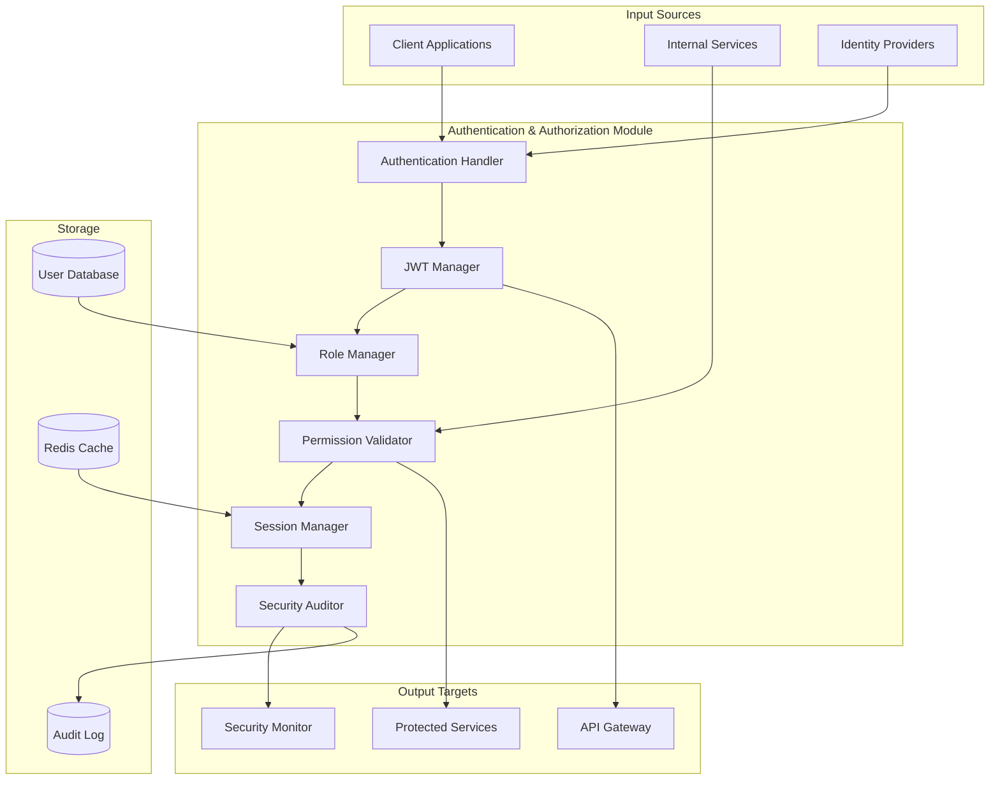

# Authentication & Authorization Module Specification

## Module Overview

The Authentication & Authorization Module provides secure access control for the QuantumTrade AI system. It handles user authentication, JWT token management, role-based access control (RBAC), and API security across all system components.

## Core Responsibilities

- **User Authentication**: Secure login/logout with multiple authentication methods
- **JWT Token Management**: Issue, validate, and refresh JSON Web Tokens
- **Role-Based Access Control**: Manage user roles and permissions
- **API Security**: Protect all API endpoints with appropriate authorization
- **Session Management**: Handle user sessions and concurrent access
- **Security Auditing**: Log authentication events and security violations

## Architecture Diagram



## Data Inputs

### User Login Request
```json
{
  "login_request": {
    "email": "trader@example.com",
    "password": "hashed_password",
    "login_method": "password",
    "client_info": {
      "user_agent": "Mozilla/5.0...",
      "ip_address": "192.168.1.100",
      "device_id": "device_12345"
    },
    "remember_me": true,
    "mfa_token": "123456"
  }
}
```

### Token Validation Request
```json
{
  "token_validation": {
    "access_token": "eyJhbGciOiJSUzI1NiIsInR5cCI6IkpXVCJ9...",
    "requested_resource": "/api/v1/public/predict",
    "http_method": "POST",
    "client_ip": "192.168.1.100"
  }
}
```

### Permission Check Request
```json
{
  "permission_check": {
    "user_id": "user_12345",
    "resource": "predictions",
    "action": "create",
    "context": {
      "symbol": "AAPL",
      "prediction_type": "price",
      "data_sources": ["market_data", "sentiment"]
    }
  }
}
```

## Data Outputs

### Authentication Response
```json
{
  "auth_response": {
    "success": true,
    "user": {
      "user_id": "user_12345",
      "email": "trader@example.com",
      "username": "john_trader",
      "first_name": "John",
      "last_name": "Smith",
      "roles": ["premium_user", "api_access"],
      "permissions": [
        "predictions:read",
        "predictions:create",
        "portfolio:read",
        "portfolio:write"
      ],
      "subscription_tier": "premium",
      "account_status": "active"
    },
    "tokens": {
      "access_token": "eyJhbGciOiJSUzI1NiIsInR5cCI6IkpXVCJ9...",
      "refresh_token": "eyJhbGciOiJSUzI1NiIsInR5cCI6IlJlZnJlc2giLCJhdWQiOi...",
      "expires_in": 3600,
      "token_type": "Bearer"
    },
    "session": {
      "session_id": "sess_789abc",
      "expires_at": "2025-07-26T18:30:00Z",
      "last_activity": "2025-07-26T10:30:00Z"
    }
  }
}
```

### Authorization Response
```json
{
  "authorization_response": {
    "authorized": true,
    "user_id": "user_12345",
    "permissions_matched": [
      "predictions:create"
    ],
    "rate_limits": {
      "requests_per_minute": 100,
      "requests_remaining": 87,
      "reset_time": "2025-07-26T10:31:00Z"
    },
    "context": {
      "roles": ["premium_user"],
      "subscription_tier": "premium",
      "account_limits": {
        "max_predictions_per_day": 1000,
        "max_symbols_per_request": 10
      }
    }
  }
}
```

### Token Claims (JWT Payload)
```json
{
  "jwt_claims": {
    "sub": "user_12345",
    "iss": "quantumtrade-auth",
    "aud": "quantumtrade-api",
    "exp": 1722080400,
    "iat": 1722076800,
    "jti": "token_id_789",
    "email": "trader@example.com",
    "roles": ["premium_user", "api_access"],
    "permissions": [
      "predictions:read",
      "predictions:create",
      "portfolio:read",
      "portfolio:write"
    ],
    "subscription_tier": "premium",
    "rate_limits": {
      "rpm": 100,
      "rpd": 10000
    },
    "session_id": "sess_789abc"
  }
}
```

## Core Components

### 1. Authentication Handler
**Purpose**: Handle user login, logout, and authentication flows
**Technology**: Rust with password hashing (argon2) and crypto libraries
**Key Functions**:
- Password-based authentication
- Multi-factor authentication (MFA)
- OAuth2/OIDC integration
- Brute force protection

### 2. JWT Manager
**Purpose**: Issue, validate, and manage JWT tokens
**Technology**: Rust with jsonwebtoken crate
**Key Functions**:
- Token generation with RSA256 signing
- Token validation and parsing
- Token refresh logic
- Token blacklisting

### 3. Role Manager
**Purpose**: Manage user roles and role-based permissions
**Technology**: Rust with database integration
**Key Functions**:
- Role assignment and revocation
- Permission inheritance
- Dynamic role evaluation
- Role hierarchy management

### 4. Permission Validator
**Purpose**: Validate user permissions for specific actions
**Technology**: Rust with efficient permission checking
**Key Functions**:
- Resource-based permission checking
- Context-aware authorization
- Permission caching for performance
- Audit trail for permission checks

### 5. Session Manager
**Purpose**: Manage user sessions and concurrent access
**Technology**: Rust with Redis integration
**Key Functions**:
- Session creation and destruction
- Concurrent session limits
- Session timeout handling
- Session activity tracking

## API Endpoints

### Public Authentication APIs

#### POST /api/v1/auth/login
**Purpose**: Authenticate user and issue tokens
**Input**: Login credentials and client information
**Output**: Authentication response with tokens and user info

#### POST /api/v1/auth/refresh
**Purpose**: Refresh access token using refresh token
**Input**: Refresh token
**Output**: New access token and updated expiration

#### POST /api/v1/auth/logout
**Purpose**: Invalidate user session and tokens
**Input**: Access token
**Output**: Logout confirmation

#### POST /api/v1/auth/forgot-password
**Purpose**: Initiate password reset flow
**Input**: Email address
**Output**: Password reset confirmation

#### POST /api/v1/auth/reset-password
**Purpose**: Complete password reset
**Input**: Reset token and new password
**Output**: Password reset confirmation

### Internal Authorization APIs

#### POST /api/v1/internal/auth/validate
**Purpose**: Validate token and return user context
**Input**: JWT token and request context
**Output**: User information and permissions

#### POST /api/v1/internal/auth/authorize
**Purpose**: Check if user has permission for specific action
**Input**: User ID, resource, action, and context
**Output**: Authorization decision with context

#### GET /api/v1/internal/auth/user/{user_id}
**Purpose**: Get user information and permissions
**Input**: User ID
**Output**: Complete user profile with roles and permissions

#### POST /api/v1/internal/auth/audit
**Purpose**: Log authentication/authorization events
**Input**: Audit event data
**Output**: Audit confirmation

### Administrative APIs

#### GET /api/v1/admin/auth/users
**Purpose**: List users with filtering and pagination
**Input**: Query parameters for filtering
**Output**: Paginated user list

#### POST /api/v1/admin/auth/users/{user_id}/roles
**Purpose**: Assign roles to a user
**Input**: User ID and roles to assign
**Output**: Updated user role assignment

#### GET /api/v1/admin/auth/sessions
**Purpose**: View active sessions across the system
**Input**: Query parameters
**Output**: Active session information

## Database Interactions

### User Management Tables

#### Users Table
```sql
CREATE TABLE users (
    user_id UUID PRIMARY KEY DEFAULT gen_random_uuid(),
    email VARCHAR(255) UNIQUE NOT NULL,
    username VARCHAR(100) UNIQUE,
    password_hash VARCHAR(255) NOT NULL,
    first_name VARCHAR(100),
    last_name VARCHAR(100),
    phone VARCHAR(20),
    email_verified BOOLEAN DEFAULT FALSE,
    account_status VARCHAR(20) DEFAULT 'active',
    subscription_tier VARCHAR(50) DEFAULT 'basic',
    created_at TIMESTAMP DEFAULT NOW(),
    updated_at TIMESTAMP DEFAULT NOW(),
    last_login_at TIMESTAMP,
    failed_login_attempts INTEGER DEFAULT 0,
    locked_until TIMESTAMP NULL
);
```

#### Roles Table
```sql
CREATE TABLE roles (
    role_id UUID PRIMARY KEY DEFAULT gen_random_uuid(),
    role_name VARCHAR(100) UNIQUE NOT NULL,
    description TEXT,
    permissions JSONB NOT NULL,
    is_system_role BOOLEAN DEFAULT FALSE,
    created_at TIMESTAMP DEFAULT NOW(),
    updated_at TIMESTAMP DEFAULT NOW()
);
```

#### User Roles Table
```sql
CREATE TABLE user_roles (
    user_id UUID REFERENCES users(user_id),
    role_id UUID REFERENCES roles(role_id),
    assigned_at TIMESTAMP DEFAULT NOW(),
    assigned_by UUID REFERENCES users(user_id),
    expires_at TIMESTAMP NULL,
    PRIMARY KEY (user_id, role_id)
);
```

### Token Management

#### Refresh Tokens Table
```sql
CREATE TABLE refresh_tokens (
    token_id UUID PRIMARY KEY DEFAULT gen_random_uuid(),
    user_id UUID REFERENCES users(user_id),
    token_hash VARCHAR(255) NOT NULL,
    expires_at TIMESTAMP NOT NULL,
    created_at TIMESTAMP DEFAULT NOW(),
    last_used_at TIMESTAMP,
    device_id VARCHAR(255),
    is_revoked BOOLEAN DEFAULT FALSE
);
```

#### Token Blacklist Table
```sql
CREATE TABLE token_blacklist (
    jti VARCHAR(255) PRIMARY KEY,
    user_id UUID REFERENCES users(user_id),
    expires_at TIMESTAMP NOT NULL,
    blacklisted_at TIMESTAMP DEFAULT NOW(),
    reason VARCHAR(255)
);
```

### Redis Caching

#### User Session Cache
```
session:{session_id} -> {
    "user_id": "user_12345",
    "email": "trader@example.com",
    "roles": ["premium_user", "api_access"],
    "permissions": [...],
    "last_activity": "2025-07-26T10:30:00Z",
    "expires_at": "2025-07-26T18:30:00Z",
    "device_id": "device_12345",
    "ttl": 28800
}
```

#### Permission Cache
```
permissions:{user_id} -> {
    "permissions": [
        "predictions:read",
        "predictions:create",
        "portfolio:read",
        "portfolio:write"
    ],
    "roles": ["premium_user", "api_access"],
    "subscription_tier": "premium",
    "cached_at": "2025-07-26T10:30:00Z",
    "ttl": 900
}
```

#### Rate Limiting Cache
```
rate_limit:{user_id}:{endpoint} -> {
    "requests_made": 13,
    "window_start": "2025-07-26T10:30:00Z",
    "limit": 100,
    "ttl": 60
}
```

## Security Implementation

### Password Security
```rust
use argon2::{Argon2, PasswordHash, PasswordHasher, PasswordVerifier};
use argon2::password_hash::{rand_core::OsRng, SaltString};

pub struct PasswordManager {
    argon2: Argon2<'static>,
}

impl PasswordManager {
    pub fn hash_password(&self, password: &str) -> Result<String> {
        let salt = SaltString::generate(&mut OsRng);
        let password_hash = self.argon2
            .hash_password(password.as_bytes(), &salt)?
            .to_string();
        Ok(password_hash)
    }
    
    pub fn verify_password(&self, password: &str, hash: &str) -> Result<bool> {
        let parsed_hash = PasswordHash::new(hash)?;
        Ok(self.argon2.verify_password(password.as_bytes(), &parsed_hash).is_ok())
    }
}
```

### JWT Token Management
```rust
use jsonwebtoken::{encode, decode, Header, Algorithm, Validation, EncodingKey, DecodingKey};

pub struct JwtManager {
    encoding_key: EncodingKey,
    decoding_key: DecodingKey,
    validation: Validation,
}

impl JwtManager {
    pub fn generate_access_token(&self, user: &User) -> Result<String> {
        let claims = Claims {
            sub: user.user_id.to_string(),
            exp: (Utc::now() + Duration::hours(1)).timestamp() as usize,
            iat: Utc::now().timestamp() as usize,
            email: user.email.clone(),
            roles: user.roles.clone(),
            permissions: user.permissions.clone(),
            subscription_tier: user.subscription_tier.clone(),
        };
        
        encode(&Header::new(Algorithm::RS256), &claims, &self.encoding_key)
            .map_err(|e| AuthError::TokenGeneration(e.to_string()))
    }
    
    pub fn validate_token(&self, token: &str) -> Result<Claims> {
        // Check if token is blacklisted first
        if self.is_token_blacklisted(token).await? {
            return Err(AuthError::TokenBlacklisted);
        }
        
        decode::<Claims>(token, &self.decoding_key, &self.validation)
            .map(|data| data.claims)
            .map_err(|e| AuthError::TokenValidation(e.to_string()))
    }
}
```

### Permission System
```rust
#[derive(Debug, Clone, Serialize, Deserialize)]
pub struct Permission {
    pub resource: String,
    pub action: String,
    pub conditions: Option<Vec<Condition>>,
}

#[derive(Debug, Clone, Serialize, Deserialize)]
pub struct Condition {
    pub field: String,
    pub operator: String,
    pub value: serde_json::Value,
}

pub struct PermissionValidator {
    redis_client: redis::Client,
}

impl PermissionValidator {
    pub async fn check_permission(
        &self,
        user_id: &str,
        resource: &str,
        action: &str,
        context: Option<&serde_json::Value>
    ) -> Result<bool> {
        // Get user permissions from cache or database
        let permissions = self.get_user_permissions(user_id).await?;
        
        // Check if user has required permission
        for permission in permissions {
            if permission.resource == resource && permission.action == action {
                // Check conditions if they exist
                if let Some(conditions) = &permission.conditions {
                    if let Some(ctx) = context {
                        return self.evaluate_conditions(conditions, ctx);
                    }
                }
                return Ok(true);
            }
        }
        
        Ok(false)
    }
    
    fn evaluate_conditions(
        &self,
        conditions: &[Condition],
        context: &serde_json::Value
    ) -> Result<bool> {
        for condition in conditions {
            let context_value = context.get(&condition.field);
            if !self.evaluate_condition(condition, context_value)? {
                return Ok(false);
            }
        }
        Ok(true)
    }
}
```

## Integration Points

### With API Gateway
- **Inbound**: Token validation requests for all protected endpoints
- **Outbound**: User context and authorization decisions
- **Protocol**: Synchronous HTTP calls with caching
- **Data Format**: JWT tokens and authorization responses

### With All Internal Services
- **Inbound**: Authorization requests for service-to-service calls
- **Outbound**: User context and permission grants
- **Protocol**: Internal API calls with service authentication
- **Data Format**: User context objects with permissions

### With Security Monitoring
- **Outbound**: Authentication events and security violations
- **Protocol**: Event-driven via logging infrastructure
- **Data Format**: Structured security events

### With User Management
- **Inbound**: User profile updates and role changes
- **Protocol**: Database triggers and event notifications
- **Data Format**: User profile changes and role modifications

## Performance Requirements

### Authentication Latency
- **Login Processing**: < 500ms (including MFA validation)
- **Token Validation**: < 10ms (with Redis caching)
- **Permission Check**: < 5ms (with cached permissions)
- **Token Refresh**: < 100ms

### System Throughput
- **Concurrent Logins**: 100 login requests/minute
- **Token Validations**: 10,000 validations/minute
- **Permission Checks**: 50,000 checks/minute

### Security Requirements
- **Password Strength**: Minimum 8 characters with complexity requirements
- **Token Expiration**: Access tokens expire in 1 hour, refresh tokens in 7 days
- **Session Limits**: Maximum 5 concurrent sessions per user
- **Brute Force Protection**: Account lockout after 5 failed attempts

## Security Configuration

### JWT Configuration
```bash
# JWT Settings
JWT_ALGORITHM=RS256
JWT_ACCESS_TOKEN_EXPIRY=3600
JWT_REFRESH_TOKEN_EXPIRY=604800
JWT_ISSUER=quantumtrade-auth
JWT_AUDIENCE=quantumtrade-api

# RSA Key Paths
JWT_PRIVATE_KEY_PATH=/etc/secrets/jwt-private-key.pem
JWT_PUBLIC_KEY_PATH=/etc/secrets/jwt-public-key.pem
```

### Security Policies
```json
{
  "security_policies": {
    "password_policy": {
      "min_length": 8,
      "require_uppercase": true,
      "require_lowercase": true,
      "require_numbers": true,
      "require_special_chars": true,
      "max_age_days": 90
    },
    "session_policy": {
      "max_concurrent_sessions": 5,
      "idle_timeout_minutes": 30,
      "absolute_timeout_hours": 8
    },
    "brute_force_protection": {
      "max_failed_attempts": 5,
      "lockout_duration_minutes": 15,
      "progressive_delays": [1, 2, 4, 8, 16]
    }
  }
}
```

This Authentication & Authorization Module provides comprehensive security for the QuantumTrade AI system while maintaining high performance and scalability requirements.