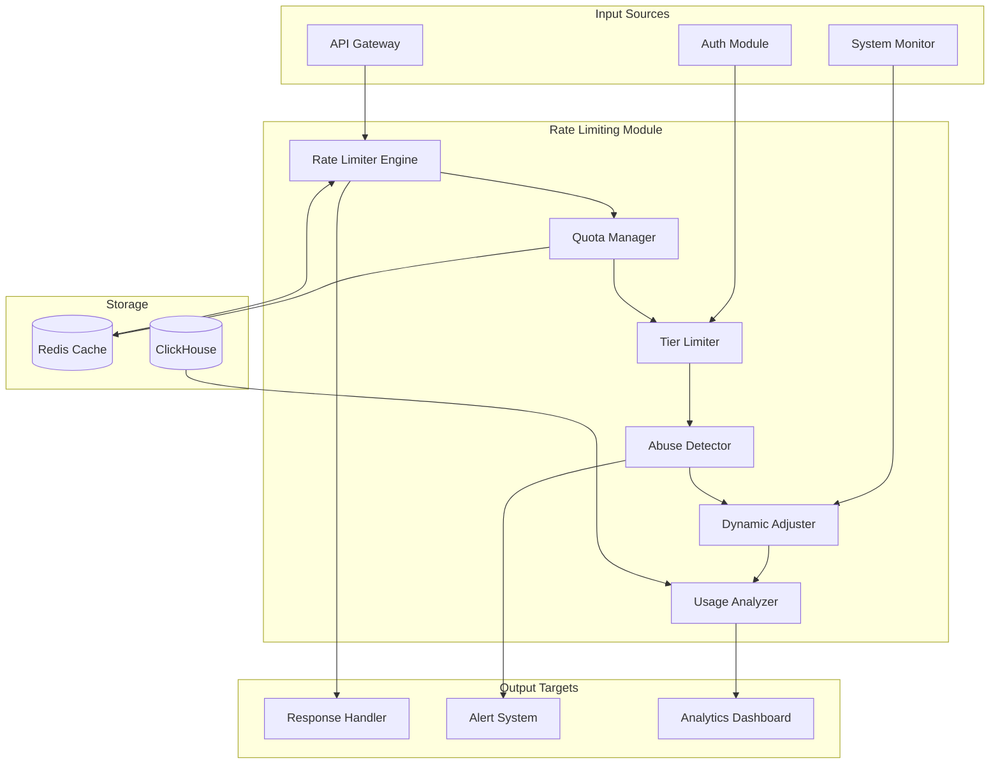

# Rate Limiting Module Specification

## Module Overview

The Rate Limiting Module provides comprehensive API rate limiting and quota management to protect system resources, ensure fair usage, and maintain service quality across all user tiers. It implements multiple rate limiting algorithms and integrates with the authentication system to provide tier-based limits.

## Core Responsibilities

- **Request Rate Limiting**: Control request frequency per user/IP/endpoint
- **Quota Management**: Manage daily/monthly usage quotas
- **Tier-Based Limiting**: Different limits based on subscription tiers
- **Dynamic Rate Adjustment**: Adjust limits based on system load
- **Abuse Detection**: Identify and mitigate abusive patterns
- **Analytics & Reporting**: Track usage patterns and limit effectiveness

## Architecture Diagram



## Data Inputs

### Rate Limit Check Request
```json
{
  "rate_limit_request": {
    "user_id": "user_12345",
    "ip_address": "192.168.1.100",
    "endpoint": "/api/v1/public/predict",
    "http_method": "POST",
    "user_agent": "QuantumTrade-App/1.0",
    "subscription_tier": "premium",
    "request_size_bytes": 1024,
    "timestamp": "2025-07-26T10:30:00Z",
    "auth_context": {
      "roles": ["premium_user", "api_access"],
      "permissions": ["predictions:create"]
    }
  }
}
```

### System Load Information
```json
{
  "system_load": {
    "cpu_utilization": 0.75,
    "memory_utilization": 0.68,
    "request_queue_depth": 45,
    "response_times": {
      "p50": 12,
      "p95": 45,
      "p99": 120
    },
    "active_connections": 234,
    "error_rate": 0.02
  }
}
```

### Usage Analytics Request
```json
{
  "analytics_request": {
    "user_id": "user_12345",
    "time_range": {
      "start": "2025-07-19T00:00:00Z",
      "end": "2025-07-26T23:59:59Z"
    },
    "granularity": "hourly",
    "endpoints": ["/api/v1/public/predict", "/api/v1/public/explain"]
  }
}
```

## Data Outputs

### Rate Limit Response
```json
{
  "rate_limit_response": {
    "allowed": true,
    "user_id": "user_12345",
    "endpoint": "/api/v1/public/predict",
    "limits": {
      "requests_per_minute": 100,
      "requests_per_hour": 5000,
      "requests_per_day": 50000,
      "quota_per_month": 1000000
    },
    "current_usage": {
      "requests_this_minute": 23,
      "requests_this_hour": 1247,
      "requests_this_day": 18493,
      "quota_this_month": 345678
    },
    "remaining": {
      "requests_per_minute": 77,
      "requests_per_hour": 3753,
      "requests_per_day": 31507,
      "quota_per_month": 654322
    },
    "reset_times": {
      "minute_reset": "2025-07-26T10:31:00Z",
      "hour_reset": "2025-07-26T11:00:00Z",
      "day_reset": "2025-07-27T00:00:00Z",
      "month_reset": "2025-08-01T00:00:00Z"
    },
    "headers": {
      "X-RateLimit-Limit": "100",
      "X-RateLimit-Remaining": "77",
      "X-RateLimit-Reset": "1722076860",
      "X-RateLimit-Retry-After": null
    }
  }
}
```

### Rate Limit Exceeded Response
```json
{
  "rate_limit_exceeded": {
    "allowed": false,
    "error": {
      "code": "RATE_LIMIT_EXCEEDED",
      "message": "Rate limit exceeded for endpoint /api/v1/public/predict",
      "details": "You have exceeded your minute limit of 100 requests"
    },
    "current_usage": {
      "requests_this_minute": 100
    },
    "retry_after": 37,
    "upgrade_suggestion": {
      "current_tier": "basic",
      "suggested_tier": "premium",
      "benefits": "10x higher rate limits and priority processing"
    },
    "headers": {
      "X-RateLimit-Limit": "100",
      "X-RateLimit-Remaining": "0",
      "X-RateLimit-Reset": "1722076897",
      "X-RateLimit-Retry-After": "37"
    }
  }
}
```

### Usage Analytics Response
```json
{
  "usage_analytics": {
    "user_id": "user_12345",
    "time_range": {
      "start": "2025-07-19T00:00:00Z",
      "end": "2025-07-26T23:59:59Z"
    },
    "summary": {
      "total_requests": 45789,
      "average_requests_per_hour": 271,
      "peak_requests_per_hour": 892,
      "unique_endpoints": 8,
      "error_rate": 0.01
    },
    "by_endpoint": [
      {
        "endpoint": "/api/v1/public/predict",
        "requests": 35234,
        "percentage": 77.0,
        "avg_response_time": 18
      },
      {
        "endpoint": "/api/v1/public/explain",
        "requests": 8932,
        "percentage": 19.5,
        "avg_response_time": 245
      }
    ],
    "hourly_breakdown": [
      {
        "hour": "2025-07-26T10:00:00Z",
        "requests": 234,
        "limits_hit": 0,
        "errors": 2
      }
    ],
    "tier_utilization": {
      "current_tier": "premium",
      "utilization_percentage": 34.5,
      "projected_monthly_usage": 892345,
      "tier_limit": 1000000
    }
  }
}
```

## Core Components

### 1. Rate Limiter Engine
**Purpose**: Core rate limiting logic with multiple algorithm support
**Technology**: Rust with Redis for state management
**Key Functions**:
- Token bucket algorithm implementation
- Sliding window rate limiting
- Fixed window rate limiting
- Distributed rate limiting across instances

### 2. Quota Manager
**Purpose**: Manage long-term usage quotas and billing cycles
**Technology**: Rust with persistent storage
**Key Functions**:
- Monthly/yearly quota tracking
- Billing cycle management
- Quota reset scheduling
- Usage forecasting

### 3. Tier Limiter
**Purpose**: Apply different limits based on user subscription tiers
**Technology**: Rust with configuration management
**Key Functions**:
- Tier-based limit lookup
- Dynamic tier changes
- Grandfathered limit management
- Limit inheritance and overrides

### 4. Abuse Detector
**Purpose**: Detect and mitigate abusive usage patterns
**Technology**: Rust with statistical analysis
**Key Functions**:
- Pattern recognition for abuse
- Anomaly detection in usage
- Automatic temporary blocking
- Escalation to human review

## API Endpoints

### Internal APIs (Service-to-Service)

#### POST /api/v1/internal/ratelimit/check
**Purpose**: Check if request should be allowed
**Input**: Request context with user/IP/endpoint information
**Output**: Rate limit decision with current usage stats

#### POST /api/v1/internal/ratelimit/record
**Purpose**: Record a successful request for rate limiting
**Input**: Request context and response metadata
**Output**: Updated usage counters

#### GET /api/v1/internal/ratelimit/status/{user_id}
**Purpose**: Get current rate limit status for a user
**Input**: User ID
**Output**: Current usage and remaining limits

#### POST /api/v1/internal/ratelimit/reset
**Purpose**: Reset rate limits for a user (admin function)
**Input**: User ID and reset parameters
**Output**: Reset confirmation

### Public APIs (via API Gateway)

#### GET /api/v1/public/ratelimit/usage
**Purpose**: Get current usage and limits for authenticated user
**Input**: User context from JWT
**Output**: Personal usage statistics and limits

#### GET /api/v1/public/ratelimit/analytics
**Purpose**: Get usage analytics for authenticated user
**Input**: Time range and granularity parameters
**Output**: Detailed usage analytics and trends

### Administrative APIs

#### GET /api/v1/admin/ratelimit/users
**Purpose**: Get rate limiting statistics across all users
**Input**: Query parameters for filtering
**Output**: Aggregated usage statistics

#### POST /api/v1/admin/ratelimit/adjust
**Purpose**: Temporarily adjust rate limits for users
**Input**: User selection criteria and new limits
**Output**: Adjustment confirmation and affected users

#### GET /api/v1/admin/ratelimit/abuse
**Purpose**: Get detected abuse patterns and blocked users
**Input**: Time range filter
**Output**: Abuse detection results and actions taken

## Rate Limiting Algorithms

### 1. Token Bucket Implementation
```rust
use std::time::{Duration, Instant};
use tokio::sync::Mutex;

pub struct TokenBucket {
    capacity: u32,
    tokens: f64,
    refill_rate: f64, // tokens per second
    last_refill: Instant,
}

impl TokenBucket {
    pub fn new(capacity: u32, refill_rate: f64) -> Self {
        Self {
            capacity,
            tokens: capacity as f64,
            refill_rate,
            last_refill: Instant::now(),
        }
    }
    
    pub async fn try_consume(&mut self, tokens: u32) -> bool {
        self.refill().await;
        
        if self.tokens >= tokens as f64 {
            self.tokens -= tokens as f64;
            true
        } else {
            false
        }
    }
    
    async fn refill(&mut self) {
        let now = Instant::now();
        let elapsed = now.duration_since(self.last_refill).as_secs_f64();
        
        self.tokens = (self.tokens + elapsed * self.refill_rate)
            .min(self.capacity as f64);
        self.last_refill = now;
    }
}
```

### 2. Sliding Window Rate Limiter
```rust
use std::collections::VecDeque;
use std::time::{Duration, SystemTime, UNIX_EPOCH};

pub struct SlidingWindowLimiter {
    window_size: Duration,
    max_requests: u32,
    requests: VecDeque<u64>, // timestamps
}

impl SlidingWindowLimiter {
    pub fn new(window_size: Duration, max_requests: u32) -> Self {
        Self {
            window_size,
            max_requests,
            requests: VecDeque::new(),
        }
    }
    
    pub async fn allow_request(&mut self) -> bool {
        let now = SystemTime::now()
            .duration_since(UNIX_EPOCH)
            .unwrap()
            .as_secs();
        
        // Remove old requests outside the window
        let window_start = now - self.window_size.as_secs();
        while let Some(&front) = self.requests.front() {
            if front <= window_start {
                self.requests.pop_front();
            } else {
                break;
            }
        }
        
        // Check if we can add a new request
        if self.requests.len() < self.max_requests as usize {
            self.requests.push_back(now);
            true
        } else {
            false
        }
    }
}
```

### 3. Distributed Rate Limiter (Redis-based)
```rust
use redis::{AsyncCommands, Connection};

pub struct DistributedRateLimiter {
    redis: redis::Client,
}

impl DistributedRateLimiter {
    pub async fn check_rate_limit(
        &self,
        key: &str,
        limit: u32,
        window_seconds: u64,
    ) -> Result<(bool, u32, u64)> {
        let mut conn = self.redis.get_async_connection().await?;
        
        let script = r#"
            local key = KEYS[1]
            local limit = tonumber(ARGV[1])
            local window = tonumber(ARGV[2])
            local now = tonumber(ARGV[3])
            
            -- Remove expired entries
            redis.call('ZREMRANGEBYSCORE', key, 0, now - window)
            
            -- Count current requests
            local current = redis.call('ZCARD', key)
            
            if current < limit then
                -- Add new request
                redis.call('ZADD', key, now, now)
                redis.call('EXPIRE', key, window)
                return {1, current + 1, window - (now % window)}
            else
                return {0, current, window - (now % window)}
            end
        "#;
        
        let now = SystemTime::now()
            .duration_since(UNIX_EPOCH)
            .unwrap()
            .as_secs();
        
        let result: Vec<u64> = redis::Script::new(script)
            .key(key)
            .arg(limit)
            .arg(window_seconds)
            .arg(now)
            .invoke_async(&mut conn)
            .await?;
        
        Ok((result[0] == 1, result[1] as u32, result[2]))
    }
}
```

## Database Interactions

### Redis Rate Limiting Storage

#### Token Bucket State
```
rate_limit:token_bucket:{user_id}:{endpoint} -> {
    "tokens": 87.5,
    "last_refill": 1722076800,
    "capacity": 100,
    "refill_rate": 1.67,
    "ttl": 3600
}
```

#### Sliding Window Requests
```
rate_limit:sliding:{user_id}:{endpoint} -> ZSET {
    score: timestamp,
    member: request_id
}
```

#### Usage Counters
```
rate_limit:counter:{user_id}:{period}:{endpoint} -> {
    "count": 23,
    "reset_time": 1722076860,
    "ttl": 60
}
```

### ClickHouse Analytics Storage

#### Rate Limit Events
```sql
CREATE TABLE rate_limit_events (
    timestamp DateTime64(3, 'UTC'),
    user_id String,
    ip_address IPv4,
    endpoint LowCardinality(String),
    http_method LowCardinality(String),
    allowed Boolean,
    current_usage UInt32,
    limit_value UInt32,
    subscription_tier LowCardinality(String),
    user_agent String,
    request_size_bytes UInt32,
    response_time_ms UInt16
) ENGINE = MergeTree()
PARTITION BY toYYYYMM(timestamp)
ORDER BY (user_id, endpoint, timestamp)
SETTINGS index_granularity = 8192;
```

#### Quota Usage Tracking
```sql
CREATE TABLE quota_usage (
    user_id String,
    quota_period LowCardinality(String), -- 'monthly', 'yearly'
    period_start Date,
    endpoint LowCardinality(String),
    requests_used UInt64,
    quota_limit UInt64,
    last_updated DateTime64(3, 'UTC')
) ENGINE = ReplacingMergeTree(last_updated)
PARTITION BY (quota_period, period_start)
ORDER BY (user_id, endpoint)
SETTINGS index_granularity = 8192;
```

## Integration Points

### With API Gateway
- **Inbound**: All incoming requests for rate limit checking
- **Outbound**: Rate limit decisions and headers
- **Protocol**: Synchronous function calls with minimal latency
- **Data Format**: Rate limit context and response headers

### With Authentication Module
- **Inbound**: User context and subscription tier information
- **Protocol**: Service-to-service API calls
- **Data Format**: User profile with tier and permissions

### With System Monitoring
- **Inbound**: System load metrics for dynamic adjustment
- **Protocol**: Metrics push via monitoring infrastructure
- **Data Format**: System performance metrics

### With Alert System
- **Outbound**: Abuse detection alerts and quota warnings
- **Protocol**: Event-driven notifications
- **Data Format**: Alert events with usage context

## Tier-Based Rate Limits Configuration

### Subscription Tiers
```json
{
  "rate_limits": {
    "free": {
      "requests_per_minute": 10,
      "requests_per_hour": 100,
      "requests_per_day": 1000,
      "quota_per_month": 10000,
      "burst_allowance": 5,
      "endpoints": {
        "/api/v1/public/predict": {
          "requests_per_minute": 5
        },
        "/api/v1/public/explain": {
          "requests_per_minute": 2
        }
      }
    },
    "basic": {
      "requests_per_minute": 50,
      "requests_per_hour": 1000,
      "requests_per_day": 10000,
      "quota_per_month": 100000,
      "burst_allowance": 20,
      "endpoints": {
        "/api/v1/public/predict": {
          "requests_per_minute": 30
        },
        "/api/v1/public/explain": {
          "requests_per_minute": 10
        }
      }
    },
    "premium": {
      "requests_per_minute": 100,
      "requests_per_hour": 5000,
      "requests_per_day": 50000,
      "quota_per_month": 1000000,
      "burst_allowance": 50,
      "endpoints": {
        "/api/v1/public/predict": {
          "requests_per_minute": 80
        },
        "/api/v1/public/explain": {
          "requests_per_minute": 30
        }
      }
    },
    "enterprise": {
      "requests_per_minute": 500,
      "requests_per_hour": 20000,
      "requests_per_day": 200000,
      "quota_per_month": 5000000,
      "burst_allowance": 100,
      "custom_limits": true
    }
  }
}
```

## Performance Requirements

### Response Latency
- **Rate Limit Check**: < 2ms (99th percentile)
- **Usage Recording**: < 1ms (asynchronous where possible)
- **Analytics Query**: < 100ms for standard reports
- **Configuration Update**: < 5ms propagation time

### System Throughput
- **Rate Limit Checks**: 100,000 checks/second
- **Concurrent Users**: Support all active users simultaneously
- **Redis Operations**: < 1ms average latency
- **Burst Handling**: 10x normal capacity for 60 seconds

### Accuracy Requirements
- **Rate Limit Precision**: 99.9% accuracy in limit enforcement
- **Usage Tracking**: No request double-counting or loss
- **Time Window Accuracy**: Within 1-second precision

## Error Handling and Resilience

### Redis Failure Handling
```rust
pub async fn check_with_fallback(
    &self,
    primary_check: impl Future<Output = Result<bool>>,
    fallback_strategy: FallbackStrategy,
) -> bool {
    match primary_check.await {
        Ok(allowed) => allowed,
        Err(_) => match fallback_strategy {
            FallbackStrategy::AllowAll => true,
            FallbackStrategy::DenyAll => false,
            FallbackStrategy::Conservative => {
                // Allow limited requests based on in-memory counters
                self.fallback_limiter.allow_request().await
            }
        }
    }
}
```

### Circuit Breaker Pattern
```rust
pub struct RateLimitCircuitBreaker {
    state: CircuitState,
    failure_count: u32,
    failure_threshold: u32,
    timeout: Duration,
    last_failure: Option<Instant>,
}

impl RateLimitCircuitBreaker {
    pub async fn execute<T>(
        &mut self,
        operation: impl Future<Output = Result<T>>,
    ) -> Result<T> {
        match self.state {
            CircuitState::Closed => {
                match operation.await {
                    Ok(result) => {
                        self.reset();
                        Ok(result)
                    }
                    Err(e) => {
                        self.record_failure();
                        Err(e)
                    }
                }
            }
            CircuitState::Open => {
                if self.should_attempt_reset() {
                    self.state = CircuitState::HalfOpen;
                    self.execute(operation).await
                } else {
                    Err(RateLimitError::CircuitOpen)
                }
            }
            CircuitState::HalfOpen => {
                match operation.await {
                    Ok(result) => {
                        self.reset();
                        Ok(result)
                    }
                    Err(e) => {
                        self.state = CircuitState::Open;
                        Err(e)
                    }
                }
            }
        }
    }
}
```

## Configuration Management

### Environment Variables
```bash
# Rate Limiting Configuration
RATE_LIMIT_REDIS_URL=redis://localhost:6379/1
RATE_LIMIT_DEFAULT_WINDOW_SECONDS=60
RATE_LIMIT_BURST_MULTIPLIER=2.0
RATE_LIMIT_CLEANUP_INTERVAL_SECONDS=300

# Performance Tuning
RATE_LIMIT_BATCH_SIZE=100
RATE_LIMIT_ASYNC_RECORDING=true
RATE_LIMIT_CACHE_TTL_SECONDS=300

# Abuse Detection
ABUSE_DETECTION_ENABLED=true
ABUSE_DETECTION_THRESHOLD_MULTIPLIER=5.0
ABUSE_DETECTION_BLOCK_DURATION_MINUTES=15
```

This Rate Limiting Module provides comprehensive request throttling and quota management while maintaining high performance and providing detailed usage analytics for both users and administrators.