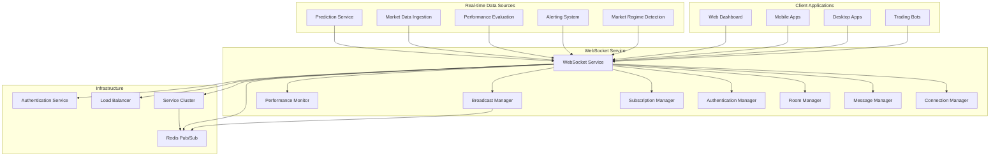

# WebSocket Service - Technical Specification

## Module Overview

The WebSocket Service provides real-time bidirectional communication between the QuantumTrade AI system and client applications. It enables live streaming of market data, predictions, alerts, and system status updates with support for connection management, message routing, authentication, and scalability through clustering.

## Architecture Diagram



## Responsibilities

### **Primary Functions**
- **Real-time Communication**: Provide bidirectional WebSocket connections for live data streaming
- **Connection Management**: Handle client connections, reconnections, and connection lifecycle
- **Message Routing**: Route messages between clients and internal services
- **Room Management**: Organize clients into rooms for targeted broadcasting
- **Subscription Management**: Manage client subscriptions to different data streams
- **Broadcast Management**: Efficiently broadcast messages to multiple clients
- **Authentication**: Verify client identity and manage session tokens
- **Load Balancing**: Distribute connections across multiple service instances

### **Real-time Data Streaming**
- **Market Data**: Live price updates, volume data, and market events
- **Predictions**: Real-time prediction updates and confidence changes
- **Alerts**: System alerts, trading signals, and risk notifications
- **Performance Metrics**: Live performance tracking and evaluation results
- **System Status**: Service health, maintenance notifications, and system events

### **Client Management**
- **Connection Tracking**: Monitor active connections and client states
- **Session Management**: Handle client sessions and authentication tokens
- **Rate Limiting**: Prevent abuse through connection and message rate limits
- **Client Groups**: Organize clients by type, permissions, or subscription level

## API Contract

### **Core Interface**
```rust
#[async_trait]
pub trait WebSocketService {
    // Connection management
    async fn handle_connection(&self, stream: TcpStream, addr: SocketAddr) -> Result<()>;
    async fn authenticate_connection(&self, token: &str) -> Result<ClientInfo>;
    async fn close_connection(&self, client_id: &str) -> Result<()>;
    async fn get_connection_info(&self, client_id: &str) -> Result<ConnectionInfo>;
    
    // Message handling
    async fn send_message(&self, client_id: &str, message: WebSocketMessage) -> Result<()>;
    async fn broadcast_message(&self, room: &str, message: WebSocketMessage) -> Result<()>;
    async fn handle_client_message(&self, client_id: &str, message: WebSocketMessage) -> Result<()>;
    
    // Room management
    async fn join_room(&self, client_id: &str, room: &str) -> Result<()>;
    async fn leave_room(&self, client_id: &str, room: &str) -> Result<()>;
    async fn get_room_members(&self, room: &str) -> Result<Vec<ClientInfo>>;
    
    // Subscription management
    async fn subscribe_to_stream(&self, client_id: &str, stream: DataStream) -> Result<()>;
    async fn unsubscribe_from_stream(&self, client_id: &str, stream: DataStream) -> Result<()>;
    async fn get_client_subscriptions(&self, client_id: &str) -> Result<Vec<DataStream>>;
    
    // Cluster management
    async fn broadcast_to_cluster(&self, message: ClusterMessage) -> Result<()>;
    async fn handle_cluster_message(&self, message: ClusterMessage) -> Result<()>;
    async fn get_cluster_info(&self) -> Result<ClusterInfo>;
}
```

### **Data Structures**
```rust
#[derive(Debug, Clone, Serialize, Deserialize)]
pub struct WebSocketMessage {
    pub message_id: String,
    pub message_type: MessageType,
    pub payload: MessagePayload,
    pub timestamp: DateTime<Utc>,
    pub source: Option<String>,
    pub target: Option<String>,
    pub room: Option<String>,
}

#[derive(Debug, Clone, Serialize, Deserialize)]
pub enum MessageType {
    // Client messages
    Connect,
    Disconnect,
    Subscribe,
    Unsubscribe,
    JoinRoom,
    LeaveRoom,
    Ping,
    Pong,
    
    // Server messages
    MarketData,
    Prediction,
    Alert,
    Performance,
    SystemStatus,
    Error,
    Heartbeat,
}

#[derive(Debug, Clone, Serialize, Deserialize)]
pub enum MessagePayload {
    // Connection messages
    ConnectRequest { token: String, client_info: ClientInfo },
    ConnectResponse { client_id: String, session_token: String },
    
    // Subscription messages
    SubscribeRequest { streams: Vec<DataStream> },
    SubscribeResponse { success: bool, message: String },
    
    // Data messages
    MarketDataPayload { symbol: String, data: MarketData },
    PredictionPayload { symbol: String, prediction: Prediction },
    AlertPayload { alert_type: AlertType, message: String, severity: AlertSeverity },
    PerformancePayload { metrics: PerformanceMetrics },
    
    // Room messages
    RoomJoinRequest { room: String },
    RoomLeaveRequest { room: String },
    RoomMessage { room: String, message: String },
    
    // Error messages
    ErrorPayload { error_code: String, message: String },
}

#[derive(Debug, Clone, Serialize, Deserialize)]
pub struct ClientInfo {
    pub client_id: String,
    pub user_id: Option<String>,
    pub client_type: ClientType,
    pub permissions: Vec<String>,
    pub subscription_level: SubscriptionLevel,
    pub connection_time: DateTime<Utc>,
    pub last_activity: DateTime<Utc>,
    pub rooms: Vec<String>,
    pub subscriptions: Vec<DataStream>,
}

#[derive(Debug, Clone, Serialize, Deserialize)]
pub struct ConnectionInfo {
    pub client_id: String,
    pub connected_at: DateTime<Utc>,
    pub last_heartbeat: DateTime<Utc>,
    pub message_count: u64,
    pub bytes_sent: u64,
    pub bytes_received: u64,
    pub rooms: Vec<String>,
    pub subscriptions: Vec<DataStream>,
    pub status: ConnectionStatus,
}

#[derive(Debug, Clone, Serialize, Deserialize)]
pub struct DataStream {
    pub stream_type: StreamType,
    pub symbol: Option<String>,
    pub interval: Option<Duration>,
    pub filters: HashMap<String, String>,
}

#[derive(Debug, Clone, Serialize, Deserialize)]
pub enum StreamType {
    MarketData,
    Predictions,
    Alerts,
    Performance,
    SystemStatus,
    Custom(String),
}

#[derive(Debug, Clone, Serialize, Deserialize)]
pub struct ClusterMessage {
    pub message_id: String,
    pub source_node: String,
    pub target_nodes: Option<Vec<String>>,
    pub message_type: ClusterMessageType,
    pub payload: Vec<u8>,
    pub timestamp: DateTime<Utc>,
}

#[derive(Debug, Clone, Serialize, Deserialize)]
pub enum ClusterMessageType {
    Broadcast,
    ClientJoin,
    ClientLeave,
    RoomUpdate,
    SubscriptionUpdate,
    Heartbeat,
}
```

## Configuration

### **WebSocket Service Configuration**
```toml
[websocket_service]
# Server configuration
host = "0.0.0.0"
port = 8081
max_connections = 10000
connection_timeout = "300s"
heartbeat_interval = "30s"
heartbeat_timeout = "90s"

# Message configuration
max_message_size = 1048576  # 1MB
message_queue_size = 1000
broadcast_buffer_size = 100

# Room configuration
max_rooms_per_client = 10
max_clients_per_room = 1000
room_cleanup_interval = "300s"

# Subscription configuration
max_subscriptions_per_client = 50
subscription_cleanup_interval = "600s"

# Cluster configuration
cluster_enabled = true
cluster_nodes = ["ws-node-1:8081", "ws-node-2:8081", "ws-node-3:8081"]
cluster_heartbeat_interval = "10s"
cluster_heartbeat_timeout = "30s"

# Redis configuration
redis_url = "redis://localhost:6379"
redis_pubsub_channels = ["websocket_broadcast", "websocket_cluster"]

[authentication]
# Authentication configuration
auth_enabled = true
token_expiry = "24h"
refresh_token_expiry = "7d"
session_cleanup_interval = "3600s"

[rate_limiting]
# Rate limiting configuration
enabled = true
messages_per_second = 100
connections_per_minute = 60
broadcast_rate_limit = 1000

[monitoring]
# Monitoring configuration
metrics_enabled = true
connection_metrics = true
message_metrics = true
performance_metrics = true

# Logging configuration
log_level = "info"
log_connections = true
log_messages = false  # Set to true for debugging
```

## Service Integration

### **Prediction Service Integration**
```rust
impl WebSocketService {
    async fn handle_prediction_update(&self, prediction: Prediction) -> Result<()> {
        // Create WebSocket message for prediction
        let message = WebSocketMessage {
            message_id: Uuid::new_v4().to_string(),
            message_type: MessageType::Prediction,
            payload: MessagePayload::PredictionPayload {
                symbol: prediction.symbol.clone(),
                prediction: prediction.clone(),
            },
            timestamp: Utc::now(),
            source: Some("prediction-service".to_string()),
            target: None,
            room: Some(format!("predictions_{}", prediction.symbol)),
        };
        
        // Broadcast to prediction room
        self.broadcast_message(&format!("predictions_{}", prediction.symbol), message).await?;
        
        // Send to subscribed clients
        let stream = DataStream {
            stream_type: StreamType::Predictions,
            symbol: Some(prediction.symbol.clone()),
            interval: None,
            filters: HashMap::new(),
        };
        
        self.broadcast_to_subscribers(&stream, &message).await?;
        
        Ok(())
    }
    
    async fn broadcast_to_subscribers(&self, stream: &DataStream, message: &WebSocketMessage) -> Result<()> {
        // Get all clients subscribed to this stream
        let subscribers = self.get_stream_subscribers(stream).await?;
        
        for client_id in subscribers {
            if let Err(e) = self.send_message(&client_id, message.clone()).await {
                log::warn!("Failed to send message to client {}: {}", client_id, e);
                
                // Remove failed client from subscriptions
                self.remove_client_subscription(&client_id, stream).await?;
            }
        }
        
        Ok(())
    }
}
```

### **Market Data Integration**
```rust
impl WebSocketService {
    async fn handle_market_data_update(&self, market_data: MarketData) -> Result<()> {
        // Create WebSocket message for market data
        let message = WebSocketMessage {
            message_id: Uuid::new_v4().to_string(),
            message_type: MessageType::MarketData,
            payload: MessagePayload::MarketDataPayload {
                symbol: market_data.symbol.clone(),
                data: market_data.clone(),
            },
            timestamp: Utc::now(),
            source: Some("market-data-ingestion".to_string()),
            target: None,
            room: Some(format!("market_data_{}", market_data.symbol)),
        };
        
        // Broadcast to market data room
        self.broadcast_message(&format!("market_data_{}", market_data.symbol), message).await?;
        
        // Send to subscribed clients
        let stream = DataStream {
            stream_type: StreamType::MarketData,
            symbol: Some(market_data.symbol.clone()),
            interval: None,
            filters: HashMap::new(),
        };
        
        self.broadcast_to_subscribers(&stream, &message).await?;
        
        Ok(())
    }
}
```

### **Alert System Integration**
```rust
impl WebSocketService {
    async fn handle_alert(&self, alert: Alert) -> Result<()> {
        // Create WebSocket message for alert
        let message = WebSocketMessage {
            message_id: Uuid::new_v4().to_string(),
            message_type: MessageType::Alert,
            payload: MessagePayload::AlertPayload {
                alert_type: alert.alert_type.clone(),
                message: alert.message.clone(),
                severity: alert.severity.clone(),
            },
            timestamp: Utc::now(),
            source: Some("alerting-system".to_string()),
            target: None,
            room: Some("alerts".to_string()),
        };
        
        // Broadcast to alerts room
        self.broadcast_message("alerts", message).await?;
        
        // Send to all clients subscribed to alerts
        let stream = DataStream {
            stream_type: StreamType::Alerts,
            symbol: None,
            interval: None,
            filters: HashMap::new(),
        };
        
        self.broadcast_to_subscribers(&stream, &message).await?;
        
        Ok(())
    }
}
```

## Connection Management

### **Connection Lifecycle**
```rust
impl WebSocketService {
    async fn handle_connection(&self, stream: TcpStream, addr: SocketAddr) -> Result<()> {
        let client_id = Uuid::new_v4().to_string();
        
        // Upgrade TCP connection to WebSocket
        let mut websocket = tokio_tungstenite::accept_async(stream).await?;
        
        // Send connection confirmation
        let connect_message = WebSocketMessage {
            message_id: Uuid::new_v4().to_string(),
            message_type: MessageType::Connect,
            payload: MessagePayload::ConnectResponse {
                client_id: client_id.clone(),
                session_token: self.generate_session_token(&client_id).await?,
            },
            timestamp: Utc::now(),
            source: Some("websocket-service".to_string()),
            target: Some(client_id.clone()),
            room: None,
        };
        
        websocket.send(Message::Text(serde_json::to_string(&connect_message)?)).await?;
        
        // Register connection
        self.register_connection(&client_id, addr, websocket).await?;
        
        // Start connection handler
        self.handle_client_connection(client_id, websocket).await?;
        
        Ok(())
    }
    
    async fn handle_client_connection(&self, client_id: String, mut websocket: WebSocketStream<TcpStream>) -> Result<()> {
        let mut heartbeat_timer = tokio::time::interval(Duration::from_secs(30));
        
        loop {
            tokio::select! {
                // Handle incoming messages
                message = websocket.next() => {
                    match message {
                        Some(Ok(Message::Text(text))) => {
                            let ws_message: WebSocketMessage = serde_json::from_str(&text)?;
                            self.handle_client_message(&client_id, ws_message).await?;
                        }
                        Some(Ok(Message::Close(_))) => {
                            break;
                        }
                        Some(Err(e)) => {
                            log::error!("WebSocket error for client {}: {}", client_id, e);
                            break;
                        }
                        None => break,
                    }
                }
                
                // Handle heartbeat
                _ = heartbeat_timer.tick() => {
                    let heartbeat = WebSocketMessage {
                        message_id: Uuid::new_v4().to_string(),
                        message_type: MessageType::Heartbeat,
                        payload: MessagePayload::Ping,
                        timestamp: Utc::now(),
                        source: Some("websocket-service".to_string()),
                        target: Some(client_id.clone()),
                        room: None,
                    };
                    
                    if let Err(e) = websocket.send(Message::Text(serde_json::to_string(&heartbeat)?)).await {
                        log::error!("Failed to send heartbeat to client {}: {}", client_id, e);
                        break;
                    }
                }
            }
        }
        
        // Clean up connection
        self.close_connection(&client_id).await?;
        
        Ok(())
    }
}
```

## Room Management

### **Room Operations**
```rust
impl WebSocketService {
    async fn join_room(&self, client_id: &str, room: &str) -> Result<()> {
        // Validate room name
        if !self.is_valid_room_name(room) {
            return Err(WebSocketError::InvalidRoomName {
                room: room.to_string(),
            }.into());
        }
        
        // Check room capacity
        let room_members = self.get_room_members(room).await?;
        if room_members.len() >= 1000 {
            return Err(WebSocketError::RoomFull {
                room: room.to_string(),
            }.into());
        }
        
        // Add client to room
        self.redis_client.sadd(&format!("room:{}", room), client_id).await?;
        
        // Update client info
        self.update_client_rooms(client_id, room, true).await?;
        
        // Notify other room members
        let join_message = WebSocketMessage {
            message_id: Uuid::new_v4().to_string(),
            message_type: MessageType::JoinRoom,
            payload: MessagePayload::RoomJoinRequest {
                room: room.to_string(),
            },
            timestamp: Utc::now(),
            source: Some(client_id.to_string()),
            target: None,
            room: Some(room.to_string()),
        };
        
        self.broadcast_to_room_except(room, &join_message, client_id).await?;
        
        Ok(())
    }
    
    async fn leave_room(&self, client_id: &str, room: &str) -> Result<()> {
        // Remove client from room
        self.redis_client.srem(&format!("room:{}", room), client_id).await?;
        
        // Update client info
        self.update_client_rooms(client_id, room, false).await?;
        
        // Notify other room members
        let leave_message = WebSocketMessage {
            message_id: Uuid::new_v4().to_string(),
            message_type: MessageType::LeaveRoom,
            payload: MessagePayload::RoomLeaveRequest {
                room: room.to_string(),
            },
            timestamp: Utc::now(),
            source: Some(client_id.to_string()),
            target: None,
            room: Some(room.to_string()),
        };
        
        self.broadcast_to_room_except(room, &leave_message, client_id).await?;
        
        Ok(())
    }
    
    async fn broadcast_to_room_except(&self, room: &str, message: &WebSocketMessage, exclude_client: &str) -> Result<()> {
        let room_members = self.get_room_members(room).await?;
        
        for client_info in room_members {
            if client_info.client_id != exclude_client {
                if let Err(e) = self.send_message(&client_info.client_id, message.clone()).await {
                    log::warn!("Failed to send room message to client {}: {}", client_info.client_id, e);
                }
            }
        }
        
        Ok(())
    }
}
```

## Subscription Management

### **Stream Subscriptions**
```rust
impl WebSocketService {
    async fn subscribe_to_stream(&self, client_id: &str, stream: DataStream) -> Result<()> {
        // Check subscription limits
        let current_subscriptions = self.get_client_subscriptions(client_id).await?;
        if current_subscriptions.len() >= 50 {
            return Err(WebSocketError::SubscriptionLimitExceeded {
                client_id: client_id.to_string(),
                limit: 50,
            }.into());
        }
        
        // Add subscription
        let subscription_key = self.generate_subscription_key(&stream);
        self.redis_client.sadd(&format!("subscription:{}", subscription_key), client_id).await?;
        
        // Update client info
        self.update_client_subscriptions(client_id, &stream, true).await?;
        
        // Send subscription confirmation
        let response = WebSocketMessage {
            message_id: Uuid::new_v4().to_string(),
            message_type: MessageType::Subscribe,
            payload: MessagePayload::SubscribeResponse {
                success: true,
                message: "Successfully subscribed to stream".to_string(),
            },
            timestamp: Utc::now(),
            source: Some("websocket-service".to_string()),
            target: Some(client_id.to_string()),
            room: None,
        };
        
        self.send_message(client_id, response).await?;
        
        Ok(())
    }
    
    async fn unsubscribe_from_stream(&self, client_id: &str, stream: DataStream) -> Result<()> {
        // Remove subscription
        let subscription_key = self.generate_subscription_key(&stream);
        self.redis_client.srem(&format!("subscription:{}", subscription_key), client_id).await?;
        
        // Update client info
        self.update_client_subscriptions(client_id, &stream, false).await?;
        
        // Send unsubscription confirmation
        let response = WebSocketMessage {
            message_id: Uuid::new_v4().to_string(),
            message_type: MessageType::Unsubscribe,
            payload: MessagePayload::SubscribeResponse {
                success: true,
                message: "Successfully unsubscribed from stream".to_string(),
            },
            timestamp: Utc::now(),
            source: Some("websocket-service".to_string()),
            target: Some(client_id.to_string()),
            room: None,
        };
        
        self.send_message(client_id, response).await?;
        
        Ok(())
    }
    
    fn generate_subscription_key(&self, stream: &DataStream) -> String {
        let mut key_parts = vec![stream.stream_type.to_string()];
        
        if let Some(symbol) = &stream.symbol {
            key_parts.push(symbol.clone());
        }
        
        if let Some(interval) = &stream.interval {
            key_parts.push(format!("{}s", interval.as_secs()));
        }
        
        for (k, v) in &stream.filters {
            key_parts.push(format!("{}={}", k, v));
        }
        
        key_parts.join(":")
    }
}
```

## Cluster Management

### **Cross-Node Communication**
```rust
impl WebSocketService {
    async fn broadcast_to_cluster(&self, message: ClusterMessage) -> Result<()> {
        // Publish message to Redis for other nodes
        let message_data = serde_json::to_vec(&message)?;
        self.redis_client
            .publish("websocket_cluster", message_data)
            .await?;
        
        Ok(())
    }
    
    async fn handle_cluster_message(&self, message: ClusterMessage) -> Result<()> {
        match message.message_type {
            ClusterMessageType::Broadcast => {
                let ws_message: WebSocketMessage = serde_json::from_slice(&message.payload)?;
                self.handle_broadcast_message(ws_message).await?;
            }
            ClusterMessageType::ClientJoin => {
                let client_id: String = serde_json::from_slice(&message.payload)?;
                self.handle_client_join_cluster(&client_id).await?;
            }
            ClusterMessageType::ClientLeave => {
                let client_id: String = serde_json::from_slice(&message.payload)?;
                self.handle_client_leave_cluster(&client_id).await?;
            }
            ClusterMessageType::RoomUpdate => {
                let room_update: RoomUpdate = serde_json::from_slice(&message.payload)?;
                self.handle_room_update_cluster(room_update).await?;
            }
            ClusterMessageType::SubscriptionUpdate => {
                let subscription_update: SubscriptionUpdate = serde_json::from_slice(&message.payload)?;
                self.handle_subscription_update_cluster(subscription_update).await?;
            }
            ClusterMessageType::Heartbeat => {
                // Handle cluster heartbeat
                self.handle_cluster_heartbeat(&message.source_node).await?;
            }
        }
        
        Ok(())
    }
    
    async fn handle_broadcast_message(&self, message: WebSocketMessage) -> Result<()> {
        // Handle broadcast message from other nodes
        if let Some(room) = &message.room {
            self.broadcast_to_local_room(room, &message).await?;
        }
        
        Ok(())
    }
}
```

## Error Handling

### **Error Types**
```rust
#[derive(Debug, thiserror::Error)]
pub enum WebSocketError {
    #[error("Connection failed: {reason}")]
    ConnectionFailed { reason: String },
    
    #[error("Authentication failed: {reason}")]
    AuthenticationFailed { reason: String },
    
    #[error("Invalid room name: {room}")]
    InvalidRoomName { room: String },
    
    #[error("Room is full: {room}")]
    RoomFull { room: String },
    
    #[error("Subscription limit exceeded for client {client_id}: {limit}")]
    SubscriptionLimitExceeded { client_id: String, limit: u32 },
    
    #[error("Rate limit exceeded: {limit}")]
    RateLimitExceeded { limit: u32 },
    
    #[error("Client not found: {client_id}")]
    ClientNotFound { client_id: String },
    
    #[error("Room not found: {room}")]
    RoomNotFound { room: String },
    
    #[error("Invalid message format: {reason}")]
    InvalidMessageFormat { reason: String },
    
    #[error("Cluster communication failed: {reason}")]
    ClusterError { reason: String },
}
```

### **Error Handling Strategies**
```rust
impl WebSocketService {
    async fn handle_client_error(&self, client_id: &str, error: &WebSocketError) -> Result<()> {
        let error_message = WebSocketMessage {
            message_id: Uuid::new_v4().to_string(),
            message_type: MessageType::Error,
            payload: MessagePayload::ErrorPayload {
                error_code: match error {
                    WebSocketError::AuthenticationFailed { .. } => "AUTH_FAILED",
                    WebSocketError::RateLimitExceeded { .. } => "RATE_LIMIT",
                    WebSocketError::SubscriptionLimitExceeded { .. } => "SUBSCRIPTION_LIMIT",
                    _ => "GENERAL_ERROR",
                }.to_string(),
                message: error.to_string(),
            },
            timestamp: Utc::now(),
            source: Some("websocket-service".to_string()),
            target: Some(client_id.to_string()),
            room: None,
        };
        
        self.send_message(client_id, error_message).await?;
        
        // Close connection for certain errors
        match error {
            WebSocketError::AuthenticationFailed { .. } => {
                self.close_connection(client_id).await?;
            }
            WebSocketError::RateLimitExceeded { .. } => {
                // Implement rate limit handling
                self.handle_rate_limit_violation(client_id).await?;
            }
            _ => {}
        }
        
        Ok(())
    }
}
```

## Performance Optimization

### **Message Batching**
```rust
impl WebSocketService {
    async fn batch_broadcast(&self, messages: Vec<WebSocketMessage>) -> Result<()> {
        // Group messages by room
        let mut room_messages: HashMap<String, Vec<WebSocketMessage>> = HashMap::new();
        
        for message in messages {
            if let Some(room) = &message.room {
                room_messages.entry(room.clone()).or_default().push(message);
            }
        }
        
        // Broadcast batched messages to each room
        for (room, messages) in room_messages {
            self.broadcast_batch_to_room(&room, messages).await?;
        }
        
        Ok(())
    }
    
    async fn broadcast_batch_to_room(&self, room: &str, messages: Vec<WebSocketMessage>) -> Result<()> {
        let room_members = self.get_room_members(room).await?;
        
        // Create batch message
        let batch_message = WebSocketMessage {
            message_id: Uuid::new_v4().to_string(),
            message_type: MessageType::Batch,
            payload: MessagePayload::BatchPayload { messages },
            timestamp: Utc::now(),
            source: Some("websocket-service".to_string()),
            target: None,
            room: Some(room.to_string()),
        };
        
        // Send to all room members
        for client_info in room_members {
            if let Err(e) = self.send_message(&client_info.client_id, batch_message.clone()).await {
                log::warn!("Failed to send batch message to client {}: {}", client_info.client_id, e);
            }
        }
        
        Ok(())
    }
}
```

## Monitoring and Observability

### **Connection Metrics**
```rust
impl WebSocketService {
    async fn record_connection_metrics(&self, client_id: &str, event: ConnectionEvent) -> Result<()> {
        match event {
            ConnectionEvent::Connected => {
                self.metrics_client
                    .counter("websocket_connections_total", 1)
                    .record()
                    .await?;
                
                self.metrics_client
                    .gauge("websocket_active_connections", 1)
                    .record()
                    .await?;
            }
            ConnectionEvent::Disconnected => {
                self.metrics_client
                    .gauge("websocket_active_connections", -1)
                    .record()
                    .await?;
            }
            ConnectionEvent::MessageSent { bytes } => {
                self.metrics_client
                    .counter("websocket_messages_sent_total", 1)
                    .with_label("client_id", client_id)
                    .record()
                    .await?;
                
                self.metrics_client
                    .counter("websocket_bytes_sent_total", bytes as u64)
                    .with_label("client_id", client_id)
                    .record()
                    .await?;
            }
            ConnectionEvent::MessageReceived { bytes } => {
                self.metrics_client
                    .counter("websocket_messages_received_total", 1)
                    .with_label("client_id", client_id)
                    .record()
                    .await?;
                
                self.metrics_client
                    .counter("websocket_bytes_received_total", bytes as u64)
                    .with_label("client_id", client_id)
                    .record()
                    .await?;
            }
        }
        
        Ok(())
    }
}
```

## Testing Strategy

### **Unit Tests**
```rust
#[cfg(test)]
mod tests {
    use super::*;
    
    #[tokio::test]
    async fn test_connection_management() {
        let service = create_test_websocket_service().await;
        let client_id = "test_client";
        
        // Test connection registration
        service.register_test_connection(client_id).await.unwrap();
        
        let connection_info = service.get_connection_info(client_id).await.unwrap();
        assert_eq!(connection_info.client_id, client_id);
        assert_eq!(connection_info.status, ConnectionStatus::Connected);
        
        // Test connection cleanup
        service.close_connection(client_id).await.unwrap();
        
        let result = service.get_connection_info(client_id).await;
        assert!(result.is_err());
    }
    
    #[tokio::test]
    async fn test_room_management() {
        let service = create_test_websocket_service().await;
        let client_id = "test_client";
        let room = "test_room";
        
        // Test room join
        service.join_room(client_id, room).await.unwrap();
        
        let room_members = service.get_room_members(room).await.unwrap();
        assert!(room_members.iter().any(|m| m.client_id == client_id));
        
        // Test room leave
        service.leave_room(client_id, room).await.unwrap();
        
        let room_members = service.get_room_members(room).await.unwrap();
        assert!(!room_members.iter().any(|m| m.client_id == client_id));
    }
    
    #[tokio::test]
    async fn test_subscription_management() {
        let service = create_test_websocket_service().await;
        let client_id = "test_client";
        let stream = DataStream {
            stream_type: StreamType::MarketData,
            symbol: Some("AAPL".to_string()),
            interval: None,
            filters: HashMap::new(),
        };
        
        // Test subscription
        service.subscribe_to_stream(client_id, &stream).await.unwrap();
        
        let subscriptions = service.get_client_subscriptions(client_id).await.unwrap();
        assert!(subscriptions.contains(&stream));
        
        // Test unsubscription
        service.unsubscribe_from_stream(client_id, stream).await.unwrap();
        
        let subscriptions = service.get_client_subscriptions(client_id).await.unwrap();
        assert!(!subscriptions.contains(&stream));
    }
}
```

### **Integration Tests**
```rust
#[cfg(test)]
mod integration_tests {
    use super::*;
    
    #[tokio::test]
    async fn test_real_time_data_streaming() {
        let service = create_test_websocket_service().await;
        let client_id = "test_client";
        
        // Subscribe to market data
        let stream = DataStream {
            stream_type: StreamType::MarketData,
            symbol: Some("AAPL".to_string()),
            interval: None,
            filters: HashMap::new(),
        };
        
        service.subscribe_to_stream(client_id, &stream).await.unwrap();
        
        // Simulate market data update
        let market_data = MarketData {
            symbol: "AAPL".to_string(),
            price: 150.0,
            volume: 1000000,
            timestamp: Utc::now(),
        };
        
        service.handle_market_data_update(market_data).await.unwrap();
        
        // Verify message was sent to client
        let sent_messages = service.get_sent_messages(client_id).await.unwrap();
        assert!(!sent_messages.is_empty());
        
        let last_message = sent_messages.last().unwrap();
        assert_eq!(last_message.message_type, MessageType::MarketData);
    }
    
    #[tokio::test]
    async fn test_cluster_communication() {
        let service1 = create_test_websocket_service().await;
        let service2 = create_test_websocket_service().await;
        
        // Test cluster message broadcasting
        let cluster_message = ClusterMessage {
            message_id: Uuid::new_v4().to_string(),
            source_node: "node-1".to_string(),
            target_nodes: None,
            message_type: ClusterMessageType::Broadcast,
            payload: serde_json::to_vec(&"test message").unwrap(),
            timestamp: Utc::now(),
        };
        
        service1.broadcast_to_cluster(cluster_message).await.unwrap();
        
        // Verify message was received by other node
        let received_messages = service2.get_received_cluster_messages().await.unwrap();
        assert!(!received_messages.is_empty());
    }
}
```

## Deployment Configuration

### **Docker Configuration**
```dockerfile
FROM rust:1.70-alpine as builder

WORKDIR /app
COPY Cargo.toml Cargo.lock ./
COPY src ./src

RUN cargo build --release

FROM alpine:latest

RUN apk add --no-cache ca-certificates tzdata
WORKDIR /app

COPY --from=builder /app/target/release/websocket-service .
COPY config/websocket-service.toml ./config/

EXPOSE 8081

CMD ["./websocket-service"]
```

### **Kubernetes Configuration**
```yaml
apiVersion: apps/v1
kind: Deployment
metadata:
  name: websocket-service
  namespace: quanttrade
spec:
  replicas: 3
  selector:
    matchLabels:
      app: websocket-service
  template:
    metadata:
      labels:
        app: websocket-service
    spec:
      containers:
      - name: websocket-service
        image: quanttrade/websocket-service:latest
        ports:
        - containerPort: 8081
        env:
        - name: RUST_LOG
          value: "info"
        - name: CONFIG_PATH
          value: "/app/config/websocket-service.toml"
        resources:
          requests:
            memory: "512Mi"
            cpu: "500m"
          limits:
            memory: "1Gi"
            cpu: "1000m"
        livenessProbe:
          httpGet:
            path: /health
            port: 8081
          initialDelaySeconds: 30
          periodSeconds: 10
        readinessProbe:
          httpGet:
            path: /ready
            port: 8081
          initialDelaySeconds: 5
          periodSeconds: 5
---
apiVersion: v1
kind: Service
metadata:
  name: websocket-service
  namespace: quanttrade
spec:
  selector:
    app: websocket-service
  ports:
  - name: websocket
    port: 8081
    targetPort: 8081
  type: LoadBalancer
```

This specification provides a comprehensive WebSocket Service that enables real-time bidirectional communication between the QuantumTrade AI system and client applications, with robust connection management, message routing, room management, and cluster support. 