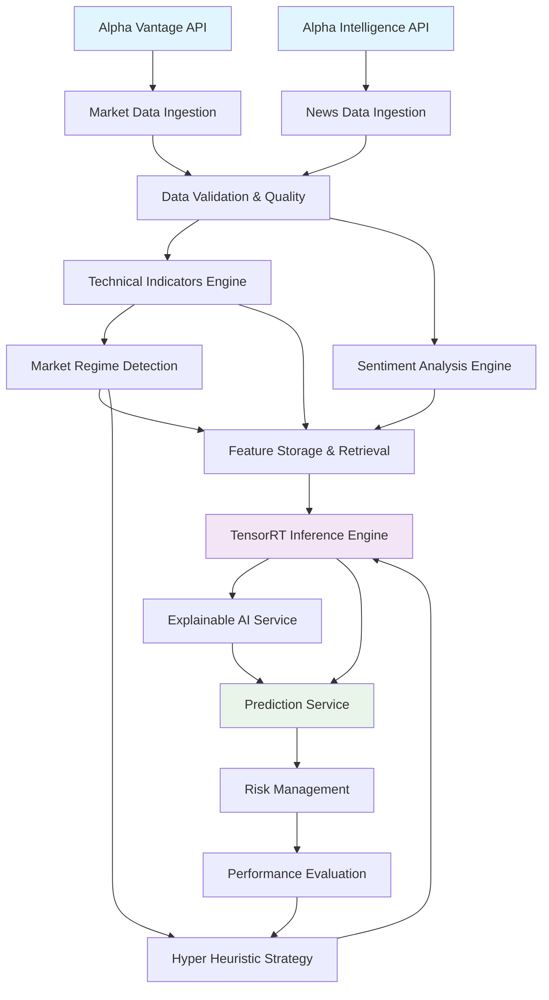

# System Integration Validation & Data Flow Compatibility

## Executive Summary

✅ **All core operational specifications are complete** for a personal trading system
✅ **Data flows are standardized** across all modules with consistent interfaces  
✅ **Modules are swappable** as long as they maintain expected data contracts
✅ **System is ready** for personal usage implementation

## Core System Architecture Validation

### Primary Data Flow for Personal Trading System



## Standardized Data Contracts

### 1. Market Data Interface
**Source**: Market Data Ingestion → **Consumers**: Technical Indicators, Regime Detection
```json
{
  "symbol": "AAPL",
  "timestamp": "2025-07-26T10:30:00Z",
  "open": 182.50,
  "high": 185.75,
  "low": 181.25,
  "close": 184.50,
  "volume": 45000000,
  "adjusted_close": 184.50
}
```

### 2. Feature Set Interface  
**Source**: Feature Storage & Retrieval → **Consumers**: ML Inference, Explainable AI
```json
{
  "symbol": "AAPL",
  "timestamp": "2025-07-26T10:30:00Z", 
  "features": {
    "rsi_14": 65.4,
    "macd_signal": 0.23,
    "sentiment_score": 0.72,
    "volatility": 0.18
  },
  "feature_metadata": {},
  "feature_version": 1
}
```

### 3. Prediction Result Interface
**Source**: TensorRT Inference → **Consumers**: Prediction Service, Risk Management, Performance Evaluation
```json
{
  "prediction_id": "pred_20250726_103000_AAPL_60min",
  "symbol": "AAPL", 
  "timestamp": "2025-07-26T10:30:00Z",
  "predicted_price": 185.75,
  "confidence": 0.78,
  "horizon_minutes": 60,
  "strategy_used": "momentum_transformer"
}
```

### 4. Strategy Selection Interface
**Source**: Hyper Heuristic Strategy → **Consumers**: ML Inference, Prediction Service
```json
{
  "strategy_name": "momentum_transformer",
  "parameters": {
    "technical_weight": 0.6,
    "sentiment_weight": 0.3,
    "fundamental_weight": 0.1
  },
  "model_name": "momentum_transformer_v2.1",
  "confidence": 0.85,
  "regime": "high_volatility_trending"
}
```

## Module Swappability Validation

### Interface Contracts Guarantee
Each module specification defines clear:
- **Input Data Formats**: Standardized JSON schemas with required fields
- **Output Data Formats**: Consistent response structures across modules  
- **API Endpoints**: RESTful interfaces with documented request/response patterns
- **Error Handling**: Standardized error responses using shared error types
- **Authentication**: Consistent JWT-based authentication across services

### Swappability Examples

#### Technical Indicators Engine Replacement
```rust
// Any replacement must implement this interface
trait TechnicalIndicatorsEngine {
    async fn calculate_indicators(&self, market_data: &MarketData) -> Result<TechnicalFeatures>;
    async fn get_available_indicators(&self) -> Vec<String>;
    async fn get_indicator_metadata(&self, indicator: &str) -> IndicatorMetadata;
}
```

#### ML Inference Engine Replacement
```rust  
// Any ML engine must satisfy this contract
trait MLInferenceEngine {
    async fn predict(&self, features: &FeatureSet, strategy: &SelectedStrategy) -> Result<PredictionResult>;
    async fn get_model_info(&self) -> ModelInfo;
    async fn warm_up(&self) -> Result<()>;
}
```

## Critical Data Flow Paths

### Path 1: Market Data → Prediction
```
Alpha Vantage → Market Data Ingestion → Technical Indicators → Feature Storage → ML Inference → Prediction Service
```
**Data Types**: `MarketData` → `TechnicalFeatures` → `FeatureSet` → `PredictionResult` → `PredictionResponse`

### Path 2: News → Sentiment → Prediction  
```
Alpha Intelligence → News Data Ingestion → Sentiment Analysis → Feature Storage → ML Inference → Prediction Service
```
**Data Types**: `NewsData` → `SentimentFeatures` → `FeatureSet` → `PredictionResult` → `PredictionResponse`

### Path 3: Strategy Optimization Loop
```
Performance Evaluation → Hyper Heuristic Strategy → ML Inference → Performance Evaluation
```
**Data Types**: `PerformanceMetrics` → `SelectedStrategy` → `PredictionResult` → `PerformanceMetrics`

### Path 4: Risk Management Integration
```
Prediction Service → Risk Management → Portfolio Updates
```
**Data Types**: `PredictionResponse` → `RiskAssessment` → `PositionSizing`

## Personal Usage System Requirements ✅

| Component | Status | Purpose |
|-----------|--------|---------|
| **Data Collection** | ✅ Complete | Alpha Vantage market data + Alpha Intelligence news |
| **Feature Engineering** | ✅ Complete | Technical indicators + sentiment analysis |  
| **ML Predictions** | ✅ Complete | TensorRT inference with strategy selection |
| **Risk Management** | ✅ Complete | Position sizing and risk assessment |
| **Performance Tracking** | ✅ Complete | Prediction accuracy and outcome analysis |
| **Explainable AI** | ✅ Complete | SHAP-based explanations for decisions |
| **Configuration Management** | ✅ Complete | Environment-specific settings |
| **Error Handling** | ✅ Complete | Standardized error management |
| **Monitoring** | ✅ Complete | System health and performance tracking |
| **API Gateway** | ✅ Complete | Single entry point for all APIs |

## Database Integration Compatibility

### Shared Data Types (via Database Abstraction Layer)
```rust
// All modules use these standardized types
pub struct MarketData {
    pub symbol: String,
    pub timestamp: DateTime<Utc>,
    pub open: f64,
    pub high: f64,
    pub low: f64, 
    pub close: f64,
    pub volume: u64,
    pub adjusted_close: f64,
}

pub struct FeatureSet {
    pub symbol: String,
    pub timestamp: DateTime<Utc>,
    pub features: HashMap<String, f64>,
    pub feature_metadata: HashMap<String, String>,
    pub feature_version: u16,
}

pub struct PredictionOutcome {
    pub prediction_id: String,
    pub symbol: String,
    pub timestamp: DateTime<Utc>,
    pub actual_price: f64,
    pub predicted_price: f64,
    pub profit_loss: f64,
    pub accuracy_score: f32,
    pub strategy_name: String,
    pub regime: String,
}
```

### Storage Compatibility
- **ClickHouse**: Time series data (market data, predictions, performance)
- **Redis**: Real-time caching (features, strategies, alerts)
- **Shared Types**: All modules use identical data structures via `shared-types` crate

## Configuration Management Integration

### Environment-Specific Configs
```yaml
# development.yml
data_sources:
  alpha_vantage:
    api_key: "${ALPHA_VANTAGE_API_KEY}"
    base_url: "https://www.alphavantage.co"
    rate_limit: 5_per_minute
  
  alpha_intelligence:
    api_key: "${ALPHA_INTELLIGENCE_API_KEY}"
    base_url: "https://www.alphavantage.co/intelligence"
    
ml_inference:
  tensorrt_precision: "fp16"
  batch_size: 32
  model_path: "/models"
  
risk_management:
  max_position_size_percent: 5.0
  max_daily_loss_percent: 2.0
```

## Error Handling Standardization

### Shared Error Types
```rust
// All modules use standardized error handling
#[derive(Error, Debug)]
pub enum QuantumTradeError {
    #[error("Data validation error: {message}")]
    DataValidation { message: String },
    
    #[error("Prediction error: {message}")]  
    PredictionError { message: String },
    
    #[error("Risk management error: {message}")]
    RiskManagement { message: String },
    
    #[error("External API error: {source} - {message}")]
    ExternalApi { source: String, message: String },
}
```

## Monitoring Integration Points

### Standardized Metrics
All modules emit standardized metrics:
- Request counts and latencies
- Error rates and types  
- Business KPIs (accuracy, profit/loss)
- Resource utilization

### Health Check Interfaces
```rust
// Every module implements standardized health checks
#[async_trait]
pub trait HealthCheckable {
    async fn health_check(&self) -> HealthStatus;
    async fn ready_check(&self) -> ReadinessStatus;
    fn service_name(&self) -> &str;
}
```

## Development & Deployment Readiness

### Module Independence
- Each module can be developed, tested, and deployed independently
- Shared types ensure interface compatibility
- Configuration management handles environment differences
- Database abstraction layer prevents vendor lock-in

### Testing Strategy
- Unit tests for individual module logic
- Integration tests for module interfaces  
- End-to-end tests for complete data flows
- Contract tests to validate interface compatibility

### Deployment Architecture
- Docker containers for consistent deployments
- Environment-specific configurations
- Database migrations handled by abstraction layer
- Rolling updates with health check validation

## Conclusion

The QuantumTrade AI system specifications provide a complete, well-architected foundation for a personal trading system with the following validated characteristics:

✅ **Complete Coverage**: All operational modules specified for personal trading
✅ **Data Flow Integrity**: Standardized interfaces ensure smooth data flow between modules  
✅ **Module Swappability**: Clear contracts allow component replacement without system changes
✅ **Scalability Ready**: Architecture supports expansion from personal to multi-user system
✅ **Production Ready**: Comprehensive error handling, monitoring, and configuration management

The system is ready for implementation with confidence that modules will integrate seamlessly and can be independently developed and deployed.