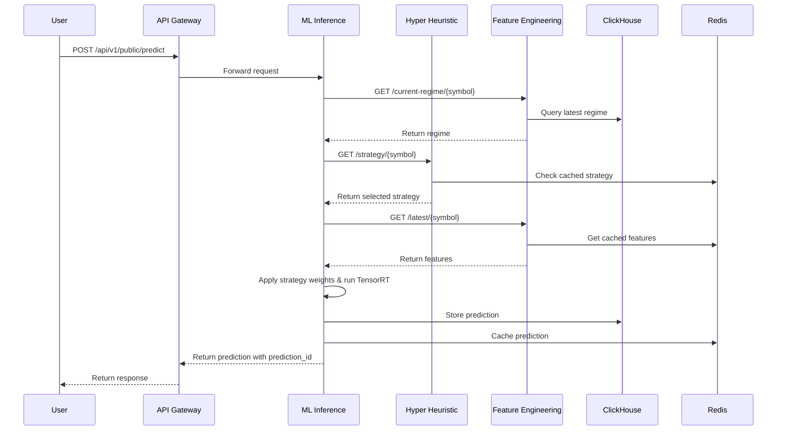
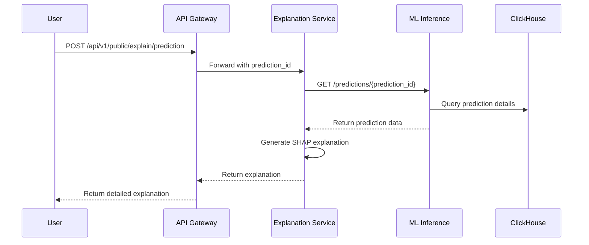
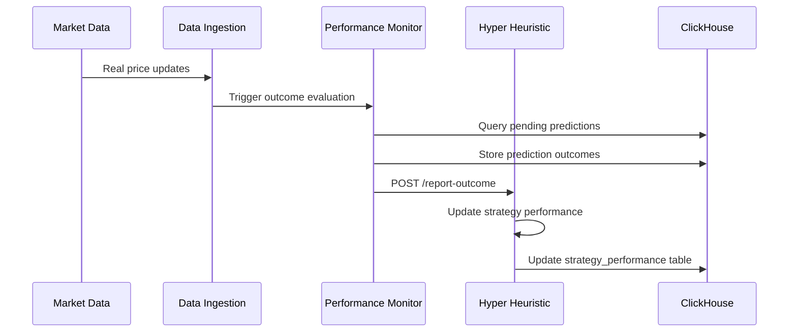

Explainable Financial Forecasting System

## Project Overview

**CURRENTLY IN EARLY DEVELOPMENT
**
This is a high-performance, modular financial forecasting system built with Rust and Python that combines advanced machine learning with explainable AI to provide actionable trading insights. The system employs a microservices architecture where each component (data ingestion, feature engineering, ML inference, and explainability) operates as an independent, scalable service communicating through well-defined REST APIs. This modular design enables individual components to be developed, tested, deployed, and scaled independently while maintaining high performance and low latency.

At its core, the system utilizes **Hyper Heuristic Strategy Selection** to dynamically choose optimal parameter weightings and model configurations based on current market conditions and regime detection. This adaptive approach allows the system to automatically select the best-performing strategies and adjust model parameters in real-time, rather than using static configurations.

The platform processes real-time and batch financial data from multiple sources including market feeds, social media sentiment, and news analysis. It uses sophisticated regime detection algorithms and TensorRT-optimized models to forecast price movements across multiple timeframes while providing detailed explanations for each prediction. The system targets sub-20ms prediction latency and supports thousands of concurrent users, making it suitable for professional trading environments.

## Key Features

- **High-Performance Architecture**: Rust-based microservices with sub-20ms prediction latency
- **Hyper Heuristic Strategy Selection**: Automated parameter weighting and model selection based on market conditions
- **Explainable AI**: Advanced SHAP/LIME integration with detailed reasoning for all predictions
- **Multi-Source Data**: Integrates market data, Reddit sentiment, and news analysis
- **Real-time Processing**: Stream processing with Kinesis for live market data
- **Regime Detection**: Dynamic model switching based on market conditions
- **Adaptive Model Parameters**: Real-time optimization of model weights and configurations
- **GPU Acceleration**: TensorRT optimization for transformer model inference
- **Modular Design**: Independent services with REST API communication
- **Time Series Optimization**: ClickHouse database for 100x faster analytical queries
- **Scalable Infrastructure**: Auto-scaling ECS services on AWS

## Technology Stack

### **Core Services (Rust)**
- **Framework**: Axum 0.7 for HTTP services 
- **Async Runtime**: Tokio 1.0 with full features
- **Data Processing**: Polars 0.35 for high-performance DataFrame operations
- **ML Inference**: TensorRT for GPU-accelerated inference
- **Serialization**: Serde 1.0 with optimized binary formats
- **HTTP Client**: Reqwest 0.11 with connection pooling
- **Database**: ClickHouse client for time series data
- **Caching**: Redis-rs for distributed cache
- **Monitoring**: Tracing + OpenTelemetry + custom financial metrics

### **ML Training Pipeline (Python)**
- **Framework**: PyTorch 2.1 + Lightning with TensorRT optimization
- **Explainability**: SHAP, LIME, Captum
- **Optimization**: Optuna for hyperparameter tuning
- **Feature Engineering**: Feature-engine, tsfresh
- **Model Export**: TensorRT for optimized deployment
- **Experiment Tracking**: MLflow
- **Data Processing**: Polars for high-performance analytics

### **Infrastructure (AWS)**
- **Compute**: ECS Fargate (Graviton3 processors) + EC2 G4dn for GPU inference
- **Load Balancing**: Application Load Balancer
- **API Gateway**: AWS API Gateway v2 with WebSocket support
- **Database**: ClickHouse for time series optimization
- **Cache**: ElastiCache Redis for real-time features
- **Storage**: S3 for models and data lake
- **Streaming**: Kinesis Data Streams for real-time processing
- **GPU Inference**: TensorRT on G4dn instances (T4 GPUs)
- **Monitoring**: CloudWatch + X-Ray
- **CI/CD**: CodePipeline + CodeBuild

### **Data Sources**
- **Market Data**: Yahoo Finance API, Alpha Vantage
- **Social Media**: Reddit API (r/wallstreetbets sentiment analysis)
- **News**: NewsAPI, Financial Modeling Prep
- **Economic Data**: FRED API (Federal Reserve)

## Project Structure

```
quantumtrade-ai/
├── README.md
├── Cargo.toml                          # Rust workspace configuration
├── docker-compose.yml                  # Local development environment
├── terraform/                          # AWS infrastructure as code
│   ├── main.tf
│   ├── variables.tf
│   └── outputs.tf
├── services/                           # Microservices directory
│   ├── data-ingestion/                 # Data collection service
│   │   ├── Cargo.toml
│   │   ├── src/
│   │   │   ├── main.rs
│   │   │   ├── yahoo_client.rs
│   │   │   ├── reddit_client.rs
│   │   │   └── news_client.rs
│   │   └── Dockerfile
│   ├── feature-engineering/            # Feature calculation service
│   │   ├── Cargo.toml
│   │   ├── src/
│   │   │   ├── main.rs
│   │   │   ├── technical_indicators.rs
│   │   │   ├── sentiment_features.rs
│   │   │   └── regime_detection.rs
│   │   └── Dockerfile
│   ├── hyper-heuristic/                # Strategy selection and parameter optimization
│   │   ├── Cargo.toml
│   │   ├── src/
│   │   │   ├── main.rs
│   │   │   ├── strategy_selector.rs
│   │   │   ├── parameter_optimizer.rs
│   │   │   ├── performance_tracker.rs
│   │   │   └── meta_learner.rs
│   │   └── Dockerfile
│   ├── ml-inference/                   # TensorRT inference service
│   │   ├── Cargo.toml
│   │   ├── src/
│   │   │   ├── main.rs
│   │   │   ├── tensorrt_engine.rs
│   │   │   ├── model_router.rs
│   │   │   └── prediction_api.rs
│   │   └── Dockerfile
│   ├── explanation-service/            # Python explainability service
│   │   ├── requirements.txt
│   │   ├── src/
│   │   │   ├── main.py
│   │   │   ├── shap_explainer.py
│   │   │   ├── lime_explainer.py
│   │   │   └── explanation_api.py
│   │   └── Dockerfile
│   └── api-gateway/                    # Main API coordination service
│       ├── Cargo.toml
│       ├── src/
│       │   ├── main.rs
│       │   ├── routes.rs
│       │   ├── auth.rs
│       │   └── rate_limiting.rs
│       └── Dockerfile
│   └── performance-monitor/            # Performance tracking and feedback service
│       ├── Cargo.toml
│       ├── src/
│       │   ├── main.rs
│       │   ├── outcome_tracker.rs
│       │   ├── performance_calculator.rs
│       │   └── feedback_reporter.rs
│       └── Dockerfile
├── ml-training/                        # Model training pipeline
│   ├── requirements.txt
│   ├── train.py
│   ├── models/
│   │   ├── transformer.py
│   │   ├── ensemble.py
│   │   └── regime_detector.py
│   ├── features/
│   │   ├── technical.py
│   │   ├── sentiment.py
│   │   └── fundamental.py
│   └── experiments/
│       └── config/
├── shared/                             # Shared libraries and types
│   ├── types/                          # Common data structures
│   │   ├── Cargo.toml
│   │   └── src/
│   │       ├── lib.rs
│   │       ├── market_data.rs
│   │       ├── features.rs
│   │       └── predictions.rs
│   └── utils/                          # Common utilities
│       ├── Cargo.toml
│       └── src/
│           ├── lib.rs
│           ├── clickhouse.rs
│           ├── redis.rs
│           └── monitoring.rs
├── frontend/                           # React web application
│   ├── package.json
│   ├── src/
│   │   ├── components/
│   │   ├── pages/
│   │   └── utils/
│   └── public/
├── scripts/                            # Deployment and utility scripts
│   ├── deploy.sh
│   ├── setup-db.sql
│   └── load-test.py
└── docs/                              # Documentation
    ├── api/                           # API documentation
    ├── deployment/                    # Deployment guides
    └── development/                   # Development setup
```

## System Architecture

### **Microservices Design**

```
┌─────────────────┐    ┌─────────────────┐    ┌─────────────────┐    ┌─────────────────┐
│   Data Ingestion│    │  Feature Engine │    │ Hyper Heuristic │    │  ML Inference   │
│     Service     │───>│     Service     │───>│    Service      │───>│    Service      │
│    (Rust)       │    │    (Rust)       │    │    (Rust)       │    │    (Rust)       │
└─────────────────┘    └─────────────────┘    └─────────────────┘    └─────────────────┘
         │                      │                      ▲                      │
         │                      │                      │                      │
         │                      │             ┌─────────────────┐             │
         │                      │             │  Performance    │             │
         │                      │             │    Monitor      │             │
         │                      │             │   (Rust)        │             │
         │                      │             └─────────────────┘             │
         ▼                      ▼                      │                      ▼
┌─────────────────┐    ┌─────────────────┐    ┌─────────────────┐    ┌─────────────────┐
│   ClickHouse    │    │     Redis       │    │  Strategy Store │    │  Explanation    │
│   (Time Series) │    │    (Cache)      │    │    (Redis)      │    │    Service      │
│                 │    │                 │    │                 │    │   (Python)      │
└─────────────────┘    └─────────────────┘    └─────────────────┘    └─────────────────┘
```

### **API Gateway Structure**
- **External APIs**: `/api/v1/public/*` - Rate limited, authenticated
- **Internal APIs**: `/api/v1/internal/*` - Service-to-service communication
- **Admin APIs**: `/api/v1/admin/*` - Management and monitoring
- **WebSocket**: `/ws/v1/*` - Real-time data streams

### **Data Flow Architecture**

#### **Batch Processing Pipeline**
```
Yahoo Finance ─┐
Reddit API     ├─▶ Data Ingestion ─▶ Feature Engineering ─▶ ClickHouse
News APIs     ─┘       Service            Service            Storage
```

#### **Real-time Processing Pipeline**
```
Market Stream ─▶ Kinesis ─▶ Stream Processor ─▶ Redis ─▶ ML Service
                            (Rust Lambda)       Cache    Inference
```

## **Complete API Integration Flow**

### **Prediction Request Flow**


### **Explanation Request Flow**


### **Performance Feedback Flow**


## Service Specifications

### **1. Data Ingestion Service**
**Purpose**: Collect and normalize data from multiple sources
**Technology**: Rust + Tokio
**Deployment**: ECS Fargate scheduled tasks

**Endpoints**:
- `POST /api/v1/internal/ingest/yahoo` - Trigger Yahoo Finance collection
- `POST /api/v1/internal/ingest/reddit` - Collect Reddit sentiment data
- `POST /api/v1/internal/ingest/news` - Process news articles
- `GET /api/v1/internal/ingest/status` - Collection status

**Data Sources Integration**:
- **Yahoo Finance**: OHLCV, volume, splits, dividends
- **Reddit**: Post sentiment, mention frequency, upvote ratios
- **News**: Article sentiment, entity extraction, relevance scoring

### **2. Feature Engineering Service**
**Purpose**: Transform raw data into ML-ready features
**Technology**: Rust + Polars
**Deployment**: ECS Fargate auto-scaling

**Endpoints**:
- `POST /api/v1/internal/features/technical` - Calculate technical indicators
- `POST /api/v1/internal/features/sentiment` - Process sentiment features
- `POST /api/v1/internal/features/regime` - Detect market regimes
- `GET /api/v1/internal/features/schema` - Feature schema definition
- `GET /api/v1/internal/features/current-regime/{symbol}` - Get current market regime for symbol
- `GET /api/v1/internal/features/latest/{symbol}` - Get latest features for ML inference

**Feature Categories**:
- **Technical**: RSI, MACD, Bollinger Bands, Volume indicators
- **Sentiment**: Reddit sentiment scores, news sentiment, fear/greed index
- **Regime**: Volatility regimes, trend identification, correlation shifts
- **Fundamental**: P/E ratios, sector performance, economic indicators

### **3. Hyper Heuristic Service**
**Purpose**: Dynamic strategy selection and parameter optimization
**Technology**: Rust + Polars + Optimization algorithms
**Deployment**: ECS Fargate with CPU-intensive instances

**Endpoints**:
- `POST /api/v1/internal/heuristic/select-strategy` - Choose optimal strategy for current conditions
- `POST /api/v1/internal/heuristic/optimize-parameters` - Optimize model parameters
- `GET /api/v1/internal/heuristic/performance` - Get strategy performance metrics
- `POST /api/v1/internal/heuristic/learn` - Update meta-learner with new performance data
- `POST /api/v1/internal/heuristic/report-outcome` - Report actual vs predicted results for learning
- `GET /api/v1/internal/heuristic/strategy/{symbol}` - Get selected strategy for symbol

**Core Functionality**:
```rust
pub struct HyperHeuristicEngine {
    strategy_pool: Vec<TradingStrategy>,
    performance_tracker: PerformanceTracker,
    meta_learner: MetaLearner,
    parameter_optimizer: ParameterOptimizer,
}

impl HyperHeuristicEngine {
    pub async fn select_strategy(&self, market_context: MarketContext) -> Result<SelectedStrategy> {
        // Analyze current market regime
        let regime = self.detect_regime(&market_context).await?;
        
        // Get performance history for each strategy in this regime
        let strategy_performance = self.performance_tracker
            .get_regime_performance(&regime).await?;
        
        // Use meta-learner to select best strategy
        let selected = self.meta_learner
            .select_optimal_strategy(&strategy_performance, &market_context).await?;
        
        // Optimize parameters for selected strategy
        let optimized_params = self.parameter_optimizer
            .optimize(&selected.strategy, &market_context).await?;
        
        Ok(SelectedStrategy {
            strategy: selected.strategy,
            parameters: optimized_params,
            confidence: selected.confidence,
            expected_performance: selected.expected_performance,
        })
    }
}
```

**Strategy Selection Methods**:
- **Multi-Armed Bandit**: Exploration vs exploitation for strategy selection
- **Genetic Algorithm**: Parameter optimization for selected strategies
- **Reinforcement Learning**: Meta-learner that improves strategy selection over time
- **Performance Tracking**: Continuous monitoring of strategy effectiveness across different market regimes

### **4. ML Inference Service**
**Purpose**: Generate predictions and confidence scores with low latency
**Technology**: Rust + TensorRT
**Deployment**: ECS Fargate + EC2 G4dn instances for GPU acceleration

**Endpoints**:
- `POST /api/v1/public/predict` - Generate price predictions
- `POST /api/v1/public/recommend` - Buy/sell recommendations
- `GET /api/v1/public/models/status` - Model health and versions
- `POST /api/v1/internal/models/reload` - Hot-swap models
- `POST /api/v1/internal/models/benchmark` - Performance testing
- `GET /api/v1/internal/predictions/{prediction_id}` - Lookup prediction details for explanation service
- `POST /api/v1/internal/predictions/batch` - Batch prediction processing

**Model Serving Architecture**:
```rust
pub struct TensorRTInference {
    tensorrt_engines: HashMap<String, TensorRTEngine>,
    model_router: ModelRouter,
    metrics_collector: MetricsCollector,
    // Service clients for integration
    heuristic_client: HeuristicServiceClient,
    feature_client: FeatureServiceClient,
}

impl TensorRTInference {
    pub async fn predict(&self, request: PredictionRequest) -> Result<PredictionResponse> {
        let start = Instant::now();
        
        // 1. Get current market regime
        let regime = self.feature_client
            .get_current_regime(&request.symbol).await?;
        
        // 2. Get optimal strategy from hyper heuristic service
        let strategy = self.heuristic_client
            .get_strategy(&request.symbol).await?;
        
        // 3. Get latest features
        let features = self.feature_client
            .get_latest_features(&request.symbol).await?;
        
        // 4. Apply strategy parameters to features
        let weighted_features = self.apply_strategy_weights(&features, &strategy.parameters);
        
        // 5. Run TensorRT inference
        let engine = self.tensorrt_engines.get(&strategy.model_name)
            .ok_or_else(|| Error::ModelNotFound)?;
        let result = self.tensorrt_predict(engine, &weighted_features).await?;
        
        // 6. Generate prediction_id and store prediction
        let prediction_id = self.generate_prediction_id(&request);
        self.store_prediction(&prediction_id, &result, &strategy).await?;
        
        self.metrics_collector.record_latency(start.elapsed());
        
        Ok(PredictionResponse {
            prediction_id,
            prediction: result,
            strategy: strategy.into(),
            timestamp: Utc::now(),
        })
    }
    
    fn generate_prediction_id(&self, request: &PredictionRequest) -> String {
        format!("pred_{}_{}_{}_{:?}min", 
            Utc::now().format("%Y%m%d_%H%M%S"),
            request.symbol,
            request.horizon_minutes
        )
    }
}
```

**Model Types**:
- **Transformer Models**: TensorRT optimized for sequence prediction
- **Ensemble Models**: Single TensorRT engine with ensemble logic
- **Regime-Specific Models**: Dynamic model switching based on market conditions

### **4. Explanation Service**
**Purpose**: Provide AI explainability and reasoning
**Technology**: Python + SHAP/LIME
**Deployment**: ECS Fargate with GPU support

**Endpoints**:
- `POST /api/v1/public/explain/prediction` - Explain specific prediction
- `POST /api/v1/public/explain/recommendation` - Explain buy/sell reasoning
- `GET /api/v1/public/explain/features` - Global feature importance
- `POST /api/v1/public/explain/counterfactual` - What-if scenarios

**Explanation Types**:
- **SHAP Values**: Feature attribution for predictions
- **Local Explanations**: Why this specific prediction
- **Global Explanations**: Overall model behavior
- **Counterfactual**: Alternative scenarios and outcomes

### **6. Performance Monitor Service**
**Purpose**: Track prediction outcomes and provide feedback to hyper heuristic system
**Technology**: Rust + Tokio + Scheduled tasks
**Deployment**: ECS Fargate with scheduled execution

**Endpoints**:
- `POST /api/v1/internal/monitor/evaluate-predictions` - Evaluate pending predictions against actual outcomes
- `GET /api/v1/internal/monitor/performance/{strategy}` - Get strategy performance metrics
- `POST /api/v1/internal/monitor/trigger-learning` - Trigger meta-learner updates
- `GET /api/v1/internal/monitor/health` - Service health check

**Core Functionality**:
```rust
pub struct PerformanceMonitor {
    clickhouse_client: ClickHouseClient,
    heuristic_client: HeuristicServiceClient,
    performance_calculator: PerformanceCalculator,
}

impl PerformanceMonitor {
    pub async fn evaluate_predictions(&self) -> Result<()> {
        // 1. Get predictions that are ready for evaluation
        let pending_predictions = self.get_pending_predictions().await?;
        
        // 2. Get actual market prices for evaluation
        let actual_prices = self.get_actual_prices(&pending_predictions).await?;
        
        // 3. Calculate outcomes and performance metrics
        let outcomes = self.performance_calculator
            .calculate_outcomes(&pending_predictions, &actual_prices).await?;
        
        // 4. Store outcomes in database
        self.store_outcomes(&outcomes).await?;
        
        // 5. Report to hyper heuristic service for learning
        for outcome in outcomes {
            self.heuristic_client
                .report_outcome(&outcome).await?;
        }
        
        Ok(())
    }
}
```

### **7. API Gateway Service**
**Purpose**: Route requests, handle authentication, rate limiting
**Technology**: AWS API Gateway v2
**Features**: JWT authentication, request/response transformation

## Database Schema

### **ClickHouse Tables**

#### **market_data**
```sql
CREATE TABLE market_data (
    symbol LowCardinality(String),
    timestamp DateTime64(3, 'UTC'),
    open Decimal64(4),
    high Decimal64(4),
    low Decimal64(4),
    close Decimal64(4),
    volume UInt64,
    adjusted_close Decimal64(4)
) ENGINE = MergeTree()
PARTITION BY toYYYYMM(timestamp)
ORDER BY (symbol, timestamp)
SETTINGS index_granularity = 8192;

-- Optimized for time series queries
CREATE MATERIALIZED VIEW market_data_1min
ENGINE = AggregatingMergeTree()
PARTITION BY toYYYYMM(timestamp)
ORDER BY (symbol, timestamp)
AS SELECT
    symbol,
    toStartOfMinute(timestamp) as timestamp,
    argMin(open, timestamp) as open,
    max(high) as high,
    min(low) as low,
    argMax(close, timestamp) as close,
    sum(volume) as volume
FROM market_data
GROUP BY symbol, toStartOfMinute(timestamp);
```

#### **sentiment_data**
```sql
CREATE TABLE sentiment_data (
    symbol LowCardinality(String),
    timestamp DateTime64(3, 'UTC'),
    source LowCardinality(String), -- 'reddit', 'news', etc.
    sentiment_score Float32,
    confidence Float32,
    mention_count UInt32,
    raw_data String, -- JSON as string for flexibility
    hash UInt64 -- for deduplication
) ENGINE = ReplacingMergeTree(hash)
PARTITION BY (source, toYYYYMM(timestamp))
ORDER BY (symbol, source, timestamp)
SETTINGS index_granularity = 8192;
```

#### **features**
```sql
CREATE TABLE features (
    symbol LowCardinality(String),
    timestamp DateTime64(3, 'UTC'),
    feature_name LowCardinality(String),
    feature_value Float64,
    feature_metadata String, -- JSON metadata
    feature_version UInt16 -- for feature engineering versioning
) ENGINE = MergeTree()
PARTITION BY (feature_name, toYYYYMM(timestamp))
ORDER BY (symbol, feature_name, timestamp)
SETTINGS index_granularity = 8192;

-- Columnar materialized view for ML training
CREATE MATERIALIZED VIEW features_wide
ENGINE = AggregatingMergeTree()
PARTITION BY toYYYYMM(timestamp)
ORDER BY (symbol, timestamp)
AS SELECT
    symbol,
    timestamp,
    -- Pivot features into columns for faster ML access
    argMax(feature_value, feature_version) as rsi_14,
    argMax(feature_value, feature_version) as macd_signal,
    argMax(feature_value, feature_version) as bollinger_upper
    -- ... other features
FROM features
WHERE feature_name IN ('rsi_14', 'macd_signal', 'bollinger_upper')
GROUP BY symbol, timestamp;
```

#### **predictions**
```sql
CREATE TABLE predictions (
    symbol LowCardinality(String),
    timestamp DateTime64(3, 'UTC'),
    prediction_id String, -- Unique identifier for each prediction
    model_version LowCardinality(String),
    strategy_name LowCardinality(String), -- Selected strategy
    prediction_horizon UInt16, -- minutes ahead
    predicted_price Decimal64(4),
    confidence Float32,
    regime LowCardinality(String),
    features_used Array(String), -- instead of JSON for better performance
    explanation_id UUID,
    model_latency_ms UInt16,
    strategy_parameters Map(String, Float64), -- Parameters used for this prediction
    heuristic_confidence Float32 -- Confidence in strategy selection
) ENGINE = MergeTree()
PARTITION BY (toYYYYMM(timestamp), model_version)
ORDER BY (symbol, timestamp, model_version)
SETTINGS index_granularity = 8192;

-- Add index for prediction_id lookups
CREATE INDEX idx_predictions_prediction_id ON predictions(prediction_id);
```

#### **prediction_outcomes**
```sql
CREATE TABLE prediction_outcomes (
    prediction_id String,
    symbol LowCardinality(String),
    timestamp DateTime64(3, 'UTC'),
    actual_price Decimal64(4),
    predicted_price Decimal64(4),
    profit_loss Float64,
    accuracy_score Float32,
    strategy_name LowCardinality(String),
    regime LowCardinality(String)
) ENGINE = MergeTree()
PARTITION BY toYYYYMM(timestamp)
ORDER BY (prediction_id, timestamp)
SETTINGS index_granularity = 8192;
```

#### **strategy_performance**
```sql
CREATE TABLE strategy_performance (
    id UUID DEFAULT generateUUIDv4(),
    strategy_name LowCardinality(String),
    regime LowCardinality(String),
    timestamp DateTime64(3, 'UTC'),
    prediction_accuracy Float32,
    profit_loss Float64,
    sharpe_ratio Float32,
    max_drawdown Float32,
    trade_count UInt32,
    win_rate Float32,
    parameters Map(String, Float64), -- Strategy parameters used
    market_conditions Map(String, Float64) -- Market conditions during this period
) ENGINE = MergeTree()
PARTITION BY (strategy_name, toYYYYMM(timestamp))
ORDER BY (strategy_name, regime, timestamp)
SETTINGS index_granularity = 8192;
```
```sql
CREATE TABLE predictions (
    symbol LowCardinality(String),
    timestamp DateTime64(3, 'UTC'),
    model_version LowCardinality(String),
    prediction_horizon UInt16, -- minutes ahead
    predicted_price Decimal64(4),
    confidence Float32,
    regime LowCardinality(String),
    features_used Array(String), -- instead of JSON for better performance
    explanation_id UUID,
    model_latency_ms UInt16,
    -- Add fields for A/B testing
    model_variant LowCardinality(String),
    experiment_id String
) ENGINE = MergeTree()
PARTITION BY (toYYYYMM(timestamp), model_version)
ORDER BY (symbol, timestamp, model_version)
SETTINGS index_granularity = 8192;
```

### **Redis Schema**

#### **Real-time Features**
```
feature:{symbol}:{feature_name} -> {value, timestamp, ttl}
features:{symbol}:latest -> {all_features_json, timestamp, ttl}
```

#### **Model Cache**
```
model:{model_id}:version -> binary_model_data
model:{model_id}:metadata -> {version, created, performance_metrics}
```

#### **Strategy & Regime Cache**
```
regime:{symbol}:current -> {regime_name, confidence, timestamp, ttl}
strategy:{symbol}:selected -> {strategy_name, parameters, model_name, confidence, timestamp}
strategy:{strategy_name}:performance -> {accuracy, sharpe_ratio, recent_trades, last_updated}
heuristic:meta_learner -> {trained_model_state, last_updated}
```

#### **Prediction Cache**
```
prediction:{prediction_id} -> {prediction_details, strategy_used, timestamp, ttl}
```

#### **Session Cache**
```
session:{user_id} -> {auth_token, permissions, rate_limit_remaining}
```

## Development Phases

### **Phase 1: Foundation (Months 1-3)**

#### **Month 1: Core Infrastructure**
- [ ] Set up AWS infrastructure with Terraform
- [ ] Implement basic Rust API framework with Axum
- [ ] Configure ClickHouse database
- [ ] Set up Redis cluster
- [ ] Implement basic authentication and rate limiting

#### **Month 2: Data Ingestion**
- [ ] Yahoo Finance API integration
- [ ] Reddit API integration with sentiment analysis
- [ ] Database schema implementation
- [ ] Basic ETL pipeline for historical data
- [ ] Data validation and quality checks

#### **Month 3: Feature Engineering**
- [ ] Technical indicator calculations
- [ ] Sentiment feature processing
- [ ] Feature storage and retrieval system
- [ ] Basic regime detection algorithms
- [ ] Feature pipeline testing and validation

### **Phase 2: ML Core (Months 4-6)**

#### **Month 4: Model Training Infrastructure**
- [ ] Python training pipeline setup
- [ ] MLflow experiment tracking
- [ ] Basic model architectures (LSTM, Transformer)
- [ ] TensorRT export pipeline
- [ ] Model validation framework

#### **Month 5: Inference System & Hyper Heuristics**
- [ ] Rust TensorRT inference service
- [ ] Model serving and hot-swapping
- [ ] Prediction API endpoints with prediction_id generation
- [ ] Performance benchmarking
- [ ] Basic ensemble methods
- [ ] Hyper heuristic service implementation
- [ ] Strategy selection algorithms (multi-armed bandit)
- [ ] Parameter optimization framework
- [ ] Performance tracking for different strategies

#### **Month 6: Explainability & Performance Tracking**
- [ ] Python explanation service
- [ ] SHAP integration for feature attribution
- [ ] Explanation API endpoints
- [ ] Visualization components
- [ ] Explanation caching system
- [ ] Performance monitor service implementation
- [ ] Prediction outcome tracking and evaluation
- [ ] Feedback loop to hyper heuristic service

### **Phase 3: Advanced Features (Months 7-9)**

#### **Month 7: Real-time Processing**
- [ ] Kinesis stream processing
- [ ] Real-time feature updates
- [ ] WebSocket API for live predictions
- [ ] Stream processing optimization
- [ ] Real-time model scoring

#### **Month 8: Advanced ML & Strategy Optimization**
- [ ] Multi-timeframe models
- [ ] Advanced ensemble techniques
- [ ] Regime-specific model switching
- [ ] Hyperparameter optimization
- [ ] Model performance monitoring
- [ ] Advanced hyper heuristic algorithms (genetic algorithms, reinforcement learning)
- [ ] Meta-learner for strategy selection improvement
- [ ] Real-time strategy adaptation based on market conditions
- [ ] Cross-validation of strategy performance across different market regimes

#### **Month 9: News and Alternative Data**
- [ ] News API integration
- [ ] NLP pipeline for news sentiment
- [ ] Alternative data source integration
- [ ] Feature importance analysis
- [ ] Cross-validation with multiple data sources

### **Phase 4: Production Ready (Months 10-12)**

#### **Month 10: Web Interface**
- [ ] React frontend application
- [ ] Interactive charts and visualizations
- [ ] Real-time dashboard
- [ ] User management system
- [ ] Mobile-responsive design

#### **Month 11: Performance Optimization**
- [ ] Latency optimization (target <20ms)
- [ ] Memory usage optimization
- [ ] Database query optimization
- [ ] Caching strategy refinement
- [ ] Load testing and scaling

#### **Month 12: Polish and Documentation**
- [ ] Comprehensive API documentation
- [ ] User guides and tutorials
- [ ] Error handling improvements
- [ ] Monitoring and alerting
- [ ] Security audit and hardening

## API Specifications

### **Public Prediction API**

#### **POST /api/v1/public/predict**
```json
{
  "symbol": "AAPL",
  "horizon_minutes": 60,
  "include_explanation": true,
  "features": {
    "technical_indicators": true,
    "sentiment_data": true,
    "news_sentiment": false
  }
}
```

**Response**:
```json
{
  "prediction_id": "pred_20250726_103000_AAPL_60min",
  "symbol": "AAPL",
  "timestamp": "2025-07-26T10:30:00Z",
  "prediction": {
    "target_price": 185.75,
    "confidence": 0.78,
    "direction": "bullish",
    "horizon_minutes": 60,
    "regime": "low_volatility_uptrend"
  },
  "strategy": {
    "selected_strategy": "momentum_transformer",
    "parameter_weights": {
      "technical_weight": 0.6,
      "sentiment_weight": 0.3,
      "fundamental_weight": 0.1
    },
    "heuristic_confidence": 0.85
  },
  "explanation": {
    "top_features": [
      {"name": "rsi_14", "importance": 0.23, "value": 65.4},
      {"name": "reddit_sentiment", "importance": 0.19, "value": 0.72},
      {"name": "volume_sma_ratio", "importance": 0.15, "value": 1.34}
    ],
    "reasoning": "The model predicts a bullish movement primarily driven by...",
    "confidence_factors": ["Strong technical momentum", "Positive sentiment"]
  }
}
```

#### **POST /api/v1/public/recommend**
```json
{
  "symbol": "AAPL",
  "portfolio_context": {
    "current_position": 100,
    "risk_tolerance": "moderate",
    "time_horizon": "intraday"
  }
}
```

**Response**:
```json
{
  "recommendation": {
    "action": "buy",
    "quantity": 50,
    "confidence": 0.82,
    "target_price": 185.75,
    "stop_loss": 182.50,
    "reasoning": "Technical indicators and sentiment analysis suggest...",
    "risk_assessment": "moderate",
    "expected_return": 0.023
  }
}
```

### **Explanation API**

#### **POST /api/v1/public/explain/prediction**
```json
{
  "prediction_id": "pred_123456",
  "explanation_type": "detailed"
}
```

**Response**:
```json
{
  "explanation": {
    "global_importance": [
      {"feature": "price_momentum_5d", "importance": 0.34},
      {"feature": "reddit_sentiment_3h", "importance": 0.28}
    ],
    "local_explanation": {
      "shap_values": {...},
      "feature_contributions": {...}
    },
    "counterfactuals": [
      {
        "scenario": "If Reddit sentiment was neutral",
        "predicted_price": 184.20,
        "probability_change": -0.15
      }
    ],
    "reasoning_chain": [
      "1. Strong upward price momentum detected (5-day trend)",
      "2. Positive Reddit sentiment reinforces bullish view",
      "3. Volume confirmation supports price movement"
    ]
  }
}
```

## Infrastructure Specifications

### **ECS Service Configurations**

#### **Data Ingestion Service**
- **CPU**: 1 vCPU
- **Memory**: 2 GB
- **Schedule**: Every 5 minutes for real-time, hourly for batch
- **Concurrency**: 5 concurrent tasks max

#### **Feature Engineering Service**
- **CPU**: 2 vCPU (Graviton3)
- **Memory**: 4 GB
- **Auto Scaling**: 1-5 instances based on queue depth
- **Health Check**: `/health` endpoint every 30s

#### **Performance Monitor Service**
- **CPU**: 1 vCPU (Graviton3)
- **Memory**: 2 GB
- **Schedule**: Every 15 minutes for outcome evaluation
- **Health Check**: `/health` endpoint every 60s
- **Deployment**: Scheduled ECS tasks

#### **Hyper Heuristic Service**
- **CPU**: 4 vCPU (Graviton3) - CPU intensive for optimization algorithms
- **Memory**: 8 GB
- **Auto Scaling**: 1-3 instances based on optimization queue depth
- **Health Check**: `/health` endpoint every 30s
- **Deployment**: Rolling updates with strategy performance validation

#### **ML Inference Service**
- **GPU Service**: EC2 G4dn.xlarge (T4 GPU, 16GB GPU memory)
- **Auto Scaling**: 1-3 GPU instances based on utilization
- **Health Check**: `/health` endpoint every 30s with model warmup validation
- **Deployment**: Simple rolling updates
- **Spot Instances**: Use Spot pricing for training workloads

#### **Explanation Service**
- **CPU**: 4 vCPU
- **Memory**: 8 GB (with GPU support for large models)
- **Auto Scaling**: 1-5 instances based on queue depth
- **GPU**: T4 instances for transformer explanations

### **Database Specifications**

#### **ClickHouse (Single Node)**
- **Instance**: c6gn.xlarge (Graviton3 with enhanced networking)
- **Storage**: 1TB GP3 SSD with 10,000 IOPS
- **Backup**: S3 automated backups with daily snapshots
- **Monitoring**: Native ClickHouse system tables + CloudWatch integration
- **Optimization**: Custom merge tree settings for financial time series

#### **Redis (ElastiCache)**
- **Node Type**: cache.r6g.large (16GB memory)
- **Mode**: Single node
- **Backup**: Daily snapshots to S3

### **Monitoring and Observability**

#### **Metrics**
- **Custom CloudWatch Metrics**: Prediction accuracy, latency percentiles
- **Business Metrics**: Predictions per minute, feature importance drift
- **Infrastructure Metrics**: CPU, memory, network, database performance

#### **Logging**
- **Structured Logging**: JSON format with correlation IDs
- **Log Aggregation**: CloudWatch Logs with retention policies
- **Log Analysis**: CloudWatch Insights for query and analysis

#### **Tracing**
- **Distributed Tracing**: AWS X-Ray integration
- **Service Map**: Automatic service dependency mapping
- **Performance Analysis**: Request flow and bottleneck identification

## Security Specifications

### **Authentication & Authorization**
- **JWT Tokens**: RS256 signed tokens with 1-hour expiration
- **API Keys**: For service-to-service communication
- **Rate Limiting**: Per-user and per-endpoint limits
- **CORS**: Configured for allowed origins only

### **Data Security**
- **Encryption at Rest**: AES-256 for RDS and S3
- **Encryption in Transit**: TLS 1.3 for all communications
- **Database Access**: IAM database authentication
- **Secrets Management**: AWS Secrets Manager for API keys

### **Network Security**
- **VPC**: Private subnets for all services
- **Security Groups**: Least privilege access rules
- **NAT Gateway**: For outbound internet access
- **WAF**: Web Application Firewall for API Gateway

## Performance Requirements

### **Latency Targets**
- **Prediction API (GPU)**: < 20ms (95th percentile)
- **Explanation API**: < 300ms (95th percentile)
- **Data Ingestion**: < 3 minutes for complete cycle
- **Feature Engineering**: < 1 minute for all symbols

### **Throughput Targets**
- **Predictions**: 5,000 requests/minute sustained
- **Concurrent Users**: 500 simultaneous connections
- **Data Points**: 5M time series points/hour ingestion
- **WebSocket Connections**: 250 concurrent real-time streams
- **Complex Queries**: 500 analytical queries/minute on ClickHouse

### **Availability Requirements**
- **Uptime**: 99.5% availability target
- **Recovery**: < 30 minutes RTO (Recovery Time Objective)
- **Backup**: < 4 hours RPO (Recovery Point Objective)
- **Monitoring**: 5-minute resolution for most metrics

### **Resource Utilization Targets**
- **GPU Utilization**: > 80% average for cost efficiency
- **Cache Hit Rate**: > 90% for frequently accessed features
- **Query Performance**: Sub-2-second response for 6-month historical analysis

## Cost Estimation (Monthly)

### **Compute**
- **ECS Fargate (CPU)**: ~$400/month
- **EC2 G4dn (GPU)**: ~$600/month (1x G4dn.xlarge, T4 GPU)
- **Spot Instances**: ~$200/month (training workloads)
- **Lambda**: ~$50/month (data collection)

### **Storage & Database**
- **ClickHouse (Single Node)**: ~$300/month (c6gn.xlarge + storage)
- **ElastiCache Redis**: ~$150/month (single r6g.large instance)
- **S3 Storage**: ~$100/month (models, backups, data lake)

### **Data Transfer & APIs**
- **CloudFront + Data Transfer**: ~$100/month
- **Kinesis**: ~$100/month (AWS native streaming)
- **External APIs**: ~$200/month (Yahoo, Reddit, News)

### **Monitoring & Misc**
- **CloudWatch**: ~$50/month
- **Other AWS Services**: ~$100/month

### **Total Estimated Cost**: ~$2,350/month

## Development Setup

### **Prerequisites**
- Rust 1.75+ with Cargo
- Python 3.11+ with pip
- Docker and Docker Compose
- AWS CLI configured
- Terraform 1.5+

### **Local Development**
```bash
# Clone the repository
git clone https://github.com/your-org/quantumtrade-ai.git
cd quantumtrade-ai

# Start local development environment
docker-compose up -d

# Install Rust dependencies
cargo build

# Install Python dependencies
pip install -r ml-training/requirements.txt
pip install -r services/explanation-service/requirements.txt

# Run database migrations
./scripts/setup-db.sql

# Start services in development mode
cargo run --bin data-ingestion
cargo run --bin feature-engineering
cargo run --bin ml-inference
python services/explanation-service/src/main.py
```

### **Testing**
```bash
# Run Rust tests
cargo test

# Run Python tests
pytest ml-training/tests/
pytest services/explanation-service/tests/

# Run integration tests
./scripts/integration-test.sh

# Load testing
python scripts/load-test.py
```

### **Deployment**
```bash
# Deploy infrastructure
cd terraform/
terraform init
terraform plan
terraform apply

# Deploy services
./scripts/deploy.sh production
```

## Risk Mitigation

### **Technical Risks**
- **Latency**: Pre-computed features, model caching, CDN
- **Accuracy**: Ensemble methods, continuous retraining, A/B testing
- **Scalability**: Auto-scaling, load testing, performance monitoring
- **Data Quality**: Validation pipelines, anomaly detection, multiple sources

### **Business Risks**
- **API Rate Limits**: Multiple data sources, caching strategies
- **Model Drift**: Continuous monitoring, automated retraining
- **Market Changes**: Regime detection, adaptive models
- **Compliance**: Documentation, audit trails, explainability features

## Contributing

1. Fork the repository
2. Create a feature branch (`git checkout -b feature/amazing-feature`)
3. Commit your changes (`git commit -m 'Add some amazing feature'`)
4. Push to the branch (`git push origin feature/amazing-feature`)
5. Open a Pull Request

## License

This project is licensed under the MIT License - see the [LICENSE](LICENSE) file for details.

## Contact

For questions and support, please open an issue on GitHub or contact the development team.
