# QuantumTrade AI: Modular Explainable Financial Forecasting System

## Project Overview

**CURRENTLY IN EARLY DEVELOPMENT**

QuantumTrade AI is a high-performance, modular financial forecasting system built with Rust and Python that combines advanced machine learning with explainable AI to provide actionable trading insights. The system employs a comprehensive microservices architecture where each component operates as an independent, scalable service communicating through well-defined REST APIs and standardized data contracts.

At its core, the system utilizes **Hyper Heuristic Strategy Selection** to dynamically choose optimal parameter weightings and model configurations based on current market conditions and regime detection. This adaptive approach allows the system to automatically select the best-performing strategies and adjust model parameters in real-time, rather than using static configurations.

The platform processes real-time and batch financial data from **Alpha Vantage** (market data) and **Alpha Intelligence** (news data), uses sophisticated regime detection algorithms and TensorRT-optimized models to forecast price movements across multiple timeframes while providing detailed explanations for each prediction. The system targets sub-20ms prediction latency and is designed to scale from personal usage to supporting thousands of concurrent users.

## Key Features

- **Modular Microservices Architecture**: Independent, swappable components with standardized data contracts
- **High-Performance Architecture**: Rust-based services with sub-20ms prediction latency
- **Hyper Heuristic Strategy Selection**: Automated parameter weighting and model selection based on market conditions
- **Explainable AI**: Advanced SHAP/LIME integration with detailed reasoning for all predictions
- **Multi-Source Data Integration**: Alpha Vantage market data + Alpha Intelligence news analysis
- **Real-time Processing**: Stream processing with Redis caching for live market data
- **Regime Detection**: Dynamic model switching based on market conditions
- **Adaptive Model Parameters**: Real-time optimization of model weights and configurations
- **GPU Acceleration**: TensorRT optimization for transformer model inference
- **Time Series Optimization**: ClickHouse database for 100x faster analytical queries
- **Comprehensive Monitoring**: Performance monitoring, health checks, metrics collection, and alerting

## Technology Stack

### **Core Services (Rust)**
- **Framework**: Axum 0.7 for HTTP services 
- **Async Runtime**: Tokio 1.0 with full features
- **Data Processing**: Polars 0.35 for high-performance DataFrame operations
- **ML Inference**: TensorRT for GPU-accelerated inference
- **Serialization**: Serde 1.0 with optimized binary formats
- **HTTP Client**: Reqwest 0.11 with connection pooling
- **Database**: ClickHouse client for time series data
- **Caching**: Redis-rs for distributed cache
- **Monitoring**: Tracing + OpenTelemetry + custom financial metrics

### **ML Training Pipeline (Python)**
- **Framework**: PyTorch 2.1 + Lightning with TensorRT optimization
- **Explainability**: SHAP, LIME, Captum
- **Optimization**: Optuna for hyperparameter tuning
- **Feature Engineering**: Feature-engine, tsfresh
- **Model Export**: TensorRT for optimized deployment
- **Experiment Tracking**: MLflow
- **Data Processing**: Polars for high-performance analytics

### **Infrastructure (AWS)**
- **Compute**: ECS Fargate (Graviton3 processors) + EC2 G4dn for GPU inference
- **Load Balancing**: Application Load Balancer
- **API Gateway**: AWS API Gateway v2 with WebSocket support
- **Database**: ClickHouse for time series optimization
- **Cache**: ElastiCache Redis for real-time features
- **Storage**: S3 for models and data lake
- **Streaming**: Kinesis Data Streams for real-time processing
- **GPU Inference**: TensorRT on G4dn instances (T4 GPUs)
- **Monitoring**: CloudWatch + X-Ray
- **CI/CD**: CodePipeline + CodeBuild

### **Data Sources**
- **Market Data**: Alpha Vantage API (OHLCV, volume, fundamentals)
- **News & Intelligence**: Alpha Intelligence API (news sentiment, market intelligence)
- **Economic Data**: Integration ready for additional sources

## System Architecture

### **High-Level System Architecture**

```mermaid
graph TB
    %% External Data Sources
    subgraph EXT ["🌐 External Data Sources"]
        AV["📈 Alpha Vantage<br/>Market Data"]
        AI["📰 Alpha Intelligence<br/>News & Sentiment"]
    end
    
    %% Data Ingestion Layer
    subgraph INGEST ["📥 Data Ingestion Layer"]
        MDI["Market Data<br/>Ingestion"]
        NDI["News Data<br/>Ingestion"]
        DVQ["Data Validation<br/>& Quality"]
    end
    
    %% Feature Engineering Layer  
    subgraph FEATURES ["⚙️ Feature Engineering Layer"]
        TIE["Technical<br/>Indicators"]
        SAE["Sentiment<br/>Analysis"]
        MRD["Market Regime<br/>Detection"]
        FSR["Feature Storage<br/>& Retrieval"]
    end
    
    %% ML/AI Layer
    subgraph MLAI ["🤖 ML/AI Layer"]
        HHS["Hyper Heuristic<br/>Strategy Selection"]
        TRE["TensorRT<br/>Inference Engine"]
        EAI["Explainable<br/>AI Service"]
    end
    
    %% Business Logic Layer
    subgraph BIZ ["💼 Business Logic Layer"]
        PS["Prediction<br/>Service"]
        RM["Risk<br/>Management"]
        PE["Performance<br/>Evaluation"]
    end
    
    %% API & Infrastructure
    subgraph APILAY ["🔌 API Layer"]
        AGW["API Gateway"]
        WSS["WebSocket<br/>Service"]
    end
    
    subgraph INFRA ["🏗️ Infrastructure"]
        AUTH["Authentication<br/>& Authorization"]
        MON["Monitoring<br/>& Alerting"]
        CONFIG["Configuration<br/>Management"]
    end
    
    %% Storage
    subgraph STORAGE ["💾 Storage Layer"]
        CH[("ClickHouse<br/>Time Series DB")]
        RD[("Redis<br/>Cache")]
        S3[("S3<br/>Object Storage")]
    end
    
    %% Data Flow - Primary Pipeline
    AV --> MDI
    AI --> NDI
    
    MDI --> DVQ
    NDI --> DVQ
    
    DVQ --> TIE
    DVQ --> SAE
    TIE --> FSR
    SAE --> FSR
    FSR --> MRD
    
    MRD --> HHS
    FSR --> TRE
    HHS --> TRE
    
    TRE --> EAI
    TRE --> PS
    EAI --> PS
    
    PS --> RM
    RM --> PE
    PE --> HHS
    
    PS --> AGW
    AGW --> WSS
    
    %% Storage connections - Dotted lines
    FSR -.-> RD
    PS -.-> CH
    EAI -.-> S3
    
    %% Infrastructure connections - Dotted lines
    AUTH -.-> AGW
    MON -.-> APILAY
    MON -.-> BIZ
    MON -.-> MLAI
    CONFIG -.-> INGEST
    CONFIG -.-> FEATURES
    CONFIG -.-> MLAI
    
    %% Enhanced Styling with black text
    classDef external fill:#e3f2fd,stroke:#1976d2,stroke-width:3px,color:#000000,font-weight:bold
    classDef ingestion fill:#f3e5f5,stroke:#7b1fa2,stroke-width:2px,color:#000000,font-weight:500
    classDef features fill:#e8f5e8,stroke:#388e3c,stroke-width:2px,color:#000000,font-weight:500
    classDef mlstyle fill:#fff3e0,stroke:#f57c00,stroke-width:3px,color:#000000,font-weight:bold
    classDef business fill:#fce4ec,stroke:#c2185b,stroke-width:2px,color:#000000,font-weight:500
    classDef apistyle fill:#e0f2f1,stroke:#00796b,stroke-width:2px,color:#000000,font-weight:500
    classDef storage fill:#f5f5f5,stroke:#616161,stroke-width:2px,color:#000000,font-weight:500
    classDef infra fill:#ede7f6,stroke:#512da8,stroke-width:2px,color:#000000,font-weight:500
    
    %% Apply styles
    class AV,AI external
    class MDI,NDI,DVQ ingestion
    class TIE,SAE,MRD,FSR features
    class HHS,TRE,EAI mlstyle
    class PS,RM,PE business
    class AGW,WSS apistyle
    class CH,RD,S3 storage
    class AUTH,MON,CONFIG infra
```



### **Core Data Flow Pipeline**

```mermaid
flowchart LR
    %% Data Sources
    AV["📊 Alpha Vantage<br/>Market Data API"]
    AI["📰 Alpha Intelligence<br/>News Data API"]
    
    %% Processing Pipeline
    MDI["📥 Market Data<br/>Ingestion"]
    NDI["📥 News Data<br/>Ingestion"]
    
    TIE["📈 Technical<br/>Indicators"]
    SAE["💭 Sentiment<br/>Analysis"]
    
    FSR["🗃️ Feature<br/>Storage"]
    MRD["🎯 Market Regime<br/>Detection"]
    
    HHS["🧠 Strategy<br/>Selection"]
    TRT["⚡ TensorRT<br/>Inference"]
    
    EAI["🔍 Explainable<br/>AI"]
    PS["🎲 Prediction<br/>Service"]
    
    RM["⚠️ Risk<br/>Management"]
    PE["📊 Performance<br/>Evaluation"]
    SO["🔄 Strategy<br/>Optimization"]
    
    %% Data Flow
    AV ==> MDI
    AI ==> NDI
    
    MDI ==> TIE
    NDI ==> SAE
    
    TIE ==> FSR
    SAE ==> FSR
    FSR ==> MRD
    
    MRD ==> HHS
    FSR ==> TRT
    HHS ==> TRT
    
    TRT ==> EAI
    TRT ==> PS
    EAI ==> PS
    
    PS ==> RM
    RM ==> PE
    PE ==> SO
    SO ==> HHS
    
    %% Styling for different stages
    classDef sourceStyle fill:#e3f2fd,stroke:#1565c0,stroke-width:3px,color:#000
    classDef ingestStyle fill:#f3e5f5,stroke:#7b1fa2,stroke-width:2px,color:#000
    classDef processStyle fill:#e8f5e8,stroke:#2e7d32,stroke-width:2px,color:#000
    classDef mlStyle fill:#fff3e0,stroke:#ef6c00,stroke-width:2px,color:#000
    classDef bizStyle fill:#fce4ec,stroke:#ad1457,stroke-width:2px,color:#000
    classDef feedbackStyle fill:#e0f2f1,stroke:#00695c,stroke-width:2px,color:#000
    
    class AV,AI sourceStyle
    class MDI,NDI ingestStyle
    class TIE,SAE,FSR,MRD processStyle
    class HHS,TRT,EAI mlStyle
    class PS,RM bizStyle
    class PE,SO feedbackStyle
```



## Module Specifications

The system is designed with complete modularity. Each component is fully specified with detailed technical documentation:

### **Core Infrastructure Modules**
- 📋 [Configuration Management](specification/1%20-%20Core%20Infrastructure/configuration_management.md) - Centralized configuration with secrets management
- 📋 [Database Abstraction Layer](specification/1%20-%20Core%20Infrastructure/database_abstraction_layer.md) - Unified database interface (ClickHouse + Redis)
- 📋 [Error Handling](specification/1%20-%20Core%20Infrastructure/error_handling.md) - Standardized error management across services
- 📋 [Logging & Monitoring](specification/1%20-%20Core%20Infrastructure/logging_monitoring.md) - Comprehensive observability infrastructure

### **Data Ingestion Modules**
- 📋 [Market Data Ingestion](specification/2%20-%20Data%20Ingestion/market_data_ingestion.md) - Alpha Vantage API integration with validation
- 📋 [News Data Ingestion](specification/2%20-%20Data%20Ingestion/news_data_ingestion.md) - Alpha Intelligence news processing
- 📋 [Data Validation & Quality](specification/2%20-%20Data%20Ingestion/data_validation_quality.md) - Data quality checks and cleaning
- 📋 [Real-time Stream Processor](specification/2%20-%20Data%20Ingestion/realtime_stream_processor.md) - Live data processing pipeline

### **Feature Engineering Modules**
- 📋 [Technical Indicators Engine](specification/3%20-%20Feature%20Engineering/technical_indicators_engine.md) - RSI, MACD, Bollinger Bands, and more
- 📋 [Sentiment Analysis Engine](specification/3%20-%20Feature%20Engineering/sentiment_analysis_engine.md) - News sentiment processing
- 📋 [Market Regime Detection](specification/3%20-%20Feature%20Engineering/market_regime_detection.md) - Market condition classification
- 📋 [Feature Storage & Retrieval](specification/3%20-%20Feature%20Engineering/feature_storage_retrieval.md) - High-performance feature caching

### **ML/AI Modules**
- 📋 [Model Training Pipeline](specification/4%20-%20ML-AI/model_training_pipeline.md) - PyTorch training with TensorRT export
- 📋 [TensorRT Inference Engine](specification/4%20-%20ML-AI/tensorrt_inference_engine.md) - GPU-accelerated ML inference
- 📋 [Hyper Heuristic Strategy Selection](specification/4%20-%20ML-AI/hyper_heuristic_strategy.md) - Automated strategy optimization
- 📋 [Explainable AI Service](specification/4%20-%20ML-AI/explainable_ai_service.md) - SHAP/LIME-based explanations

### **Business Logic Modules**
- 📋 [Prediction Service](specification/5%20-%20Business%20Logic/prediction_service.md) - Core prediction orchestration
- 📋 [Risk Management](specification/5%20-%20Business%20Logic/risk_management.md) - Position sizing and risk assessment
- 📋 [Performance Evaluation](specification/5%20-%20Business%20Logic/performance_evaluation.md) - Prediction accuracy tracking
- 📋 [Strategy Optimization](specification/5%20-%20Business%20Logic/strategy_optimization.md) - Continuous strategy improvement

### **API Layer Modules**
- 📋 [API Gateway](specification/6%20-%20API%20Layer/api_gateway.md) - Request routing and transformation
- 📋 [WebSocket Service](specification/6%20-%20API%20Layer/websocket_service.md) - Real-time data streaming
- 📋 [Authentication & Authorization](specification/6%20-%20API%20Layer/authentication_authorization.md) - JWT-based security
- 📋 [Rate Limiting](specification/6%20-%20API%20Layer/rate_limiting.md) - API throttling and quota management

### **Monitoring & Operations Modules**
- 📋 [Performance Monitoring](specification/7%20-%20Monitoring%20&%20Operations/performance_monitoring.md) - System and business metrics
- 📋 [Health Checks](specification/7%20-%20Monitoring%20&%20Operations/health_checks.md) - Service health validation
- 📋 [Metrics Collection](specification/7%20-%20Monitoring%20&%20Operations/metrics_collection.md) - Comprehensive metrics infrastructure
- 📋 [Alerting](specification/7%20-%20Monitoring%20&%20Operations/alerting.md) - Intelligent alerting with correlation
- 📋 [System Architecture Overview](specification/7%20-%20Monitoring%20&%20Operations/AAsystem_architecture.md) - Complete system design

### **Integration Validation**
- 📋 [System Integration & Data Flow Validation](specification/system_integration_validation.md) - Complete compatibility analysis

## Project Structure

```
quantumtrade-ai/
├── README.md
├── Cargo.toml                          # Rust workspace configuration
├── docker-compose.yml                  # Local development environment
├── specification/                      # Complete module specifications
│   ├── 1 - Core Infrastructure/
│   ├── 2 - Data Ingestion/
│   ├── 3 - Feature Engineering/
│   ├── 4 - ML-AI/
│   ├── 5 - Business Logic/
│   ├── 6 - API Layer/
│   ├── 7 - Monitoring & Operations/
│   └── system_integration_validation.md
├── terraform/                          # AWS infrastructure as code
│   ├── main.tf
│   ├── variables.tf
│   └── outputs.tf
├── services/                           # Microservices implementation (future)
│   ├── data-ingestion/
│   ├── feature-engineering/
│   ├── hyper-heuristic/
│   ├── ml-inference/
│   ├── explanation-service/
│   ├── api-gateway/
│   └── performance-monitor/
├── ml-training/                        # Model training pipeline (future)
│   ├── requirements.txt
│   ├── train.py
│   ├── models/
│   ├── features/
│   └── experiments/
├── shared/                             # Shared libraries and types (future)
│   ├── types/                          # Common data structures
│   └── utils/                          # Common utilities
├── frontend/                           # React web application (future)
├── scripts/                            # Development and utility scripts
│   ├── fix-services.ps1
│   ├── test-connections.ps1
│   └── init-db.sql
├── .vscode/                            # VSCode configuration
└── docs/                              # Additional documentation (future)
```

## Data Architecture

### **Standardized Data Contracts**

All modules communicate using standardized data structures defined in the `shared-types` crate:

#### Core Data Types
```rust
pub struct MarketData {
    pub symbol: String,
    pub timestamp: DateTime<Utc>,
    pub open: f64,
    pub high: f64,
    pub low: f64,
    pub close: f64,
    pub volume: u64,
    pub adjusted_close: f64,
}

pub struct FeatureSet {
    pub symbol: String,
    pub timestamp: DateTime<Utc>,
    pub features: HashMap<String, f64>,
    pub feature_metadata: HashMap<String, String>,
    pub feature_version: u16,
}

pub struct PredictionResult {
    pub prediction_id: String,
    pub symbol: String,
    pub timestamp: DateTime<Utc>,
    pub predicted_price: f64,
    pub confidence: f32,
    pub horizon_minutes: u16,
    pub strategy_name: String,
}
```

### **Database Schema**

#### **ClickHouse (Time Series Data)**
- `market_data` - OHLCV data with 1-minute granularity
- `sentiment_data` - News sentiment scores and metadata  
- `features` - Calculated technical and sentiment features
- `predictions` - ML predictions with strategy context
- `prediction_outcomes` - Actual vs predicted results
- `strategy_performance` - Strategy effectiveness metrics

#### **Redis (Real-time Cache)**  
- `features:{symbol}:latest` - Current feature values
- `regime:{symbol}:current` - Market regime classification
- `strategy:{symbol}:selected` - Active trading strategy
- `metrics:realtime:{service}` - Live performance metrics

## API Endpoints

### **Public Prediction API**

#### Generate Prediction
```http
POST /api/v1/public/predict
Content-Type: application/json

{
  "symbol": "AAPL",
  "horizon_minutes": 60,
  "include_explanation": true
}
```

#### Get Explanation
```http
POST /api/v1/public/explain/prediction
Content-Type: application/json

{
  "prediction_id": "pred_20250726_103000_AAPL_60min",
  "explanation_type": "detailed"
}
```

#### Get Performance Analytics
```http
GET /api/v1/public/performance/analytics?timerange=7d&symbol=AAPL
```

### **Administrative APIs**
- `/api/v1/admin/health/overview` - System health dashboard
- `/api/v1/admin/metrics/performance` - Performance metrics
- `/api/v1/admin/strategies/optimization` - Strategy performance tuning

## Development Phases

### **Phase 1: Foundation (Months 1-3)**
- [x] Complete module specifications and architecture design
- [ ] Core infrastructure setup (database, configuration, error handling)
- [ ] Data ingestion modules (Alpha Vantage + Alpha Intelligence)
- [ ] Basic feature engineering pipeline

### **Phase 2: ML Core (Months 4-6)**
- [ ] Model training infrastructure and TensorRT optimization
- [ ] ML inference service with strategy selection
- [ ] Explainable AI service integration
- [ ] Performance evaluation and feedback loops

### **Phase 3: Advanced Features (Months 7-9)**
- [ ] Real-time processing and WebSocket APIs
- [ ] Advanced monitoring and alerting systems
- [ ] Strategy optimization and hyper-heuristic algorithms
- [ ] Comprehensive testing and validation

### **Phase 4: Production Ready (Months 10-12)**
- [ ] Web interface and user dashboard
- [ ] Performance optimization and scaling
- [ ] Security hardening and compliance
- [ ] Documentation and deployment automation

## Key Design Principles

### **Modularity & Swappability**
- Each module operates independently with clear data contracts
- Components can be replaced without affecting other modules
- Standardized interfaces enable technology stack changes

### **Performance First**
- Sub-20ms prediction latency target
- TensorRT GPU acceleration for ML inference
- ClickHouse for 100x faster time series queries
- Redis caching for real-time data access

### **Explainability & Trust**
- SHAP/LIME explanations for all predictions
- Strategy selection reasoning
- Performance attribution analysis
- Complete audit trails

### **Scalability & Reliability**
- Microservices architecture for independent scaling
- Comprehensive monitoring and health checks
- Graceful degradation and error handling
- Real-time performance feedback loops

## Performance Requirements

### **Latency Targets**
- **Prediction API**: < 20ms (95th percentile)
- **Explanation API**: < 300ms (95th percentile)  
- **Feature Engineering**: < 1 minute for all symbols
- **Strategy Selection**: < 2 seconds response time

### **Throughput Targets**
- **Predictions**: 5,000 requests/minute sustained
- **Concurrent Users**: 500 simultaneous connections (scalable to thousands)
- **Data Points**: 5M time series points/hour ingestion
- **Complex Queries**: 500 analytical queries/minute

### **Accuracy Requirements**
- **Prediction Accuracy**: Target >65% directional accuracy
- **Risk Model Validation**: 95% confidence level backtesting
- **Data Quality**: 99.9% data integrity across pipelines

## Cost Estimation (Monthly AWS)

### **Production Deployment**
- **Compute (ECS + GPU instances)**: ~$1,000/month
- **Database (ClickHouse + Redis)**: ~$450/month
- **Storage & Data Transfer**: ~$200/month
- **External APIs (Alpha Vantage + Intelligence)**: ~$200/month
- **Monitoring & Misc Services**: ~$150/month
- **Total Estimated**: ~$2,000/month

### **Development Environment**
- Significantly reduced costs using smaller instances and limited data retention
- Estimated ~$300-500/month for full development environment

## Development Setup

### **Prerequisites**
- Rust 1.75+ with Cargo
- Python 3.11+ with pip
- Docker and Docker Compose
- AWS CLI configured
- Terraform 1.5+

### **Local Development**
```bash
# Clone the repository
git clone https://github.com/your-org/quantumtrade-ai.git
cd quantumtrade-ai

# Start local development environment  
docker-compose up -d

# Verify database connections
./scripts/test-connections.ps1

# Begin implementation following module specifications
```

## Contributing

The system is designed for modular development:

1. **Choose a module** from the specifications directory
2. **Implement the module** following the detailed specification
3. **Test against data contracts** using provided interfaces
4. **Integration test** with other modules via standardized APIs
5. **Deploy independently** using containerized deployment

Each module specification includes:
- Complete technical requirements
- API endpoint definitions  
- Database schema requirements
- Integration points with other modules
- Performance and reliability targets

## License

This project is licensed under the MIT License - see the [LICENSE](LICENSE) file for details.

## Contact

For questions and support regarding the system architecture and specifications, please open an issue on GitHub.

---

**Note**: This system is currently in the specification and design phase. All modules have been comprehensively specified with detailed technical documentation, standardized data contracts, and integration requirements. The modular architecture ensures that development can proceed independently on each component while maintaining system coherence through well-defined interfaces.